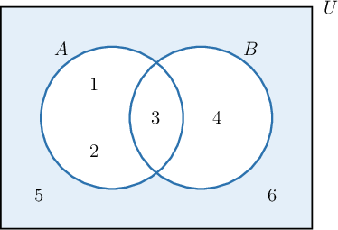
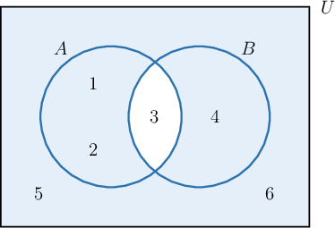

# De Morgan's Laws for Sets

Source: https://www.mathacademy.com/topics/2788?courseId=76
Topic ID: 2788

## Prerequisites

- [The Union of Sets](../geometry/2826-the-union-of-sets.md)
- [The Intersection of Sets](../geometry/2827-the-intersection-of-sets.md)
- [Set Complements](./2829-set-complements.md)

## Lesson

### Introduction

**De Morgan's laws** for sets tell us alternative ways to represent the complement of a union or intersection.

- De Morgan's law for unions states that

- De Morgan's law for intersections states that

Intuitively, you can think that the complement "flips" the union into an intersection and vice versa.

To demonstrate De Morgan's laws, consider the sets $A = \{1,2,3 \}$ and $B = \{3,4 \}$ in the universe $U = \{1,2,3,4,5,6 \}.$

- Computing $\overline{A \cup B},$ we have Computing $\overline{A} \cap \overline{B},$ we have So, we have that $\overline{A \cup B} = \overline{A} \cap \overline{B}. \quad \color{green}\checkmark$

- Computing $\overline{A \cap B},$ we have Computing $\overline{A} \cup \overline{B},$ we have So, we have that $\overline{A \cap B} = \overline{A} \cup \overline{B}. \quad \color{green}\checkmark$

### Venn Diagram Representations of De Morgan's Laws

For the sets $A = \{1,2,3 \}$ and $B = \{3,4 \}$ in the universe $U = \{1,2,3,4,5,6 \},$ the region $\overline{A \cup B} = \overline{A} \cap \overline{B}$ is shown below:

Likewise, the region $\overline{A \cap B} = \overline{A} \cup \overline{B}$ is shown below:

### Example: Finding the Complement of a Union

#### Question

If $\overline{X} = \{a, c, d\}$ and $\overline{Y} = \{a, e, i, o, u \},$ then what is $\overline{X \cup Y}?$

#### Explanation

De Morgan's law for unions states that

$$

\overline{X \cup Y} \equiv \overline{X} \cap \overline{Y}.

$$

So, we have

$$

\begin{aligned}\overset{𝑋∪𝑌}{} & =\overset{𝑋}{}∩\overset{𝑌}{} \\ & ={𝑎,𝑐,𝑑}∩{𝑎,𝑒,𝑖,𝑜,𝑢} \\ & ={𝑎}.\end{aligned}

$$

### Example: Finding the Complement of an Intersection

#### Question

If $\overline{P} = \{2, 4, 6 \}$ and $\overline{Q} = \{1, 2, 4 \},$ then what is $\overline{P \cap Q}?$

#### Explanation

De Morgan's law for intersections states that

$$

\overline{P \cap Q} \equiv \overline{P} \cup \overline{Q}.

$$

So, we have

$$

\begin{aligned}\overset{𝑃∩𝑄}{} & =\overset{𝑃}{}∪\overset{𝑄}{} \\ & ={2,4,6}∪{1,2,4} \\ & ={1,2,4,6}.\end{aligned}

$$
