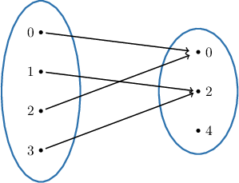
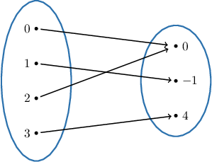
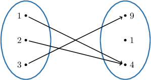
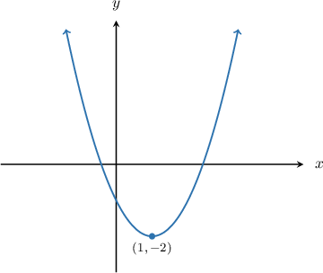
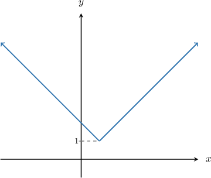

# Into Functions

Source: https://www.mathacademy.com/topics/3027?courseId=76
Topic ID: 3027

## Prerequisites

- [Properties of Transformed Logarithmic Functions](../algebra-ii/1610-properties-of-transformed-logarithmic-functions.md)
- [Domain and Range of Absolute Value Functions](../algebra-i/1884-domain-and-range-of-absolute-value-functions.md)
- [Surjections](./2627-surjections.md)

## Lesson

### Introduction

A function $f: X \rightarrow Y$ is said to be an **into** function if it is not a surjection. In other words, there exists an element $y$ in $Y$ such that it has no preimage in $X.$

Symbolically, we can write:

$f: X \to Y$ is an into function if $\exists\, y \in Y$ such that $\forall\, x \in X,$ we have $f(x) \neq y.$

The following diagram shows an example of an into function.

According to the diagram, the element $4 \in Y$ has no preimage in $X$ because we have no arrows from $X$ to $4.$So, we conclude that there exists some $y$ (i.e., $y=4$) contained within $Y$ such that $f(x) \neq y$ for any $x$ in $X.$

On the other hand, the following is *not* an into function because every element in $Y$ has at least one element of $X$ that maps to it.

### Example: Functions Defined as Mapping Diagrams

#### Question

Which of the following statements are true regarding the function $f:X \to Y$ represented by the mapping diagram above?

1. $f(2) = 4$

2. $\exists\, y \in Y$ such that $\forall\, x \in X,$ we have $f(x) \neq y$

3. The function $f:X \to Y$ is ****

#### Explanation

Recall that $f: X \rightarrow Y$ is an ** function if it is not a surjection. In other words, there exists an element $y$ in $Y$ such that it has no preimage in $X\mathbin{:}$

$f: X \to Y$ is an into function if $\exists\, y \in Y$ such that $\forall\, x \in X,$ we have $f(x) \neq y.$

With that in mind, let's consider each statement in turn.

- Statement I is true. Indeed, there is an arrow from $2 \in X$ to $4\in Y.$ So, $f(2)=4.$

- Statement II is true. According to the diagram, $1 \in Y$ has no preimage in $X$ because we have no arrows from $X$ to $1 \in Y.$ As a result, there exists some $y$ (i.e., $y=1$) contained within $Y$ such that $f(x) \neq y$ for any $x$ in $X.$

- Statement III is true. Since statement II is true, $f$ is an ** function.

Therefore, the correct answer is "I, II, and III."

### Example: Functions Whose Codomain Is the Set of Real Numbers

#### Question

Which of the following statements are true regarding the function $f:\mathbb{R}\to\mathbb{R}$ which is given by $f(x)=(x-1)^2-2?$

1. The range of $f$ is $[-2, \infty)$

2. $\forall\, y \in [-2, \infty),$ $\exists\, x \in \mathbb{R}$ such that $f(x)=y$

3. $f$ maps $\mathbb{R}$ **** $\mathbb{R}$

#### Explanation

First, we graph the function.

Recall that $f: X \rightarrow Y$ is an ** function if it is not a surjection. In other words, there exists an element $y$ in $Y$ such that it has no preimage in $X\mathbin{:}$

$f: X \to Y$ is an into function if $\exists\, y \in Y$ such that $\forall\, x \in X,$ we have $f(x) \neq y.$

With that in mind, let's consider each statement in turn.

- Statement I is true. From the graph, the lowest $y$-value is $-2,$ and it occurs at the point $(1,-2).$ The graph will cover all $y$-values higher than $y=-2$, including $y=-2$ itself. So the range of the function is indeed $[-2, \infty).$

- Statement II is true. Since the range of the function is $[-2, \infty)$, then for all $y$ contained within $[-2, \infty),$ there exists some $x$ contained within $\mathbb{R}$ such that $f(x) = y.$

- Statement III is true. As we can see from the range, there is no real number $x$ such that $f(x)=-3 \in \mathbb{R}.$ So, $f$ maps $\mathbb{R}$ ** $\mathbb{R}.$

Therefore, the correct answer is "I, II, and III only."

### Cases Where the Codomain Is a Real Interval

Recall that $f: X \rightarrow Y$ is an *into* function if it is not a surjection. In other words, there exists an element $y$ in $Y$ such that it has no preimage in $X\mathbin{:}$

$f: X \to Y$ is an into function if $\exists\, y \in Y$ such that $\forall\, x \in X,$ we have $f(x) \neq y.$

Consider the function $f: \Bbb R \rightarrow [0,\infty)$ defined by

$$

f(x)=|x-1|+1.

$$

Notice that the codomain is not $\mathbb R$ but $[0,\infty) \subseteq \mathbb R.$ Let's show that $f$ is an into function.

To show that $f$ is into $[0,\infty),$ let's take ${\color{blue}0} \in [0, \infty).$ Notice that there is no number $x$ in the domain $\mathbb{R}$ such that

$$

g(x)=|x-1|+1={\color{blue}0}.

$$

In fact, $|x-1|+1 \geq 1$ for all $x \in \mathbb{R}.$

Thus, we have showed that $\exists\, y \in Y$ (e.g., $y={\color{blue}0}$) such that $\forall\, x \in X,$ we have $f(x) \neq y.$ Therefore, $f$ is an into function.

The graph of our function $f$ is shown below.

### Example: Functions Whose Codomain Is a Real Interval

#### Question

Which of the following functions are **** functions?

1. $f: [-2, \infty) \to \mathbb{R}$ defined by $f(x) =\sqrt{x+2}$

2. $g: \mathbb{R} \to [0, \infty)$ defined by $g(x) = |x-2|+3$

3. $h:(0,\infty) \to\Bbb R$ defined by $h(x) = \ln(x)$

#### Explanation

Recall that $f: X \rightarrow Y$ is an ** function if it is not a surjection. In other words, there exists an element $y$ in $Y$ such that it has no preimage in $X\mathbin{:}$

$f: X \to Y$ is an into function if $\exists\, y \in Y$ such that $\forall\, x \in X,$ we have $f(x) \neq y.$

With that in mind, let's consider each statement in turn.

- I is an into function. Let's take $-1 \in\Bbb R.$ There is no number $x \in[-2, \infty)$ such that $f(x) =\sqrt{x+2}=-1.$ In fact, $f(x) =\sqrt{x+2} \geq 0$ for all $x \in[-2, \infty).$

- II is an into function. Let's take $1 \in [0, \infty).$ There is no number $x \in \mathbb{R}$ such that $g(x)=|x-2|+3=1.$ In fact, $|x-2|+3 \geq 3$ for all $x \in \mathbb{R}.$

- III is a ** an into function. Given any $y \in \Bbb R,$ we can choose $x =e^{y} \in \mathbb{R}.$ Then $h(x) = h \left(e^{y}\right) =\ln(e^{y}) = y.$

Therefore, the correct answer is "I and II only."
