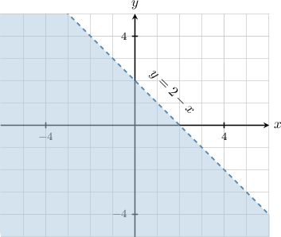

# Truth Sets of Predicates

Source: https://www.mathacademy.com/topics/4254?courseId=76
Topic ID: 4254

## Prerequisites

- [Describing Planar Regions Using Set-Builder Notation](./4392-describing-planar-regions-using-set-builder-notation.md)

## Lesson

### Introduction

Recall that a *predicate* of one variable is a sentence that contains a variable defined on some universal set and has the property that when we substitute a concrete value of the variable into the predicate, the result becomes a mathematical statement that is either true or false.

The **truth set** $T$ of a predicate $P(x)$ is the set of elements in its universal set $U$ such that substituting these elements into the predicate gives a true statement:

$$

T = \big\{ x \in U \: | \: P(x) \big\}

$$

For example, let's find the truth set of the following predicate:

$\qquad$ $D(x):$ $x$ is divisible by $2,$

where the universal set is $U = \big\{1,2, \ldots, 6 \big\}.$

To find the truth set $T,$ we need to find $x \in U$ such that the following is true:

$\qquad$ $x$ is divisible by $2.$

Let's check all the elements in our universal set $U$ to determine which of them are elements of the truth set $T{:}$

- $x=1\notin T$ since $1$ is *not* divisible by $2$

- $x=2\in T$ since $2$ is divisible by $2$

- $x=3\notin T$ since $3$ is *not* divisible by $2$

- $x=4\in T$ since $4$ is divisible by $2$

- $x=5\notin T$ since $5$ is *not* divisible by $2$

- $x=6\in T$ since $6$ is divisible by $2$

Therefore, the truth set of our predicate is

$$

T = \big\{ 2,4,6 \big\}.

$$

### Example: Finding the Truth Set of a Predicate

#### Question

Find the truth set of the following predicate:

$\qquad$ $P(x):$ $x^2+2x=3$

where the universal set is $\mathbb{Z}.$

#### Explanation

The ** of a predicate $P(x)$ is the set of elements in its universal set $U$ such that substituting these elements for the variable makes the predicate a true statement:

$$

T = \big\{ x \in U \: | \: P(x) \big\}

$$

The universal set for our predicate is $U = \mathbb{Z}.$

We need to find $x \in U$ such that the following is true:

$\qquad$ $x^2+2x=3$

Now, we solve the above equation by factoring:

$$

\begin{aligned}𝑥^{2}+2𝑥 & =3 \\ 𝑥^{2}+2𝑥−3 & =0 \\ (𝑥+3)(𝑥−1) & =0\end{aligned}

$$

So, the solutions are $x=-3\in\mathbb Z$ and $x=1\in\mathbb Z.$

Therefore, the truth set of our predicate is $T = \{-3,1\}.$

### Predicates With More Than One Variable

A predicate of the variables $x_1,x_2,\ldots,x_n$ is a sentence that contains these variables with the property that when we substitute concrete values for all the variables, the result becomes a statement that is either true or false.

We can denote such a predicate using the following notation:

$$

P(x_1,x_2,\ldots,x_n)

$$

If $U_1$ is the universal set for $x_1,U_2$ is the universal set for $x_2,\ldots,$ etc, then the universal set $U$ for our predicate is given by the Cartesian product

$$

U = U_1 \times U_2 \times \cdots \times U_n.

$$

For example, the sentence

$\qquad$ $P(x,y): x+y \lt 2,$ $\quad$ $x,y \in \mathbb{R}$

is a predicate of two variables, $x$ and $y.$ In this case, the universal set is

$$

U = \mathbb{R} \times \mathbb{R} = \mathbb{R}^2.

$$

The **truth set** $T$ of a predicate $P(x_1,x_2,\ldots,x_n)$ is the set of $n$-tuples $(x_1, x_2, \ldots, x_n) \in U$ such that substituting these tuples into the predicate gives a true statement:

$$

T = \big\{ (x_1,x_2,\ldots,x_n) \in U \: | \: P(x_1,x_2,\ldots,x_n) \big\}

$$

For example, to determine the truth set of the predicate $P(x,y)$ defined above, we need to find $(x,y) \in \mathbb R^2$ such that the following is true:

$\qquad$ $x+y \lt 2$

To find the truth set, we first find an explicit condition on $y$ as a function of $x{:}$

$$

\begin{aligned}𝑥+𝑦 & <2 \\ 𝑦 & <2−𝑥\end{aligned}

$$

Therefore, the truth set contains all tuples $(x,y)\in\mathbb R^2$ that satisfy this inequality. We can write the truth set $T$ of our predicate as follows:

$$

T = \big\{(x,y)\in\mathbb R^2 \:|\: y < 2-x\big\}

$$

Finally, since $T$ is a subset of $\mathbb R^2,$ we can represent it as a region in the coordinate plane.

### Example: Identifying Predicates of More Than One Variable

#### Question

Which of the following are mathematical predicates?

1. $x \geq y$

2. $\dfrac{p}{q}$ is a rational number.

3. $a$ is a positive number.

#### Explanation

A ** of the variables $x_1,x_2,\ldots,x_n$ is a sentence that contains the variables defined on some ** and has the property that when we substitute concrete values for all the variables into the predicate, the result becomes a statement that is either true or false.

With that in mind, let's examine our options.

- Option I is a predicate of two variables. Substituting a concrete pair of values $(x,y)$ into the sentence, we get a statement that is either true or false.

- Option II is a predicate of two variables. Substituting a concrete pair of values $(p,q)$ into the sentence, we get a statement that is either true or false.

- Option III is a predicate of one variable. Substituting a concrete value for $a$ into the sentence, we get a statement that is either true or false.

Therefore, the correct answer is "I, II, and III."

### Example: Finding the Truth Set of a Multivariable Predicate

#### Question

Find the truth set of the following predicate:

$\qquad$ $p \, | \, q$,

where the universal set is $\big\{(p,q) \: | \: p = 1,2,6, \: q = 3,6,9 \big\}.$

#### Explanation

The ** of a predicate $P(x_1,x_2,\ldots,x_n)$ is the set of $n$-tuples in its universal set $U = U_1 \times U_2 \times \cdots \times U_n$ such that substituting these tuples for the variables makes the predicate a true statement:

$$

T = \big\{ (x_1,x_2,\ldots,x_n) \in U \: | \: P(x_1,x_2,\ldots,x_n) \big\}

$$

The universal set for our predicate is

$$

\begin{aligned}𝑈 & ={1,2,6}×{3,6,9} \\ & ={(1,3),(1,6),(1,9),(2,3),(2,6),(2,9),(6,3),(6,6),(6,9)}.\end{aligned}

$$

We need to find $(p,q) \in U$ such that the following is true:

$\qquad$ $p \, | \, q$

The following pairs give the elements of our truth set:

- $(1,3)$ since $1$ divides $3,$

- $(1,6)$ since $1$ divides $6,$

- $(1,9)$ since $1$ divides $9,$

- $(2,6)$ since $2$ divides $6,$

- $(6,6)$ since $6$ divides $6.$

Therefore, the truth set of our predicate is

$$

T = \big\{ (1,3), (1,6), (1,9), (2,6), (6,6) \big\}.

$$
