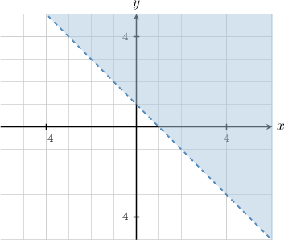
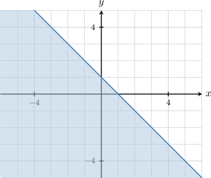

# The "Not" Connective With Predicates

Source: https://www.mathacademy.com/topics/4256?courseId=76
Topic ID: 4256

## Prerequisites

- [The "Not" Connective](./2790-the-not-connective.md)
- [Truth Sets of Predicates](./4254-truth-sets-of-predicates.md)

## Lesson

### Introduction

The **negation** of the predicate $P(x_1,x_2,\ldots,x_n)$ is a new predicate that we denote as follows:

$$

\lnot P(x_1,x_2,\ldots,x_n)

$$

This predicate is true if and only if $P$ is false for a specific set of assignment variables $x_1,x_2, \ldots x_n.$

For example, consider the following predicate defined over the universal set $\mathbb Z.$

$\qquad$ *$P(m):$ $m$ is even*

Then, $\lnot P(m)$ is a new predicate that reads as follows:

$\qquad$ *$m$ is **** even*

This can be simplified as:

$\qquad$ *$m$ is odd*

For example:

- $P(2)$ is true while $\lnot P(2)$ is false

- $P(3)$ is false while $\lnot P(3)$ is true

### Example: Negating a Predicate Expressed in Plain English

#### Question

Write down $\lnot P(x)$ given that

$$

𝑥

$$

#### Explanation

The symbol "$\neg$" represents negation. So, our task is to negate the given sentence.

To negate our plain English sentence, we place the words "It is not true that" in front of it. This gives the following:

$$

𝑥

$$

In other words, $x$ is smaller than $10.$ Therefore, $\neg P(x)$ means the following:

$$

𝑥

$$

### Example: Negating a Predicate Expressed Using Notation

#### Question

$\qquad$ $x \nleq \sqrt{2}$

The predicate $P(x)$ is given above. Write down $\neg P(x).$

#### Explanation

In plain English, our predicate $P(x)$ means the following:

$\qquad$ $x$ is not smaller than or equal to $\sqrt{2}.$

The symbol "$\neg$" represents negation. To negate our plain English expression, we place the words "It is not true that" in front of it. This gives the following:

$\qquad$ It is not true that $x$ is not smaller than or equal to $\sqrt{2}.$

In other words, $x$ ** ** $\sqrt{2}.$ Therefore, $\neg P(x)$ means the following:

$\qquad$ $x\leq \sqrt{2}$

### Truth Sets of Negations

Let $T_P$ be the truth set of the predicate $P(x_1,x_2,\ldots,x_n).$

From the definition of the negation of a predicate, we have that $\lnot P$ is true if and only if $P$ is false. Therefore, the truth set of $\neg P$ is the *complement* of the truth set of $P{:}$

$$

T_{\neg P} = \overline{T}_P

$$

For example, consider the following predicate defined over the universal set $\mathbb{R}{:}$

$P(x):$ $-2x +3 \leq 5$

To find the the truth set of $P(x),$ we solve the inequality:

$$

\begin{aligned}−2𝑥+3 & ≤5 \\ −2𝑥 & ≤2 \\ 𝑥 & ≥−1\end{aligned}

$$

So, the truth set of $P(x)$ is $T_P = [-1,\infty).$

Therefore, we have

$$

\begin{aligned}𝑇_{¬𝑃} & =\overset{𝑇}{}_{𝑃} \\ & =\overset{[−1,∞)}{} \\ & =(−∞,−1).\end{aligned}

$$

### Example: Finding the Truth Set of Predicate's Negation

#### Question

The shaded region below represents the truth set of a predicate $P(x),$ defined over the universal set $\mathbb{R}^2.$ Determine the region that represents the truth set of $\neg P(x).$

#### Explanation

The truth set of $\neg P(x)$ is the ** of the truth set of $P(x){:}$

$$

T_{\neg P} = \overline{T}_P

$$

Therefore, to get the truth set of $\neg P(x),$ we take all the points that belong to $U$ and do not lie in $T_p,$ as shown below.

