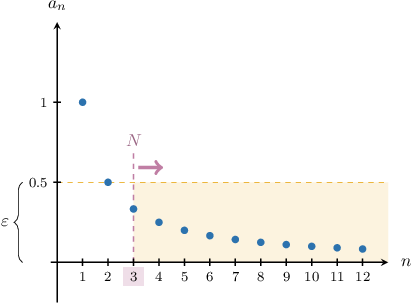
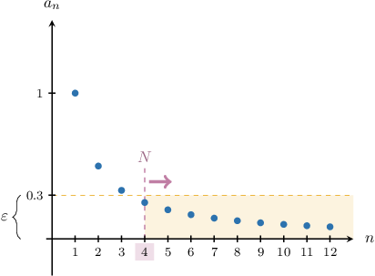
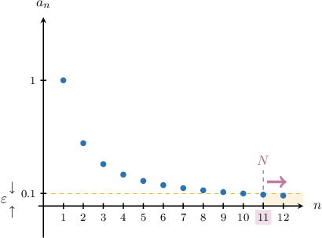

# The Limit of a Null Sequence

Source: https://www.mathacademy.com/topics/4342?courseId=76
Topic ID: 4342

## Prerequisites

- [The Floor and Ceiling Functions](./290-the-floor-and-ceiling-functions.md)
- [Solving Inequalities Involving Geometric Sequences](../integrated-math-iii-honors/1004-solving-inequalities-involving-geometric-sequences.md)
- [Limits of Sequences](../ap-calculus-bc/1087-limits-of-sequences.md)
- [Convergence of Geometric Sequences](../ap-calculus-bc/1088-convergence-of-geometric-sequences.md)
- [Limits of Radical Functions](../ap-calculus-ab/1986-limits-of-radical-functions.md)
- [Formal and Informal Language](./2798-formal-and-informal-language.md)
- [Solving Radical Inequalities](../integrated-math-iii-honors/2856-solving-radical-inequalities.md)
- [Solving Rational Inequalities](../integrated-math-iii-honors/3355-solving-rational-inequalities.md)

## Lesson

### Introduction

Suppose that $a_n$ is a sequence defined for $n\geq 1.$ We know that the *limit* of a sequence (if it exists) is the unique number $L$ such that

$$

\lim_{n \to \infty} a_n = L.

$$

Intuitively, this statement means that the distance between $a_n$ and $L$ can be as small as we want, provided that $n$ is large enough.

While intuition is important, none of this is very precise. What does "the distance between $a_n$ and $L$ can be as small as we want" mean? And what about "provided that $n$ is large enough"? Can we quantify these ideas more precisely?

We need a precise mathematical definition of what's meant by *the limit of a sequence.* This lesson aims to construct a suitable definition in the case where $L=0.$

We start with a definition.

*A **** is a sequence that converges to zero.*

For example, the sequence

$$

a_n = \dfrac{1}{1+n^2}, \qquad n\geq 1

$$

is a null sequence since

$$

\begin{aligned}\underset{𝑛→∞}{lim}𝑎_{𝑛} & =\underset{𝑛→∞}{lim}(\frac{1}{1+𝑛^{2}})=0.\end{aligned}

$$

On the other hand, the sequence

$$

b_n = n+1, \qquad n\geq 1

$$

is *not* a null sequence since

$$

\begin{aligned}\underset{𝑛→∞}{lim}𝑏_{𝑛} & =\underset{𝑛→∞}{lim}(𝑛+1) \\ & =∞ \\ & ≠0.\end{aligned}

$$

### Example: Identifying Null Sequences

#### Question

Which of the following are null sequences for $n\geq 1?$

1. $a_n = \dfrac{n}{n^2 + 1}$

2. $b_n = \sqrt{n+1}$

3. $c_n =\left(\dfrac89\right)^n$

#### Explanation

A ** is a sequence that converges to zero:

- Sequence I is a null sequence. By dividing the numerator and denominator by $n^2,$ we have

- Sequence II is ** a null sequence since

- Sequence III is null. Notice that this is a geometric sequence with the common ratio $r =\dfrac{8}{9}.$ Since $|r| < 1,$ the sequence converges to zero:

Therefore, the correct answer is "I and III only."

### Finding an Index Whose Subsequent Terms Are Close to Zero

Consider the following sequence:

$$

a_n = \dfrac{1}{n}, \qquad n \geq 1

$$

This is a null sequence since

$$

\lim_{n\to\infty} \left(\dfrac1n\right) = 0.

$$

Our intuitive understanding of this result tells us, "the distance between $a_n$ and zero can be as small as we want, provided that $n$ is large enough."

To make this idea more precise, we define a (small) positive real number $\varepsilon.$ We're interested in the values of $n$ such that the terms of the sequence all lie at a distance from zero that's *smaller than* $\varepsilon.$ We express this as the following inequality:

$$

|a_n| < \varepsilon

$$

Let's discuss the meaning of this inequality for some concrete values of $\varepsilon.$

- If $\varepsilon = 0.5,$ then $|a_n| < \varepsilon$ for all $n \geq 3.$ These values of $a_n$ are those lying inside the yellow region below (from $n=3$ onwards).

- If $\varepsilon = 0.3,$ then $|a_n| < \varepsilon$ for all $n \geq 4.$

- If $\varepsilon = 0.1,$ then $|a_n| < \varepsilon$ for all $n \geq 11.$

By making $\varepsilon$ smaller and smaller, we can *always* find an index $N$ where the distance between $a_n$ and zero is smaller than $\varepsilon$ *for all* $n\geq N.$ This is the critical property of a null sequence that we'll use to construct our precise definition.

### Example: Finding N Given a Concrete Epsilon

#### Question

Consider the (null) geometric sequence $a_n,$ defined by

$$

a_n = \left(\dfrac23\right)^n, \qquad n\geq 1.

$$

Find the smallest natural number $N$ such that $\left| a_n \right| < 0.000\,4$ for all $n \geq N.$

#### Explanation

We need to find the smallest natural number $N$ such that

$$

\left| \left(\dfrac23\right)^n \right| < 0.000\,4

$$

for all $n\geq N.$

First, notice that $\left(\dfrac23\right)^n \gt 0$ for any natural number $n \geq 1.$ With that in mind, we have

$$

\left|\left(\dfrac23\right)^n\right| = \left(\dfrac23\right)^n.

$$

Now, we solve the following inequality for $n$:

$$

\begin{aligned}(\frac{2}{3})^{𝑛} & <0.000\,4 \\ ln⁡(\frac{2}{3})^{𝑛} & <ln⁡(0.000\,4) \\ 𝑛ln⁡(\frac{2}{3}) & <ln⁡(0.000\,4) \\ 𝑛 & >\frac{ln⁡(0.000\,4)}{ln⁡(\frac{2}{3})}=19.296...\end{aligned}

$$

As a result, $\left| \left(\dfrac23\right)^n \right| < 0.000\,4$ for all natural numbers $n \geq \lceil19.296... \rceil =20.$

Therefore, ${\color{blue}{N}} ={\color{blue}{20}}.$

### Further Discussion of a Prior Result

Let's consider the null geometric sequence

$$

a_n = \left(\dfrac23\right)^n, \qquad n\geq 1.

$$

Earlier, we showed that if we select $\varepsilon = 0.000\, 4,$ then to satisfy $|a_n| < \varepsilon$ for all $n\geq N,$ the smallest value of $N$ we can pick is ${\color{blue}{N}} ={\color{blue}{20}}.$

Let's calculate a few terms of the sequence to understand concretely what this result means:

- We expect that for $a_n$ is larger than $\varepsilon = 0.000\, 4$ when $n={\color{red}{19}}.$ Indeed,

- However, *for all* $n\geq {\color{blue}{N}} ={\color{blue}{20}},$ we have that $|a_n|$ is smaller than $\varepsilon = 0.000\,4{:}$

The smallest value of $N$ such that $|a_n| < \varepsilon$ for all $n\geq N$ entirely depends on which value of $\varepsilon$ we select.

For example, if we selected $\varepsilon = 0.000\,1,$ then we'd need a larger value of $N$ to satisfy $|a_n| < \varepsilon$ for all $n\geq N.$ We can see from the above calculations that we would select ${\color{purple}{N}}={\color{purple}{23}}.$ Indeed:

$$

\begin{aligned}𝑎_{22} & =(\frac{2}{3})^{22}≈0.000\,134>𝜀\,× \\ 𝑎_{23} & =(\frac{2}{3})^{23}≈0.000\,089<𝜀\,✓ \\ 𝑎_{24} & =(\frac{2}{3})^{24}≈0.000\,059<𝜀\,✓ \\ 𝑎_{24} & =(\frac{2}{3})^{25}≈0.000\,040<𝜀\,✓ \\ & ⋮\end{aligned}

$$

Thus, the defining feature of a null sequence is that *no matter how small* $\varepsilon$ is, we can *always* find an $N$ such that $|a_n| < \varepsilon$ for all $n\geq N.$

Finally, since $N$ always depends on $\varepsilon,$ we should think of $N$ as a *function* of $\varepsilon,$ i.e.,

$$

N= N(\varepsilon)

$$

We won't always write this explicitly, but you should keep this idea firmly in mind.

Proving that a given sequence is null relies on finding $N(\varepsilon)$ for a given sequence. We'll return to this in future lessons.

### The Definition of the Limit of a Null Sequence

Based on what we've discussed so far, the notation

$$

\lim\limits_{n \to \infty} a_n = 0

$$

means that if we take any *arbitrarily small* positive number $\varepsilon,$ the distance of each $a_n$ from zero is *smaller than* $\varepsilon$ for *sufficiently large* $n.$

This gives us our definition of a null sequence:

*For any real $\varepsilon > 0$ there exists a natural number $N$ such that for every natural number $n \geq N,$ we have $\left| a_n \right| \lt \varepsilon.$*

For example, the statement

$$

\lim\limits_{n \to \infty} \left(\dfrac{1}{n}\right) = 0

$$

means the following:

*For any real $\varepsilon > 0$ there exists a natural number $N$ such that for every natural number $n \geq N,$ we have $\left| \dfrac{1}{n} \right| \lt \varepsilon.$*

This definition is still informal. We can turn this into more formal language by explicitly including an implication:

*For any real $\varepsilon > 0$ there exists a natural number $N$ such that, for every natural number $n,$ if $n \geq N,$ then $\left| \dfrac{1}{n} \right| \lt \varepsilon.$*

Finally, by expressing the last statement using formal symbolic notation, we get the following:

$$

\forall \varepsilon > 0, \: \exists N \in \mathbb{N}, \forall n \in \mathbb{N}, \: n \geq N \: \Rightarrow \: \left| \dfrac{1}{n} \right| \lt \varepsilon

$$

### Example: Constructing the Definition of a Limit

#### Question

What is the meaning of the notation $\displaystyle \lim\limits_{n \to \infty} \left(\dfrac{4}{n^3}\right) = 0$ expressed in symbolic form?

#### Explanation

First, recall that $\lim\limits_{n \to \infty} \left(\dfrac{4}{n^3}\right) = 0$ means the following:

For any real $\varepsilon > 0$ there exists a natural number $N$ such that, for every natural number $n \geq N,$ we have

$$

\left|\dfrac{4}{n^3} \right| \lt \varepsilon.

$$

This can also be expressed as follows:

For any real $\varepsilon > 0$ there exists a natural number $N$ such that, for every natural number $n,$ if $n \geq N,$ then

$$

\left| \dfrac{4}{n^3} \right| \lt \varepsilon.

$$

Translating this into symbolic form, we get

$$

\forall \varepsilon > 0, \: \exists N \in \mathbb{N}, \forall n \in \mathbb{N}, \: n \geq N \: \Rightarrow \: \left| \dfrac{4}{n^3} \right| \lt \varepsilon.

$$
