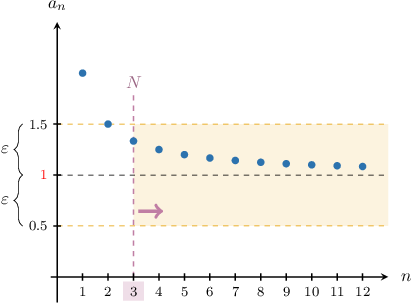
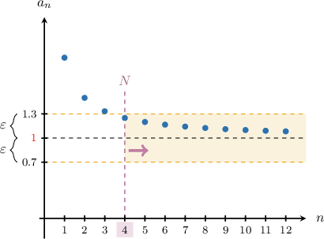
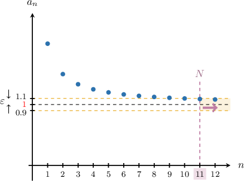
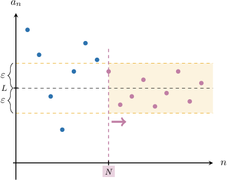

# Proving the Finite Limit of a Sequence

Source: https://www.mathacademy.com/topics/4343?courseId=76
Topic ID: 4343

## Prerequisites

- [Proving the Limit of a Null Sequence](./4376-proving-the-limit-of-a-null-sequence.md)

## Lesson

### Introduction

In previous lessons, we saw how to define the limit of a null sequence (i.e., a sequence whose limit equals zero) and how to construct a formal proof that a given sequence is null.

In this lesson, we'll extend our understanding to include sequences that converge to a finite (not necessarily zero) limit. If such a limit exists, it's usually denoted as $L.$

Consider the following sequence:

$$

a_n = \dfrac{n+1}{n}, \qquad n \geq 1

$$

It's easy to see that the limit of this sequence is ${\color{red}{L}}={\color{red}{1}}{:}$

$$

\begin{aligned}\underset{𝑛→∞}{lim}𝑎_{𝑛} & =\underset{𝑛→∞}{lim}(\frac{𝑛+1}{𝑛}) \\ & =\underset{𝑛→∞}{lim}(\frac{𝑛}{𝑛}+\frac{1}{𝑛}) \\ & =\underset{𝑛→∞}{lim}(1+\frac{1}{𝑛}) \\ & =1+0 \\ & =1\end{aligned}

$$

This means that for any $\varepsilon > 0,$ there exists a natural number $N(\varepsilon)$ such that the distance between $a_n$ and ${\color{red}{L}} = {\color{red}{1}}$ is *smaller than* $\varepsilon$ for all $n\geq N.$ In other words,

$$

\forall n\geq N,\qquad|a_n - {\color{red}{1}}| < \varepsilon.

$$

Let's draw a few sketches to illustrate this idea.

- If we select $\varepsilon = 0.5,$ then $|a_n-{\color{red}{1}}| < \varepsilon$ for all $n \geq 3.$

- If $\varepsilon = 0.3,$ then $|a_n-{\color{red}{1}}| < \varepsilon$ for all $n \geq 4.$

- If $\varepsilon = 0.1,$ then $|a_n-{\color{red}{1}}| < \varepsilon$ for all $n \geq 11.$

The key idea is this: By making $\varepsilon$ smaller and smaller, we can *always* find an index $N$ where the distance between $a_n$ and $\color{red}L$ is smaller than $\varepsilon$ for all $n\geq N.$

### The Formal Definition of a Finite Limit

Based on the discussion so far, the notation

$$

\lim\limits_{n \to \infty} a_n = {\color{red}{L}}

$$

means that if we take any *arbitrarily small* positive number $\varepsilon,$ the distance of each $a_n$ from ${\color{red}{L}}$ is smaller than $\varepsilon$ for sufficiently large $n.$

This gives us our definition of a finite limit:

*For any real $\varepsilon > 0$ there exists a natural number $N$ such that for every natural number $n \geq N,$ we have $\left| a_n-L \right| \lt \varepsilon.$*

We can illustrate the key idea using the diagram shown below.

For example, the statement

$$

\lim\limits_{n \to \infty} \left(\dfrac{n+1}{n}\right) = {\color{red}{1}}

$$

means the following:

*For any real $\varepsilon > 0$ there exists a natural number $N$ such that for every natural number $n \geq N,$ we have*

$$

\left| \dfrac{n+1}{n}-{\color{red}{1}} \right| \lt \varepsilon.

$$

We can make this definition more formal by explicitly including an implication:

*For any real $\varepsilon > 0$ there exists a natural number $N$ such that for every natural number $n \geq N,$ if $n\geq N,$ then*

$$

\left| \dfrac{n+1}{n}-{\color{red}{1}} \right| \lt \varepsilon.

$$

Finally, by expressing the last statement using formal symbolic notation, we get the following:

$$

\forall \varepsilon > 0, \: \exists N \in \mathbb{N}, \forall n \in \mathbb{N}, \: n \geq N \: \Rightarrow \: \left| \dfrac{n+1}{n}-{\color{red}{1}} \right| \lt \varepsilon

$$

### Example: Constructing the Definition of a Limit

#### Question

Write down a formal definition of the fact that $\lim\limits_{n \to \infty} \left(\dfrac{3n^2-1}{n^2+2}\right) = 3.$

#### Explanation

According to the definition, the notation

$$

\lim\limits_{n \to \infty} a_n = L

$$

for some $L \in \mathbb{R}$ means that if we take any arbitrarily small positive number $\varepsilon,$ the distance of each $a_n$ from $L$ is smaller than $\varepsilon$ for sufficiently large $n.$

In other words, there exists a natural number $N$ such that $|a_n - L| < \varepsilon,$ provided that $n \geq N.$

Recall that the distance between $a_n$ and $L$ equals $|a_n - L|.$

Therefore, $\lim\limits_{n \to \infty} \left(\dfrac{3n^2-1}{n^2+2}\right) = 3,$ means:

**

$$

\left|\dfrac{3n^2-1}{n^2+2} - 3\right| < \varepsilon.

$$

### Example: Finding N Given a Concrete Epsilon

#### Question

Consider the sequence $a_n$ that converges to $L = 1,$ defined by

$$

a_n = \dfrac{5^n+1}{5^n+6}, \qquad n \geq 1.

$$

Find the smallest natural number $N$ such that $|a_n - L| < 0.001$ for all $n \geq N.$

#### Explanation

We need to find the smallest natural number $N$ such that

$$

\left| \dfrac{5^n+1}{5^n+6}- 1 \right| < 0.001

$$

for all $n \geq N.$

First, simplifying $|a_n - L|,$ we have

$$

\begin{aligned}|𝑎_{𝑛}−𝐿| & =\frac{5^{𝑛}+1}{5^{𝑛}+6}−1 \\ & =\frac{5^{𝑛}+1}{5^{𝑛}+6}−\frac{5^{𝑛}+6}{5^{𝑛}+6} \\ & =\frac{5^{𝑛}+1−5^{𝑛}−6}{5^{𝑛}+6} \\ & =\frac{−5}{5^{𝑛}+6} \\ & =−\frac{5}{5^{𝑛}+6}.\end{aligned}

$$

Notice that $\dfrac{5}{5^n+6} > 0$ for any natural number $n \geq 1.$ With that in mind, we have

$$

|a_n - L| = \left|- \dfrac{5}{5^n+6} \right| = \dfrac{5}{5^n+6}.

$$

Now, we solve the following inequality for $n{:}$

$$

\begin{aligned}\frac{5}{5^{𝑛}+6} & <0.001 \\ 5 & <0.001(5^{𝑛}+6) \\ \frac{5}{0.001} & <5^{𝑛}+6 \\ \frac{5}{0.001}−6 & <5^{𝑛} \\ 4\,994 & <5^{𝑛} \\ log_{5}⁡(4\,994) & <𝑛 \\ 𝑛 & >log_{5}⁡(4\,994)≈5.291\end{aligned}

$$

As a result, $\left| \dfrac{5^n+1}{5^n+6}- 1 \right| < 0.001$ for all natural numbers $n \geq \lceil 5.291 \rceil = 6.$

Therefore, $N = 6.$

### Example: Finding N for an Arbitrary Epsilon

#### Question

Consider the following sequence that converges to $L=3{:}$

$$

a_n = \dfrac{9n^2+1}{3n^2-2}, \qquad n \geq 1

$$

Given $\varepsilon \gt 0,$ find a natural number $N(\varepsilon)$ such that for all $n \geq N,$ we have $|a_n - L| \lt \varepsilon.$

#### Explanation

First, simplifying $|a_n - L|,$ we have

$$

\begin{aligned}|𝑎_{𝑛}−𝐿| & =\frac{9𝑛^{2}+1}{3𝑛^{2}−2}−3 \\ & =\frac{9𝑛^{2}+1}{3𝑛^{2}−2}−\frac{3(3𝑛^{2}−2)}{3𝑛^{2}−2} \\ & =\frac{9𝑛^{2}+1−9𝑛^{2}+6}{3𝑛^{2}−2} \\ & =\frac{7}{3𝑛^{2}−2}.\end{aligned}

$$

Notice that $a_n - L \gt 0$ for any natural $n \geq 1.$ With that in mind, we have

$$

\left| a_n - L \right| = \left|\dfrac{7}{3n^2-2}\right| = \dfrac{7}{3n^2-2}.

$$

Now, we solve the inequality $|a_n - L| \lt \varepsilon$ for $n{:}$

$$

\begin{aligned}\frac{7}{3𝑛^{2}−2} & <𝜀 \\ 7 & <𝜀(3𝑛^{2}−2) \\ \frac{7}{𝜀} & <3𝑛^{2}−2 \\ \frac{7}{𝜀}+2 & <3𝑛^{2} \\ \frac{7}{3𝜀}+\frac{2}{3} & <𝑛^{2} \\ 𝑛^{2} & >\frac{2}{3}+\frac{7}{3𝜀} \\ 𝑛 & >\sqrt{√\frac{2}{3}+\frac{7}{3𝜀}}\end{aligned}

$$

So, we let $N$ be the smallest natural number such that

$$

N \gt \sqrt{\dfrac23+\dfrac{7}{3\varepsilon}}.

$$

Therefore, $\left| \dfrac{9n^2+1}{3n^2-2} - 3 \right| \lt \varepsilon$ for all natural numbers $n \geq N.$

### Example: Proving the Limit of a Sequence

#### Question

Using the formal definition of a limit, prove that

$$

\lim\limits_{n \to \infty} \left(\dfrac{1-4^n}{4^n-10} \right)= -1.

$$

#### Explanation

Recall that

$$

\lim\limits_{n \to \infty} \left(\dfrac{1-4^n}{4^n-10} \right)= -1

$$

means that

$$

\forall \varepsilon > 0, \: \exists N \in \mathbb{N}, \forall n \in \mathbb{N}, \: n \geq N \: \Rightarrow \: \left| \dfrac{1-4^n}{4^n-10} -(-1) \right| \lt \varepsilon.

$$

In other words, we need to show that for any real $\varepsilon \gt 0,$ there exists a natural number $N$ such that, for every natural number $n \geq N,$ we have

$$

\left| \dfrac{1-4^n}{4^n-10} -(-1) \right| \lt \varepsilon.

$$

Before we start the proof, we would like to figure out how $N$ may depend on $\varepsilon.$

First, we simplifying $|a_n - L|,$ we have

$$

\begin{aligned}|𝑎_{𝑛}−𝐿| & =\frac{1−4^{𝑛}}{4^{𝑛}−10}−(−1) \\ & =\frac{1−4^{𝑛}}{4^{𝑛}−10}+1 \\ & =\frac{1−4^{𝑛}}{4^{𝑛}−10}+\frac{4^{𝑛}−10}{4^{𝑛}−10} \\ & =\frac{1−4^{𝑛}+4^{𝑛}−10}{4^{𝑛}−10} \\ & =−\frac{9}{4^{𝑛}−10} \\ & =\frac{9}{4^{𝑛}−10}.\end{aligned}

$$

Notice that $\dfrac{9}{4^n-10} \gt 0$ for any natural $n \geq 2.$ With that in mind, we have

$$

|a_n - L| = \left| \dfrac{9}{4^n-10} \right| = \dfrac{9}{4^n-10}.

$$

Now, we solve the inequality $|a_n - L| < \varepsilon$ for $n\geq 2{:}$

$$

\begin{aligned}\frac{9}{4^{𝑛}−10} & <𝜀 \\ 9 & <𝜀(4^{𝑛}−10) \\ \frac{9}{𝜀} & <4^{𝑛}−10 \\ 10+\frac{9}{𝜀} & <4^{𝑛} \\ log_{4}⁡(10+\frac{9}{𝜀}) & <𝑛 \\ 𝑛 & >log_{4}⁡(10+\frac{9}{𝜀}).\end{aligned}

$$

As a result, if we want

$$

\left| \dfrac{1-4^n}{4^n-10} - (-1) \right| \lt \varepsilon,

$$

it's sufficient to take all values of $n$ that are larger than $\log_4\left(10+\dfrac{9}{\varepsilon}\right).$

We can now continue the proof:

Suppose $\varepsilon > 0.$ Let's choose some natural number $N > \log_4\left(10+\dfrac{9}{\varepsilon}\right).$

Notice that, since $\dfrac{9}{\varepsilon} > 0,$ then $\log_4\left(10+\dfrac{9}{\varepsilon}\right) > \log_4(10)\approx 1.66$ and therefore $N \geq 2.$

With that in mind, we'll find the upper bound for the absolute value of the sequence's $n$th term:

Then, for any natural number $n \geq N,$ we have

$$

\begin{aligned}\frac{1−4^{𝑛}}{4^{𝑛}−10}−(−1) & =\frac{9}{4^{𝑛}−10} \\ & <\frac{9}{4^{log_{4}⁡(10+9/𝜀)}−10} \\ & =\frac{9}{(10+\frac{9}{𝜀}−10)} \\ & =𝜀.\end{aligned}

$$

Finally, we make the conclusion:

Therefore, according to the definition,

$$

\lim\limits_{n \to \infty} \left(\dfrac{1-4^n}{4^n-10} \right)= -1

$$

The full proof is given below:

Suppose $\varepsilon > 0.$ Let's choose some natural number $N > \log_4\left(10+\dfrac{9}{\varepsilon}\right).$

Then, for any natural number $n \geq N,$ we have

$$

\begin{aligned}\frac{1−4^{𝑛}}{4^{𝑛}−10}−(−1) & <\frac{9}{4^{log_{4}⁡(10+9/𝜀)}−10} \\ & =\frac{9}{(10+\frac{9}{𝜀}−10)} \\ & =𝜀.\end{aligned}

$$

Therefore, according to the definition, $\lim\limits_{n \to \infty} \dfrac{1-4^n}{4^n-10} = -1.$
