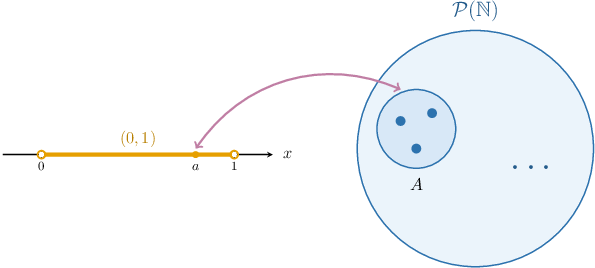
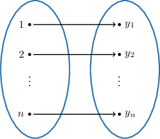
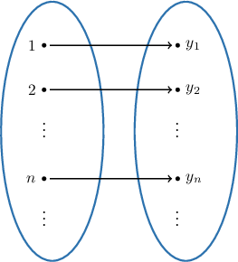

# The Cardinality of the Power Set of Natural Numbers

Source: https://www.mathacademy.com/topics/4424?courseId=76
Topic ID: 4424

## Prerequisites

- [Power Sets](./51-power-sets.md)
- [The Cantor-Bernstein-Schröder Theorem](./3426-the-cantor-bernstein-schro-der-theorem.md)

## Lesson

### Introduction

Recall that the power set of a finite $X,$ denoted $\mathcal{P}(X),$ contains every subset of $S,$ including $X$ itself and the empty set.

We've already seen that if $X$ is *finite*, the cardinality of $\mathcal{P}(X)$ is given by

$$

\big|\mathcal{P}(X)\big| = 2^{|X|}.

$$

We know from previous lessons that the cardinality of the set of natural numbers is denoted $\aleph_0,$ so

$$

\big|\mathbb N\big| = \aleph_0.

$$

The power set of $\mathbb N,$ denoted $\mathcal P(\mathbb N),$ is an infinite set that contains every subset of the natural numbers. Taking inspiration from the above result, we will define the cardinality of the power set of the natural numbers as follows:

$$

\big|\mathcal P(\mathbb N)\big| = 2^{\aleph_0}

$$

Loosely speaking, $\mathcal P (\mathbb N)$ is "larger" than $\mathbb N.$ Can we quantify this more precisely? Indeed, we can. In fact, the cardinality of $\mathcal P(\mathbb{N})$ is deeply connected to that of $(0,1),$ as given by the following result:

*The power set of $\mathbb{N}$ has the same cardinality as the interval $(0,1),$ i.e.,*

$$

\big| \mathcal{P}(\mathbb{N}) \big| = 2^{\aleph_0} = \big| (0,1) \big| = \mathfrak{c}.

$$

This means that there is a bijection that maps every real number $a$ from $(0,1)$ to a subset $A$ of natural numbers. We'll prove this result later in the lesson.

More generally, for *any* countably infinite set $X$, we have

$$

\big| \mathcal{P}(X) \big| = \mathfrak{c}.

$$

For example,

$$

\big| \mathcal{P}(\mathbb N) \big| = \big| \mathcal{P}(\mathbb Z) \big| = \big| \mathcal{P}(\mathbb Q) \big| = \mathfrak{c}.

$$

### Example: The Cardinality of a Power Set

#### Question

Given the set

$$

A = \{ x \in \mathbb{Q} : |3x -2| \lt 1 \},

$$

determine $|A|$ and $|\mathcal{P}(A)|.$

#### Explanation

Remember that the power set of a countably infinite set possesses the cardinality of the continuum.

First, let's solve the restricting inequality:

$$

\begin{aligned}|3𝑥−2| & <1 \\ −1 & <3𝑥−2≤1 \\ 1 & <3𝑥≤3 \\ \frac{1}{3} & <𝑥<1\end{aligned}

$$

So, the set $A$ consists of all rational numbers in the interval $\left(\dfrac13,1\right).$ This set is infinite, and since it's an infinite subset of the countably infinite set $\mathbb{Q},$ we can conclude that

$$

|A| = |\mathbb{N}| = \boxed{\color{blue}\aleph_0}.

$$

Therefore, we have

$$

|\mathcal{P}(A)| = |\mathcal{P}(\mathbb{N})| = \boxed{\color{blue}\mathfrak{c}}.

$$

### Finite Sequences

We have the following theorem:

*The set containing all finite binary sequences is countably infinite.*

To see why this is true, let $\mathcal{S}$ be the set of all finite binary sequences with elements from $\{0,1\}.$ Note the following:

- The set $\mathcal{S}_1$ of sequences of length $1$ consists of only two sequences, namely:

- The set $\mathcal{S}_2$ of sequences of length $2$ consists of four sequences, namely:

- the set $\mathcal{S}_3$ of sequences of length $3$ contains eight sequences, namely:

and so on.

In general, the set $\mathcal{S}_n$ of sequences of length $n$ contains $2^n$ sequences. As a result, the set of all finite binary sequences can be viewed as a union of countably many finite sets:

$$

\mathcal{S} = \bigcup_{n=1}^\infty \mathcal{S}_n

$$

Therefore, $| \mathcal{S} | = \aleph_0$ since the union of countably many finite sets is countably infinite.

### Some Notation

What about the set of all infinite binary sequences? Is this countable, too?

Before we can answer this, we need to introduce some new notation.

The set containing *all functions* from a set $X$ to a set $Y$ is denoted

$$

Y^X.

$$

To understand why this notation makes sense, recall that $Y^n$ is simply shorthand for

$$

𝑛

$$

that is, the set of all possible $n$-tuples of the form $(y_1,y_2,\ldots,y_n)$ where $y_i \in Y$ for all $i \in \{1,2,\ldots,n\}.$ You can think of each $(y_1,y_2,\ldots,y_n)$ as a list of elements from $Y,$ indexed by the natural numbers $1,2\ldots,n{:}$

$$

\begin{aligned}𝑦_{1}, & 𝑦_{2}, & …, & 𝑦_{𝑛} \\ ↑ & ↑ & …, & ↑ \\ 1st & 2nd & …, & 𝑛th\end{aligned}

$$

This, in turn, can be viewed as simply a function from $\{1,2,\ldots,n\}$ to $Y,$ as shown below.

Thus, the set $Y^n$ contains *all possible functions* from the set $\{1,2,3,\ldots,n\}$ to the set $Y.$

Now, we take one step further. Instead of using the set $\{1,2,3,\ldots,n\}$ as the function domain, we can pick *any* set $X,$ and $X$ can be finite or infinite! So, the notation $Y^X$ makes sense in this content.

In particular,

$$

𝑖∈ℕ

$$

denotes the set containing all infinite sequences with elements from $Y,$ since any such sequence can be viewed as a function from $\mathbb{N}$ to $Y.$ Indeed, $Y^\mathbb{N}$ is simply shorthand for

$$

|ℕ|

$$

that is, the set containing all possible infinite tuples (or sequences) of the form $(y_1,y_2,\ldots,y_n,\ldots),$ where $y_i \in Y$ for all $i \in \mathbb{N}.$ You can think of each $(y_1,y_2,\ldots,y_n,\ldots)$ as an infinite list (or sequence) of elements from $Y,$ indexed by the natural numbers:

$$

\begin{aligned}𝑦_{1}, & 𝑦_{2}, & … & 𝑦_{𝑛}, & … \\ ↑ & ↑ & …, & ↑ & … \\ 1st & 2nd & …, & 𝑛th, & …\end{aligned}

$$

This, in turn, can be viewed as simply a function from $\mathbb{N}$ to $Y,$ as shown below.

Thus, the set $Y^\mathbb{N}$ contains *all possible functions* (i.e., all possible infinite sequences) from the set $\mathbb N$ to the set $Y.$

### Infinite Sequences

So, is the set of all infinite binary sequences countable?

To answer this, consider the set $\{0,1 \}^{\mathbb{N}}$ of all infinite binary sequences over $\{0,1 \}.$ Then, we have the following theorem:

*The set of all infinite binary sequences has the cardinality of the continuum:*

$$

\big| \{ 0,1 \}^{\mathbb{N}} \big| = \big| \mathcal{P}(\mathbb{N}) \big| = \mathfrak{c}

$$

This result implies that the set of all infinite binary sequences is *uncountable!*

To prove this, consider the function

$$

f: \mathcal P(\mathbb N)\to \{ 0,1 \}^{\mathbb{N}}

$$

that, given $A \subseteq \mathbb{N},$ maps $A$ to the sequence $(s_1, s_2, s_3, \ldots) \in \{0,1 \}^{\mathbb{N}},$ where

$$

\begin{aligned}1, & if\,𝑛∈𝐴 \\ 0, & if\,𝑛∉𝐴.\end{aligned}

$$

For example, if $A = \{2, 4, 5 \},$ then $f(A) = (0, 1, 0, 1, 1, 0, \ldots),$ where all terms after the $5$th equal zero.

The function $f$ is a bijection from $\mathcal{P}(\mathbb{N})$ onto $\{0,1 \}^{\mathbb{N}}.$ To show this, we need to show that $f$ is injective and surjective:

- First, we prove $f$ is injective. Assume that the subsets $A\subseteq \mathbb N$ and $B\subseteq \mathbb N$ are distinct. Then, one of them should contain an element that the other doesn't contain. Without loss of generality, assume that $s \in A$ while $s \notin B$ for some natural number $s.$ Then, the sequence $f(A)$ has $1$ as its $s$th term whereas $f(B)$ has $0.$ In other words, distinct subsets give distinct sequences. So, $f$ is injective.

- On the other hand, $f$ is surjective since for any sequence from $\{0,1 \}^{\mathbb{N}},$ we can reconstruct the corresponding subset in $\mathbb{N}.$ For example, the sequence $(0, 1, 1, 1, 0, 0, \ldots),$ where all terms after the $4$th equal zero, corresponds to $\{2,3,4\}.$ In other words, each sequence in $\{0,1\}^\mathbb{N}$ is paired with an element of $\mathcal P (\mathbb N).$ So, $f$ is surjective.

Therefore,

$$

\big| \{ 0,1 \}^{\mathbb{N}} \big| = \big| \mathcal{P}(\mathbb{N}) \big| = \mathfrak{c}.

$$

### Example: The Cardinality of Sets of Binary Sequences

#### Question

Given that $\{-2, 2 \}^{\mathbb{N}_0}$ denotes the set of all infinite sequences with elements from $\{-2, 2 \},$ what are the missing entries in the reasoning below?

For any subset $A$ of the set $\mathbb{N}_0,$ consider the function $f$ that maps $A$ to the sequence $(s_0, s_1, s_2, s_3, \ldots) \in \{-2, 2 \}^{\mathbb{N}_0}$ such that:

$$

\begin{aligned}2, & if\,𝑛\,\,∈𝐴 \\ −2\,, & if\,𝑛\,\,∉𝐴\end{aligned}

$$

Since $f$ is a bijection from $\boxed{\phantom{\mathcal{P}(\mathbb{N}_0)}}$ onto $\{-2, 2 \}^{\mathbb{N}_0},$ we have that $\big| \{-2, 2 \}^{\mathbb{N}_0} \big| = \boxed{\phantom{\mathfrak{c\,\,}}}$.

#### Explanation

Recall that sets $A$ and $B$ have the same cardinality if there exists a bijection (i.e., a function that's injective and surjective) that maps $A$ onto $B.$ Also, we know that $\big| \mathcal{P}(\mathbb{N}_0) \big| = \mathfrak{c}.$

Now, consider the function $f: \mathcal P(\mathbb N_0)\to \{-2, 2 \}^{\mathbb{N}_0}$ that, given $A\subseteq \mathbb{N}_0,$ maps $A$ to the sequence $(s_0, s_1, s_2, s_3, \ldots) \in \{-2, 2 \}^{\mathbb{N}_0},$ where

$$

\begin{aligned}2, & if\,𝑛∈𝐴 \\ −2, & if\,𝑛∉𝐴\end{aligned}

$$

For example, if $A = \{0, 1, 2 \},$ then

$$

f(A) = (s_0, s_1, s_2, s_3, \ldots) = (2, 2, 2, -2, \ldots),

$$

where all terms after $s_3$ are equal to $-2.$

This function $f$ is both

- injective, since $f(A_1) \neq f(A_2)$ wherever $A_1 \neq A_2,$ and

- surjective, since each sequence in $\{-2, 2 \}^{\mathbb{N}_0}$ has a preimage in $\mathcal{P}(\mathbb{N}_0).$

Therefore, $f$ is a bijection from $\boxed{\color{blue}\mathcal{P}(\mathbb{N}_0)}$ onto $\{-2, 2 \}^{\mathbb{N}_0}.$

Finally, we have that

$$

\big| \{ -2, 2 \}^{\mathbb{N}_0} \big| = \big| \mathcal{P}(\mathbb{N}_0) \big| = \boxed{\color{blue}\mathfrak{c}}.

$$

### Proof of the Theorem

Let's now prove the theorem stated in the introduction:

*The power set of $\mathbb{N}$ has the same cardinality as the interval $(0,1),$ i.e.,*

First, consider the function $f: \mathcal{P}(\mathbb N) \to (0,1)$ that, given $A \subseteq \mathbb{N},$ maps it to the decimal number

$$

0.a_1 a_2 a_3 \ldots \in (0,1),

$$

where

$$

\begin{aligned}1, & if\,𝑛∈𝐴, \\ 2, & if\,𝑛∉𝐴.\end{aligned}

$$

For example, if $A = \{2, 4, 5 \}$ then $f(A) = 0.21211\overline{2}.$

The function $f$ is injective since $f(A) \neq f(B)$ whenever $A \neq B.$ Indeed, if two subsets $A$ and $B$ are distinct, then one of them should contain an element that the other doesn't contain. Without loss of generality, assume that $s \in A$ while $s \notin B$ for some natural number $s.$ Then, the decimal number $f(A)$ has $1$ as its $s$th term whereas $f(B)$ has $2.$ In other words, distinct subsets give distinct sequences. So, we get

$$

\big| \mathcal{P}(\mathbb{N}) \big| \leq \big| (0,1) \big|.

$$

Now, consider the function $g: (0,1) \to \mathcal{P}(\mathbb N)$ that, given $0.a_1 a_2 a_3 \ldots \in (0,1),$ maps it to the set

$$

\{ 10 a_1, 10^2 a_2, 10^3 a_3, \ldots \}.

$$

**Watch out!** To avoid ambiguity, we use only those decimal representations that do not have repeating $9$'s at the end. For example, $0.5=0.4\overline{9},$ but we consider only the representation $0.5.$

The function $g$ is injective since $g(x) \neq g(y)$ whenever $x \neq y.$ Indeed, if $x=0.x_1x_2x_3\ldots,$ and $y=0.y_1y_2y_3\ldots,$ then $g(x)=g(y)$ would mean that

$$

\{ 10 x_1, 10^2 x_2, 10^3 x_3, \ldots \} = \{ 10 y_1, 10^2 y_2, 10^3 y_3, \ldots \}.

$$

Since the elements listed in each set must be distinct (the ascending powers of $10$ guarantee this), this equality is true if and only if $x_i=y_i$ for all $i \in \mathbb{N},$ i.e., $x=y.$ So, we get

$$

\big| (0,1) \big| \leq \big| \mathcal{P}(\mathbb{N}) \big|.

$$

Finally, according to the Cantor-Bernstein-Schröder theorem, we have

$$

\big| \mathcal{P}(\mathbb{N}) \big| = \big| (0,1) \big| = \mathfrak{c}.

$$

**Note:** We did not find a concrete bijection between the underlying sets, but we showed that it exists, which is enough!
