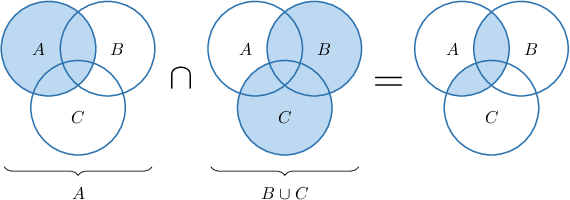
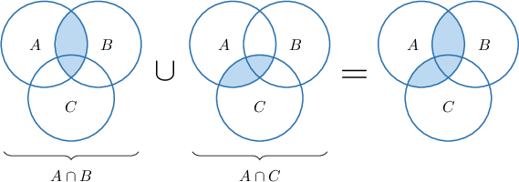
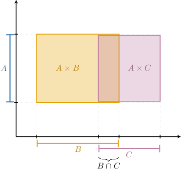
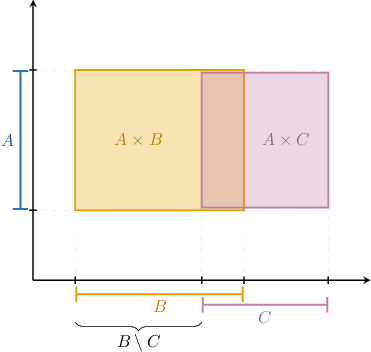
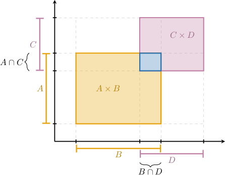
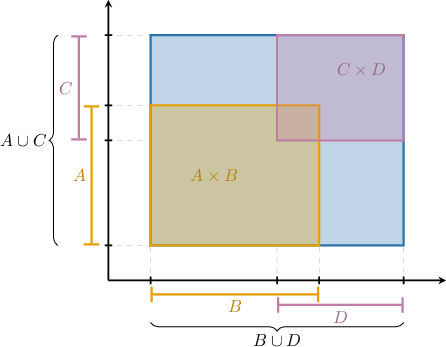

# Distributive Properties of Set Operations

Source: https://www.mathacademy.com/topics/4430?courseId=76
Topic ID: 4430

## Prerequisites

- [The Cartesian Product](./49-the-cartesian-product.md)
- [The Difference of Sets](./2828-the-difference-of-sets.md)
- [Elementary Properties of Set Operations](./4327-elementary-properties-of-set-operations.md)

## Lesson

### Introduction

Given that $A,$ $B,$ and $C$ are sets, we have the following **distributive properties** of union and intersection:

- We can distribute an intersection over a union: Since intersections are commutative, we can also write this property as follows:

- We can also distribute a union over an intersection: Since unions are commutative, we can also write this property as follows:

Let's build some intuition around the first property:

$$

A \cap (B \cup C) = (A \cap B) \cup (A \cap C)

$$

First, notice that this distributive law works similarly to the distributive laws for real numbers $a, b,$ and $c.$

$$

a\cdot (b+c) = a\cdot b+ a\cdot c, \qquad\qquad (a+b)\cdot c = a\cdot c + b\cdot c

$$

Also, we can visualize this law using Venn diagrams:

- The left-hand side of the identity can be represented using Venn diagrams as follows:

- Then, the corresponding right-hand side looks as shown below:

In both cases, we have the same resulting set.

It's worth taking a moment to convince yourself that the other identities are true by drawing similar pictures.

Remember that images alone do not constitute formal mathematical proof. Later in the course, we will learn how to formally prove these results.

### Example: Applying the Distributive Properties of Unions and Intersections

#### Question

Given that

$$

\begin{aligned}𝐴∪𝐶 & ={1,2,3,5}, \\ 𝐵∪𝐶 & ={1,2,3,4}, \\ 𝐴∩𝐶 & ={1}, \\ 𝐵∩𝐶 & ={2},\end{aligned}

$$

calculate $(A \cap B) \cup C$ and $(A \cup B) \cap C.$

#### Explanation

The distributive property of union over intersection states

$$

(A \cap B) \cup C = (A \cup C) \cap (B \cup C).

$$

Now, since,

$$

A \cup C =\{1,2,3 ,5\}, \qquad B \cup C=\{ 1,2,3,4 \},

$$

we have

$$

\begin{aligned}(𝐴∩𝐵)∪𝐶 & =(𝐴∪𝐶)∩(𝐵∪𝐶) \\ & ={1,2,3,5}∩{1,2,3,4} \\ & ={1,2,3}.\end{aligned}

$$

On the other hand, the distributive property of intersection over union states

$$

(A \cup B) \cap C = (A \cap C) \cup (B \cap C).

$$

Now, since,

$$

A \cap C =\{ 1 \}, \qquad B \cap C=\{2 \},

$$

we have

$$

\begin{aligned}(𝐴∪𝐵)∩𝐶 & =(𝐴∩𝐶)∪(𝐵∩𝐶) \\ & ={1}∪{2} \\ & ={1,2}.\end{aligned}

$$

### Distributing Cartesian Products

The Cartesian product distributes over unions and intersections in much the same way that unions distribute over intersections and vice versa.

#### Distributivity over Unions:

The Cartesian product distributes over the union of two sets according to the following laws:

- $A \times (B \cup C) = (A \times B) \cup (A \times C)$

- $(A \cup B) \times C = (A \times C) \cup (B \times C)$

We can visualize the first rule using the diagram below.

Notice that the rectangle corresponding to the Cartesian product $A \times (B \cup C)$ equals the union of the rectangles corresponding to $\color{SandyBrown}A \times B$ and $\color{Plum}A \times C.$

#### Distributivity over Intersections:

The Cartesian product distributes over the intersection of two sets according to the following laws:

- $A \times (B \cap C) = (A \times B) \cap (A \times C)$

- $(A \cap B) \times C = (A \times C) \cap (B \times C)$

We can visualize the first rule using the same diagram as before.

Notice that the rectangle corresponding to the Cartesian product $A \times (B \cap C)$ equals the intersection of the rectangles corresponding to $\color{SandyBrown}A \times B$ and $\color{Plum}A \times C.$

#### Distributivity over Differences:

The Cartesian product distributes over the difference between two sets according to the following laws:

- $A \times (B \setminus C) = (A \times B) \setminus (A \times C)$

- $(A \setminus B) \times C = (A \times C) \setminus (B \times C)$

We can visualize the first rule using the same diagram.

Notice that the rectangle corresponding to the Cartesian product $A \times (B \setminus C)$ equals the difference between rectangles corresponding to $\color{SandyBrown}A \times B$ and $\color{Plum}A \times C.$

### Example: Applying the Distributive Properties of the Cartesian Product

#### Question

Given that

$$

A\times B =\{(0,0),(0,1)\}, \quad A\times C = \{(0,0),(0,2)\},

$$

what are $A \times (B \cup C)$ and $A \times (B \cap C)?$

#### Explanation

The distributive properties of the Cartesian product over unions and intersections state

$$

\begin{aligned}𝐴×(𝐵∪𝐶)=(𝐴×𝐵)∪(𝐴×𝐶), \\ 𝐴×(𝐵∩𝐶)=(𝐴×𝐵)∩(𝐴×𝐶).\end{aligned}

$$

Now, since

$$

A \times B = \{(0,0),(0,1)\}, \qquad A\times C = \{(0,0),(0,2)\},

$$

we have

$$

\begin{aligned}𝐴×(𝐵∪𝐶) & =(𝐴×𝐵)∪(𝐴×𝐶) \\ & ={(0,0),(0,1)}∪{(0,0),(0,2)} \\ & ={(0,0),(0,1),(0,2)},\end{aligned}

$$

and

$$

\begin{aligned}𝐴×(𝐵∩𝐶) & =(𝐴×𝐵)∩(𝐴×𝐶) \\ & ={(0,0),(0,1)}∩{(0,0),(0,2)} \\ & ={(0,0)}.\end{aligned}

$$

### Intersections and Unions of Cartesian Products

Finally, we also have the following law:

$$

(A \times B) \cap (C \times D) = (A \cap C) \times (B \cap D)

$$

We can visualize this rule using the diagram below.

Notice that the rectangle corresponding to the Cartesian product $\color{SteelBlue}(A \cap C) \times (B \cap D)$ equals the intersection of rectangles corresponding to $\color{SandyBrown}A \times B$ and $\color{Plum}C \times D.$

However, the analogous law for unions is *not* valid in general:

$$

(A \times B) \cup (C \times D) \neq (A \cup C) \times (B \cup D)

$$

It's clear from the following diagram why this is the case.

Notice that the rectangle corresponding to the Cartesian product $\color{SteelBlue}(A \cup C) \times (B \cup D)$ is *larger than* the union of rectangles corresponding to $\color{SandyBrown}A \times B$ and $\color{Plum}C \times D.$

These diagrams are great for building intuition around these distributive laws. However, they do not constitute a formal mathematical proof of these laws.

One way to prove these laws is to use the property that $X=Y$ if and only if $X \subseteq Y$ and $Y \subseteq X.$ So, let's begin by proving a subset relation for one of these identities.

### Example: Finding Unions and Intersections of Cartesian Products

#### Question

Given that

$$

A \cap C = \{1,2,4\}, \quad B\cap D = \{0,3\},

$$

what is $(A \times B) \cap (C \times D)?$

#### Explanation

We have the following identity for all sets $A,B,C,D{:}$

$$

(A \times B) \cap (C \times D) = (A\cap C) \times (B\cap D).

$$

Now, since

$$

A \cap C = \{1,2,4\}, \qquad B \cap D = \{0,3\}

$$

we have

$$

\begin{aligned}(𝐴×𝐵)∩(𝐶×𝐷) & =(𝐴∩𝐶)×(𝐵∩𝐷). \\ & ={1,2,4}×{0,3} \\ & ={(1,0),(1,3),(2,0),(2,3),(4,0),(4,3)}.\end{aligned}

$$
