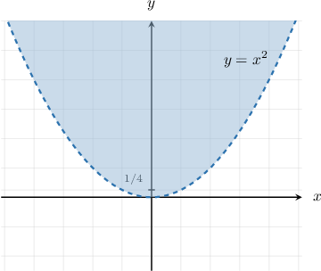

# Relations on Infinite Sets

Source: https://www.mathacademy.com/topics/4826?courseId=76
Topic ID: 4826

## Prerequisites

- [Relations on Finite Sets](./2817-relations-on-finite-sets.md)

## Lesson

### Introduction

Recall that a binary relation $R$ on a set $A$ is a subset of the Cartesian product $A\times A = A^2{:}$

$$

R\subseteq A^2

$$

Additionally, we have the following notations:

- $x \: R \: y$ if and only if $(x,y) \in R$

- $x \: \!R\! \: y$ if and only if $(x,y) \notin R$

Relations can be defined over infinite sets. For example, consider the relation $R$ on $\mathbb{Z}$ defined by

$$

x \: R \: y \qquad \Leftrightarrow \qquad x \geq y.

$$

In this case, we have $x \: R \: y$ if and only if $x \geq y.$ For this relation, note that

- the symbols $R$ and $\geq$ are interchangeable, and

- the symbols $\!R\!$ and $\not\geq$ (or, equivalently, $\!R\!$ and $\lt$) are also interchangeable.

For example:

- $2 \: R \: 0$ since $2 \geq 0$

- $ 1 \: \!R\! \: \pi$ since $1 \not\geq \pi$

- $0 \: R \: 0$ since $0 \geq 0$

Finally, since $R$ is the set of ordered pairs $(x,y) \in \mathbb{Z}^2$ such that $x \geq y,$ we can write out $R$ in set-builder notation as

$$

R = \big\{ (x,y) \in \mathbb{Z}^2 \: : \: x \geq y \big\}.

$$

### Example: Identifying Ordered Pairs Belonging to a Standard Relation

#### Question

Consider the following set:

$$

A = \big\{\mathbb{R}_0^+, \mathbb{R}_0^-, \mathbb{R}\big\}

$$

Given the relation $R$ on $A$ defined by

$$

X\:R\: Y \quad \Leftrightarrow \quad X\supset Y,

$$

which of the following statements are true?

1. $\mathbb{R} \: R\: \mathbb{R}_0^-$

2. $\mathbb{R}_0^- \: R\: \mathbb{R}_0^+$

3. $\mathbb{R}_0^+ \: \!R\! \: \mathbb{R}$

#### Explanation

A relation $R$ on a set $A$ is a subset of the Cartesian product $A\times A = A^2.$

$$

R\subseteq A^2

$$

We also have the following notations:

- $x \: R \: y$ if and only if $(x,y) \in R$

- $x \: \!R\! \: y$ if and only if $(x,y) \notin R$

In this case, we have $X \: R \: Y$ if and only if $X\supset Y.$ For this relation, note that

- the symbols $R$ and $\supset$ are interchangeable, and

- the symbols $\!R\!$ and $\not\supset$ are also interchangeable.

With that in mind, let's examine our statements in turn.

- Statement I is true. Replacing $R$ with the symbol $\supset,$ we have $\mathbb{R} \supset \mathbb{R}_0^-.$ This is equivalent to $\mathbb{R}_0^- \subset \mathbb{R},$ which is true.

- Statement II is false. Replacing $R$ with the symbol $\supset,$ we have $\mathbb{R}_0^- \supset \mathbb{R}_0^+.$ This is equivalent to $\mathbb{R}_0^+ \subset \mathbb{R}_0^-,$ which is false.

- Statement III is true. Replacing $\!R\!$ with the symbol $\not\supset,$ we have $\mathbb{R}_0^+ \not\supset \mathbb{R}.$ This is equivalent to $\mathbb{R} \not\subset \mathbb{R}_0^+,$ which is true.

Therefore, the correct answer is "I and III only."

### Example: Identifying Ordered Pairs Belonging to a Non-Standard Relation

#### Question

Consider the following set:

$$

A = \big\{\mathbb{Z}, \mathbb{Q}, \mathbb{R}\big\}

$$

Given the relation $R$ on $A$ defined by

$$

X\:R\: Y \quad \Leftrightarrow \quad \mathbb{Q} \subseteq X \cap Y,

$$

which of the following statements are true?

1. $\mathbb{Z} \: R \: \mathbb{Q}$

2. $\mathbb{R} \: R \: \mathbb{R}$

3. $\mathbb{Q} \: \!R\!\: \mathbb{R}$

#### Explanation

A relation $R$ on a set $A$ is a subset of the Cartesian product $A\times A = A^2.$

$$

R\subseteq A^2

$$

We also have the following notations:

- $x \: R \: y$ if and only if $(x,y) \in R$

- $x \: \!R\! \: y$ if and only if $(x,y) \notin R$

In this case, we have $X \: R \: Y$ if and only if $\mathbb{Q} \subseteq X \cap Y.$

With that in mind, let's examine our statements in turn.

- Statement I is false. In this case, we have $\mathbb{Q} \subseteq \mathbb{Z} \cap \mathbb{Q},$ which is false.

- Statement II is true. In this case, we have $\mathbb{Q} \subseteq \mathbb{R} \cap \mathbb{R},$ which is true.

- Statement III is false. In this case, we have $\mathbb{Q} \not\subseteq \mathbb{Q} \cap \mathbb{R},$ which is false.

Therefore, the correct answer is "II only."

### Example: Expressing Relations Using Set-Builder Notation

#### Question

Let $A = \mathbb{R},$ and consider the relation $R$ on $A$ such that $x \: R \: y$ if and only if $x$ and $y$ both lie above the upward-opening parabola whose focus is at $\left(0,\dfrac14\right)$ and whose vertex is at $O.$ Express $R$ using set-builder notation.

#### Explanation

A relation $R$ on a set $A$ is a subset of the Cartesian product $A\times A = A^2.$

$$

R\subseteq A\times A

$$

For a relation $R$ on a set $A,$ we also have the following notations:

- $a \: R \: b$ if and only if $(a,b) \in R$

- $a \: \!R\! \: b$ if and only if $(a,b) \notin R$

In this case, $R$ is the set of ordered pairs $(x,y) \in \mathbb{R} \times \mathbb{R} = \mathbb{R}^2$ such that $y \gt x^2.$

Therefore, we can write out $R$ in set-builder notation as follows:

$$

R = \Big\{ (x,y) \in \mathbb{R}^2 \: : \: y \gt x^2 \Big\}

$$
