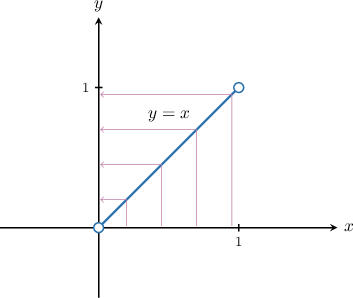
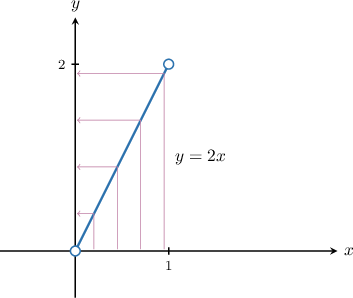
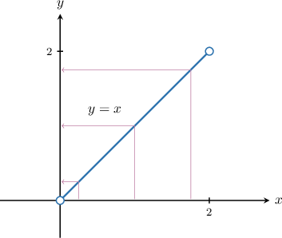
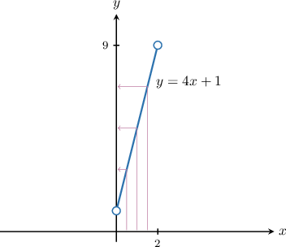
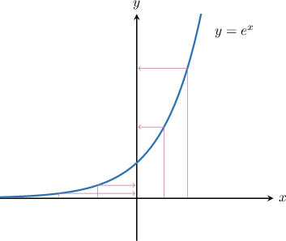
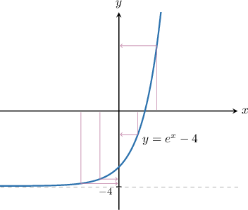
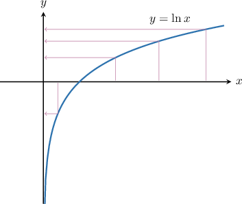
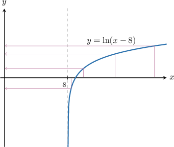
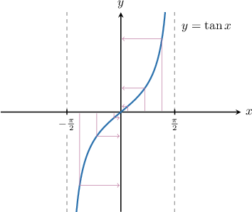
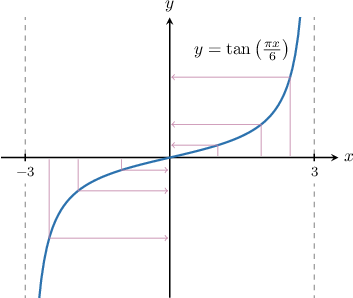

# Continuous Infinite Sets With Equal Cardinality

Source: https://www.mathacademy.com/topics/4860?courseId=76
Topic ID: 4860

## Prerequisites

- [Graph Transformations of Tangent and Cotangent](../algebra-ii/654-graph-transformations-of-tangent-and-cotangent.md)
- [Graphing the Inverse Tangent Function](../integrated-math-iii-honors/1487-graphing-the-inverse-tangent-function.md)
- [Combining Graph Transformations of Logarithmic Functions](../algebra-ii/1707-combining-graph-transformations-of-logarithmic-functions.md)
- [Discrete Infinite Sets With Equal Cardinality](./3424-discrete-infinite-sets-with-equal-cardinality.md)

## Lesson

### Introduction

Recall that two sets $A$ and $B$ have the *same cardinality* if there exists a bijection of $A$ onto $B.$ If no such bijection exists, the sets are said to have *unequal cardinalities*.

In this lesson, we'll discuss how bijections can be used to determine whether two real intervals have the same cardinality.

To begin, consider the intervals $A$ and $B,$ defined below:

$$

A= (0,1), \qquad B= (0,2)

$$

In terms of their *lengths*, the second interval is twice as long as the first. But what about their cardinalities?

Since the length of $B$ is twice that of $A,$ our intuition might tell us that $B$ should have twice the cardinality of $A.$ However, this is *not* the case! You might be surprised to learn that $A$ and $B$ have the same cardinality!

$$

|A| = |B|

$$

To show why this is true, we need to construct a bijection that maps $A$ onto $B.$

First, notice that the function $y=x$ bijectively (i.e., both injectively and surjectively) maps the interval $(0,1)$ onto the interval $(0,1).$

However, we need a function that maps $(0,1)$ onto $(0,2)$ instead of onto $(0,1).$ To construct one, we can stretch our function by a factor of $2$ along the $y$-axis. This can be done by multiplying the function by $2.$

So, we consider the function $f: A \to B$ that maps the underlying sets as follows:

$$

f: x \to 2x

$$

Notice that $f$ bijectively maps $(0,1)$ onto $(0,2).$

Therefore, $|A| = |B|,$ i.e., the sets have the same cardinality.

### Example: Constructing a Bijection Between Two Open Segments

#### Question

Do the sets below have the same cardinality, and why?

$$

A= (0,2), \qquad B= (1,9)

$$

#### Explanation

Sets $A$ and $B$ have the ** if there exists a bijection of $A$ onto $B.$

Recall that the function $y=x$ bijectively (i.e., both injectively and surjectively) maps the interval $(0,2)$ onto the interval $(0,2).$

However, we need a function that maps $(0,2)$ of length $2$ onto $(1,9)$ of length $8.$ To construct one, we proceed as follows:

- First, we stretch our function by a factor of $4$ along the $y$-axis, i.e, multiply the function by $4.$

- Next, we shift the result $1$ units up, i.e., add $1$ to the result of the previous transformation.

So, we consider the function $f: (0,2) \to (1,9)$ that maps the underlying sets as follows:

$$

f: x \to 4x + 1

$$

Notice that $f$ bijectively maps $(0,2)$ onto $(1,9).$

Therefore, $|A| = |B|,$ i.e., the sets have the same cardinality.

### The Exponential and Logarithm Functions

As we've seen, transformations of the function $f(x) = x$ help to construct bijections that map finite intervals to finite intervals. Let's now consider some functions we can use to map infinite intervals to infinite intervals.

- The function $y=e^x$ bijectively (i.e., both injectively and surjectively) maps the interval $(-\infty,\infty) = \mathbb{R}$ onto the interval $(0,\infty).$

- On the other hand, $y=\ln x$ bijectively maps the interval $(0,\infty)$ onto the interval $(-\infty,\infty) = \mathbb{R}.$

In particular, this means that

$$

\big| (0,\infty) \big| = \big| (-\infty,\infty) \big| = |\mathbb R|.

$$

Similar to what we've seen previously, we can perform transformations on these elementary functions to construct bijections that map between different intervals. Let's see some examples.

### Example: Constructing a Bijection Between the Real Line and a Ray

#### Question

Consider the following intervals.

$$

A= (-4,\infty), \qquad B = \mathbb{R}

$$

If possible, construct a bijection from $B$ onto $A.$ Use your result to determine whether the sets have the same cardinality.

#### Explanation

Sets $A$ and $B$ have the ** if there exists a bijection between $A$ and $B.$

Recall that the function $y=e^x$ bijectively (i.e., both injectively and surjectively) maps the interval $(-\infty,\infty) = \mathbb{R}$ onto the interval $(0,\infty).$

However, we need a function that maps $\mathbb R$ onto $(-4,\infty)$ instead of $(0,\infty).$ To construct one, we shift our exponential graph by $4$ downward. This can be done by subtracting $4$ from the function.

So, we consider the function $f: B \to A$ that maps the underlying sets as follows:

$$

f: x \to e^{x}-4

$$

Notice that $f$ bijectively maps $\mathbb{R}$ onto $(-4,\infty).$

Therefore, $|A| = |B|,$ i.e., the sets have the same cardinality.

### Example: Constructing a Bijection Between a Ray and the Real Line

#### Question

Consider the following intervals.

$$

A= (8,\infty), \qquad B = \mathbb{R}

$$

If possible, construct a bijection from $A$ onto $B.$ Use your result to determine whether the sets have the same cardinality.

#### Explanation

Sets $A$ and $B$ have the ** if there exists a bijection between $A$ and $B.$

Recall that the function $y=\ln x$ bijectively (i.e., both injectively and surjectively) maps the interval $(0,\infty)$ onto the interval $(-\infty,\infty) = \mathbb{R}.$

However, we need a function that maps $(8,\infty)$ onto $\mathbb R$ instead of $(0,\infty)$ onto $\mathbb{R}.$ To construct one, we shift our logarithm function by $8$ units to the right. This can be done by subtracting $8$ from the argument.

So, we consider the function $f: A \to B$ that maps the underlying sets as follows:

$$

f: x \to \ln(x-8)

$$

Notice that $f$ bijectively maps $(8,\infty)$ onto $\mathbb{R}.$

Therefore, $|A| = |B|,$ i.e., the sets have the same cardinality.

### Tangent, Cotangent, and Arctangent

Finally, let's consider functions we can use to map an (open) segment to the real line and vice-versa.

- The function $y = \tan x$ bijectively (i.e., both injectively and surjectively) maps the interval $\left(-\dfrac{\pi}2,\dfrac{\pi}2\right)$ onto the interval $(-\infty,\infty) = \mathbb{R}.$

- Similarly, the function $y = \cot x$ bijectively maps the interval $\left(0, \pi\right)$ onto the interval $(-\infty,\infty) = \mathbb{R}.$

- Finally, the function $y = \arctan x$ bijectively maps the interval $\left(-\infty, \infty \right)$ onto the interval $\left(-\dfrac\pi2,\dfrac\pi2\right).$

In particular, this means that

$$

\bigg| \left( -\dfrac{\pi}{2}, \dfrac{\pi}{2} \right) \bigg| =\big|(0,\pi)\big|= \big| (-\infty, \infty) \big| = \big|\mathbb R\big|.

$$

### Example: Constructing a Bijection Between an Open Segment and the Real Line

#### Question

Do the sets below have the same cardinality, and why?

$$

A= (-3,3), \qquad B= \mathbb{R}

$$

#### Explanation

Sets $A$ and $B$ have the ** if there exists a bijection between $A$ and $B.$

Recall that the function $y = \tan x$ bijectively (i.e., both injectively and surjectively) maps the interval $\left(-\dfrac{\pi}2,\dfrac{\pi}2\right)$ onto the interval $(-\infty,\infty) = \mathbb{R}.$

However, we need a function that maps from $(-3,3)$ onto $\mathbb R$ instead of $\left(-\dfrac{\pi}2,\dfrac{\pi}2\right)$ onto $\mathbb R.$ To construct one, we can expand our tangent curve by a factor of $\dfrac{6}{\pi}$ along the $x$-axis. This can be done by multiplying the argument of the function by $\dfrac{\pi}{6}.$

So, we consider the function $f: A \to B$ that maps the underlying sets as follows:

$$

f: x \to \tan \left(\dfrac{\pi x}{6}\right)

$$

Notice that $f$ bijectively maps $(-3,3)$ onto $\mathbb{R}.$

Therefore, $|A| = |B|,$ i.e., the sets have the same cardinality.
