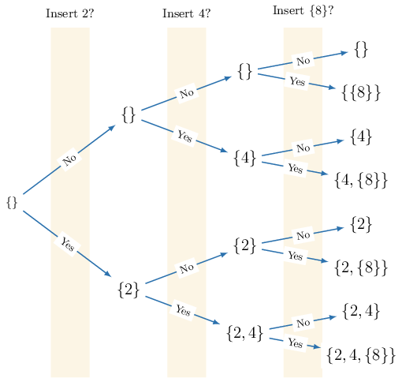
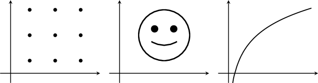
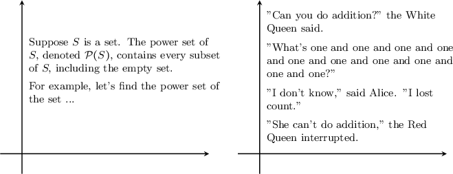

# Power Sets

Source: https://www.mathacademy.com/topics/51?courseId=76
Topic ID: 51

## Prerequisites

- [The Cartesian Product](./49-the-cartesian-product.md)

## Lesson

### Introduction

Suppose $S$ is a set. The **power set** of $S,$ denoted $\mathcal{P}(S),$ is the set containing every subset of $S,$ *including* the empty set.

For example, let's find the power set of the set

$$

S = \{ 1,2,3 \}.

$$

To do this, we list out all the subsets of $S{:}$

- The subset containing no elements is $\emptyset.$

- The subsets containing $1$ element are $\{1 \},$ $\{2 \},$ and $\{3 \}.$

- The subsets containing $2$ elements are $\{1,2 \},$ $\{1,3 \},$ and $\{2,3 \}.$

- The subset containing $3$ elements is $S$ itself: $\{1,2,3 \}.$

Now, let's put all these subsets together as elements of a single set. We get

$$

\mathcal{P}(S) = \big\{ \emptyset, \{1\}, \{2\}, \{3\}, \{ 1,2 \}, \{ 1,3 \}, \{ 2,3 \}, \{ 1,2,3 \} \big\}.

$$

### Using a Tree Diagram

Another way to generate all the subsets of $S=\{1,2,3 \}$ is using a tree diagram. We start off with the empty set $\{\}$ and generate additional subsets of $S$ by systematically inserting or excluding elements of $S.$

Let's go through the process.

- Start with the empty set $\{\}$ at the root node of our tree. This is the parent node.

- Draw two branches pointing away from the parent node. The tip of each arrow gives a child node. Label one branch 'No' and the other 'Yes'.

- We'll now write down a subset of $S$ at each child node: At the child node (tip of the arrow) whose branch is labeled 'No,' we write down the parent node's set. At the child node whose branch is labeled 'Yes,' we create a new set by inserting the *first* element of $S$ into the parent node's set. This gives the following subset of $S{:}$ We now have the following diagram.

We repeat the process, setting the subsets found in the previous step as the new parent nodes.

- We start by considering the parent node $\{\}{:}$ At the child node whose branch is labeled 'No', we write down the parent node's set. At the child node whose branch is labeled 'Yes,' we create a new set by inserting the *second* element of $S$ into the parent node's set. This gives the following subset of $S{:}$ We now have the following diagram.

- Then, we consider the parent node $\{1\}{:}$ At the child node whose branch is labeled 'No', we write down the parent node's set. At the child node whose branch is labeled 'Yes,' we create a new set by inserting the *second* element of $S$ into the parent node's set. This gives the following subset of $S{:}$ We now have the following diagram.

- Finally, we repeat the process for the new parent nodes $\{\}, \{2\}, \{1\},$ and $\{1,2\}.$ Our final tree diagram looks as follows.

The final column lists all subsets of $S.$

$$

\emptyset = \{\},\quad \{1\},\quad \{2\},\quad \{3\},\quad \{ 1,2 \},\quad \{ 1,3 \},\quad \{ 2,3 \},\quad \{ 1,2,3 \}

$$

Finally then, we can write down $\mathcal P(S){:}$

$$

\mathcal{P}(S) = \big\{ \emptyset, \{1\}, \{2\}, \{3\}, \{ 1,2 \}, \{ 1,3 \}, \{ 2,3 \}, \{ 1,2,3 \} \big\}.

$$

### Example: Listing the Elements in a Power Set

#### Question

Find $\mathcal{P}(A)$ if $A = \{2, 4, \{8 \} \}.$

#### Explanation

The power set of $A,$ denoted $\mathcal{P}(A),$ is the set that contains every possible subset of $A,$ including the empty set $\emptyset.$

So, let's list all possible subsets of $A$ using a tree diagram.

According to our diagram, the subsets of $A$ are

$$

\emptyset = \{\},\quad \{2\},\quad \{4\},\quad \{ \{8\} \}, \quad \{2, 4\},\quad \{2, \{8\}\},\quad \{4, \{8\}\},\quad\{2, 4, \{8\}\}.

$$

Therefore, we have

$$

\mathcal{P}(A) = \{\emptyset, \{2\}, \{4\}, \{\{8\}\}, \{2, 4\}, \{2, \{8\}\}, \{4, \{8\}\},\{2, 4, \{8\}\}\}.

$$

### The Cardinality of a Power Set

Suppose we have a finite set $S$ with cardinality $|S|.$ Then, the cardinality of $\mathcal P(S)$ is given by

$$

\left|\mathcal{P}(S)\right| = 2^{\left| S \right|}.

$$

In other words, a finite set with cardinality $|S|$ has $2^{|S|}$ subsets.

For example, for the set $S = \{a,b,c \},$ we have $|S| = 3,$ and therefore

$$

\left|\mathcal{P}(S)\right| = 2^{\left| S \right|} = 2^3 = 8.

$$

This tells us that $S$ has $8$ subsets, and consequently, $\mathcal{P}(S)$ has $8$ elements.

$$

\mathcal{P}(S) = \big\{ \underbrace{\emptyset}_1, \underbrace{ \{a\}}_2, \underbrace{ \{b\}}_3, \underbrace{ \{c\}}_4, \underbrace{ \{ a,b \}}_5, \underbrace{ \{ a,c \}}_6, \underbrace{ \{ b,c \}}_7, \underbrace{ \{ a,b,c \}}_8 \big\}

$$

Note the following:

- It's clear from our rule that if $S$ is finite, then $\mathcal P(S)$ is finite.

- It can be shown that if $S$ is infinite, then $\mathcal P(S)$ is also infinite.

We'll discuss power sets of infinite sets at the end of this lesson and in future lessons.

### Example: Computing the Cardinality of a Power Set

#### Question

If $Y = \{1, \{3, 5 \}, 7, X \},$ then what is $\left|\mathcal{P}(Y)\right|?$

#### Explanation

For any set $Y,$ we have $\left|\mathcal{P}(Y)\right| = 2^{\left| Y \right|}.$

In this case, $\left| Y \right| = 4,$ so we have

$$

\left| \mathcal{P}(Y) \right| = 2^{\left| Y \right|} = 2^{4} = 16.

$$

Remember that $\{3,5 \}$ is a single element in the set $Y.$

### Example: Determining Cardinality in More Advanced Cases

#### Question

Given that $Y =\{\mu\}$ and $Z =\{1,2\},$ find $\left|\mathcal{P}(\mathcal{P}(Y\times Z))\right|.$

#### Explanation

For any set $S,$ we have $\left|\mathcal{P}(S)\right| = 2^{\left| S \right|}.$ Also, $|S \times T| = |S| \cdot |T|.$

In our case,

$$

\left| Y \right| = 1, \qquad \left| Z \right| = 2.

$$

As a result,

$$

\begin{aligned}|P(𝑌×𝑍)| & =2^{|𝑌×𝑍|} \\ & =2^{|𝑌|\,⋅\,|𝑍|} \\ & =2^{1⋅2} \\ & =2^{2} \\ & =4.\end{aligned}

$$

Therefore, we obtain

$$

\begin{aligned}|P(P(𝑌×𝑍))| & =2^{|P(𝑌×𝑍)|} \\ & =2^{4} \\ & =16.\end{aligned}

$$

### Example: Identifying True Statements

#### Question

Which of the following statements are true?

1. $\mathcal{P}(\{\{\emptyset\}\}) = \{\emptyset, \{\emptyset\} \}$

2. $\mathcal{P} (\{\emptyset, \{0\} \}) = \{\emptyset, \{0\}, \{\{\emptyset\}\}, \{0, \emptyset\} \}$

3. $\mathcal{P}(\mathcal{P}(\{y\})) = \{\emptyset, \{\emptyset\}, \{\{y\}\}, \{\emptyset, \{y\}\} \}$

#### Explanation

The power set of $T,$ denoted $\mathcal{P}(T),$ is the set that contains every possible subset of $T,$ including the empty set $\emptyset.$

With that in mind, let's examine our statements.

- Statement I is false. Notice that we are given the set $\{\{\emptyset\}\}.$ So, its power set must be $\{\emptyset, \{\{\emptyset\}\} \}.$

- Statement II is false. Notice that we are given the set $\{\emptyset, \{0\} \}.$ So, its power set must be $\{\emptyset, \{\{0\}\}, \{\emptyset\}, \{\emptyset, \{0\} \} \}.$

- Statement III is true. Notice that we are given the set $\{y\}.$ So, its power set must be $\{\emptyset, \{y\} \}.$ Therefore, $\mathcal{P}(\mathcal{P}(\{y\})) = \{\emptyset, \{\emptyset\}, \{\{y\}\}, \{\emptyset, \{y\}\} \}.$

Therefore, the correct answer is "III only."

### Power Sets of Infinite Sets

In this lesson, our primary focus was on power sets of *finite* sets. The definition of the power set of an *infinite* set mirrors that of finite sets. Namely, it comprises all possible subsets.

As we already understand, for finite sets, the size of power sets grows exponentially based on the size of the underlying set:

$$

\big| \mathcal{P}(X) \big| = 2^{|X|}

$$

When dealing with power sets of infinite sets, the situation is more intricate.

For example, let's consider $\mathbb{R}^2,$ the set containing all points on the Cartesian plane. What are the elements of the power set $\mathcal P(\mathbb R^2)?$

Any collection of points on the plane is a subset of $\mathbb R^2.$ Such subsets can be visualized as black-and-white images on the plane, where points belonging to the subset are drawn in black, and points not belonging to the subset are represented in white.

For instance, each of the following images gives us a specific element of $\mathcal{P}(\mathbb{R}^2){:}$

It follows that any text, be it any or all existing Math Academy lessons, those planned for the future, or any other possible text (finite or infinite), including those not yet written, are all contained within $\mathcal{P}(\mathbb{R}^2).$

It's somewhat extraordinary that such a vast and important set can be expressed using just the symbols $\mathcal P(\mathbb R^2).$
