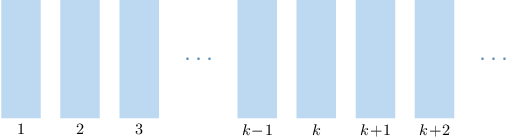

# Mathematical Induction

Source: https://www.mathacademy.com/topics/642?courseId=76
Topic ID: 642

## Prerequisites

- [Finding the Sum of an Arithmetic Series](../integrated-math-ii-honors/675-finding-the-sum-of-an-arithmetic-series.md)
- [Sums of Finite Geometric Series Given in Sigma Notation](../integrated-math-iii-honors/690-sums-of-finite-geometric-series-given-in-sigma-notation.md)
- [Universal and Existential Quantifiers](./2787-universal-and-existential-quantifiers.md)
- [Properties of Finite Series](../integrated-math-ii-honors/3958-properties-of-finite-series.md)

## Lesson

### Introduction

In this lesson, we'll introduce a powerful technique for proving mathematical results, known as **proof by mathematical induction** (or **proof by induction** for short).

Mathematical induction is used to prove statements of the form

$$

\forall n,\: P(n)

$$

where the universal set is $\mathbb N.$

For example, consider the following statement:

$$

P(n): \quad \sum_{i=1}^n i = 1+2+3+\cdots + n= \dfrac12 n (n+1)

$$

It can be shown (and we'll prove it shortly) that this statement is true *for all* $n\in\mathbb N.$

To get a feel for this result, let's begin by checking the first few instances:

- The statement is true for $n={\color{blue}{1}}{:}$

- The statement is also true for $n={\color{blue}{2}}{:}$

- The statement is also true for $n={\color{blue}{3}}{:}$

Unfortunately, checking a handful of cases is not a valid proof that $P(n)$ is true *for all* $n.$

Moreover, if we were able to create a computer program to check that $P(n)$ is true for all values of $n$ up to, say, $10^{100},$ this *still* would not be a valid proof that $P(n)$ is true *for all* $n.$

To resolve this difficulty, we can use proof by induction. To fully understand how proof by induction works, we first need to understand the **principle of induction**, which we'll discuss next.

### The Principle of Induction

The **principle of mathematical induction** states the following:

*Suppose we have a sequence of mathematical statements $P(1), \, P(2), \, P(3), \, \ldots,$ where*

- *$P(1)$ is true, and*

- *$P(k)\Rightarrow P(k+1)$ for every $k\in\mathbb N.$*

*Then, $P(n)$ is true for every $n\in\mathbb N.$*

To understand this principle, we can view our statements as a series of dominoes, where the first domino corresponds to $P(1),$ the second domino corresponds to $P(2),$ and so on.

A typical proof using the principle of induction can be split into the following steps:

- **Step 1: The Base Case**. We start by showing that the statement $P(1)$ is true. Visually, this means we're knocking down the first domino.

- **Step 2: Inductive Hypothesis**. Here, we *assume* that the statement $P(k)$ is true for some $k \geq 1.$ Visually, this means we're assuming that the $k$th domino has already fallen (as well as all the dominoes before).

- **Step 3: Inductive Step**. Next, we must show that $P(k) \Rightarrow P(k+1).$ In other words, we need to show that if the $k$th domino has fallen, then the $(k+1)$th domino must always fall, too.

- **Step 4: Conclusion**. We conclude that $P(n)$ is true for every $n \in \mathbb N.$

### A Template for Proving Results Using Induction

So, to prove a statement using induction, we use the following framework:

- **Step 1**: Base Case

- **Step 2**: Inductive Hypothesis

- **Step 3**: Inductive Step

- **Step 4**: Conclusion

So, let's outline a proof strategy (or template) for constructing a proof of the result we met earlier:

$$

P(n): \qquad \sum_{i=1}^n i = \dfrac12 n (n+1)

$$

We'll write down each step of our framework for this particular case.

******: *We first prove that our statement is true for the base case* $n=1.$

$$

\begin{aligned}𝑃(1):\,\underset{\underset{𝑖=1}{∑}}{\overset{}{1}}𝑖=\frac{1}{2}⋅1⋅(1+1)\end{aligned}

$$

Proving that the base case is true is usually straightforward. We calculate the left-hand and right-hand sides independently and show they're equal.

Next, we write down our **inductive hypothesis**. To do this, we assume that $P(k)$ is true for some $n=k\geq 1.$ This means we replace $n$ with $k$ in our original statement $P(n).$

******: *We assume that for some $n=k\geq 1,$ we have*

$$

P(k): \qquad \displaystyle\sum_{i=1}^k i = \dfrac12 k (k+1).

$$

Due to the base case, we already *know* that the statement is true for *some* value of $k,$ namely $k=1,$ so this assumption is valid.

Then, we move onto the **inductive step**: We must show that $P(k)\Rightarrow P(k+1).$ We start by writing down $P(k+1).$

******: *We're required to prove that*

$$

P(k+1): \qquad \displaystyle \sum_{i=1}^{k+1} i = \dfrac12 (k+1)(k+2).

$$

Once we've shown that $P(k)\Rightarrow P(k+1),$ our proof is complete, and we can write our conclusion.

******: *Therefore, we conclude that* $\displaystyle\sum_{i=1}^n i = \dfrac12n(n+1)$ for all $n\geq 1.$

Note the following:

- For now, we're simply constructing a "bird's-eye view" of how proof by induction works. We haven't yet proved anything! We'll get to the details of the proof shortly.

- The inductive step is where most of the work lies. The idea is to rewrite the left-hand side of this equation *using the inductive hypothesis* and apply algebraic techniques to show that this equals the right-hand side.

- It's possible to extend the principle of induction to statements of the form where $a$ and $n$ are integers. In this case, the only difference is that we must assume $P(k)$ is true for some $n=k\geq a$ as our inductive hypothesis.

Now that we've developed a strategy, let's apply this to another result.

### Example: Completing a Proof Template

#### Question

Suppose we wish to prove the following statement using mathematical induction:

$$

\sum_{i=1}^n 3i(i+3) = n(n+1)(n+5)

$$

What are the missing entries in the proof template below?

****: We first prove that our statement is true for the base case $n=1.$

$$

\begin{aligned}\underset{\underset{𝑖=1}{∑}}{\overset{}{1}}3𝑖(𝑖+3)=(1)(1+1)(1+5)\end{aligned}

$$

****: We assume that for some $n=k\geq 1,$ we have

$$

\displaystyle\sum_{i=1}^k 3i(i+3) = \boxed{\phantom{k(k+1)(k+5)}} .

$$

****: We're required to prove that

$$

\displaystyle \sum_{i=1}^{k+1} 3i(i+3) = \boxed{\phantom{(k+1)(k+2)(k+6)}} .

$$

****: Therefore, $\displaystyle\sum_{i=1}^n 3i(i+3) = n(n+1)(n+5)$ for all $n\geq 1.$

#### Explanation

To prove a statement using induction, we use the following framework:

- ****: Base Case

- ****: Inductive Hypothesis

- ****: Inductive Step

- ****: Conclusion

In this case, the general statement $P(n)$ we're required to prove is the following:

$$

\sum_{i=1}^n 3i(i+3) = n(n+1)(n+5)

$$

We start by proving the so-called **** $P(1).$ To do this, we substitute $n=1$ into both the left-hand side and right-hand side.

In our case, this gives the following:

****: We first prove that our statement is true for the base case $n=1.$

$$

\begin{aligned}\underset{\underset{𝑖=1}{∑}}{\overset{}{1}}3𝑖(𝑖+3)=1⋅(1+1)(1+5)\end{aligned}

$$

Proving that the base case is true is usually straightforward. We simply calculate the left-hand and right-hand sides independently and show they're equal.

Next, we write down our ****. We assume that $P(k)$ is true for some $n=k\geq 1.$ To do this, we simply replace $n$ with $k$ in our original statement $P(n).$

In our case, this gives the following:

****: We assume that for some $n=k\geq 1,$ we have

$$

\sum_{i=1}^k 3i(i+3) = \boxed{\color{blue}k(k+1)(k+5)}.

$$

Due to the base case, we already ** that the statement is true for ** value of $k,$ namely $k=1,$ so this assumption is valid.

Then, we move onto the ****: We must show that $P(k)\Rightarrow P(k+1).$ We start by writing down $P(k+1).$

****: We're required to prove that

$$

\sum_{i=1}^{k+1} 3i(i+3) = \boxed{\color{blue}(k+1)(k+2)(k+6)}.

$$

The inductive step is where most of the work lies. The idea is to rewrite the left-hand side of this equation ** and apply algebraic techniques to show that this equals the right-hand side.

Once we've shown that $P(k)\Rightarrow P(k+1),$ the proof is complete, and we state our ****.

****: Therefore, $\displaystyle\sum_{i=1}^n 3i(i+3) = n(n+1)(n+5)$ for all $n\geq 1.$

### Rewriting Finite Series

We're almost ready to construct our first proof by induction. Before we do, let's quickly discuss a handy trick that's often needed in these proofs.

Let $a_i$ for $i\geq 1$ be a sequence, and let $S(k)$ denote the sum of the first $k$ terms.

$$

S(k) = \sum_{i=1}^{k} a_i

$$

Therefore,

$$

S(k+1) = \sum_{i=1}^{k+1} a_i.

$$

When proving sums of finite series by induction, we often need to express $S(k+1)$ in terms of $S(k).$ This is usually very easy, as we can always write the last term of the series $S(k+1)$ on its own, as follows:

$$

\sum_{i=1}^{k+1} a_i = \left(\sum_{i=1}^{k} a_i\right) + a_{k+1}.

$$

Let's see a concrete example.

### Example: Expressing S(k+1) in Terms of S(k)

#### Question

Given that $\displaystyle S(k) = \sum_{i=1}^k 2^i,$ express $S(k+1)$ in terms of $S(k).$

#### Explanation

We need to express the summation $S(k+1)$ in terms of $S(k).$

Let $a_i$ for $i\geq 1$ be a sequence, and let $S(k)$ denote the sum of the first $k$ terms.

$$

S(k) = \sum_{i=1}^{k} a_i

$$

We can always express $S(k+1)$ in terms of $S(k)$ by writing the last term on its own, as follows:

$$

\sum_{i=1}^{k+1} a_i = \left(\sum_{i=1}^{k} a_i\right) + a_{k+1}.

$$

In our case, we have $a_i = 2^i.$ Therefore,

$$

\begin{aligned}𝑎_{𝑘+1}=2^{𝑘+1}.\end{aligned}

$$

Hence,

$$

\sum_{i=1}^{k+1} 2^i = \left(\sum_{i=1}^{k} 2^i \right) + 2^{k+1},

$$

which we can write as

$$

S(k+1) = S(k) + 2^{k+1}.

$$

### Proof By Induction

We now have everything we need to construct a proof by induction. So, let's prove that the following statement is true for all $n\in\mathbb N{:}$

$$

P(n): \qquad \sum_{i=1}^n i = \dfrac12 n (n+1)

$$

We start by proving the so-called base case, $P(1).$ To do this, we substitute $n=1$ into both the left-hand side and right-hand side and show that they're equal:

******: *We first prove our statement is true for the base case* $n=1.$ *For the left-hand side, we have*

$$

\begin{aligned}\underset{\underset{𝑖=1}{∑}}{\overset{}{1}}𝑖=1,\end{aligned}

$$

*and for the right-hand side, we have*

$$

\begin{aligned}\frac{1}{2}⋅1⋅(1+1)=1.\end{aligned}

$$

*Thus, our statement is true for* $n=1.$

Next, we state our inductive hypothesis. Here, we assume that the given statement is true for some $n=k\geq 1.$

******: *We assume that for some $n=k\geq 1,$ we have*

$$

\displaystyle \sum_{i=1}^k i = \dfrac12 k(k+1).

$$

We must show that $P(k)\Rightarrow P(k+1).$ Let's start by writing down $P(k+1).$ This is the first part of the so-called **inductive step**, so let's write that, too.

******: *We're required to prove that*

$$

\displaystyle \sum_{i=1}^{k+1} i = \dfrac12 (k+1)(k+2). \qquad\qquad (\ast)

$$

The idea is to rewrite the left-hand side of $(\ast)$ *using the inductive hypothesis* and apply algebraic techniques to show that this equals the right-hand side.

When proving sums of finite series using induction, the key to unlocking the proof is to write the last term on its own, as follows:

$$

\sum_{i=1}^{k+1} a_i = \left(\sum_{i=1}^{k} a_i\right) + a_{k+1.}

$$

Let's apply this technique in this case:

*We write*

$$

\begin{aligned}\underset{\underset{𝑖=1}{∑}}{\overset{}{𝑘+1}}𝑖=(\underset{\underset{𝑖=1}{∑}}{\overset{}{𝑘}}𝑖)+(𝑘+1).\end{aligned}

$$

*By the inductive hypothesis, we have*

$$

\begin{aligned}(\underset{\underset{𝑖=1}{∑}}{\overset{}{𝑘}}𝑖)+(𝑘+1) & =\frac{1}{2}𝑘(𝑘+1)+(𝑘+1) \\ & =(𝑘+1)(\frac{1}{2}𝑘+1) \\ & =(𝑘+1)(\frac{𝑘+2}{2}) \\ & =\frac{1}{2}(𝑘+1)(𝑘+2),\end{aligned}

$$

*as required.*

Since we've shown that the left-hand side of $(\ast)$ equals the right-hand side, our proof is complete. So, let's write down our conclusion.

*Therefore, by the principle of induction,* $\displaystyle \sum_{i=1}^ni = \dfrac12 n(n+1)$ *is true for all* $n\geq 1.$

### Stating the Full Proof

When writing a formal mathematical proof, we usually include only the essential details and exclude any additional commentary.

So, when communicating the full proof that $\displaystyle \sum_{i=1}^n i = \dfrac12 n (n+1)$ is true for all $n\in\mathbb N,$ we could write our proof as follows:

*We proceed using induction on $n.$*

******: *We first prove our statement is true for the base case* $n=1.$ *For the left-hand side, we have*

$$

\begin{aligned}\underset{\underset{𝑖=1}{∑}}{\overset{}{1}}𝑖=1,\end{aligned}

$$

*and for the right-hand side, we have*

$$

\begin{aligned}\frac{1}{2}⋅1⋅(1+1)=1.\end{aligned}

$$

*Thus, our statement is true for* $n=1.$

******: *We assume that for some $n=k\geq 1,$ we have*

$$

\displaystyle \sum_{i=1}^k i = \dfrac12 k(k+1).

$$

******: *We're required to prove that*

$$

\displaystyle \sum_{i=1}^{k+1} i = \dfrac12 (k+1)(k+2).

$$

*We write*

$$

\begin{aligned}\underset{\underset{𝑖=1}{∑}}{\overset{}{𝑘+1}}𝑖 & =(\underset{\underset{𝑖=1}{∑}}{\overset{}{𝑘}}𝑖)+(𝑘+1).\end{aligned}

$$

*By the inductive hypothesis, we have*

$$

\begin{aligned}(\underset{\underset{𝑖=1}{∑}}{\overset{}{𝑘}}𝑖)+(𝑘+1) & =\frac{1}{2}𝑘(𝑘+1)+(𝑘+1) \\ & =\frac{1}{2}(𝑘+1)(𝑘+2),\end{aligned}

$$

*as required.*

*Therefore, by the principle of induction,* $\displaystyle \sum_{i=1}^ni = \dfrac12 n(n+1)$ *is true for all* $n\geq 1.$

Note the following:

- For clarity, it's a good idea to state the proof method we plan to use at the beginning of the proof. For induction arguments, one possibility is to state, "*We proceed using induction on $n$*" at the beginning of the proof. This tells the reader that induction is the method of proof we're employing.

- Notice that we skipped a few steps in the algebra when applying the inductive hypothesis. This is quite normal. Formal proofs usually only include the steps essential to understanding the core argument. Although, this depends on the author and the intended reader. If the intended readers are new to mathematical proofs, keeping more detail is probably a good idea.

### Example: Proving Sums of Series Using Induction

#### Question

Prove that $\displaystyle \sum_{i=1}^{n} \dfrac{1}{4^i} = \dfrac{1}{3}\left(1 - \dfrac{1}{4^n}\right)$ using mathematical induction.

#### Explanation

The principle of induction states the following: Suppose we have a sequence of mathematical statements $P(1), P(2), P(3),\ldots,$ where

- $P(1)$ is true, and

- $P(k)\Rightarrow P(k+1)$ for every $k\in\mathbb N.$

Then, $P(n)$ is true for every $n\in\mathbb N.$

In this case, the general statement $P(n)$ we're required to prove is the following:

$$

\sum_{i=1}^n \dfrac{1}{4^i} = \dfrac{1}{3}\left(1 - \dfrac{1}{4^n}\right)

$$

We start by proving the so-called base case, $P(1).$ To do this, we substitute $n=1$ into both the left-hand side and right-hand side and show that they're equal:

We proceed using induction on $n.$

****: We first prove our statement is true for the base case $n=1.$ For the left-hand side, we have

$$

\begin{aligned}\underset{\underset{𝑖=1}{∑}}{\overset{}{1}}\frac{1}{4^{𝑖}}=\frac{1}{4^{1}}=\frac{1}{4},\end{aligned}

$$

and for the right-hand side, we have

$$

\begin{aligned}\frac{1}{3}(1−\frac{1}{4^{1}})=\frac{1}{3}(\frac{3}{4})=\frac{1}{4}.\end{aligned}

$$

Thus, our statement is true for $n=1.$

Next, we state our inductive hypothesis. Here, we assume that the given statement is true for some $n = k \geq 1.$

Due to the base case, we already ** that the statement is true for ** value of $k,$ namely $k = 1,$ so this assumption is valid.

****: We assume that for some $n = k \geq 1,$ we have

$$

\sum_{i=1}^{k} \dfrac{1}{4^i} = \dfrac{1}{3}\left(1 - \dfrac{1}{4^k}\right).

$$

We must show that $P(k) \Rightarrow P(k+1).$ Let's start by writing down $P(k+1).$ This is the first part of the so-called ****, so let's write that, too.

****: We're required to prove that

$$

\displaystyle \sum_{i=1}^{k+1} \dfrac{1}{4^i} = \dfrac{1}{3}\left(1 - \dfrac{1}{4^{k+1}}\right). \qquad\qquad (\ast)

$$

The idea is to rewrite the left-hand side of $(\ast)$ ** and apply algebraic techniques to show that this equals the right-hand side.

When proving sums of finite series using induction, the key to unlocking the proof is to write the last term on its own, as follows:

$$

\sum_{i=1}^{k+1} a_i = \left(\sum_{i=1}^{k} a_i\right) + a_{k+1}

$$

Let's apply this technique in this case:

We write

$$

\begin{aligned}\underset{\underset{𝑖=1}{∑}}{\overset{}{𝑘+1}}\frac{1}{4^{𝑖}} & =(\underset{\underset{𝑖=1}{∑}}{\overset{}{𝑘}}\frac{1}{4^{𝑖}})+(\frac{1}{4^{𝑘+1}}).\end{aligned}

$$

By the inductive hypothesis, we have

$$

\begin{aligned}(\underset{\underset{𝑖=1}{∑}}{\overset{}{𝑘}}\frac{1}{4^{𝑖}})+(\frac{1}{4^{𝑘+1}}) & =\frac{1}{3}(1−\frac{1}{4^{𝑘}})+\frac{1}{4^{𝑘+1}} \\ & =\frac{1}{3}−\frac{1}{3⋅4^{𝑘}}+\frac{1}{4^{𝑘+1}} \\ & =\frac{1}{3}−\frac{1}{4^{𝑘}}(\frac{1}{3}−\frac{1}{4}) \\ & =\frac{1}{3}−\frac{1}{4^{𝑘}}(\frac{1}{12}) \\ & =\frac{1}{3}−\frac{1}{4^{𝑘}}(\frac{1}{3⋅4}) \\ & =\frac{1}{3}−\frac{1}{3⋅4^{𝑘+1}} \\ & =\frac{1}{3}(1−\frac{1}{4^{𝑘+1}}),\end{aligned}

$$

as required.

Since we've shown that the left-hand side of $(\ast)$ equals the right-hand side, our proof is complete. So let's write down our conclusion.

Therefore, by the principle of induction, $\displaystyle \sum_{i=1}^{n} \dfrac{1}{4^i} = \dfrac{1}{3}\left(1 - \dfrac{1}{4^n}\right)$ is true for all $n\geq 1.$
