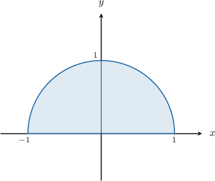

# Surface Integrals Over Cartesian Surfaces

Source: https://www.mathacademy.com/topics/1264?courseId=54
Topic ID: 1264

## Prerequisites

- [Surface Integrals Over Parametric Surfaces](./3386-surface-integrals-over-parametric-surfaces.md)
- [Areas of Surfaces](./3602-areas-of-surfaces.md)

## Lesson

### Introduction

Recall that for a surface $S$ with parametrization $\mathbf{r}(u,v)$ for $(u,v) \in D\subseteq \mathbb R^2,$ the surface integral of a scalar function $f(x,y,z)$ over $S$ is given by

$$

\iint\limits_S f(x,y,z) \, \textrm{d}S = \iint\limits_D f(\mathbf{r}(u,v)) \left\| \mathbf{r}'_u \times \mathbf{r}'_v \right\| \text{d}A.

$$

Now, if a surface is given by the explicit equation $z=g(x,y)$ over a plane region $D$ in Cartesian coordinates, then the canonical parametrization of this surface is

$$

\mathbf{r}(x,y) = \langle x,\: y, \: g(x,y) \rangle, \qquad (x,y) \in D.

$$

Moreover, we know that under the canonical parametrization, the magnitude of the fundamental vector product is given by

$$

\begin{aligned}𝐫_{′𝑥}^{}×𝐫_{′𝑦}^{} & =\sqrt{√1+(\frac{𝜕𝑧}{𝜕𝑥})^{2}+(\frac{𝜕𝑧}{𝜕𝑦})^{2}}.\end{aligned}

$$

Therefore, for a surface $S$ defined by $z=g(x,y)$ with $(x,y)\in D\subseteq \mathbb R^2,$ the surface integral of a scalar function $f(x,y,z)$ over $S$ is given by

$$

\iint\limits_S f(x,y,z) \, \textrm{d}S = \iint\limits_D f\left(x,y,g(x,y)\right) \sqrt{1+\left(\dfrac{\partial z}{\partial x}\right)^2+\left(\dfrac{\partial z}{\partial y}\right)^2} \: \text{d}A.

$$

### Example: Express Surface Integrals as Repeated Integrals

#### Question

Consider the surface integral of the function $f(x,y,z)=xz,$ where the surface $S$ is defined by $z=x^2-y$ for $0 \leq x \leq 2$ and $0 \leq y \leq 1.$ This surface integral can be written as a repeated integral, as shown below.

$$

𝐴𝐴𝐴𝐴𝐴𝐴𝐴

$$

What is the missing expression?

#### Explanation

For a surface $S$ defined by $z=g(x,y)$ with $(x,y)\in D,$ the surface integral of a scalar function $f(x,y,z)$ over $S$ is given by

$$

\iint\limits_S f(x,y,z) \, \textrm{d}S = \iint\limits_D f\left(x,y,g(x,y)\right) \sqrt{1+\left(\dfrac{\partial z}{\partial x}\right)^2+\left(\dfrac{\partial z}{\partial y}\right)^2} \: \text{d}A.

$$

For the partial derivatives, we have

$$

\dfrac{\partial z}{\partial x} = \dfrac{\partial}{\partial x}(x^2-y) = 2x,

$$

and

$$

\dfrac{\partial z}{\partial y} = \dfrac{\partial}{\partial y}(x^2-y) = -1.

$$

Therefore, the surface integral can be written as

$$

\begin{aligned}\underset{𝑆}{∬}𝑓(𝑥,𝑦,𝑧)\,d𝑆 & =\underset{𝐷}{∬}𝑓(𝑥,𝑦,𝑔(𝑥,𝑦))\sqrt{√1+(\frac{𝜕𝑧}{𝜕𝑥})^{2}+(\frac{𝜕𝑧}{𝜕𝑦})^{2}}\,d𝐴 \\ & =\underset{𝐷}{∬}𝑓(𝑥,𝑦,𝑔(𝑥,𝑦))\sqrt{√1+(2𝑥)^{2}+(−1)^{2}}\,d𝐴 \\ & =\underset{𝐷}{∬}\,𝑥(𝑥^{2}−𝑦)\sqrt{√2+4𝑥^{2}}\,d𝐴 \\ & =∫_{20}^{}∫_{10}^{}\,(𝑥^{3}−𝑥𝑦)\sqrt{√2+4𝑥^{2}}\,\,d𝑦\,d𝑥.\end{aligned}

$$

Therefore, the missing expression is ${\color{blue} (x^3-xy) \sqrt{2+4x^2}}.$

### Example: Evaluating Surface Integrals

#### Question

Evaluate the surface integral

$$

\iint\limits_{S} \dfrac{1}{\sqrt{z-x+y^2}} \: \textrm{d}S

$$

where $S$ is defined by $z=1+x+y^2$ for $0 \leq x \leq 1$ and $-1 \leq y \leq 1.$

#### Explanation

For a surface $S$ defined by $z=g(x,y)$ with $(x,y)\in D,$ the surface integral of a scalar function $f(x,y,z)$ over $S$ is given by

$$

\iint\limits_S f(x,y,z) \, \textrm{d}S = \iint\limits_D f\left(x,y,g(x,y)\right) \sqrt{1+\left(\dfrac{\partial z}{\partial x}\right)^2+\left(\dfrac{\partial z}{\partial y}\right)^2} \: \text{d}A.

$$

For the partial derivatives, we have

$$

\dfrac{\partial z}{\partial x} = \dfrac{\partial}{\partial x}\left(1+x+y^2\right) = 1,

$$

and

$$

\dfrac{\partial z}{\partial y} = \dfrac{\partial}{\partial y}\left(1+x+y^2\right) = 2y.

$$

Therefore, the surface integral can be evaluated as follows:

$$

\begin{aligned}\underset{𝑆}{∬}\frac{1}{\sqrt{√𝑧−𝑥+𝑦^{2}}}\,d𝑆 & =\underset{𝐷}{∬}𝑓(𝑥,𝑦,𝑔(𝑥,𝑦))\sqrt{√1+(\frac{𝜕𝑧}{𝜕𝑥})^{2}+(\frac{𝜕𝑧}{𝜕𝑦})^{2}}\,d𝐴 \\ & =\underset{𝐷}{∬}\,\frac{1}{\sqrt{√(1+𝑥+𝑦^{2})−𝑥+𝑦^{2}}}⋅\sqrt{√1+1^{2}+(2𝑦)^{2}}\,d𝐴 \\ & =\underset{𝐷}{∬}\,\frac{1}{\sqrt{√1+2𝑦^{2}}}⋅\sqrt{√2+4𝑦^{2}}\,d𝐴 \\ & =\underset{𝐷}{∬}\,\frac{1}{\sqrt{√1+2𝑦^{2}}}⋅\sqrt{√2(1+2𝑦^{2})}\,d𝐴 \\ & =\underset{𝐷}{∬}\,\frac{1}{\sqrt{√1+2𝑦^{2}}}⋅\sqrt{√2}⋅\sqrt{√1+2𝑦^{2}}\,d𝐴 \\ & =\underset{𝐷}{∬}\,\frac{1}{\sqrt{√1+2𝑦^{2}}}⋅\sqrt{√2}⋅\sqrt{√1+2𝑦^{2}}\,d𝐴 \\ & =\underset{𝐷}{∬}\,\sqrt{√2}\,d𝐴 \\ & =\sqrt{√2}\underset{𝐷}{∬}\,d𝐴 \\ & =\sqrt{√2}⋅Area(𝐷) \\ & =\sqrt{√2}⋅(1−0)⋅(1−(−1)) \\ & =\sqrt{√2}⋅1⋅2 \\ & =2\sqrt{√2}.\end{aligned}

$$

### Example: Evaluating Surface Integrals Using Polar Coordinates

#### Question

Evaluate the surface integral

$$

\displaystyle \iint\limits_{S} x^2y \: \textrm{d}S,

$$

where $S$ is defined by $z=\sqrt2x-y$ and whose domain is a semicircle of radius $1$ centered at $O$ in the upper-half plane, as shown above.

#### Explanation

For a surface $S$ defined by $z=g(x,y)$ with $(x,y)\in D,$ the surface integral of a scalar function $f(x,y,z)$ over $S$ is given by

$$

\iint\limits_S f(x,y,z) \, \textrm{d}S = \iint\limits_D f\left(x,y,g(x,y)\right) \sqrt{1+\left(\dfrac{\partial z}{\partial x}\right)^2+\left(\dfrac{\partial z}{\partial y}\right)^2} \: \text{d}A.

$$

For the partial derivatives, we have

$$

\dfrac{\partial z}{\partial x} = \dfrac{\partial}{\partial x}(\sqrt2x-y) = \sqrt2,

$$

and

$$

\dfrac{\partial z}{\partial y} = \dfrac{\partial}{\partial y}(\sqrt2x-y) = -1.

$$

Therefore, the surface integral can be expressed as follows:

$$

\begin{aligned}\underset{𝑆}{∬}𝑥^{2}𝑦\,d𝑆 & =\underset{𝐷}{∬}𝑓(𝑥,𝑦,𝑔(𝑥,𝑦))\sqrt{√1+(\frac{𝜕𝑧}{𝜕𝑥})^{2}+(\frac{𝜕𝑧}{𝜕𝑦})^{2}}\,d𝐴 \\ & =\underset{𝐷}{∬}𝑥^{2}𝑦⋅\sqrt{√1+(\sqrt{√2})^{2}+(−1)^{2}}\,d𝐴 \\ & =\underset{𝐷}{∬}𝑥^{2}𝑦⋅\sqrt{√4}\,d𝐴 \\ & =2\underset{𝐷}{∬}\,𝑥^{2}𝑦\,d𝐴.\end{aligned}

$$

Notice that in polar coordinates $(r, \theta),$ our domain can be expressed as

$$

\Delta = \left\{ (r,\theta) \: : \: 0 \leq r \leq 1, \: 0 \leq \theta \leq \pi \right\}.

$$

Therefore, using the change of variables formula for polar coordinates, where $x=r\cos\theta$ and $y=r\sin\theta,$ we obtain

$$

\begin{aligned}2\underset{𝐷}{∬}\,𝑥^{2}𝑦\,d𝐴 & =2\underset{Δ}{∬} 𝑓(𝑟cos⁡𝜃,𝑟sin⁡𝜃)\,𝑟 d𝑟d𝜃 \\ & =2\underset{Δ}{∬}𝑟^{2}cos^{2}⁡𝜃⋅𝑟sin⁡𝜃⋅𝑟\,d𝑟d𝜃 \\ & =2\underset{Δ}{∬}𝑟^{4}cos^{2}⁡𝜃sin⁡𝜃\,d𝑟d𝜃 \\ & =2∫_{𝜋0}^{}cos^{2}⁡𝜃sin⁡𝜃∫_{10}^{}𝑟^{4}\,d𝑟\,d𝜃 \\ & =2∫_{𝜋0}^{}cos^{2}⁡𝜃sin⁡𝜃\,[\frac{𝑟^{5}}{5}]_{10}^{}\,d𝜃 \\ & =\frac{2}{5}∫_{𝜋0}^{}cos^{2}⁡𝜃sin⁡𝜃\,d𝜃 \\ & =\frac{2}{15}[−cos^{3}⁡𝜃]_{𝜋0}^{} \\ & =\frac{2}{15}(1+1) \\ & =\frac{4}{15}.\end{aligned}

$$
