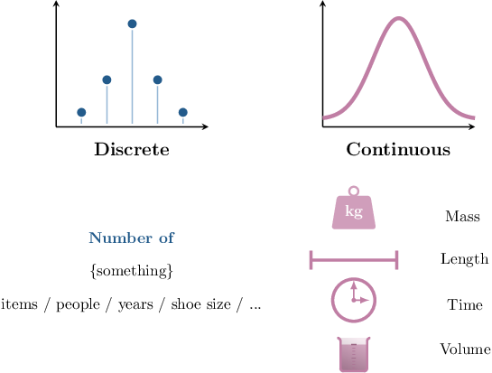
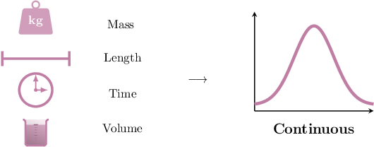
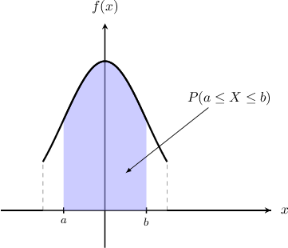
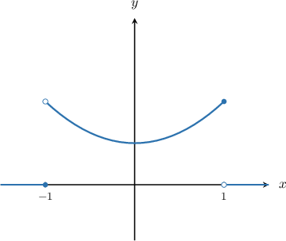

# Probability Density Functions of Continuous Random Variables

Source: https://www.mathacademy.com/topics/1347?courseId=54
Topic ID: 1347

## Prerequisites

- [The Area Bounded by a Curve and the X-Axis](../ap-calculus-ab/1040-the-area-bounded-by-a-curve-and-the-x-axis.md)
- [Probability Mass Functions of Discrete Random Variables](../integrated-math-iii-honors/1290-probability-mass-functions-of-discrete-random-variables.md)

## Lesson

### Introduction

Recall that a random variable $X$ is a variable whose value is determined by the outcome of a trial or experiment. A random variable can take on one of many values from a set $S,$ called the range or support of $X.$

A **continuous random variable** is a random variable whose set of possible values $S$ is given by an interval of real numbers.

For example, the height of a randomly selected person could be modeled as a continuous random variable because its possible values form an interval of real numbers. For modeling purposes, we usually assume that the height of a randomly selected person could be *any number* in the real interval $(0,\infty),$ although we could also restrict this to a finite interval $[a,b]$ if we wanted.

On the other hand, the result of rolling a $6$-sided die is *not* a continuous random variable because its possible values are $1,2,3,4,5,6,$ which does *not* correspond to an interval of real numbers.

Physical quantities, such as mass, length, area, volume, time, fluid concentration, etc, are usually modeled as continuous variables.

### Example: Identifying Continuous Random Variables Given in Context

#### Question

Which of the following are continuous random variables?

1. The number of tickets sold for a randomly selected baseball game in a certain stadium

2. The length of a randomly selected baseball field.

3. The weight, in grams, of a slice cut from a cake weighing $1\,\text{kg}$

#### Explanation

A random variable is a variable whose value is determined by the outcome of a trial or experiment. A ** random variable is a random variable whose possible values are represented by an interval of real numbers.

Common examples of continuous random variables are shown in the diagram below.

With that in mind, let's consider each of the given statements.

- Statement I does ** describe a continuous random variable. Its value is determined by the result of an experiment, but its possible values are the integers $0,1,2,3,\ldots,$ which do not correspond to an interval of real numbers.

- Statement II describes a continuous random variable. Its value is determined by the result of an experiment, and its possible values correspond to the real numbers in the interval $(0, \infty).$

- Statement III describes a continuous random variable. Its value is determined by the result of an experiment, and its possible values correspond to the real numbers in the interval $(0, 1\,000].$

Therefore, the correct answer is "II and III only."

### Probability Density Functions

The **probability density function** (or **pdf**) of a continuous random variable $X$ defined over a set $S$ is a function $f(x)$ such that the probability that $X$ lies in the interval $[a,b]$ is given by

$$

P(a \leq X \leq b) = \int_a^b f(x) \, \textrm dx.

$$

Thus, the probability that $X$ lies between $a$ and $b$ can be interpreted as the area bounded between $f(x)$ and the $x$-axis over the interval $x\in [a,b],$ as shown below.

In general, for a function $f(x)$ to be a valid probability density function over a set $S,$ it must satisfy the following conditions:

- $f(x) \geq 0$ for all $x$ in $S$

- $\displaystyle \int_{S} f(x) \, \textrm dx = 1$

For example, let the random variable $X$ be the result of randomly selecting a real number between $0$ and $6.$ In this case, the pdf of $X$ is given by

$$

\begin{aligned}\frac{1}{6},\, & 0≤𝑥≤6, \\ 0,\, & otherwise.\end{aligned}

$$

This pdf tells us that any number between $0$ and $6$ has an equal chance of being selected, and no number outside this interval can be selected.

Note that this is a valid pdf because it's always nonnegative, and

$$

\begin{aligned}∫_{𝑆}𝑓(𝑥)\,d𝑥 & =∫_{60}^{}\frac{1}{6}\,d𝑥 \\ & =[\frac{1}{6}𝑥]_{60}^{} \\ & =[\frac{1}{6}⋅6]−[\frac{1}{6}⋅0] \\ & =1.\end{aligned}

$$

To compute the probability that our randomly selected number is no greater than $3,$ we integrate the pdf over the interval $[0,3]{:}$

$$

\begin{aligned}𝑃(0≤𝑋≤3) & =∫_{30}^{}\frac{1}{6}\,d𝑥 \\ & =[\frac{1}{6}𝑥]_{30}^{} \\ & =[\frac{1}{6}⋅3]−[\frac{1}{6}⋅0] \\ & =\frac{1}{2}\end{aligned}

$$

This result matches our intuition. Since every number has an equal chance of being selected, and $[0,3]$ is half the length of $[0,6],$ we must have $P(0 \leq X \leq 3) = \dfrac12.$

### Interpreting Probability Density Functions

The probability density function of a continuous random variable $X$ is somewhat analogous to the probability *mass* function of a discrete random variable in the sense that it describes the probability distribution of $X.$

However, unlike the case with discrete random variables, probability density is *not* the same as probability! Instead, we can think of a pdf as a tool for computing probabilities for continuous random variables.

There are two counterintuitive yet important points to be aware of when it comes to interpreting a pdf:

- *The probability that a continuous random variable takes on any particular value is always equal to $0.$* Continuing the previous example, the probability that our random variable takes on the value $X=5$ is equal to In general, for any value $a$ and any continuous random variable $X$ with probability density function $f(x),$ we have

- *The values of a probability density function may be greater than $1.$* For example, let $Y$ be the result of randomly selecting a real number between $0$ and $\dfrac{1}{2}.$ Then, the pdf of $Y$ is given by This pdf tells us that all numbers between $0$ and $\dfrac{1}{2}$ are equally likely. Again, $f(y)$ is nonnegative, and So, $f(y)$ is a valid probability density function.

Lastly, note that since the probability that a continuous random variable takes on a particular value is always equal to $0,$ it doesn't matter whether or not we include the endpoints of a particular interval. In other words, for any continuous random variable $X,$ we have

$$

P(a \leq X \leq b) = P(a < X < b) = P(a < X \leq b) = P(a \leq X < b) = \int_a^b f(x) \, \textrm dx.

$$

### Example: Determining Whether a Function Is a Valid PDF

#### Question

Consider the function $f(x)$ whose graph is shown above.

$$

\begin{aligned}\frac{3}{8}(𝑥^{2}+1),\, & −1<𝑥≤1, \\ 0,\, & otherwise\end{aligned}

$$

Which of the following statements are true?

1. $f(x) \geq 0$ for all $x$

2. $\displaystyle \int_{-1}^1 f(x) \,\textrm{d}x = 1$

3. $f(x)$ is a valid probability density function

#### Explanation

For a function $f(x)$ to be a valid probability density function on a set $S,$ it must satisfy the following conditions:

- $f(x) \geq 0$ for all $x$

- $\displaystyle \int_{S} f(x) \, \textrm dx = 1$

Now, let's consider each statement in turn:

- Statement I is true. From the graph, we see that $f(x)$ is nonnegative for all $x.$

- Statement II is true. Indeed,

- Statement III is true. Since statements I and II are true, $f(x)$ is a valid probability density function.

Therefore, the correct answer is "I, II, and III."

### Example: Determining the Value of an Unknown Constant Given a PDF

#### Question

Solve for $k$ given that the following function is a probability density function:

$$

\begin{aligned}2𝑥^{3}+𝑘𝑥^{2},\, & 0<𝑥<1, \\ 0,\, & otherwise.\end{aligned}

$$

#### Explanation

For a function $f(x)$ to be a valid probability density function on a set $S,$ it must satisfy the following conditions:

- $f(x) \geq 0$ for all $x\in S$

- $\displaystyle \int_{S} f(x) \, \textrm dx = 1$

For the given function, the second condition states that

$$

\int_0^{1} (2x^3+kx^2) \, \textrm dx = 1.

$$

Computing the integral on the left-hand side, we get

$$

\begin{aligned}∫_{10}^{}(2𝑥^{3}+𝑘𝑥^{2})\,d𝑥 & =[\frac{𝑥^{4}}{2}+\frac{𝑘𝑥^{3}}{3}]_{10}^{} \\ & =[\frac{1}{2}+\frac{𝑘}{3}]−0 \\ & =\frac{𝑘}{3}+\frac{1}{2}.\end{aligned}

$$

Therefore,

$$

\dfrac k3+\dfrac{1}{2} = 1 \quad \Longrightarrow \quad k=\dfrac{3}{2}.

$$
