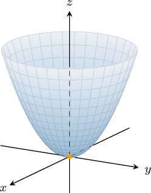
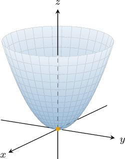
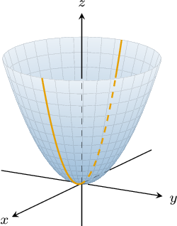
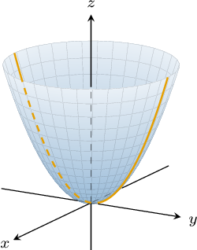
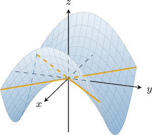
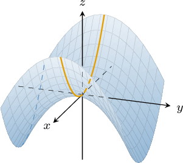
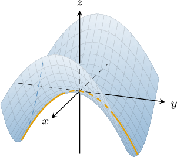
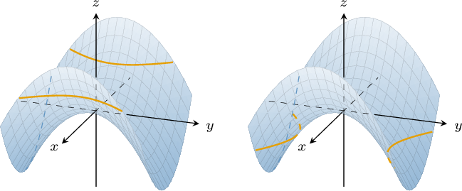

# Paraboloids

Source: https://www.mathacademy.com/topics/1893?courseId=54
Topic ID: 1893

## Prerequisites

- [Finding Intercepts and Intersections of Hyperbolas](../integrated-math-iii-honors/874-finding-intercepts-and-intersections-of-hyperbolas.md)
- [The Vertex of a Parabola](../algebra-ii/1128-the-vertex-of-a-parabola.md)
- [Calculating Intercepts of Parabolas](../algebra-ii/1132-calculating-intercepts-of-parabolas.md)
- [Ellipsoids](./1896-ellipsoids.md)
- [The Intersection of Two Planes](../linear-algebra/2539-the-intersection-of-two-planes.md)

## Lesson

### Introduction

Consider the quadric surface with the equation

$$

z = x^2 + y^2

$$

whose graph is shown below.

This surface is an example of an **elliptic paraboloid.**

The **vertex** of this elliptic paraboloid is located at the origin, and its **axis of symmetry** is the $z$-axis. Note that the axis of symmetry is the vertical line that passes through the vertex.

More generally, the equation of an elliptic paraboloid oriented along the $z$-axis whose vertex is at the point $(x_0,y_0,z_0)$ is given by

$$

z - z_0 = \dfrac{(x-x_0)^2}{a^2} + \dfrac{(y-y_0)^2}{b^2},

$$

where $a$ and $b$ are constants.

These surfaces are called *elliptic* *paraboloids* because their traces in the $xy$-plane are *ellipses*, while their traces in the $yz$- and $xz$-planes are *parabolas*. We'll discuss the traces of this surface in more detail shortly.

### Example: Identifying Properties of an Elliptic Paraboloid

#### Question

Find the vertex and the axis of symmetry of the elliptic paraboloid $z= 4x^2 + 8(y + 2)^2.$

#### Explanation

The general equation of an elliptic paraboloid oriented along the $z$-axis with vertex at a point $(x_0, y_0, z_0)$ is

$$

z - z_0 = \dfrac{(x-x_0)^2}{a^2} + \dfrac{(y-y_0)^2}{b^2}.

$$

To find the vertex, we rewrite our equation as follows:

$$

\begin{aligned}𝑧−0 & =4𝑥^{2}+8(𝑦+2)^{2} \\ 𝑧−0 & =\frac{𝑥^{2}}{1/4}+\frac{(𝑦+2)^{2}}{1/8} \\ 𝑧−0 & =\frac{(𝑥−0)^{2}}{1/4}+\frac{(𝑦−(−2))^{2}}{1/8}\end{aligned}

$$

This gives us the equation of an elliptic paraboloid oriented along the $z$-axis that has its vertex at $(0,-2,0).$ Since it is oriented along the $z$-axis, we conclude that its axis of symmetry is parallel to the $z$-axis.

The axis of symmetry should pass through the vertex of the paraboloid. Therefore, the equation of the axis of symmetry can be written as an intersection of two planes:

$$

\begin{aligned}𝑥=0 \\ 𝑦=−2\end{aligned}

$$

### Hyperbolic Paraboloids

Now consider the graph of the quadric surface

$$

z = x^2 -y^2

$$

whose graph is shown below.

This surface is an example of a **hyperbolic paraboloid** whose **saddle point** is at the origin.

More generally, a hyperbolic paraboloid whose saddle point is at $(x_0,y_0,z_0)$ has the general equation

$$

z - z_0 = \dfrac{(x-x_0)^2}{a^2}- \dfrac{(y-y_0)^2}{b^2}

$$

where $a$ and $b$ constants.

This surface is called *hyperbolic* *paraboloid* because its traces in the $xy$-plane are *hyperbolas*, while its traces in the $yz$- and $xz$-planes are *parabolas*. We'll discuss the traces of this surface in more detail shortly.

Another property is that this surface mirrors itself across the planes $x=0$ and $y=0.$ Since these planes meet along the $z$-axis, that axis serves as the **axis of symmetry** of the hyperbolic paraboloid.

### Example: Identifying Properties of a Hyperbolic Paraboloid

#### Question

Find the saddle point of the hyperbolic paraboloid $z+1=\dfrac{(x-1)^2}{4} - (y-2) ^2.$

#### Explanation

The general equation of a hyperbolic paraboloid with a saddle point at $(x_0, y_0, z_0)$ is given by

$$

z - z_0 = \dfrac{(x-x_0)^2}{a^2} - \dfrac{(y-y_0)^2}{b^2}.

$$

To find the saddle point, we rewrite our equation as follows:

$$

\begin{aligned}𝑧+1 & =\frac{(𝑥−1)^{2}}{4}−(𝑦−2)^{2} \\ 𝑧−(−1) & =\frac{(𝑥−1)^{2}}{4}−(𝑦−2)^{2}\end{aligned}

$$

This gives us the equation of a hyperbolic paraboloid with a saddle point at $(1,2,-1).$

### Alternative Orientations of the Axis of Symmetry

So far, we've encountered elliptic paraboloids whose axes of symmetry are parallel to the $z$-axis. Let's now consider the cases when an elliptic paraboloid is oriented along the $x$- or the $y$-axes.

For an elliptic paraboloid, the other two cases are as follows.

- When the vertex is at the origin and the $y$ term is linear, the axis of symmetry is the $y$-axis:

- When the vertex is at the origin and the $x$ term is linear, the axis of symmetry is the $x$-axis:

Likewise, for a hyperbolic paraboloid, the other two cases are as follows:

- When the saddle point is at the origin and the $y$ term is linear, the axis of symmetry is the $y$-axis. The two corresponding equations are

- When the saddle point is at the origin and the $x$ term is linear, the axis of symmetry is the $x$-axis. The two corresponding equations are

### Traces of Elliptic Paraboloids

The traces of an elliptic paraboloid are either ellipses, parabolas, a single point, or the empty set.

For example, let's find the traces with the coordinate planes for the elliptic paraboloid given by

$$

z=x^2+y^2.

$$

- The trace of this surface in the $xy$-plane (when $z=0$) is given by the equation which corresponds to the origin $(0,0,0).$

- The trace of this surface in the $xz$-plane (when $y=0$) is given by the equation which is a parabola in the $xz$-plane that has its vertex at the origin.

- The trace of this surface in the $yz$-plane (when $x=0$) is given by the equation which is a parabola in the $yz$-plane that has its vertex at the origin.

There are a few other cases we should note:

- The trace of our surface with the plane $z=-k$ for $k > 0$ is the empty set. This is because $z\geq 0$ everywhere on the elliptic paraboloid.

- The trace of our surface with the plane $z=k$ for $k > 0$ is an ellipse:

### Traces of Hyperbolic Paraboloids

The traces of a hyperbolic paraboloid are either hyperbolas, parabolas, or intersecting lines.

For example, let's find the traces with the coordinate planes for the hyperbolic paraboloid given by

$$

z=x^2-y^2.

$$

- The trace of this surface in the $xy$-plane (when $z=0$) is given by the equation which corresponds to two intersecting lines in the $xy$-plane.

- The trace of this surface in the $xz$-plane (when $y=0$) is given by the equation which corresponds to the parabola in the $xz$-plane that has its vertex at the origin.

- The trace of this surface in the $yz$-plane (when $x=0$) is given by the equation which corresponds to the parabola in the $yz$-plane that has its vertex at the origin.

In this particular case, the **saddle point** is at the origin. It is a minimum point for the trace in the $xz$-plane but a maximum point for the trace in the $yz$-plane.

Finally, note that the trace of our surface with the plane $z=k\neq 0$ is a hyperbola:

$$

x^2-y^2 = k

$$

### Example: Finding Traces of Paraboloids

#### Question

The projection of the intersection between the hyperbolic paraboloid

$$

\dfrac{x^2}{4} - \dfrac{(y+5) ^2}{3} = z-1

$$

and the plane $x=2$ onto the $yz$-plane is a parabola. Find the vertex of this parabola.

#### Explanation

To find the intersection of the paraboloid and the plane $x=2,$ we substitute $x=2$ into the equation of the paraboloid and simplify:

$$

\begin{aligned}\frac{𝑥^{2}}{4}−\frac{(𝑦+5)^{2}}{3} & =𝑧−1 \\ \frac{2^{2}}{4}−\frac{(𝑦+5)^{2}}{3} & =𝑧−1 \\ 1−\frac{(𝑦+5)^{2}}{3} & =𝑧−1 \\ 𝑧 & =−\frac{1}{3}(𝑦+5)^{2}+2\end{aligned}

$$

Projecting this onto the $yz$-plane, we get the equation of a parabola that has its vertex at $(-5,2).$
