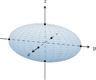
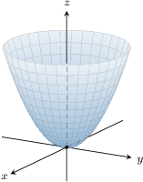
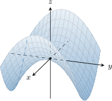
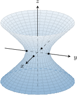
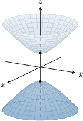
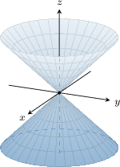
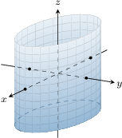
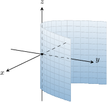
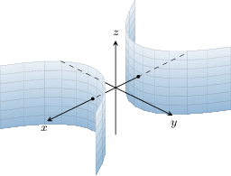

# Identifying Quadric Surfaces

Source: https://www.mathacademy.com/topics/1898?courseId=54
Topic ID: 1898

## Prerequisites

- [Hyperboloids](./1892-hyperboloids.md)
- [Paraboloids](./1893-paraboloids.md)
- [Elliptic Cones](./1894-elliptic-cones.md)
- [Cylinders](./1895-cylinders.md)

## Lesson

### Introduction

The most common quadric surfaces are those centered at the origin. We describe these common surfaces in the table below.

Also, recall the following from previous lessons:

- We can generate paraboloids, hyperboloids, and cones with alternative orientation axes by permuting the variables in the corresponding equation. For example, the equation of an elliptic cone with its vertex at $O$ and axis of symmetry along the $y$-axis is given by

- We can shift the center/vertex/saddle point of a quadric surface to $(x_0,y_0,z_0)$ using the usual coordinate transformation:

Finally, there is a simple way to distinguish between hyperboloids with one and two sheets by simply looking at the equations:

- *one* minus sign indicates hyperboloids of *one* sheet:

- *two* minus signs indicate hyperboloids of *two* sheets:

### A Table of Common Cylinders

A table showing the most common cylinders whose base curve is centered at the origin in the $xy$-plane is given below.

Similar to quadric surfaces:

- We can generate cylinders with alternative orientation axes by describing a base curve in the $xz$-or $yz$-planes. For example, the equation of an elliptic cylinder with its axis of symmetry along the $y$-axis is given by

- We can shift the center/vertex of the base curve in the usual way.

### Example: Identifying Quadric Surfaces and Cylinders

#### Question

Identify the surface $z -1 = \dfrac{(x-3)^2}{4} - \dfrac{(y+2)^2}4.$

#### Explanation

Recall that the equation of a hyperbolic paraboloid centered at $O$ is given by

$$

z = \dfrac{x^2}{a^2}-\dfrac{y^2}{b^2},

$$

and a hyperbolic paraboloid centered at $(x_0,y_0,z_0)$ is given by

$$

z - z_0 = \dfrac{(x-x_0)^2}{a^2}-\dfrac{(y-y_0)^2}{b^2}.

$$

Thus, our equation is a hyperbolic paraboloid with the following parameters:

$$

(x_0,y_0,z_0) = (3, -2, 1), \quad a= b=2.

$$

### Example: Identifying Quadric Surfaces and Cylinders With Alternative Orientations

#### Question

Identify the surface $x = \dfrac{y^2}{4} - 4z^2.$

#### Explanation

Recall that the equation of a hyperbolic paraboloid centered at $O$ whose axis of symmetry is the $z$-axis is given by

$$

z = \dfrac{x^2}{a^2}-\dfrac{y^2}{b^2}.

$$

Thus, a hyperbolic paraboloid centered at $O$ whose axis of symmetry is the $\boldsymbol x$**** is given by

$$

x = \dfrac{y^2}{b^2} - \dfrac{z^2}{c^2}.

$$

Therefore, our equation is a hyperbolic paraboloid whose axis of symmetry is the $x$-axis, and $b=2, \: c=\dfrac 12.$

### Example: Identifying Quadric Surfaces by Completing the Square

#### Question

Identify the surface $-x^2 + z^2 + 2x + y=0.$

#### Explanation

First, we complete the square in the $x$ term:

$$

\begin{aligned}−𝑥^{2}+𝑧^{2}+2𝑥+𝑦 & =0 \\ −(𝑥^{2}−2𝑥)+𝑧^{2}+𝑦 & =0 \\ −(𝑥−1)^{2}+1+𝑧^{2}+𝑦 & =0\end{aligned}

$$

Now, by rearranging, we get the equation

$$

\begin{aligned}−(𝑥−1)^{2}+1+𝑧^{2}+𝑦 & =0 \\ −(𝑥−1)^{2}+𝑧^{2} & =−𝑦−1 \\ (𝑥−1)^{2}−𝑧^{2} & =𝑦+1.\end{aligned}

$$

This is the equation of a hyperbolic paraboloid centered at $(1, -1, 0).$
