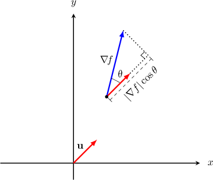
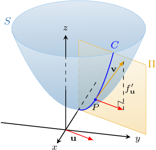
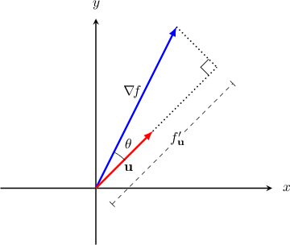

# Directional Derivatives

Source: https://www.mathacademy.com/topics/1938?courseId=54
Topic ID: 1938

## Prerequisites

- [The Gradient Vector](./1934-the-gradient-vector.md)

## Lesson

### Introduction

Let's consider a surface $z=f(x,y)$ and a unit vector $\mathbf{u} = \left\langle u_1, u_2 \right\rangle.$

The **directional derivative of $f$** at the point $(x_0,y_0)$ in the direction of $\mathbf{u}$ is

$$

f'_{\mathbf u}(x_0,y_0) = \lim\limits_{t \to 0}\dfrac{f(\mathbf x_0 + t \mathbf u) - f(\mathbf x_0)}{t}.

$$

The directional derivative of $f$ is the rate of change of the function $f$ in the direction of $\mathbf{u}.$ We'll discuss this idea more later in the lesson.

It turns out that if $f$ is differentiable, we can write $f'_{\mathbf u}$ in terms of partial derivatives $f_x$ and $f_y,$ as follows:

$$

f'_{\mathbf u}(x_0,y_0) = \nabla f (x_0,y_0) \cdot \mathbf u.

$$

At the end of the lesson, we'll derive this formula. But for now, let's get some practice using it.

For example, let's find the directional derivative of the function $f(x, y) = x^2 + y^2$ at the point $(x_0,y_0)=(1,2)$ in the direction of the vector $\mathbf{v} = \mathbf{i} + \mathbf{j}.$

First, we find the unit vector $\mathbf{u}$ in the direction of $\mathbf{v} \mathbin{:}$

$$

\begin{aligned}‖𝐯‖ & =\sqrt{√1^{2}+1^{2}}=\sqrt{√2} \\ 𝐮 & =\frac{𝐯}{‖𝐯‖}=\frac{1}{\sqrt{√2}}(𝐢+𝐣)\end{aligned}

$$

Now, we compute the gradient $\nabla f(x,y)$ and evaluate it at the point $(1,2)\mathbin{:}$

$$

\begin{aligned}∇\,𝑓(𝑥,𝑦) & =\frac{𝜕}{𝜕𝑥}(𝑥^{2}+𝑦^{2})\,𝐢+\frac{𝜕}{𝜕𝑦}(𝑥^{2}+𝑦^{2})\,𝐣 \\ & =2𝑥\,𝐢+2𝑦\,𝐣 \\ ∇\,𝑓(1,2) & =(2⋅1)\,𝐢+(2⋅2)\,𝐣 \\ & =2𝐢+4𝐣\end{aligned}

$$

Therefore, the directional derivative is

$$

\begin{aligned}𝑓_{′𝐮}^{}(1,2) & =∇\,𝑓(1,2)⋅𝐮 \\ & =(2\,𝐢+4\,𝐣)⋅(\frac{1}{\sqrt{√2}}𝐢+\frac{1}{\sqrt{√2}}𝐣) \\ & =\frac{2⋅1+4⋅1}{\sqrt{√2}} \\ & =\frac{6}{\sqrt{√2}} \\ & =3\sqrt{√2}.\end{aligned}

$$

### Example: Calculating a Directional Derivative

#### Question

Find the directional derivative of the function $g(x, y) =3x^2+4xy$ at the point $A(0,1)$ in the direction towards the point $B(1,4).$

#### Explanation

The directional derivative $g'_{\mathbf u}(a,b)$ of a function $g(x,y)$ at the point $(a,b)$ in the direction of the vector $\mathbf v$ is given by

$$

g'_{\mathbf u}(a,b) = \nabla g(a,b)\cdot\mathbf u

$$

where $\mathbf u$ is a unit vector in the direction of $\mathbf v.$

First, we find the direction vector and the corresponding unit vector:

$$

\begin{aligned}\overset{𝐴𝐵}{} & =⟨1,4⟩−⟨0,1⟩ \\ & =⟨1,3⟩ \\ 𝐮 & =\frac{\overset{𝐴𝐵}{}}{‖\overset{𝐴𝐵}{}‖} \\ & =\frac{1}{\sqrt{√1^{2}+3^{2}}}⟨1,3⟩ \\ & =\frac{1}{\sqrt{√10}}⟨1,3⟩\end{aligned}

$$

Now, we calculate the gradient $\nabla g(x,y)$ and evaluate it at the point $A(0,1)\mathbin{:}$

$$

\begin{aligned}∇𝑔(𝑥,𝑦) & =⟨\frac{𝜕}{𝜕𝑥}(3𝑥^{2}+4𝑥𝑦),\frac{𝜕}{𝜕𝑦}(3𝑥^{2}+4𝑥𝑦)⟩ \\ & =⟨6𝑥+4𝑦,\,4𝑥⟩ \\ ∇𝑔(0,1) & =⟨6⋅0+4⋅1,\,4⋅0⟩ \\ & =⟨4,0⟩\end{aligned}

$$

Therefore, the directional derivative is

$$

\begin{aligned}𝑔_{′𝐮}^{}(0,1) & =∇𝑔(0,1)⋅𝐮 \\ & =⟨4,0⟩⋅⟨\frac{1}{\sqrt{√10}},\frac{3}{\sqrt{√10}}⟩ \\ & =\frac{4}{\sqrt{√10}} \\ & =\frac{4\sqrt{√10}}{10} \\ & =\frac{2\sqrt{√10}}{5}.\end{aligned}

$$

### The Gradient as the Direction of Maximum Increase of a Function

From the formula for the directional derivative, we get that if $z = f (x, y)$ is a differentiable function and $\mathbf u$ is a unit vector, then

$$

\begin{aligned} f'_{\mathbf u} &= \nabla f \cdot \mathbf u \\[3pt] &= |\nabla f| |\mathbf u| \cos\theta\\[3pt] & = |\nabla f| \cos\theta, \end{aligned}

$$

where $\theta$ is the angle between the vectors $\nabla f$ and $\mathbf u,$ as depicted below.

It follows that $f'_{\mathbf u}$ is maximized when $\theta =0.$ In other words, $f'_{\mathbf u}$ is maximized when $\mathbf u$ and $\nabla f$ point in the same direction. Thus, the maximum value of $f'_{\mathbf u}$ is $|\nabla f|.$

A similar argument shows that $f'_{\mathbf u}$ reaches its minimum value $- |\nabla f|$ when $\theta = \pi;$ that is, when $\nabla f$ and $\mathbf u$ point in opposite directions.

As a result, we get the following theorem:

*A differentiable function $f$ increases most rapidly in the direction of the gradient and decreases most rapidly in the opposite direction to that of its gradient.*

For functions of more than two variables, the same theorem holds.

### Example: Finding the Direction of Maximum Increase or Maximum Decrease of a Function

#### Question

In what direction does the function $f (x, y) = \ln (x^2y)$ decrease most rapidly at the point $(2, 1)?$

#### Explanation

At a given point, a function $f(x,y)$ decreases most rapidly in the direction opposite to that of its gradient.

So, we compute $-\nabla f(x,y)$ and evaluate it at the point $(2,1)\mathbin{:}$

$$

\begin{aligned}−∇𝑓(𝑥,𝑦) & =−\frac{𝜕}{𝜕𝑥}(ln⁡(𝑥^{2}𝑦)) 𝐢−\frac{𝜕}{𝜕𝑦}(ln⁡(𝑥^{2}𝑦)) 𝐣 \\ & =−\frac{1}{𝑥^{2}𝑦}⋅2𝑥𝑦 𝐢−\frac{1}{𝑥^{2}𝑦}⋅𝑥^{2}𝐣 \\ & =−\frac{2}{𝑥} 𝐢−\frac{1}{𝑦} 𝐣 \\ −∇𝑓(2,1) & =−\frac{2}{2} 𝐢−\frac{1}{1} 𝐣 \\ & =−𝐢−𝐣\end{aligned}

$$

Therefore, the function decreases most rapidly in the direction of $- \, \mathbf i - \mathbf j.$

### The Directional Derivative as a Generalization of the Partial Derivative

For a surface $z = f(x,y),$ the partial derivative $f_x(x_0,y_0)$ gives us the rate of change of $f$ in the direction of the vector $\mathbf{i} = \langle 1,0\rangle.$ But this is just a special case of the directional derivative, because

$$

\begin{aligned}𝑓_{′𝐢}^{}(𝑥_{0},𝑦_{0}) & =∇(𝑥_{0},𝑦_{0})⋅⟨1,0⟩ \\ & =⟨𝑓_{𝑥}(𝑥_{0},𝑦_{0}),𝑓_{𝑦}(𝑥_{0},𝑦_{0})⟩⋅⟨1,0⟩ \\ & =𝑓_{𝑥}(𝑥_{0},𝑦_{0}).\end{aligned}

$$

Similarly,

$$

\begin{aligned}𝑓_{′𝐣}^{}(𝑥_{0},𝑦_{0}) & =∇(𝑥_{0},𝑦_{0})⋅⟨0,1⟩ \\ & =⟨𝑓_{𝑥}(𝑥_{0},𝑦_{0}),𝑓_{𝑦}(𝑥_{0},𝑦_{0})⟩⋅⟨0,1⟩ \\ & =𝑓_{𝑦}(𝑥_{0},𝑦_{0}).\end{aligned}

$$

So, the directional derivative generalizes the notion of a partial derivative.

Now, recall that the partial derivatives $f_x$ and $f_y$ represent the rate of change of $f$ in the direction of vectors $\mathbf i$ and $\mathbf j,$ respectively. As for a general directional derivative, we obtain the following property:

*The directional derivative $f'_\mathbf{u}(x_0,y_0)$ represents the rate of change of the function $f(x,y)$ at the point $(x_0,y_0)$ in the direction of $\mathbf{u}.$*

### The Rate of Change in the Direction of the Gradient

What is the directional derivative of the function $\mathbf{f}$ at $(x_0,y_0)$ in the direction of the gradient?

Let's apply our formula. First, we find the unit vector $\mathbf{u}$ in the direction of $\nabla\! f\mathbin{:}$

$$

\begin{aligned}𝐮 & =\frac{∇\,𝑓(𝑥_{0},𝑦_{0})}{‖∇\,𝑓(𝑥_{0},𝑦_{0})‖}\end{aligned}

$$

Therefore, the directional derivative is

$$

\begin{aligned}𝑓_{′𝐮}^{}(𝑥_{0},𝑦_{0}) & =∇\,𝑓(𝑥_{0},𝑦_{0})⋅\frac{∇\,𝑓(𝑥_{0},𝑦_{0})}{‖∇\,𝑓(𝑥_{0},𝑦_{0})‖} \\ & =\frac{∇\,𝑓(𝑥_{0},𝑦_{0})⋅∇\,𝑓(𝑥_{0},𝑦_{0})}{‖∇\,𝑓(𝑥_{0},𝑦_{0})‖} \\ & =\frac{‖∇\,𝑓(𝑥_{0},𝑦_{0})‖^{2}}{‖∇\,𝑓(𝑥_{0},𝑦_{0})‖} \\ & =‖∇\,𝑓(𝑥_{0},𝑦_{0})‖.\end{aligned}

$$

So, we conclude the following:

*The directional derivative in the direction of the gradient equals the norm of the gradient. Furthermore, the norm of the gradient can be interpreted as the rate of change of the function in the direction of the gradient.*

### Example: Finding the Rate of Change of a Function in a Given Direction

#### Question

Consider the function $g (x, y) = \ln \left(\sqrt {xy^3}\right).$ What is the rate of change of $g$ at the point $\left(\dfrac 12, \dfrac 32 \right)$ in the direction in which the function increases most rapidly?

#### Explanation

At a given point, a function $g(x,y)$ increases most rapidly in the direction of its gradient at that point.

In our case, we compute $\nabla g(x,y)$ and evaluate it at the point $\left(\dfrac 12, \dfrac 32 \right)\!\mathbin{:}$

$$

\begin{aligned}∇𝑔(𝑥,𝑦) & =⟨\frac{𝜕}{𝜕𝑥}(ln⁡(\sqrt{√𝑥𝑦^{3}})),\,\frac{𝜕}{𝜕𝑦}(ln⁡(\sqrt{√𝑥𝑦^{3}}))⟩ \\ & =⟨\frac{1}{\sqrt{√𝑥𝑦^{3}}}⋅\frac{𝑦^{3}}{2\sqrt{√𝑥𝑦^{3}}},\,\frac{1}{\sqrt{√𝑥𝑦^{3}}}⋅\frac{3𝑥𝑦^{2}}{2\sqrt{√𝑥𝑦^{3}}}⟩ \\ & =⟨\frac{1}{2𝑥},\,\frac{3}{2𝑦}⟩ \\ ∇𝑔(\frac{1}{2},\frac{3}{2}) & =⟨\frac{1}{2⋅(\frac{1}{2})},\frac{3}{2⋅(\frac{3}{2})}⟩ \\ & =⟨1,1⟩\end{aligned}

$$

Finally, the rate of change of $g(x,y)$ at the point $\left(\dfrac 12, \dfrac 32 \right)$ in the direction of $\nabla g\left(\dfrac 12, \dfrac 32 \right)$ is given by

$$

\begin{aligned}∇𝑔(\frac{1}{2},\frac{3}{2}) & =∥⟨1,1⟩∥ \\ & =\sqrt{√1^{2}+1^{2}} \\ & =\sqrt{√2}.\end{aligned}

$$

### Deriving the Formula For the Directional Derivative

Consider a surface $S$ defined by $z=f(x,y),$ and suppose that the point $P$ with coordinates $(x_0,y_0, f(x_0,y_0))$ lies on $S.$ We wish to derive a formula for the directional derivative $f'_\mathbf{u}(x_0,y_0),$ where $\mathbf u = \langle u_1, u_2 \rangle$ is a unit vector.

Geometrically, $f'_{\mathbf u}(x_0,y_0)$ can be constructed in the following way:

- Define a vertical plane $\Pi$ that's parallel to $\mathbf u$ and passes through $P.$

- Define the curve $C$ as the intersection of the surface $S$ and the plane $\Pi.$

- Then, the directional derivative $f'_{\mathbf u}$ is the slope of the tangent to $C$ at $P.$

The geometric interpretation of $f'_{\mathbf u}$ is similar to that of the partial derivatives $f_x$ and $f_y.$ The only difference here is that we are not restricting the plane $\Pi$ to be parallel to the coordinate axes.

Now, since $f'_{\mathbf u}$ is tangent to $C$ and is in the direction of $\mathbf u$ at $P,$ the vector

$$

\mathbf v = \langle u_1, u_2, f'_{\mathbf u}\rangle

$$

is tangent to our surface $S$ at $P.$

Recall that $\langle f_x (x_0,y_0), f_y(x_0,y_0), -1\rangle$ is known to be a normal vector to the surface at $P.$ Since this vector must be perpendicular to $\mathbf v,$ the dot product of the two vectors must be zero, which means that

$$

\begin{aligned} \langle u_1, u_2, f'_{\mathbf u}\rangle \cdot \langle f_x (x_0,y_0), f_y(x_0,y_0), -1\rangle &=0 \\\[5pt] u_1 f_x (x_0,y_0) + u_2 f_y (x_0,y_0) - f'_{\mathbf u} &=0 \\\[5pt] f'_{\mathbf u} = \nabla f (x_0,y_0) \cdot \mathbf u. \end{aligned}

$$

We can interpret this formula as the projection of $\nabla f (x_0,y_0)$ onto the direction of $\mathbf u,$ as shown below.

