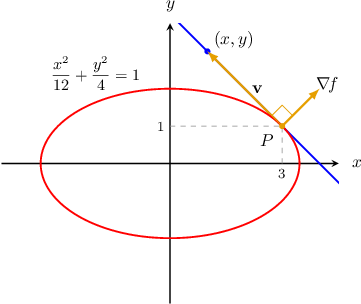
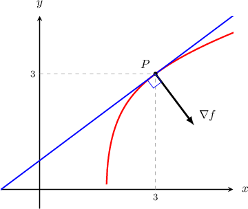
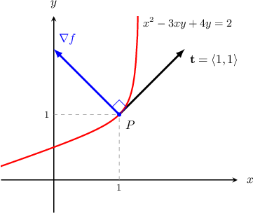

# Tangent Lines to Level Curves

Source: https://www.mathacademy.com/topics/1940?courseId=54
Topic ID: 1940

## Prerequisites

- [The Gradient as a Normal Vector](./1939-the-gradient-as-a-normal-vector.md)

## Lesson

### Introduction

Suppose we want to find the equation of the **tangent line** to the ellipse

$$

\dfrac{x^2}{12} + \dfrac{y^2}{4} =1

$$

at the point $P(3,1).$

To solve this problem, we could find the slope of the line using techniques from single-variable calculus. However, we can also solve the problem by computing the gradient of a two-variable function.

Let's start by defining

$$

f(x,y) = \dfrac{x^2}{12} + \dfrac {y^2}{4}.

$$

Then, the given ellipse is the level curve $f(x,y)=1.$

Now, we know that $\nabla \! f(3,1)$ is a vector that's normal to the level curve $f(x,y)= 1$ at $P(3,1).$ So, it's also normal to the tangent line to our ellipse at $P.$

Suppose that $(x,y)$ is any point on that tangent line. Then $\mathbf v=\langle x - 3, y-1 \rangle$ is a vector that's parallel to the tangent line. So $\mathbf v$ must be also orthogonal to $\nabla f(3,1),$ and since the dot product of two orthogonal vectors is zero, we have that

$$

\nabla f(3,1)\,\cdot \,\langle x - 3, y-1 \rangle = 0.

$$

Now, computing $\nabla\! f$ and evaluating it at the point $P(3,1),$ we have

$$

\begin{aligned}∇\,𝑓(𝑥,𝑦) & =⟨\frac{𝑥}{6},\frac{𝑦}{2}⟩ \\ ∇\,𝑓(3,1) & =⟨\frac{1}{2},\frac{1}{2}⟩.\end{aligned}

$$

Therefore, we can write the equation of our tangent, as follows:

$$

\begin{aligned}∇\,𝑓(3,1)⋅⟨𝑥−3,𝑦−1⟩ & =0 \\ ⟨\frac{1}{2},\frac{1}{2}⟩⋅⟨𝑥−3,𝑦−1⟩ & =0 \\ \frac{1}{2}(𝑥−3)+\frac{1}{2}(𝑦−1) & =0 \\ (𝑥−3)+(𝑦−1) & =0 \\ 𝑥+𝑦−4 & =0\end{aligned}

$$

### Tangent Line to a Level Curve

Now, let's state the previous result more generally.

Let $f(x,y)$ be a function that's continuously differentiable at the point $P(x_0,y_0).$ If $\nabla f(x_0, y_0)$ is not the zero vector, then it is orthogonal to the tangent line to the level curve

$$

f(x,y)= f(x_0,y_0)

$$

at the point $P.$ The equation of the tangent can then be written as

$$

\nabla\! f (x_0,y_0) \cdot \langle x-x_0,y-y_0\rangle = 0.

$$

Writing this explicitly, we get

$$

f_x(x_0,y_0)(x-x_0) + f_y(x_0,y_0)(y-y_0) = 0.

$$

### Example: Finding the Tangent Line to a Level Curve

#### Question

Given the function $f(x,y) = 6x^2+2y^2 - 2xy^2,$ find the equation of the tangent line to the level curve that passes through the point where $(x,y) = (3,3).$

#### Explanation

The equation of the tangent line to the level curve $f(x,y) = k$ at the point $(x_0,y_0)$ can be expressed as

$$

\nabla f(x_0,y_0) \cdot \langle x-x_0, \: y-y_0 \rangle = 0.

$$

First, we find the gradient of $f(x,y)$ and evaluate it at $(x,y) = (3,3)\mathbin{:}$

$$

\begin{aligned}∇\,𝑓(𝑥,𝑦) & =𝑓_{𝑥}(𝑥,𝑦) 𝐢+𝑓_{𝑦}(𝑥,𝑦) 𝐣 \\ & =\frac{𝜕}{𝜕𝑥}(6𝑥^{2}+2𝑦^{2}−2𝑥𝑦^{2}) 𝐢+\frac{𝜕}{𝜕𝑦}(6𝑥^{2}+2𝑦^{2}−2𝑥𝑦^{2}) 𝐣 \\ & =(12𝑥−2𝑦^{2}) 𝐢+(4𝑦−4𝑥𝑦) 𝐣 \\ ∇\,𝑓(3,3) & =(12(3)−2(3)^{2})𝐢+(4(3)−4(3)(3))𝐣 \\ & =18\,𝐢−24\,𝐣 \\ & =⟨18,−24⟩\end{aligned}

$$

Now, the Cartesian equation of the tangent to the level curve that passes through the point $(x_0,y_0)=(3,3)$ can be written as

$$

\begin{aligned}∇𝑓(𝑥_{0},𝑦_{0})⋅⟨𝑥−𝑥_{0},\,𝑦−𝑦_{0}⟩ & =0 \\ ∇𝑓(3,3)⋅⟨𝑥−3,\,𝑦−3⟩ & =0 \\ ⟨18,−24⟩⋅⟨𝑥−3,\,𝑦−3⟩ & =0.\end{aligned}

$$

We can leave our answer in this form. Or, if we want to leave our final answer in Cartesian form, we expand the dot product and simplify:

$$

\begin{aligned}18(𝑥−3)−24(𝑦−3) & =0 \\ 18𝑥−24𝑦+18 & =0 \\ 3𝑥−4𝑦+3 & =0\end{aligned}

$$

### The Tangent Vector to a Plane Curve

Given a level curve $f(x,y) = f(x_0,y_0),$ a **tangent vector** is

$$

\mathbf t(x_0,y_0) = f_y(x_0,y_0) \ \mathbf i - f_x(x_0,y_0) \ \mathbf j.

$$

To understand why the above vector is tangent to the level curve, first recall that the gradient vector $\nabla f(x_0,y_0)$ is normal to the level curve. Now, by computing the dot product, we see that the vector $\mathbf t$ is orthogonal to the gradient vector $\nabla\! f{:}$

$$

\begin{aligned}∇\,𝑓⋅𝐭 & =(𝑓_{𝑥} 𝐢+𝑓_{𝑦} 𝐣)⋅(𝑓_{𝑦} 𝐢−𝑓_{𝑥}𝐣) \\ & =𝑓_{𝑥}𝑓_{𝑦}−𝑓_{𝑦}𝑓_{𝑥} \\ & =0\end{aligned}

$$

Consequently, $\mathbf t$ is tangent to the level curve.

### Example: Finding a Tangent Vector to a Plane Curve

#### Question

Consider the plane curve $x^2-3xy+4y=2.$ Find a tangent vector to the curve at the point $(1,1).$

#### Explanation

First, if we set $f(x,y) = x^2-3xy+4y,$ our curve can be viewed as the level curve $f(x,y)=2.$

A tangent vector to the level curve that passes through the point $(1,1)$ can be computed as follows:

$$

\mathbf t(1,1) = f_y(1,1) \ \mathbf i - f_x(1,1) \ \mathbf j

$$

So, we calculate $\mathbf t(x,y)$ and evaluate it at $(1,1)\mathbin{:}$

$$

\begin{aligned}𝐭(𝑥,𝑦) & =\frac{𝜕}{𝜕𝑦}(𝑥^{2}−3𝑥𝑦+4𝑦) 𝐢−\frac{𝜕}{𝜕𝑥}(𝑥^{2}−3𝑥𝑦+4𝑦) 𝐣 \\ & =(−3𝑥+4) 𝐢−(2𝑥−3𝑦) 𝐣 \\ 𝐭(1,1) & =(−3(1)+4) 𝐢−(2(1)−3(1)) 𝐣 \\ & =1\,𝐢−(−1)\,𝐣 \\ & =𝐢+𝐣\end{aligned}

$$

Therefore, our tangent vector is $\mathbf i +\mathbf j,$ as shown in the diagram below.

### Example: Finding the Points on a Curve at which the Tangent Vector is Perpendicular to a Given Vector

#### Question

At which points on the curve $6xy+3y^2 =7+ y - 3x^2$ is the tangent vector to the curve perpendicular to the vector $\mathbf{j}?$

#### Explanation

First, we bring all variables to one side:

$$

\begin{aligned}6𝑥𝑦+3𝑦^{2} & =7+𝑦−3𝑥^{2} \\ 6𝑥𝑦+3𝑦^{2}−𝑦+3𝑥^{2} & =7\end{aligned}

$$

If we set $f(x,y) = 6xy+3y^2 - y + 3x^2,$ our curve can be viewed as the level curve $f(x,y)=7.$

A tangent vector to the level curve can be computed as follows:

$$

\mathbf t(x,y) = f_y(x,y) \ \mathbf i - f_x(x,y) \ \mathbf j

$$

So, we calculate $\mathbf t(x,y)\mathbin{:}$

$$

\begin{aligned}𝐭(𝑥,𝑦) & =𝑓_{𝑦}(𝑥,𝑦) 𝐢−𝑓_{𝑥}(𝑥,𝑦) 𝐣 \\ & =\frac{𝜕}{𝜕𝑦}(6𝑥𝑦+3𝑦^{2}−𝑦+3𝑥^{2})\,𝐢−\frac{𝜕}{𝜕𝑥}(6𝑥𝑦+3𝑦^{2}−𝑦+3𝑥^{2})\,𝐣 \\ & =(6𝑥+6𝑦−1)\,𝐢−(6𝑦+6𝑥)\,𝐣\end{aligned}

$$

Since our tangent vector needs to be perpendicular to $\mathbf{j},$ we must have $\mathbf t \cdot \mathbf j = 0.$

$$

\begin{aligned}𝐭(𝑥,𝑦)⋅𝐣 & =0 \\ ((6𝑥+6𝑦−1)\,𝐢−(6𝑦+6𝑥)\,𝐣)⋅𝐣 & =0 \\ −6𝑦−6𝑥 & =0 \\ 𝑦 & =−𝑥\end{aligned}

$$

Substituting $y=-x$ into the equation of our curve gives

$$

\begin{aligned}6𝑥𝑦+3𝑦^{2} & =7+𝑦−3𝑥^{2} \\ 6𝑥(−𝑥)+3(−𝑥)^{2} & =7+(−𝑥)−3𝑥^{2} \\ −6𝑥^{2}+3𝑥^{2} & =7−𝑥−3𝑥^{2} \\ 𝑥 & =7.\end{aligned}

$$

Finally, if $x=7,$ we get $y=-7$ and the corresponding point is $(7,-7).$
