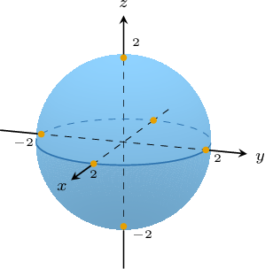

# Level Surfaces

Source: https://www.mathacademy.com/topics/1978?courseId=54
Topic ID: 1978

## Prerequisites

- [Identifying Quadric Surfaces](./1898-identifying-quadric-surfaces.md)
- [Level Curves](./1900-level-curves.md)

## Lesson

### Introduction

Let's consider the following function:

$$

w = f(x,y,z) =x^2 +y^2+z^2

$$

Sadly, it is impossible to plot this function because four spatial dimensions ($x,y,z,$ and $w$) are needed, and space as we know it is restricted to three dimensions.

However, we can get an idea of how the function $f(x,y,z)$ behaves by plotting surfaces of the form

$$

\left\{(x,y,z)\in\mathbb R^3 \, : \,f(x,y,z)=c\right\},

$$

where $c$ is some value that is in the range of $f.$ These sets are called **level surfaces** because they can be visualized as surfaces in three-dimensional space, and are "level" in the sense that each surface corresponds to a constant value of $w.$

For this particular function, all level surfaces are spheres. For example, if we let $w = 4,$ we get

$$

x^2 +y^2+z^2 = 4,

$$

which is a sphere of radius $2$ centered at the origin.

Functions with more than two input variables are sometimes called **hypersurfaces** because they can be thought of as surfaces that exist within a space whose dimension is greater than $3.$ For example, the function

$$

w = x^2+y^2+z^2

$$

can be thought of as a sphere in four-dimensional space, and is sometimes called a **hypersphere.**

Another way of thinking about the level surfaces of this function is that they correspond to the intersection of the hypersphere $w=x^2+y^2+z^2$ and the **hyperplane** $w=c.$

### Example: Finding the Equation of a Level Surface

#### Question

For the function $f(x,y,z) = x^2+4y^2-z,$ find the equation of the level surface $f(x,y,z)=0.$

#### Explanation

Recall that the level surfaces for the function $f(x,y,z)$ are given by the equation

$$

f(x,y,z) = c.

$$

In our case, we're interested in $c = 0.$ So, we have:

$$

\begin{aligned}𝑓(𝑥,𝑦,𝑧) & =𝑐 \\ 𝑥^{2}+4𝑦^{2}−𝑧 & =0 \\ 𝑧 & =𝑥^{2}+4𝑦^{2} \\ 𝑧 & =𝑥^{2}+\frac{𝑦^{2}}{1/4}\end{aligned}

$$

Therefore, the level surface for $c=0$ is the elliptic paraboloid $z = x^2+\dfrac{y^2}{{1/4}}.$

### Example: Describing a Level Surface of a Function

#### Question

Find the family of surfaces that describe the level surfaces of the function $f(x,y, z) = \ln(x^2 + 2y^2 - z^2).$

#### Explanation

The level surfaces of the function $f(x,y,z)$ are given by the following equation:

$$

\begin{aligned}𝑓(𝑥,𝑦,𝑧) & =𝑐 \\ ln⁡(𝑥^{2}+2𝑦^{2}−𝑧^{2}) & =𝑐 \\ 𝑥^{2}+2𝑦^{2}−𝑧^{2} & =𝑒^{𝑐} \\ \frac{𝑥^{2}}{𝑒^{𝑐}}+\frac{2𝑦^{2}}{𝑒^{𝑐}}−\frac{𝑧^{2}}{𝑒^{𝑐}} & =1\end{aligned}

$$

Therefore, we get a family of hyperboloids of one sheet:

$$

\dfrac{x^2}{e^c} + \dfrac{y^2}{e^c/2} - \dfrac{z^2}{e^c} = 1, \qquad c \in (-\infty,\infty)

$$

### Example: Finding a Level Surface of a Function Passing Through a Point

#### Question

Find the equation of the level surface for the function $f(x,y,z) = \sin{xyz}$ that passes through the point $P\left(\pi,1,\dfrac{1}{2}\right).$

#### Explanation

First, we find the value of the function at $P\mathbin{:}$

$$

\begin{aligned} f\left(\pi,1,\dfrac{1}{2}\right)&= \sin \left(\pi\cdot 1 \cdot \dfrac{1}{2} \right) = \sin{\left(\dfrac{\pi}{2}\right)} = 1\end{aligned}

$$

Recall that the level surfaces for the function $f(x,y,z)$ are given by the equation

$$

f(x,y,z) = c.

$$

In our case, we're interested in $c = 1.$ So, we have

$$

\begin{aligned}𝑓(𝑥,𝑦,𝑧) & =𝑐 \\ sin⁡𝑥𝑦𝑧 & =1 \\ 𝑥𝑦𝑧 & =\frac{𝜋}{2}+2𝜋𝑘\end{aligned}

$$

where $k$ is any integer.

Therefore, the level surface that passes through the point $P\left(\pi,1,\dfrac{1}{2}\right)$ is the surface $xyz= \dfrac{\pi}{2} + 2\pi k,$ where $k$ is any integer.
