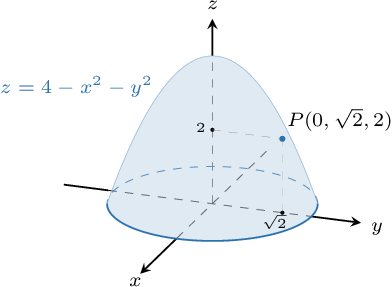
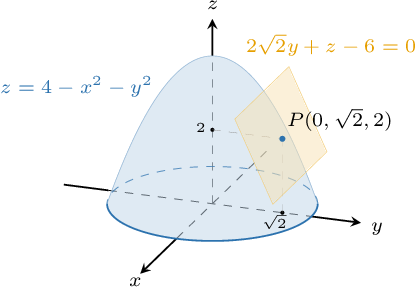

# Tangent Planes to Surfaces

Source: https://www.mathacademy.com/topics/1980?courseId=54
Topic ID: 1980

## Prerequisites

- [Tangent Vectors and Tangent Lines to Curves](./1792-tangent-vectors-and-tangent-lines-to-curves.md)
- [The Cartesian Equation of a Plane](../linear-algebra/1807-the-cartesian-equation-of-a-plane.md)
- [Computing Partial Derivatives Using the Rules of Differentiation](./4096-computing-partial-derivatives-using-the-rules-of-differentiation.md)

## Lesson

### Introduction

Similar to tangent lines for single variable functions, we can think of the **tangent plane** to a surface at a point as the plane that "touches" the surface at that point.

The equation of the tangent plane to a surface $z=f(x,y)$ at the point $(x_0,y_0,z_0),$ where $z_0=f(x_0,y_0),$ can be found using the formula

$$

z - z_0 = (x-x_0)\dfrac{\partial f}{\partial x}(x_0,y_0) + (y-y_0)\dfrac{\partial f}{\partial y}(x_0,y_0).

$$

For example, consider the surface

$$

z = 4-x^2-y^2.

$$

Let's find the equation of the tangent plane to the surface at the point $(0,\sqrt{2},2),$ as shown below.

First, we find the partial derivatives:

$$

\begin{aligned}\frac{𝜕𝑓}{𝜕𝑥} & =\frac{𝜕}{𝜕𝑥}(4−𝑥^{2}−𝑦^{2})=−2𝑥 \\ \frac{𝜕𝑓}{𝜕𝑦} & =\frac{𝜕}{𝜕𝑦}(4−𝑥^{2}−𝑦^{2})=−2𝑦\end{aligned}

$$

Next, we evaluate the partial derivatives at $(x,y) = (0,\sqrt{2})\mathbin{:}$

$$

\begin{aligned}\frac{𝜕𝑓}{𝜕𝑥}(0,\sqrt{√2}) & =−2(0)=0 \\ \frac{𝜕𝑓}{𝜕𝑦}(0,\sqrt{√2}) & =−2(\sqrt{√2})=−2\sqrt{√2}\end{aligned}

$$

Finally, we write down the equation of the tangent plane:

$$

\begin{aligned}𝑧−2 & =(𝑥−0)\frac{𝜕𝑓}{𝜕𝑥}(0,\sqrt{√2})+(𝑦−\sqrt{√2})\frac{𝜕𝑓}{𝜕𝑦}(0,\sqrt{√2}) \\ 𝑧−2 & =0(𝑥−0)−2\sqrt{√2}(𝑦−\sqrt{√2}) \\ 𝑧−2 & =−2\sqrt{√2}𝑦+4 \\ 2\sqrt{√2}𝑦+𝑧−6 & =0\end{aligned}

$$

So, we get that the Cartesian equation of the tangent plane is $2\sqrt{2}y + z - 6 = 0.$

### A Note on Differentiability

A surface $z = f(x,y)$ is differentiable at a point $P$ if and only if it admits a *unique* tangent plane at $P.$ Intuitively, this means that, in the neighborhood of $P,$ the surface $z=f(x,y)$ can be approximated as a plane.

Note that this is analogous to the case of functions of one variable. A function $y = f(x)$ is differentiable at a point $P$ if and only if it admits a *unique* tangent *line* at $P.$ This is the same as saying that, in the neighborhood of $P,$ the curve $y=f(x)$ can be approximated as a straight line.

We'll explore these ideas in more depth at the end of the lesson. For now, let's get some practice at computing tangent planes.

### Example: Calculating the Equation of a Tangent Plane

#### Question

Find the equation of the tangent plane to the surface $z= x^2 + xy$ at the point $(1,2, 3).$

#### Explanation

The Cartesian equation of the tangent plane to the surface $z=f(x,y)$ at the point $(x_0, y_0, z_0)$ on the surface can be written as

$$

z - z_0 = (x-x_0)\dfrac{\partial f}{\partial x}(x_0,y_0) + (y-y_0)\dfrac{\partial f}{\partial y}(x_0,y_0).

$$

First, we find the partial derivatives:

$$

\begin{aligned}\frac{𝜕𝑓}{𝜕𝑥} & =\frac{𝜕}{𝜕𝑥}(𝑥^{2}+𝑥𝑦) \\ & =2𝑥+𝑦 \\ \frac{𝜕𝑓}{𝜕𝑦} & =\frac{𝜕}{𝜕𝑦}(𝑥^{2}+𝑥𝑦) \\ & =𝑥\end{aligned}

$$

Next, we evaluate the partial derivatives at $(x,y) = (1,2)\mathbin{:}$

$$

\begin{aligned}\frac{𝜕𝑓}{𝜕𝑥}(1,2) & =2(1)+2=4 \\ \frac{𝜕𝑓}{𝜕𝑦}(1,2) & =1\end{aligned}

$$

Finally, we write down the equation of the tangent plane:

$$

\begin{aligned}𝑧−3 & =(𝑥−1)\frac{𝜕𝑓}{𝜕𝑥}(1,2)+(𝑦−2)\frac{𝜕𝑓}{𝜕𝑦}(1,2) \\ 𝑧−3 & =4(𝑥−1)+1(𝑦−2) \\ 𝑧−3 & =4𝑥+𝑦−6 \\ −4𝑥−𝑦+𝑧+3 & =0 \\ 4𝑥+𝑦−𝑧−3 & =0\end{aligned}

$$

### The Equation of a Tangent Hyperplane

Until now, we considered only functions of the form

$$

z=f(x,y)

$$

of two independent variables. But what about the case the functions

$$

w=f(x,y,z)

$$

with three variables? Can we define a tangent plane to such a function?

The answer is yes! Analogously to the case with two variables, a function of three variables $w = f(x,y,z)$ is differentiable at $(x_0,y_0,z_0)$ if admits a **unique tangent hyperplane** at $(x_0,y_0,z_0,w_0).$ The equation of the **tangent hyperplane** is given by

$$

w - w_0 = (x-x_0)\dfrac{\partial f}{\partial x}(x_0,y_0,z_0) + (y-y_0)\dfrac{\partial f}{\partial y}(x_0,y_0,z_0) + (z-z_0)\dfrac{\partial f}{\partial z}(x_0,y_0,z_0).

$$

Notice that we use the term *hyperplane*. The graphs of functions of three variables live in four-dimensional space. The equation above describes an object (a so-called hyperplane) in four-dimensional space that can be considered an analog to a *plane* in three-dimensional space.

### Example: Calculating the Equation of a Tangent Hyperplane

#### Question

Find the equation of the tangent hyperplane to the hypersurface $w=x^2+y^2+z^2-2xyz$ at the point $(1,-1,1,5).$

#### Explanation

The Cartesian equation of the tangent plane to the surface $w=f(x,y,z)$ at the point $(x_0, y_0, z_0,w_0)$ on the hypersurface can be written as

$$

w - w_0 = (x-x_0)\dfrac{\partial f}{\partial x}(x_0,y_0,z_0) + (y-y_0)\dfrac{\partial f}{\partial y}(x_0,y_0,z_0) + (z-z_0)\dfrac{\partial f}{\partial z}(x_0,y_0,z_0).

$$

First, we find the partial derivatives:

$$

\begin{aligned}\frac{𝜕𝑓}{𝜕𝑥} & =\frac{𝜕}{𝜕𝑥}(𝑥^{2}+𝑦^{2}+𝑧^{2}−2𝑥𝑦𝑧)=2𝑥−2𝑦𝑧 \\ \frac{𝜕𝑓}{𝜕𝑦} & =\frac{𝜕}{𝜕𝑦}(𝑥^{2}+𝑦^{2}+𝑧^{2}−2𝑥𝑦𝑧)=2𝑦−2𝑥𝑧 \\ \frac{𝜕𝑓}{𝜕𝑧} & =\frac{𝜕}{𝜕𝑧}(𝑥^{2}+𝑦^{2}+𝑧^{2}−2𝑥𝑦𝑧)=2𝑧−2𝑥𝑦\end{aligned}

$$

Next, we evaluate the partial derivatives at $(x,y,z) = (1,-1,1)\mathbin{:}$

$$

\begin{aligned}\frac{𝜕𝑓}{𝜕𝑥}(1,−1,1) & =2(1)−2(−1)(1)=4 \\ \frac{𝜕𝑓}{𝜕𝑦}(1,−1,1) & =2(−1)−2(1)(1)=−4 \\ \frac{𝜕𝑓}{𝜕𝑧}(1,−1,1) & =2(1)−2(1)(−1)=4\end{aligned}

$$

Finally, we write down the equation of the tangent hyperplane:

$$

\begin{aligned}𝑤−5 & =(𝑥−1)\frac{𝜕𝑓}{𝜕𝑥}(1,−1,1)+(𝑦+1)\frac{𝜕𝑓}{𝜕𝑦}(1,−1,1)+(𝑧−1)\frac{𝜕𝑓}{𝜕𝑧}(1,−1,1)\end{aligned}

$$

Substituting and simplifying, we get

$$

\begin{aligned}𝑤−5 & =4(𝑥−1)−4(𝑦+1)+4(𝑧−1) \\ 𝑤−5 & =4𝑥−4𝑦+4𝑧−12 \\ −4𝑥+4𝑦−4𝑧+𝑤+7 & =0 \\ 4𝑥−4𝑦+4𝑧−𝑤−7 & =0.\end{aligned}

$$

### Finding a Normal Vector to a Surface

Recall that the equation of the tangent plane to the surface $z = f(x,y)$ at $(x_0,y_0,z_0)$ can be given as

$$

z - z_0 = (x-x_0)\dfrac{\partial f}{\partial x}(x_0,y_0) + (y-y_0)\dfrac{\partial f}{\partial y}(x_0,y_0).

$$

Slightly rewriting the equation, we obtain

$$

{\color{blue}\dfrac{\partial f}{\partial x}(x_0,y_0)} \cdot (x-x_0) + {\color{blue}\dfrac{\partial f}{\partial y}(x_0,y_0)} \cdot (y-y_0) + ({\color{blue}-1}) \cdot (z - z_0) = 0,

$$

which immediately gives us a normal vector to the tangent plane:

$$

\left\langle {\color{blue}\dfrac{\partial f}{\partial x}(x_0,y_0)}, \:\: {\color{blue}\dfrac{\partial f}{\partial y}(x_0,y_0)}, \:\: {\color{blue}-1} \right\rangle

$$

A normal vector to the tangent plane to the surface is called a **normal vector to the surface**.

### Example: Finding Points at Which Tangent Planes Have Particular Properties

#### Question

At which points on the surface $z={y^2}+ {xy}$ is the tangent plane horizontal?

#### Explanation

The tangent plane to a surface is horizontal if and only if the normal vector to the tangent plane is vertical. So, let's first find the general expression of a normal vector to the surface.

Remember that the Cartesian equation of the tangent plane to the surface $z=f(x,y)$ at the point $(x_0, y_0, z_0)$ on the surface can be written as

$$

z - z_0 = (x-x_0)\dfrac{\partial f}{\partial x}(x_0,y_0) + (y-y_0)\dfrac{\partial f}{\partial y}(x_0,y_0)

$$

where $\left\langle \dfrac{\partial f}{\partial x}(x_0,y_0), \dfrac{\partial f}{\partial y}(x_0,y_0), -1 \right\rangle$ represents a normal vector to the tangent plane.

First, we find the partial derivatives:

$$

\begin{aligned}\frac{𝜕𝑓}{𝜕𝑥} & =\frac{𝜕}{𝜕𝑥}(𝑦^{2}+𝑥𝑦) \\ & =𝑦 \\ \frac{𝜕𝑓}{𝜕𝑦} & =\frac{𝜕}{𝜕𝑦}(𝑦^{2}+𝑥𝑦) \\ & =2𝑦+𝑥\end{aligned}

$$

Therefore, a normal vector to the tangent plane is

$$

\left\langle y, \: 2y+x, \: -1 \right\rangle.

$$

We want to find where this normal vector is vertical. This means that the $x$- and $y$-components of the vector must be $0\mathbin{:}$

$$

\begin{aligned}\frac{𝜕𝑓}{𝜕𝑥}=0 \\ \frac{𝜕𝑓}{𝜕𝑦}=0\end{aligned}

$$

From the first equation, we get $y=0.$ Substituting this into the second equation, we obtain

$$

2(0) +x = 0 \qquad\Longrightarrow\qquad x = 0.

$$

Finally, substituting $x=0$ and $y=0$ into our function, we get

$$

z = 0^2+(0)(0)= 0.

$$

Therefore, the point where the tangent plane is horizontal is $(0,0,0).$

### Defining the Differentiability of Single Variable Functions in Terms of Tangent Lines

Earlier, we claimed that function $f(x)$ is differentiable at $x_0$ *if the function admits a unique tangent line* at $x_0.$ Let's now justify this claim.

Recall that a function $f(x)$ is differentiable at $x=x_0$ with derivative $f'(x_0)$ if and only if the following limit exists:

$$

f'(x_0) = \lim_{x\to x_0}\dfrac {f(x) - f(x_0)} {x-x_0}

$$

We can rewrite this limit as follows:

$$

\begin{aligned}\underset{𝑥→𝑥_{0}}{lim}(\frac{𝑓(𝑥)−𝑓(𝑥_{0})}{𝑥−𝑥_{0}})−𝑓^{′}(𝑥_{0}) & =0 \\ \underset{𝑥→𝑥_{0}}{lim}(\frac{𝑓(𝑥)−𝑓(𝑥_{0})}{𝑥−𝑥_{0}}−𝑓^{′}(𝑥_{0})) & =0 \\ \underset{𝑥→𝑥_{0}}{lim}\frac{𝑓(𝑥)−𝑓(𝑥_{0})−(𝑥−𝑥_{0})𝑓^{′}(𝑥_{0})}{𝑥−𝑥_{0}} & =0\end{aligned}

$$

In order for the above limit to hold true, the numerator must approach zero. So, near $x_0,$ we must have

$$

f(x) - f(x_0) - (x-x_0)f'(x_0) \approx 0,

$$

which can be rewritten as

$$

f(x) - f(x_0) \approx (x-x_0)f'(x_0).

$$

This corresponds to the following equation of the tangent line at $x_0\mathbin{:}$

$$

y -y_0 = (x-x_0)\dfrac{\textrm d f}{\textrm d x}(x_0)

$$

From here, we can say that a function $f(x)$ is differentiable at $x_0$ *if the function admits a unique tangent line* at $x_0.$

We'll now use a similar idea to define the differentiability of a multivariable function at a point $P$ in terms of tangent planes.

### Defining the Differentiability of Multivariable Functions in Terms of Tangent Planes

Earlier, we claimed that function $f(x,y)$ is differentiable at $(x_0,y_0)$ *if the function admits a unique tangent plane* at $(x_0,y_0).$ Let's now justify this claim.

Assume that $f(x,y)$ is a differentiable function of two variables. Since $f(x,y)$ is differentiable at $(x_0,y_0),$ then there exists a vector $\nabla f = \langle f_1, f_2\rangle$ such that

$$

\lim_{(x,y)\to (x_0,y_0)}\dfrac {f(x,y) - f(x_0,y_0) - \langle x-x_0, y-y_0\rangle \cdot \langle f_1, f_2\rangle} {||\langle x-x_0,y-y_0\rangle||} = 0. \qquad (\ast)

$$

For the above limit to hold, the numerator must approach zero. So, near $(x_0,y_0),$ we must have

$$

f(x,y) - f(x_0,y_0) - \langle x-x_0, y-y_0\rangle \cdot \langle f_1, f_2\rangle \approx 0,

$$

which can be rewritten as

$$

f(x,y) - f(x_0,y_0) \approx \langle x-x_0, y-y_0\rangle \cdot \langle f_1, f_2\rangle.

$$

Expanding the dot product, we get

$$

f(x,y) \approx f(x_0,y_0) + (x-x_0)\cdot f_1+ (y-y_0)\cdot f_2.

$$

We now need to show that $f_1$ and $f_2$ are the partial derivatives.

- Let $y=y_0$ in the first equation $(\ast)$ above. This gives which is the definition of the partial derivative with respect to $x.$ So, we have $f_1 = \dfrac{\partial f}{\partial x}(x_0,y_0).$

- Similarly, letting $x = x_0$ gives $f_2 = \dfrac{\partial f}{\partial y}(x_0,y_0).$

Therefore, the function $f(x,y)$ can be linearized as

$$

f(x,y)\approx f(x_0,y_0) + (x-x_0)\dfrac{\partial f}{\partial x}(x_0,y_0) + (y-y_0)\dfrac{\partial f}{\partial y}(x_0,y_0).

$$

By setting $z=f(x,y)$ and $z_0 = f(x_0,y_0),$ we get the equation of the tangent plane:

$$

z - z_0 = (x-x_0)\dfrac{\partial f}{\partial x}(x_0,y_0) + (y-y_0)\dfrac{\partial f}{\partial y}(x_0,y_0)

$$

From here, we can say that a function $f(x,y)$ is differentiable at $(x_0,y_0)$ *if the function admits a unique tangent plane* at $(x_0, y_0).$

Finally, note that we have also shown that

$$

\nabla f = \left\langle \dfrac{\partial f}{\partial x}, \dfrac{\partial f}{\partial y} \right\rangle.

$$

The vector $\nabla f$ is known as the **gradient vector**.
