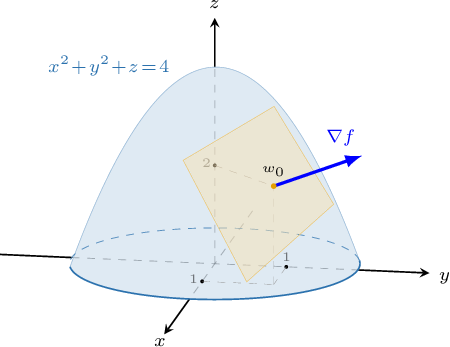

# Tangent Planes to Level Surfaces

Source: https://www.mathacademy.com/topics/1984?courseId=54
Topic ID: 1984

## Prerequisites

- [Tangent Lines to Level Curves](./1940-tangent-lines-to-level-curves.md)

## Lesson

### Introduction

In this lesson, we will learn how to compute the tangent plane to the level surface $f (x, y, z) = k,$ where $k$ is a constant, at some point $\mathbf x_0 = (x_0, y_0, z_0).$

As an example, consider the function

$$

f(x,y,z) = x^2 +y^2+z.

$$

Suppose that we wish to find the equation of the tangent plane to the level surface that passes through the point where $(x,y,z)= (1,1, 2).$

Evaluating $f$ at the point $(1,1,2),$ we get

$$

f(x,y,z) = (1)^2 +(1)^2+2 = 4.

$$

So, the equation of our level surface is

$$

x^2 +y^2+z = 4.

$$

Now, to find the equation of the tangent plane to this surface at $(1,1,2),$ we can use the following result:

*Given a hypersurface $w = f(x,y,z)$ and a point $\mathbf x_0 = (x_0,y_0,z_0)$ that lies in the domain of $f$, the gradient $\nabla \! f (\mathbf x_0)$ is normal to the tangent plane of the level surface $f (x, y, z) = k$ at the point $\mathbf x_0$*.

We can now find the equation of the tangent plane to our level surface.

First, we find the gradient of $f(x,y,z)$ and evaluate it at $\mathbf x_0 = (1,1,2)\mathbin{:}$

$$

\begin{aligned}∇\,𝑓(𝑥,𝑦,𝑧) & =𝑓_{𝑥}\,𝐢+𝑓_{𝑦}\,𝐣+𝑓_{𝑧}\,𝐤 \\ & =\frac{𝜕}{𝜕𝑥}(𝑥^{2}+𝑦^{2}+𝑧) 𝐢+\frac{𝜕}{𝜕𝑦}(𝑥^{2}+𝑦^{2}+𝑧) 𝐣+\frac{𝜕}{𝜕𝑧}(𝑥^{2}+𝑦^{2}+𝑧) 𝐤 \\ & =2𝑥 𝐢+2𝑦 𝐣+𝐤 \\ ∇𝑓(1,1,2) & =2(1) 𝐢+2(1) 𝐣+𝐤 \\ & =2 𝐢+2 𝐣+𝐤 \\ & =⟨2,\,2,1⟩\end{aligned}

$$

Finally, we write down the Cartesian equation of the tangent plane:

$$

\begin{aligned} \nabla f(x_0,y_0,z_0) \cdot \langle x-x_0, \: y-y_0, \: z-z_0 \rangle & = 0 \\[3pt] \nabla f(1,1,2) \cdot \langle x-1, \: y-1, \: z-2 \rangle & = 0 \\[3pt] \langle 2,\:2,\:1\rangle\cdot \langle x-1, y-1, z-2\rangle &= 0\\[3pt] 2(x-1)+ 2(y-1) + (z-2) & =0\\2x +2y +z -6&=0 \end{aligned}

$$

### Example: Finding the Tangent to Plane a Level Surface

#### Question

Given the function $f(x,y,z) = x^2+y^2+z^2,$ find the equation of the tangent plane to the level surface that passes through the point where $(x,y,z)=(2,-2,1).$

#### Explanation

The equation of the tangent plane to the level surface $f(x,y,z) = k$ at the point $(x_0,y_0,z_0)$ can be expressed as

$$

\nabla \! f(x_0,y_0,z_0) \cdot \langle x-x_0, \: y-y_0, \: z-z_0 \rangle = 0.

$$

First, we find the gradient of $f(x,y,z)$ and evaluate it at $(x_0,y_0,z_0) =(2,-2,1)\mathbin{:}$

$$

\begin{aligned}∇\,𝑓(𝑥,𝑦,𝑧) & =𝑓_{𝑥}\,𝐢+𝑓_{𝑦}\,𝐣+𝑓_{𝑧}\,𝐤 \\ & =\frac{𝜕}{𝜕𝑥}(𝑥^{2}+𝑦^{2}+𝑧^{2}) 𝐢+\frac{𝜕}{𝜕𝑦}(𝑥^{2}+𝑦^{2}+𝑧^{2}) 𝐣+\frac{𝜕}{𝜕𝑧}(𝑥^{2}+𝑦^{2}+𝑧^{2}) 𝐤 \\ & =2𝑥 𝐢+2𝑦 𝐣+2𝑧 𝐤 \\ ∇\,𝑓(2,−2,1) & =2(2) 𝐢+2(−2) 𝐣+2(1) 𝐤 \\ & =4\,𝐢−4\,𝐣+2 𝐤 \\ & =⟨4,\,−4\,,2⟩\end{aligned}

$$

We can now write down the Cartesian equation of the tangent plane to the level surface, as follows:

$$

\begin{aligned}∇\,𝑓(𝑥_{0},𝑦_{0},𝑧_{0})⋅⟨𝑥−𝑥_{0},\,𝑦−𝑦_{0},\,𝑧−𝑧_{0}⟩ & =0 \\ ∇\,𝑓(2,−2,1)⋅⟨𝑥−2,\,𝑦−(−2),\,𝑧−1⟩ & =0 \\ ⟨4,\,−4,\,2⟩⋅⟨𝑥−2,\,𝑦+2,\,𝑧−1⟩ & =0 \\ 4(𝑥−2)−4(𝑦+2)+2(𝑧−1) & =0 \\ 4𝑥−4𝑦+2𝑧−18 & =0 \\ 2𝑥−2𝑦+𝑧−9 & =0\end{aligned}

$$

### Example: Finding a Tangent Plane of a Surface Given Implicitly Using the Gradient Vector

#### Question

Consider the surface $z^3y^2 =x^2-5.$ Find the equation of the tangent plane to this surface at the point $(-1,2,-1).$

#### Explanation

First, we bring all variables to one side:

$$

\begin{aligned}𝑧^{3}𝑦^{2} & =𝑥^{2}−5 \\ 𝑧^{3}𝑦^{2}−𝑥^{2} & =−5\end{aligned}

$$

If we set $f(x,y,z) = z^3y^2 - x^2,$ our surface can be viewed as the level surface $f(x,y,z)=-5.$

Recall that the equation of the tangent plane to the level surface $f(x,y,z) = k$ at the point $(x_0,y_0,z_0)$ can be expressed as

$$

\nabla f(x_0,y_0,z_0) \cdot \langle x-x_0, \: y-y_0, \: z-z_0 \rangle = 0.

$$

Now, we find the gradient of $f(x,y,z)$ and evaluate it at $(-1,2,-1)\mathbin{:}$

$$

\begin{aligned}∇\,𝑓(𝑥,𝑦,𝑧) & =𝑓_{𝑥}(𝑥,𝑦,𝑧)\,𝐢+𝑓_{𝑦}(𝑥,𝑦,𝑧)\,𝐣+𝑓_{𝑧}(𝑥,𝑦,𝑧)\,𝐤 \\ & =\frac{𝜕}{𝜕𝑥}(𝑧^{3}𝑦^{2}−𝑥^{2}) 𝐢+\frac{𝜕}{𝜕𝑦}(𝑧^{3}𝑦^{2}−𝑥^{2}) 𝐣+\frac{𝜕}{𝜕𝑧}(𝑧^{3}𝑦^{2}−𝑥^{2}) 𝐤 \\ & =(−2𝑥) 𝐢+2𝑧^{3}𝑦 𝐣+3𝑧^{2}𝑦^{2} 𝐤 \\ ∇\,𝑓(−1,2,−1) & =(−2)(−1) 𝐢+2(−1)^{3}(2) 𝐣+3(−1)^{2}(2)^{2} 𝐤 \\ & =2\,𝐢−4𝐣+12\,𝐤 \\ & =⟨2,−4,12⟩\end{aligned}

$$

Finally, we can now write down the Cartesian equation of the tangent plane to the level surface, as follows:

$$

\begin{aligned}∇𝑓(𝑥_{0},𝑦_{0},𝑧_{0})⋅⟨𝑥−𝑥_{0},\,𝑦−𝑦_{0},\,𝑧−𝑧_{0}⟩ & =0 \\ ∇𝑓(−1,2,−1)⋅⟨𝑥−(−1),\,𝑦−2,\,𝑧−(−1)⟩ & =0 \\ ⟨2,−4,12⟩⋅⟨𝑥+1,\,𝑦−2,\,𝑧+1⟩ & =0 \\ 2(𝑥+1)−4(𝑦−2)+12(𝑧+1) & =0 \\ 2𝑥−4𝑦+12𝑧+22 & =0 \\ 𝑥−2𝑦+6𝑧+11 & =0\end{aligned}

$$
