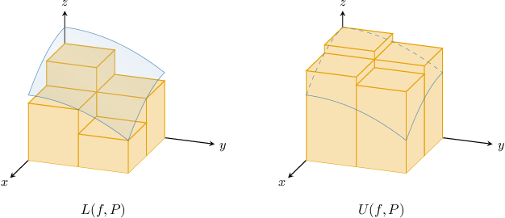
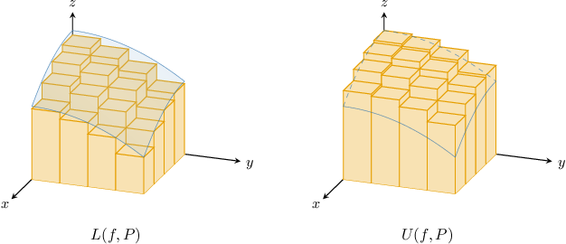
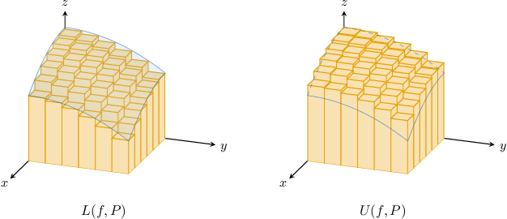

# Defining Double Integrals Using Lower and Upper Riemann Sums

Source: https://www.mathacademy.com/topics/1990?courseId=54
Topic ID: 1990

## Prerequisites

- [Defining Definite Integrals Using Left and Right Riemann Sums](../ap-calculus-ab/1086-defining-definite-integrals-using-left-and-right-riemann-sums.md)
- [Lower Riemann Sums Over General Rectangular Partitions](./2615-lower-riemann-sums-over-general-rectangular-partitions.md)
- [Upper Riemann Sums Over General Rectangular Partitions](./3696-upper-riemann-sums-over-general-rectangular-partitions.md)
- [Calculating Double Summations Over Partitions](./3698-calculating-double-summations-over-partitions.md)

## Lesson

### Introduction

Let $f(x,y)$ be a positive, continuous function defined on a closed and bounded rectangle $R,$ and let $P = P_1\times P_2$ be a partition of $R.$ We know that the volume $V$ bounded by the surface $z=f(x,y)$ and the region $R$ in the $xy$-plane satisfies

$$

L(f,P) \leq V \leq U(f,P),

$$

where $L(f, P)$ and $U(f, P)$ are the lower and upper Riemann sums of $f$ with respect to $P.$

Imagine that our initial partition $P$ consists of a few rectangles only. Let's visualize the corresponding lower and upper Riemann sums, as shown below:

Then, we refine $P$ by adding more points to $P_1$ and $P_2,$ resulting in more rectangles in $P{:}$

Refining the partition once again, we get the following:

As we continue to refine $P$ by adding more and more points to $P_1$ and $P_2,$ we find that the values of the lower and upper Riemann sums approach the volume $V{:}$

- $L(f, P)\to V$ from below, and

- $U(f, P) \to V$ from above.

We define the **double integral** of $f(x,y)$ over $R$ as the *unique* number $I$ that satisfies the inequality

$$

L(f,P) \leq I \leq U(f,P)

$$

for *all* partitions $P$ of $R,$ and we write

$$

I=\iint\limits_R f(x,y) \, \text{d}A.

$$

The double integral gives the exact volume bounded between the surface $z=f(x,y)$ and $R.$

### Example: Applying the Definition of the Double Integral in Terms of Lower and Upper Riemann Sums

#### Question

Let $R = [0,1]\times [1,2]$ be a region in the $xy$-plane, and let $f(x,y) = 12-x-y.$ Further, let

$$

\displaystyle I = \iint\limits_{R} f(x,y)\,\textrm dA

$$

be the unique number such that over all rectangular partitions $P$ of $R,$ we have $L(f,P)\:\leq I \:\leq U(f,P),$ where $L(f,P)$ and $U(f,P)$ are the corresponding lower and upper Riemann sums. Write down the upper Riemann sum $U(f,P).$

#### Explanation

For a function $f(x,y),$ the double integral of $f$ over a rectangular region $R$ is the unique number $I$ (if it exists) such that

$$

L(f,P) \leq I \leq U(f,P)

$$

over all partitions $P$ of $R,$ where the lower and upper sums respectively are given by

$$

\begin{aligned}𝐿(𝑓,𝑃) & =\underset{\underset{𝑖=1}{∑}}{\overset{}{𝑚}}\underset{\underset{𝑗=1}{∑}}{\overset{}{𝑛}}𝑚_{𝑖𝑗}Δ𝑥_{𝑖}Δ𝑦_{𝑗} \\ 𝑈(𝑓,𝑃) & =\underset{\underset{𝑖=1}{∑}}{\overset{}{𝑚}}\underset{\underset{𝑗=1}{∑}}{\overset{}{𝑛}}𝑀_{𝑖𝑗}Δ𝑥_{𝑖}Δ𝑦_{𝑗}\end{aligned}

$$

and $m_{ij}$ and $M_{ij}$ are the minimum and maximum values of $f$ respectively in each subregion $R_{ij}.$

We need to compute $U(f,P).$

Notice that for all subregions $R_{ij},$ we have that

- $f(x,y) = 12-x-y$ decreases as $x$ increases, and

- $f(x,y) = 12-x-y$ decreases as $y$ increases.

As a result, the ** value of $f$ in each subregion is attained when we have the ** possible $x$ and the ** possible $y.$ This is the value at the ** of each subregion. Therefore,

$$

M_{ij} = f(x_{i-1}, y_{j-1}) = 12-x_{i-1}-y_{j-1}

$$

and the upper Riemann sum is given by

$$

U(f,P) = \sum_{i=1}^m\sum_{j=1}^n (12-x_{i-1}-y_{j-1})\Delta x_i \Delta y_j.

$$

### Example: Calculating a Double Integral Using Lower and Upper Riemann Sums

#### Question

Let $R = [-1,4]\times [1,2]$ be a region in the $xy$-plane, and let $P$ be a partition of $R,$ where

$$

\begin{aligned}𝑃_{1}={𝑥_{0},𝑥_{1},…,𝑥_{𝑚}},\,𝑃_{2}={𝑦_{0},𝑦_{1},…,𝑦_{𝑛}},\,𝑃=𝑃_{1}×𝑃_{2}.\end{aligned}

$$

Calculate the double integral

$$

\displaystyle\iint\limits_R f(x,y) \, \textrm{d}A,

$$

where $f$ is a function such that $m_{ij} = M_{ij} = 3$ for all partitions $P$ of $R,$ and $m_{ij}$ and $M_{ij}$ are the minimum and maximum values of $f$ respectively in each subregion $R_{ij}.$

#### Explanation

For a function $f(x,y),$ the double integral of $f$ over a rectangular region $R$ is the unique number $I$ (if it exists) such that

$$

L(f,P) \leq I \leq U(f,P)

$$

over all partitions $P$ of $R,$ where the lower and upper sums respectively are given by

$$

\begin{aligned}𝐿(𝑓,𝑃) & =\underset{\underset{𝑖=1}{∑}}{\overset{}{𝑚}}\underset{\underset{𝑗=1}{∑}}{\overset{}{𝑛}}𝑚_{𝑖𝑗}Δ𝑥_{𝑖}Δ𝑦_{𝑗} \\ 𝑈(𝑓,𝑃) & =\underset{\underset{𝑖=1}{∑}}{\overset{}{𝑚}}\underset{\underset{𝑗=1}{∑}}{\overset{}{𝑛}}𝑀_{𝑖𝑗}Δ𝑥_{𝑖}Δ𝑦_{𝑗}\end{aligned}

$$

and $m_{ij}$ and $M_{ij}$ are the minimum and maximum values of $f$ in each subregion $R_{ij}.$

Now, since $m_{ij}=M_{ij}=3,$ we obtain

$$

\begin{aligned}𝐿(𝑓,𝑃)=𝑈(𝑓,𝑃) & =\underset{\underset{𝑖=1}{∑}}{\overset{}{𝑚}}\underset{\underset{𝑗=1}{∑}}{\overset{}{𝑛}}3\,Δ𝑥_{𝑖}Δ𝑦_{𝑗} \\ & =3(\underset{\underset{𝑖=1}{∑}}{\overset{}{𝑚}}Δ𝑥_{𝑖})(\underset{\underset{𝑗=1}{∑}}{\overset{}{𝑛}}Δ𝑦_{𝑗}) \\ & =3(4−(−1))(2−1) \\ & =3⋅5⋅1 \\ & =15.\end{aligned}

$$

Finally, we obtain

$$

\begin{aligned}𝐿(𝑓,𝑃)=15 & ≤\underset{𝑅}{∬}𝑓(𝑥,𝑦)\,d𝐴≤15=𝑈(𝑓,𝑃),\end{aligned}

$$

which implies that

$$

\iint\limits_R f(x,y)\,\textrm d A = 15.

$$

### Example: Calculating a Double Integral Using the Mean Value of X and Y

#### Question

Let $R = [0,2]\times [1,3]$ be a region in the $xy$-plane, and let $f(x,y)$ be a function defined over $R.$ The lower and upper Riemann sums corresponding to an arbitrary partition $P$ of $R$ are given by

$$

\begin{aligned}𝐿(𝑓,𝑃) & =\underset{\underset{𝑖=1}{∑}}{\overset{}{𝑚}}\underset{\underset{𝑗=1}{∑}}{\overset{}{𝑛}}(𝑥_{𝑖−1}+2𝑦_{𝑗−1})\,Δ𝑥_{𝑖}Δ𝑦_{𝑗},\, \\ 𝑈(𝑓,𝑃) & =\underset{\underset{𝑖=1}{∑}}{\overset{}{𝑚}}\underset{\underset{𝑗=1}{∑}}{\overset{}{𝑛}}(𝑥_{𝑖}+2𝑦_{𝑗})Δ𝑥_{𝑖}Δ𝑦_{𝑗}.\end{aligned}

$$

Using the definition of the double integral in terms of $L(f,P)$ and $U(f,P),$ compute $\displaystyle\iint\limits_R f(x,y)\,\textrm d A.$

**

$$

\sum_{i=1}^m\sum_{j=1}^n\left(x_{i-1} + x_i\right)\Delta x_i \Delta y_j = (x_m^2 - x_0^2)(y_n-y_0)

$$

#### Explanation

For a function $f(x,y),$ the double integral of $f$ over a rectangular region $R$ is the unique number $I$ (if it exists) such that

$$

L(f,P) \leq I \leq U(f,P)

$$

over all partitions $P$ of $R.$

First, notice that $\bar{x}_i = \dfrac 1 2 (x_{i-1}+x_i)$ will always lie between $x_{i-1}$ and $x_i,$ and similarly $\bar{y}_j = \dfrac 1 2 (y_{j-1}+y_j)$ will always lie between $y_{j-1}$ and $y_j.$ Therefore,

$$

x_{i-1} + {\color{blue}2}y_{j-1} \leq \dfrac{1}{2}(x_{i-1} + x_i) + {\color{blue}2}\cdot \dfrac 1 2 (y_{j-1} + y_j) \leq x_{i} + {\color{blue}2}y_{j},

$$

which simplifies to

$$

x_{i-1} + 2y_{j-1} \leq \dfrac{1}{2}(x_{i-1} + x_i) + (y_{j-1} + y_j)\leq x_{i} + 2y_{j}.

$$

Multiplying this by $\Delta x_i\Delta y_j$ and applying the double summation gives

$$

L(f,P) \leq \sum_{i=1}^m\sum_{j=1}^n\left[\dfrac{1}{2}(x_{i-1} + x_i) + (y_{j-1} + y_j)\right]\Delta x_i \Delta y_j\leq U(f,P).

$$

Separating the sums using the addition and constant multiple rules, we get

$$

L(f,P) \leq \dfrac{1}{2}\sum_{i=1}^m\sum_{j=1}^n\left(x_{i-1} + x_i\right)\Delta x_i \Delta y_j + \sum_{i=1}^m\sum_{j=1}^n\left(y_{j-1} + y_j\right)\Delta x_i \Delta y_j\leq U(f,P).

$$

Using the hint, we get the following:

$$

\begin{aligned}\frac{1}{2}\underset{\underset{𝑖=1}{∑}}{\overset{}{𝑚}}\underset{\underset{𝑗=1}{∑}}{\overset{}{𝑛}}(𝑥_{𝑖−1}+𝑥_{𝑖})Δ𝑥_{𝑖}Δ𝑦_{𝑗} & =\frac{1}{2}(2^{2}−0^{2})(3−1)=4 \\ \underset{\underset{𝑖=1}{∑}}{\overset{}{𝑚}}\underset{\underset{𝑗=1}{∑}}{\overset{}{𝑛}}(𝑦_{𝑗−1}+𝑦_{𝑗})Δ𝑥_{𝑖}Δ𝑦_{𝑗} & =(3^{2}−1^{2})(2−0)=16\end{aligned}

$$

Finally, then:

$$

\begin{aligned}𝐿(𝑓,𝑃)≤4+16≤𝑈(𝑓,𝑃)\,⟹\,𝐿(𝑓,𝑃)≤20≤𝑈(𝑓,𝑃)\end{aligned}

$$

Therefore, we conclude that

$$

\iint\limits_R f(x,y)\,\textrm d A = 20.

$$

### Final Remarks

Throughout this lesson, we've defined the double integral of $f(x,y)$ over $R$ as the *unique* number $I$ (if it exists) that satisfies the inequality

$$

L(f,P) \leq I \leq U(f,P)

$$

for *all* partitions $P$ of $R,$ and we write

$$

I=\iint\limits_R f(x,y) \, \text{d}A.

$$

We note the following:

- Up to now, we've assumed that $f(x,y)$ is continuous and $R$ is closed and bounded. Whenever this is the case, a unique number $I$ will always exist.

- For positive, continuous functions, the double integral gives the exact volume bounded between the surface $z=f(x,y)$ and $R.$

- More generally, the double integral gives a signed volume. If $f$ is negative everywhere on $R,$ then the double integral of $f$ over $R$ is negative. If $f$ is both positive and negative on $R,$ then the double integral gives the difference between the positive and negative unsigned volumes. This is similar to the case with definite integrals for single-valued functions.

- Finally, It's possible to use this definition with functions that are not continuous. If a function $f$ (not necessarily continuous) is defined over $R,$ we say that $f$ is **Riemann integrable** over $R$ if a unique number $I$ can be found that satisfies the above inequality. Many (though not all) non-continuous functions are Riemann integrable.
