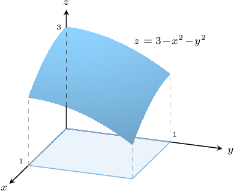

# Double Integrals Over Rectangular Domains

Source: https://www.mathacademy.com/topics/1992?courseId=54
Topic ID: 1992

## Prerequisites

- [Integration by Substitution With Inverse Trigonometric Functions](../ap-calculus-ab/315-integration-by-substitution-with-inverse-trigonometric-functions.md)
- [Integrating Trigonometric Functions Using Substitution](../ap-calculus-ab/478-integrating-trigonometric-functions-using-substitution.md)
- [The Area Bounded by a Curve and the X-Axis](../ap-calculus-ab/1040-the-area-bounded-by-a-curve-and-the-x-axis.md)
- [Integrating Logarithmic Functions Using Substitution](../ap-calculus-ab/1161-integrating-logarithmic-functions-using-substitution.md)
- [The Domain of a Multivariable Function](./1899-the-domain-of-a-multivariable-function.md)
- [Integrating Exponential Functions Using Substitution](../ap-calculus-ab/3770-integrating-exponential-functions-using-substitution.md)

## Lesson

### Introduction

A **repeated integral**, also known as an **iterated integral,** is an integral in which we carry out repeated integration with respect to different variables. An example of a repeated integral is as follows:

$$

\int_0^1\int_0^1 ye^{xy}\,\textrm d x\,\textrm d y

$$

To evaluate this integral, we first integrate with respect to the inner variable $x,$ and then with respect to the outer variable $y$. We can write this more explicitly as

$$

\begin{aligned}∫_{10}^{}[∫_{10}^{}𝑦𝑒^{𝑥𝑦}\,d𝑥]\,d𝑦.\end{aligned}

$$

We now carry out the integration. First, we integrate with respect to $x,$ *treating $y$ as a constant*. This gives

$$

\begin{aligned}∫_{10}^{}[∫_{10}^{}𝑦𝑒^{𝑥𝑦}\,d𝑥]\,d𝑦 & =∫_{10}^{}[\frac{𝑦𝑒^{𝑥𝑦}}{𝑦}]_{10}^{}\,d𝑦 \\ & =∫_{10}^{}[𝑒^{𝑥𝑦}]_{10}^{}\,d𝑦 \\ & =∫_{10}^{}𝑒^{𝑦}−𝑒^{0}\,d𝑦 \\ & =∫_{10}^{}𝑒^{𝑦}−1\,d𝑦.\end{aligned}

$$

Finally, we integrate with respect to $y\mathbin{:}$

$$

\begin{aligned}∫_{10}^{}𝑒^{𝑦}−1\,d𝑦 & =[𝑒^{𝑦}−𝑦]_{10}^{} \\ & =[𝑒−1]−[1−0] \\ & =𝑒−2.\end{aligned}

$$

We conclude that

$$

\int_0^1\int_0^1 ye^{xy}\,\textrm d x\,\textrm d y = e-2.

$$

### Example: Evaluating a Repeated Integral

#### Question

Evaluate the repeated integral $\displaystyle \int_{2}^{4} \int_{0}^{2} \dfrac{x^3}{y^2} \, \textrm{d}x \, \textrm{d}y.$

#### Explanation

First, we evaluate the inner integral by integrating with respect to $x$, treating $y$ as a constant:

$$

\begin{aligned}∫_{42}^{}[∫_{20}^{}\frac{𝑥^{3}}{𝑦^{2}}\,d𝑥]d𝑦 & =∫_{42}^{}\frac{1}{𝑦^{2}}[\frac{𝑥^{4}}{4}]_{20}^{}\,d𝑦 \\ & =∫_{42}^{}\frac{1}{𝑦^{2}}(\frac{2^{4}}{4}−\frac{0^{4}}{4})d𝑦 \\ & =∫_{42}^{}\frac{4}{𝑦^{2}}\,d𝑦 \\ & =4∫_{42}^{}\frac{1}{𝑦^{2}}\,d𝑦\end{aligned}

$$

Then, we integrate with respect to $y\mathbin{:}$

$$

\begin{aligned}4∫_{42}^{}\frac{1}{𝑦^{2}}\,d𝑦 & =4[−\frac{1}{𝑦}]_{42}^{} \\ & =4(−\frac{1}{4}−(−\frac{1}{2})) \\ & =4⋅\frac{1}{4} \\ & =1\end{aligned}

$$

### Double Integrals

Consider the surface $z= f(x,y) = 3-x^2-y^2,$ defined over the following rectangle:

$$

R=[0,1] \times [0,1] = \big\{ (x,y) \: : \: 0 \leq x \leq 1, \: 0 \leq y \leq 1 \big\}.

$$

A sketch of our surface and its domain is shown below.

The **double integral** of $f(x,y)$ over $R,$ denoted

$$

\iint\limits_{R}{ f(x,y) \, \mathrm{d}A},

$$

represents the total *signed* volume bounded between the surface $z=f(x,y)$ and the planes $x=0, x=1, y=0, y=1.$

It can be shown that the double integral

$$

\displaystyle \iint\limits_{R} {{(3-x^2-y^2) \, \mathrm{d}A}},

$$

can be evaluated using the repeated integral

$$

\displaystyle \int_0^1\int_0^1 (3-x^2-y^2) \, \mathrm{d} x\, \mathrm{d} y.

$$

Notice that we replace $\textrm d A$ with $\textrm d x\,\textrm d y$ when writing our double integral as a repeated integral.

### Example: Evaluating a Double Integral Over a Rectangular Domain

#### Question

Evaluate the double integral $\displaystyle \iint \limits_{D} \dfrac y{x^2} \, \textrm d A$, where $D=\left\{(x,y) \:: \:2 \leq x \leq 4,\: 0 \leq y \leq 3\right\}.$

#### Explanation

First, we express our double integral as a repeated integral:

$$

\begin{aligned}\underset{𝐷}{∬}\frac{𝑦}{𝑥^{2}}\,d𝐴 & =∫_{30}^{}[∫_{42}^{}\frac{𝑦}{𝑥^{2}}\,d𝑥]d𝑦\end{aligned}

$$

Now, we evaluate the inner integral by integrating with respect to $x$, treating $y$ as a constant:

$$

\begin{aligned}∫_{30}^{}[∫_{42}^{}\frac{𝑦}{𝑥^{2}}\,d𝑥]d𝑦 & =∫_{30}^{}[−\frac{𝑦}{𝑥}]_{42}^{}d𝑦 \\ & =∫_{30}^{}(−\frac{𝑦}{4}−(−\frac{𝑦}{2}))\,d𝑦 \\ & =∫_{30}^{}\frac{𝑦}{4}\,d𝑦\end{aligned}

$$

Finally, we integrate with respect to $y\mathbin{:}$

$$

\begin{aligned}∫_{30}^{}\frac{𝑦}{4}\,d𝑦 & =[\frac{𝑦^{2}}{8}]_{30}^{} \\ & =\frac{3^{2}}{8}−\frac{0^{2}}{8} \\ & =\frac{9}{8}\end{aligned}

$$

### The Order of Integration for Double Integrals on a Rectangular Domain

Let's once again consider the integral

$$

\displaystyle \iint\limits_{D}{ { (x^2+y^2) \, \mathrm{d}A}}

$$

over the rectangular domain

$$

D=[0,1] \times [0,1] = \big\{ (x,y) \: : \: 0 \leq x \leq 1, \: 0 \leq y \leq 1 \big\}.

$$

Similar to definite integrals of single-variable functions, this double integral can be defined as the limit of a Riemann sum, as follows:

$$

\iint\limits_{D}{{f\left( {x,y} \right)\, \mathrm{d}A}} = \mathop {\lim }\limits_{n,\,\,m \to \infty } \sum\limits_{j = 1}^n {\sum\limits_{i = 1}^m {f\big( {x_i^*,y_j^*} \big)\,\Delta x_i \Delta y_j} }

$$

Notice that in the above summation, we could have instead summed over the $j$'s first and then the $i$'s, giving

$$

\iint\limits_{D}{{f\left( {x,y} \right)\, \mathrm{d}A}} = \mathop {\lim }\limits_{m,\,\,n \to \infty } \sum\limits_{i = 1}^m {\sum\limits_{j = 1}^n {f\big( {x_i^*,y_j^*} \big)\,\Delta y_j \Delta x_i} },

$$

and this would result in an iterated integral in the reverse order:

$$

\iint\limits_{D}{{f\left( {x,y} \right)\, \mathrm{d}A}} = \int_0^1\int_0^1 f(x,y)\ \mathrm{d} y\, \mathrm{d} x.

$$

Regardless of the order in which we carry out the integration, the answer will always be the same!

Moreover, *provided that the region $D$ is rectangular*, we can swap the order of integration. This means that if

$$

D=[a,b] \times [c,d] = \big\{ (x,y) \: : \: a \leq x \leq b, \: c \leq y \leq d \big\},

$$

then

$$

\begin{aligned}\underset{𝐷}{∬}𝑓(𝑥,𝑦)\,d𝐴 & =∫_{𝑑𝑐}^{}∫_{𝑏𝑎}^{}𝑓(𝑥,𝑦) d𝑥\,d𝑦 \\ & =∫_{𝑏𝑎}^{}∫_{𝑑𝑐}^{}𝑓(𝑥,𝑦) d𝑦\,d𝑥\end{aligned}

$$

### Example: Changing the Order of Integration

#### Question

Which of the following equalities are true given that $D = \big\{(x,y) \:: \: 0 \leq x \leq 2, \: 0 \leq y \leq 1 \big\}.$

1. $\displaystyle \iint\limits_{D} e^{\sqrt{xy}} \,\text{d}A = \int_{0}^{1} \int_{0}^{2}e^{\sqrt{xy}}\, \text{d}y \, \text{d}x$

2. $\displaystyle \iint\limits_{D} e^{\sqrt{xy}}\,\text{d}A = \int_{0}^{2} \int_{0}^{1} e^{\sqrt{xy}}\, \text{d}y\, \text{d}x$

3. $\displaystyle \iint\limits_{D} e^{\sqrt{xy}} \,\text{d}A = \int_{0}^{1} \int_{0}^{2}e^{\sqrt{xy}}\, \text{d}x \, \text{d}y$

#### Explanation

We notice that:

- the limits for the variable $x$ are from ${\color{blue}0}$ to ${\color{blue}2}$, and

- the limits for the variable $y$ are from ${\color{red}0}$ to ${\color{red}1}.$

Therefore,

$$

\begin{aligned}\underset{𝐷}{∬}𝑒^{\sqrt{√𝑥𝑦}}\,d𝐴 & =∫_{10}^{}[∫_{20}^{}𝑒^{\sqrt{√𝑥𝑦}}\,d𝑥]d𝑦.\end{aligned}

$$

Now, since the region of integration is rectangular, we can simply swap the order of integration. This gives

$$

\iint\limits_{D} e^{\sqrt{xy}} \,\text{d}A = \int_{\color{blue}0}^{\color{blue}{2}} \left[ \int_{\color{red}0}^{\color{red}1} e^{\sqrt{xy}}\,\text{d}{\color{red}y} \right] \text{d}{\color{blue}x} .

$$

So, the correct answer is "II and III only".
