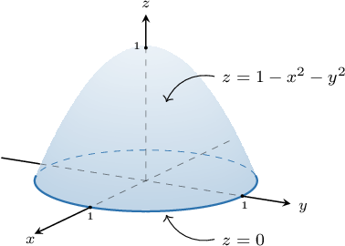
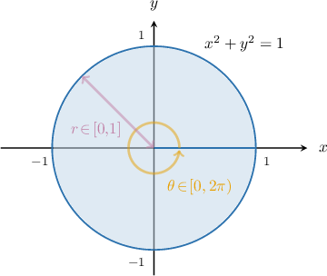
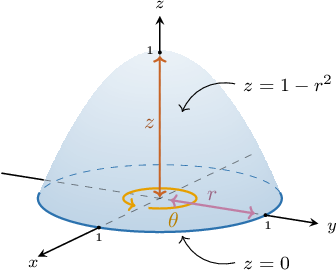
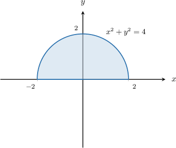
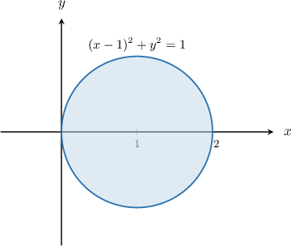
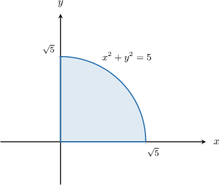
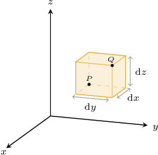
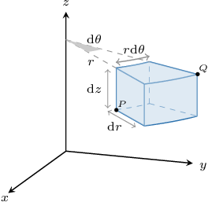

# Triple Integrals in Cylindrical Polar Coordinates

Source: https://www.mathacademy.com/topics/2059?courseId=54
Topic ID: 2059

## Prerequisites

- [Double Integrals in Plane Polar Coordinates](./2030-double-integrals-in-plane-polar-coordinates.md)
- [Surfaces in Cylindrical Polar Coordinates](./3569-surfaces-in-cylindrical-polar-coordinates.md)

## Lesson

### Introduction

We can evaluate triple integrals by changing the variables to cylindrical polar coordinates.

For example, suppose we want to evaluate the triple integral

$$

\displaystyle \iiint\limits_R x^2 + y^2 \:\textrm{d}V

$$

where $R$ is the finite region enclosed between the surfaces $z =0$ and $z = 1 - x^2 - y^2,$ as shown below.

This is a challenging integral to evaluate as it currently stands. However, we should recognize that the problem naturally lends itself to cylindrical polar coordinates.

Recall that if $(r, \theta, z)$ are the cylindrical polar coordinates of a point, then its Cartesian coordinates $(x,y,z)$ can be found by using the formulas

$$

x = r\cos\theta, \qquad y = r\sin\theta, \qquad z = z.

$$

First, let's sketch the projection of $R$ onto the $xy$-plane:

Notice that the region $R$ is

- bounded below by $z = 0,$ and

- bounded above by $z = 1 - x^2 - y^2 = 1 - r^2.$

As a result, in cylindrical polar coordinates, our region can be expressed as

$$

\Delta = \left\{ (r,\theta,z) \, : \, 0 \leq r \leq 1, \: 0 \leq \theta \lt 2\pi, \: 0 \leq z \leq 1-r^2 \right\}.

$$

To express our integral in terms of cylindrical polar coordinates, we will use the change of variables formula, given by

$$

\iiint\limits_{R} f(x,y,z) \, {\color{blue}\mathrm{d}V} = \iiint\limits_{\Delta} \, f(r \cos\theta, r\sin\theta, z) \: {\color{blue}r \: \mathrm{d}z \, \mathrm{d}r \, \mathrm{d}\theta}.

$$

When expressing our integral in cylindrical polar coordinates, we must write

$$

{\color{blue}{\textrm{d}V}} = {\color{blue}r \: \mathrm{d}z \, \mathrm{d}r \, \mathrm{d}\theta}.

$$

It's important not to forget the extra factor of ${\color{blue}{r}}.$

Therefore, using the change of variables formula, we obtain

$$

\begin{aligned}\underset{𝑅}{∭}𝑥^{2}+𝑦^{2}\,d𝑉 & =\underset{Δ}{∭}((𝑟cos⁡𝜃)^{2}+(𝑟sin⁡𝜃)^{2})⋅𝑟\,d𝑧\,d𝑟\,d𝜃 \\ & =\underset{Δ}{∭}𝑟^{2}(cos^{2}⁡𝜃+sin^{2}⁡𝜃)⋅𝑟\,d𝑧\,d𝑟\,d𝜃 \\ & =∫_{2𝜋0}^{}∫_{10}^{}∫_{1−𝑟^{2}0}^{}𝑟^{3}\,d𝑧\,d𝑟\,d𝜃.\end{aligned}

$$

Evaluating this integral using the usual methods, we get

$$

\int_{0}^{2\pi} \int_{0}^{\boxed{\color{black}1}} \int_{0}^{\boxed{\color{black}1 - r^2 }} \boxed{\color{black} r^3} \: \mathrm{d}z \: \textrm{d}r \: \textrm{d}\theta = \dfrac{\pi}{6}

$$

Therefore, we conclude that

$$

\displaystyle \iiint\limits_R x^2 + y^2 \:\textrm{d}V = \dfrac{\pi}{6}.

$$

### Example: Rewriting a Triple Integral Defined Over a Cylindrical Solid

#### Question

The region $R$ is enclosed inside the cylinder $x^2 + y^2 = 4$ for $y \geq 0$ between the surfaces $z =0$ and $z = 10 - x.$ Express the following triple integral in cylindrical polar coordinates.

$$

\displaystyle \iiint\limits_R y \:\textrm{d}V

$$

#### Explanation

We will use the change of variables formula in the form

$$

\iiint\limits_{R} f(x,y,z) \, \mathrm{d}V = \iiint\limits_{\Delta} \, f(r \cos\theta, r\sin\theta, z) \: r \: \mathrm{d}z \, \mathrm{d}r \, \mathrm{d}\theta.

$$

If $(r, \theta, z)$ are the cylindrical polar coordinates of a point, then its Cartesian coordinates $(x,y,z)$ can be found by using the formulas

$$

x = r\cos\theta, \qquad y = r\sin\theta, \qquad z = z.

$$

First, let's sketch the projection of $R$ onto the $xy$-plane:

The region $R$ is one-half of a right vertical cylinder of radius $2$ whose axis passes through the point $(0,0)$ in the $xy$-plane, and is

- bounded below by $z=0,$ and

- bounded above by $z=10-x = 10 - r\cos\theta.$

As a result, in cylindrical polar coordinates, our region can be expressed as

$$

\Delta = \left\{ (r,\theta,z) \, : \, 0 \leq r \leq 2, \: 0 \leq \theta \leq \pi, \: 0 \leq z \leq 10-r\cos\theta \right\}.

$$

Therefore, using the change of variables formula, we obtain

$$

\begin{aligned}\underset{𝑅}{∭}𝑦\,d𝑉 & =\underset{Δ}{∭}(𝑟sin⁡𝜃)⋅𝑟\,d𝑧\,d𝑟\,d𝜃 \\ & =∫_{𝜋0}^{}∫_{20}^{}∫_{10−𝑟cos⁡𝜃0}^{}𝑟^{2}sin⁡𝜃\,d𝑧\,d𝑟\,d𝜃.\end{aligned}

$$

### Example: Rewriting a Triple Integral Defined Over a Shifted Cylindrical Solid

#### Question

If the solid region $R$ is given by

$$

R = \left\{ (x,y,z) \, : \, (x-1)^2 + y^2 \leq 1, \: -2 \leq z \leq 4-y \right\},

$$

then express the triple integral

$$

\displaystyle \iiint\limits_R \sqrt{x^2 + y^2} \: \textrm{d}V

$$

as an equivalent integral in cylindrical polar coordinates.

#### Explanation

We will use the change of variables formula in the form

$$

\iiint\limits_{R} f(x,y,z) \, \mathrm{d}V = \iiint\limits_{\Delta} \, f(r \cos\theta, r\sin\theta, z) \: r \: \mathrm{d}z \, \mathrm{d}r \, \mathrm{d}\theta.

$$

If $(r, \theta, z)$ are the cylindrical polar coordinates of a point, then its Cartesian coordinates $(x,y,z)$ can be found by using the formulas

$$

x = r\cos\theta, \qquad y = r\sin\theta, \qquad z = z.

$$

First, let's sketch the projection of $R$ onto the $xy$-plane:

The region $R$ is a right vertical cylinder of radius $1$ whose axis passes through the point $(1,0)$ in the $xy$-plane, and is

- bounded below by $z = -2,$ and

- bounded above by $z = 4 - y = 4 - r\sin{\theta}.$

With that in mind, let's write the equation $(x-1)^2 + y^2 = 1$ in polar coordinates:

$$

\begin{aligned}(𝑥−1)^{2}+𝑦^{2} & =1 \\ (𝑟cos⁡𝜃−1)^{2}+(𝑟sin⁡𝜃)^{2} & =1 \\ 𝑟^{2}cos^{2}⁡𝜃−2𝑟cos⁡𝜃+1+𝑟^{2}sin^{2}⁡𝜃 & =1 \\ 𝑟^{2}(cos^{2}⁡𝜃+sin^{2}⁡𝜃)−2𝑟cos⁡𝜃 & =0 \\ 𝑟^{2}−2𝑟cos⁡𝜃 & =0 \\ 𝑟(𝑟−2cos⁡𝜃) & =0\end{aligned}

$$

Since $r$ cannot be identical to zero on the entire circle, we must have $r = 2\cos{\theta}.$

As a result, in cylindrical polar coordinates, our region can be expressed as

$$

\Delta = \left\{ (r,\theta,z) \, : \, 0 \leq r \leq 2\cos{\theta}, \: -\dfrac{\pi}{2} \leq \theta \leq \dfrac{\pi}{2}, \: -2 \leq z \leq 4-r\sin{\theta} \right\}.

$$

Therefore, using the change of variables formula, we obtain

$$

\begin{aligned}\underset{𝑅}{∭}\sqrt{√𝑥^{2}+𝑦^{2}}\,d𝑉 & =\underset{Δ}{∭}\sqrt{√(𝑟cos⁡𝜃)^{2}+(𝑟sin⁡𝜃)^{2}}\,𝑟\,d𝑧\,d𝑟\,d𝜃 \\ & =\underset{Δ}{∭}\sqrt{√𝑟^{2}(cos^{2}⁡𝜃+sin^{2}⁡𝜃)}\,𝑟\,d𝑧\,d𝑟\,d𝜃 \\ & =∫_{𝜋/2−𝜋/2}^{}∫_{2cos⁡𝜃0}^{}∫_{4−𝑟sin⁡𝜃−2}^{}𝑟^{2}\,d𝑧\,d𝑟\,d𝜃.\end{aligned}

$$

### Example: Evaluating a Triple Integral by Converting to Cylindrical Coordinates

#### Question

Evaluate the triple integral

$$

\displaystyle \iiint\limits_R x+2y \:\textrm{d}V

$$

over the region $R$ enclosed inside the cylinder $x^2+y^2=5$ for $x\geq 0,$ $y\geq 0$ and between the surfaces $z=y$ and $z=y+3.$

#### Explanation

We will use the change of variables formula in the form

$$

\iiint\limits_{R} f(x,y,z) \, \mathrm{d}V = \iiint\limits_{\Delta} \, f(r \cos\theta, r\sin\theta, z) \: r \: \mathrm{d}z \, \mathrm{d}r \, \mathrm{d}\theta.

$$

If $(r, \theta, z)$ are the cylindrical polar coordinates of a point, then its Cartesian coordinates $(x,y,z)$ can be found by using the formulas

$$

x = r\cos\theta, \qquad y = r\sin\theta, \qquad z = z.

$$

First, let's sketch the projection of $R$ onto the $xy$-plane:

The region $R$ is a right vertical cylinder of radius $\sqrt{5}$ whose axis passes through the point $(0,0)$ in the $xy$-plane, and is

- bounded below by $z=y=r\sin\theta,$ and

- bounded above by $z=y+3=r\sin\theta + 3.$

As a result, in cylindrical polar coordinates, our region can be expressed as

$$

\Delta = \left\{ (r,\theta,z) \, : \, 0 \leq r \leq \sqrt{5}, \: 0 \leq \theta \lt \dfrac{\pi}{2}, \: r\sin\theta \leq z \leq r\sin\theta + 3\right\}.

$$

Therefore, using the change of variables formula, we obtain

$$

\begin{aligned}\underset{𝑅}{∭}𝑥+2𝑦\,d𝑉 & =\underset{Δ}{∭}(𝑟cos⁡𝜃+2𝑟sin⁡𝜃)\,𝑟\,d𝑧\,d𝑟\,d𝜃 \\ & =∫_{𝜋/20}^{}∫_{\sqrt{√5}0}^{}∫_{𝑟sin⁡𝜃+3𝑟sin⁡𝜃}^{}𝑟^{2}(cos⁡𝜃+2sin⁡𝜃)\,d𝑧\,d𝑟\,d𝜃 \\ & =∫_{𝜋/20}^{}∫_{\sqrt{√5}0}^{}𝑟^{2}(cos⁡𝜃+2sin⁡𝜃)[𝑧]_{𝑧=𝑟sin⁡𝜃+3𝑧=𝑟sin⁡𝜃}^{}\,d𝑟\,d𝜃 \\ & =∫_{𝜋/20}^{}∫_{\sqrt{√5}0}^{}𝑟^{2}(cos⁡𝜃+2sin⁡𝜃)(𝑟sin⁡𝜃+3−𝑟sin⁡𝜃)\,d𝑟\,d𝜃 \\ & =∫_{𝜋/20}^{}∫_{\sqrt{√5}0}^{}3𝑟^{2}(cos⁡𝜃+2sin⁡𝜃)\,d𝑟\,d𝜃 \\ & =∫_{𝜋/20}^{}[𝑟^{3}(cos⁡𝜃+2sin⁡𝜃)]_{𝑟=\sqrt{√5}𝑟=0}^{}\,d𝜃 \\ & =∫_{𝜋/20}^{}(\sqrt{√5})^{3}(cos⁡𝜃+2sin⁡𝜃)\,d𝜃 \\ & =∫_{𝜋/20}^{}5\sqrt{√5}(cos⁡𝜃+2sin⁡𝜃)\,d𝜃 \\ & =5\sqrt{√5}[sin⁡𝜃−2cos⁡𝜃]_{𝜃=𝜋/2𝜃=0}^{} \\ & =5\sqrt{√5}(1−0)−10\sqrt{√5}(0−1) \\ & =15\sqrt{√5}.\end{aligned}

$$

### Deriving the Volume Element in Cartesian Coordinates

Let's now build some intuition behind the meaning of the volume element $\textrm d V.$ This will help us to understand the change of variables formula in cylindrical polar coordinates. We start by considering the usual rectangular coordinate system.

Suppose we have a point $P$ and a neighboring point $Q$ in the Cartesian $xyz$-space, as shown below.

Imagine moving from $P$ to $Q$ as follows:

- First, we move a distance $\textrm d x$ parallel to the $x$-axis so that the new point $P'$ has the same $x$-coordinate as $Q.$

- Then, we move a distance $\textrm d y$ parallel to the $y$-axis so that the new point $P''$ has the same $y$-coordinate as $Q.$

- Finally, we move a distance $\textrm d z$ parallel to the $z$-axis to land to $Q.$

These movements span the rectangular solid shown above. The volume of this solid, denoted $\textrm d V,$ is given by

$$

\mathrm{d}V = \mathrm{d}x \, \mathrm{d}y \, \mathrm{d}z.

$$

Thus, the element $\textrm d V$ represents the volume generated by moving from the point $P$ to the point $Q$ in this coordinate system.

### Deriving the Volume Element in Cylindrical Polar Coordinates

Let's now repeat this process for a cylindrical polar system. Consider the points $P$ and $Q$ shown below.

Imagine moving from $P$ to $Q$ as follows:

- First, we move a distance $\textrm d r$ so that the new point $P'$ has the same $r$-coordinate as $Q.$

- Then, we sweep through an angle $\textrm d \theta$ so that the new point $P''$ has the same $\theta$-coordinate as $Q.$ The arc length traced out by this movement approximately equals $r\,\textrm d \theta.$

- Finally, we move a distance $\textrm d z$ vertically to land on $Q.$

These three movements trace out a solid that's approximately rectangular, and so the approximate volume of this solid is given by

$$

\mathrm{d}V = \mathrm{d}r \cdot r\,\mathrm{d}\theta \cdot \mathrm{d}z= r\,\mathrm{d}z\,\mathrm{d}r \, \mathrm{d}\theta.

$$
