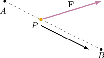
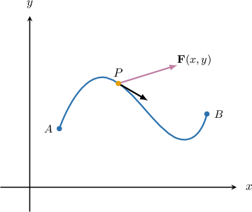
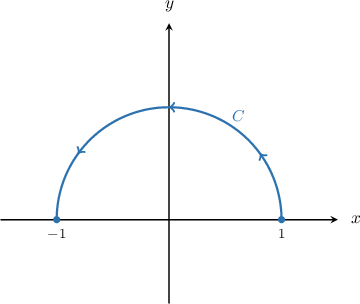
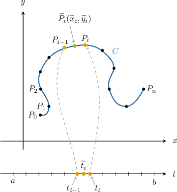

# Line Integrals of Vector-Valued Functions Over Parametric Curves

Source: https://www.mathacademy.com/topics/2108?courseId=54
Topic ID: 2108

## Prerequisites

- [Calculating the Dot Product Using Components](../integrated-math-iii-honors/177-calculating-the-dot-product-using-components.md)
- [Line Integrals of Scalar Functions](./2107-line-integrals-of-scalar-functions.md)

## Lesson

### Introduction

Consider a particle $P$ in the $xy$-plane. Imagine that the motion of $P$ is restricted to the line segment $\overline{AB}.$

Let $\mathbf F$ be a *constant* force that acts on $P,$ moving it from the point $A$ to the point $B.$ A sketch of the situation is shown below.

The **work done** by $\mathbf F$ in moving $P$ from $A$ to $B$ along this segment is given by

$$

W = \mathbf F \cdot \mathbf r

$$

where $\mathbf r = \mathbf b - \mathbf a,$ and $\mathbf a$ and $\mathbf b$ are the position vectors of $A$ and $B,$ respectively.

The work done by $\mathbf F$ is equal to the projection of $\mathbf F$ in the direction of $\mathbf r,$ multiplied by the length of $\mathbf r.$ It is an essential quantity in physics. However, the formula above is somewhat restrictive:

- Firstly, $\mathbf F$ must be a constant force. Many forces, such as electric and magnetic forces, vary from point to point.

- Secondly, the path from $A$ to $B$ must be a line segment. Ideally, we'd like a definition that allows the path from $A$ to $B$ to be a curve.

We'll now consider a situation where these restrictions are relaxed.

### The Work Done by a Variable Force

Suppose that $C$ is a curve in the $xy$-plane. Imagine that the motion of a particle $P$ is restricted to $C,$ and that $\mathbf F(x,y)$ is a variable force that acts on $P.$ A sketch of the situation is shown below.

The work done by $\mathbf F(x,y)$ in moving a particle $P$ from the initial point $A$ to the terminal point $B$ on $C$ is denoted

$$

W = \int\limits_C \mathbf F \cdot \textrm d\mathbf r.

$$

The quantity on the right-hand side is called the **line integral of $\mathbf F$ along $\boldsymbol C$.**

Now suppose that $C$ can be parameterized by the function $\mathbf r(t),$ where $t\in [a,b].$ It can be shown that

$$

\int\limits_C \mathbf F \cdot \textrm d\mathbf r = \int_a^b \mathbf F(\mathbf r(t)) \cdot \mathbf r'(t)\,\textrm dt.

$$

We'll derive this formula at the end of the lesson. It should be noted that this formula also works when $\mathbf F$ is a function of three variables.

Let's take a look at a concrete example.

### A Concrete Example

Suppose that $\mathbf F(x, y) = y\, \mathbf i + x \, \mathbf j$ and that $C$ is the path along the semi-circle $\mathbf r(t) = \cos t \,\mathbf i + \sin t \,\mathbf j$ for $t\in [0,\pi].$

We wish to calculate the line integral

$$

\int\limits_C \mathbf F \cdot \mathrm d \mathbf r.

$$

To do this, we use the formula

$$

\int\limits_C \mathbf F \cdot \textrm d\mathbf r = \int_a^b \mathbf F(\mathbf r(t)) \cdot \mathbf r'(t)\,\textrm dt.

$$

Since $\mathbf{r}(t)=\cos{t}\,\mathbf{i} + \sin{t}\,\mathbf{j},$ along the curve $C$ we have that

$$

x = \cos{t}, \qquad y = \sin{t}.

$$

Therefore,

$$

\begin{aligned}𝐅(𝐫(𝑡))=𝑦\,𝐢+𝑥\,𝐣=sin⁡𝑡\,𝐢+cos⁡𝑡\,𝐣.\end{aligned}

$$

Computing $\mathbf{r}'(t),$ we get

$$

\begin{aligned}𝐫^{′}(𝑡) & =\frac{d𝑥}{d𝑡}\,𝐢+\frac{d𝑦}{d𝑡}\,𝐣 \\ & =\frac{d}{d𝑡}(cos⁡𝑡)𝐢+\frac{d}{d𝑡}(sin⁡𝑡)𝐣 \\ & =−sin⁡𝑡\,𝐢+cos⁡𝑡\,𝐣.\end{aligned}

$$

Then, we compute $\mathbf{F}(\mathbf{r}(t)) \cdot \mathbf r'(t)$ by taking the dot product:

$$

\begin{aligned}𝐅(𝐫(𝑡))⋅𝐫^{′}(𝑡) & =(sin⁡𝑡\,𝐢+cos⁡𝑡\,𝐣)⋅(−sin⁡𝑡\,𝐢+cos⁡𝑡\,𝐣) \\ & =−sin^{2}⁡𝑡+cos^{2}⁡𝑡 \\ & =cos^{2}⁡𝑡−sin^{2}⁡𝑡 \\ & =cos⁡2𝑡\end{aligned}

$$

Finally, we can evaluate our line integral as follows:

$$

\begin{aligned}\underset{𝐶}{∫}𝐅⋅d𝐫 & =∫_{𝜋0}^{}𝐅(𝐫(𝑡))⋅𝐫^{′}(𝑡)\,d𝑡 \\ & =∫_{𝜋0}^{}cos⁡2𝑡\,d𝑡 \\ & =\frac{1}{2}sin⁡2𝑡_{𝜋0}^{} \\ & =\frac{1}{2}(sin⁡2𝜋−sin⁡(0)) \\ & =0\end{aligned}

$$

### Example: Constructing Line Integrals of a Vector-Valued Functions Over Plane Curves

#### Question

Find a definite integral that's equivalent to $\displaystyle\int\limits_C\mathbf F\cdot \textrm d \mathbf r$ given that $\mathbf F(x, y) = xy \,\mathbf i - x^2\,\mathbf j$ and $C$ is the path $\mathbf r(t) = t^3\,\mathbf{i} + t^2\,\mathbf{j}$ for $t \in [0, 1].$

#### Explanation

We will use the formula

$$

\int\limits_C\mathbf F\cdot \textrm d \mathbf r = \int_a^b\mathbf F(\mathbf r (t))\cdot \mathbf r'(t)\,\textrm d t.

$$

Along the curve $C,$ we have

$$

x = t^3, \qquad y = t^2.

$$

Therefore,

$$

\begin{aligned}𝐅(𝐫(𝑡)) & =𝑥𝑦\,𝐢−𝑥^{2}\,𝐣 \\ & =(𝑡^{3})(𝑡^{2})\,𝐢−(𝑡^{3})^{2}\,𝐣 \\ & =𝑡^{5}\,𝐢−𝑡^{6}\,𝐣.\end{aligned}

$$

Computing $\mathbf{r}'(t),$ we get

$$

\begin{aligned}𝐫^{′}(𝑡) & =\frac{d𝑥}{d𝑡}\,𝐢+\frac{d𝑦}{d𝑡}\,𝐣 \\ & =\frac{d}{d𝑡}(𝑡^{3})𝐢+\frac{d}{d𝑡}(𝑡^{2})𝐣 \\ & =3𝑡^{2}\,𝐢+2𝑡\,𝐣.\end{aligned}

$$

Therefore,

$$

\begin{aligned}𝐅(𝐫(𝑡))⋅𝐫^{′}(𝑡) & =(𝑡^{5}\,𝐢−𝑡^{6}\,𝐣)⋅(3𝑡^{2}\,𝐢+2𝑡\,𝐣) \\ & =3𝑡^{7}−2𝑡^{7} \\ & =𝑡^{7}.\end{aligned}

$$

Finally, we can write the integral as follows:

$$

\begin{aligned}\underset{𝐶}{∫}𝐅(𝐫)⋅d𝐫 & =∫_{10}^{}𝐅(𝐫(𝑡))⋅𝐫^{′}(𝑡)\,d𝑡 \\ & =∫_{10}^{}𝑡^{7}\,d𝑡\end{aligned}

$$

### Example: Evaluating Line Integrals of a Vector-Valued Functions Over Plane Curves

#### Question

Evaluate $\displaystyle\int\limits_C\mathbf F\cdot \textrm d \mathbf r$ given that $\mathbf F(x, y) = y \,\mathbf i + (x+y)\,\mathbf j$ and $C$ is the path $\mathbf r(t) = (1+2t)\,\mathbf{i} + (1-t)\,\mathbf{j}$ for $t \in [0, 1].$

#### Explanation

We will use the formula

$$

\int\limits_C\mathbf F\cdot \textrm d \mathbf r = \int_a^b\mathbf F(\mathbf r (t))\cdot \mathbf r'(t)\,\textrm d t.

$$

Along the curve $C,$ we have

$$

x = 1 + 2t, \qquad y = 1 - t .

$$

Therefore,

$$

\begin{aligned}𝐅(𝐫(𝑡)) & =𝑦\,𝐢+(𝑥+𝑦)\,𝐣 \\ & =(1−𝑡)\,𝐢+((1+2𝑡)+(1−𝑡))\,𝐣 \\ & =(1−𝑡)\,𝐢+(𝑡+2)\,𝐣.\end{aligned}

$$

Computing $\mathbf{r}'(t),$ we get

$$

\begin{aligned}𝐫^{′}(𝑡) & =\frac{d𝑥}{d𝑡}\,𝐢+\frac{d𝑦}{d𝑡}\,𝐣 \\ & =\frac{d}{d𝑡}(1+2𝑡)𝐢+\frac{d}{d𝑡}(1−𝑡)𝐣 \\ & =2\,𝐢−𝐣.\end{aligned}

$$

Therefore,

$$

\begin{aligned}𝐅(𝐫(𝑡))⋅𝐫^{′}(𝑡) & =((1−𝑡)\,𝐢+(𝑡+2)\,𝐣)⋅(2\,𝐢−𝐣) \\ & =(1−𝑡)⋅2+(𝑡+2)⋅(−1) \\ & =2−2𝑡−𝑡−2 \\ & =−3𝑡.\end{aligned}

$$

Finally, we can evaluate the integral, as follows:

$$

\begin{aligned}\underset{𝐶}{∫}𝐅(𝐫)⋅d𝐫 & =∫_{10}^{}𝐟(𝐫(𝑡))⋅𝐫^{′}(𝑡)\,d𝑡 \\ & =∫_{10}^{}(−3𝑡)\,d𝑡 \\ & =−\frac{3}{2}𝑡^{2}\,_{10}^{} \\ & =−\frac{3}{2}−0 \\ & =−\frac{3}{2}\end{aligned}

$$

### Example: Evaluating Line Integrals of Vector-Valued Functions Over Space Curves

#### Question

Evaluate $\displaystyle\int\limits_C\mathbf F\cdot \textrm d \mathbf r$ given that $\mathbf F(x, y, z) = x \,\mathbf i + y\,\mathbf j + z\,\mathbf k$ and $C$ is the path $\mathbf r(t) = {t}\,\mathbf{i} + t^2\,\mathbf{j} + t^3\,\mathbf{k}$ for $t \in [0, 1].$

#### Explanation

We will use the formula

$$

\int_C\mathbf F\cdot \textrm d \mathbf r = \int_a^b\mathbf F(\mathbf r (t))\cdot \mathbf r'(t)\,\textrm d t.

$$

Along the curve $C,$ we have

$$

x = t, \qquad y = t^2, \qquad z = t^3.

$$

Therefore,

$$

\begin{aligned}𝐅(𝐫(𝑡))=𝑥\,𝐢+𝑦\,𝐣+𝑧\,𝐤=𝑡\,𝐢+𝑡^{2}\,𝐣+𝑡^{3}\,𝐤.\end{aligned}

$$

Computing $\mathbf{r}'(t),$ we get

$$

\begin{aligned}𝐫^{′}(𝑡) & =\frac{d𝑥}{d𝑡}\,𝐢+\frac{d𝑦}{d𝑡}\,𝐣+\frac{d𝑧}{d𝑡}\,𝐤 \\ & =\frac{d}{d𝑡}(𝑡)𝐢+\frac{d}{d𝑡}(𝑡^{2})𝐣+\frac{d}{d𝑡}(𝑡^{3})𝐤 \\ & =𝐢+2𝑡\,𝐣+3𝑡^{2}\,𝐤.\end{aligned}

$$

Therefore,

$$

\begin{aligned}𝐅(𝐫(𝑡))⋅𝐫^{′}(𝑡) & =(𝑡\,𝐢+𝑡^{2}\,𝐣+𝑡^{3}\,𝐤)⋅(𝐢+2𝑡\,𝐣+3𝑡^{2}\,𝐤) \\ & =𝑡+2𝑡^{3}+3𝑡^{5}.\end{aligned}

$$

Finally, we evaluate the integral as follows:

$$

\begin{aligned}\underset{𝐶}{∫}𝐅(𝐫)⋅d𝐫 & =∫_{10}^{}𝐅(𝐫(𝑡))⋅𝐫^{′}(𝑡)\,d𝑡 \\ & =∫_{10}^{}(𝑡+2𝑡^{3}+3𝑡^{5})\,d𝑡 \\ & =[\frac{1}{2}𝑡^{2}+\frac{1}{2}𝑡^{4}+\frac{1}{2}𝑡^{6}]_{10}^{} \\ & =\frac{1}{2}+\frac{1}{2}+\frac{1}{2} \\ & =\frac{3}{2}\end{aligned}

$$

### Derivation of the Main Result

Here, we derive the following result in the two-dimensional case.

$$

\int\limits_C \mathbf F \cdot \textrm d\mathbf r = \int_a^b \mathbf F(\mathbf r(t)) \cdot \mathbf r'(t)\,\textrm dt

$$

Let $\mathbf F(x,y)$ be a continuous vector field on $\mathbb{R}^2.$ We wish to compute the work done by $\mathbf F$ in moving a particle along a smooth curve $C.$

Suppose that $C$ can be parameterized by the function $\mathbf r(t),$ where $t \in [a,b].$ We divide the interval $[a,b]$ into subintervals $[t_{i-1},t_i]$ of equal length. This divides $C$ into subarcs, and each subinterval $[t_{i-1},t_i]$ traces out a subarc from the point $P_{i-1}$ to the point $P_i$ along the curve. Let the length of the subarc traced out over $[t_{i-1}, t_i]$ be equal to $\Delta s_i.$

We now pick a point $\widetilde t_i \in [t_{i-1}, t_i],$ and let $\widetilde{P}(\widetilde{x}, \widetilde{y})$ be the point on $C$ corresponding to $\widetilde{t}_i,$

Suppose that $\Delta s_i$ is small. As the particle moves from $P_{i-1}$ to $P_i$ along the curve, its direction of travel is approximately $\mathbf T(\widetilde x_i, \widetilde y_i),$ the unit tangent vector at $\widetilde P_i.$ Thus, the work done by $\mathbf F$ in moving the particle from $P_{i-1}$ to $P_i$ is approximately equal to

$$

\mathbf F (\widetilde x_i, \widetilde y_i) \cdot [\Delta s_i \,\mathbf T(\widetilde x_i, \widetilde y_i)] = [\mathbf F(\widetilde x_i, \widetilde y_i) \cdot \mathbf T(\widetilde x_i, \widetilde y_i)]\Delta s_i.

$$

Therefore, the total work done by $\mathbf F$ in moving the particle from the initial point to the terminal point along $C$ is approximately equal to

$$

\sum\limits_{i=1}^{n} [\mathbf F(\widetilde x_i, \widetilde y_i) \cdot \mathbf T(\widetilde x_i, \widetilde y_i)] \Delta s_i.

$$

These approximations become better as the number of subintervals $n$ increases. Therefore, we define the work done by $\mathbf F$ as the limit of the Riemann sum above, that is

$$

W = \int\limits_C \mathbf F \cdot \mathbf T \,\textrm ds.

$$

This equation says that work done by $\mathbf F$ is the line integral with respect to arc length along $C$ of the tangential component of the force.

We now recall the following:

- The unit tangent vector can be expressed in terms of $\mathbf r(t)$ as

- The arc-length element $\textrm d s$ can be expressed as

Substituting the above into our expression for $W,$ we arrive at

$$

\begin{aligned}𝑊 & =\underset{𝐶}{∫}𝐅⋅𝐓\,d𝑠 \\ & =∫_{𝑏𝑎}^{}(𝐅(𝐫(𝑡))⋅\frac{𝐫^{′}(𝑡)}{||𝐫^{′}(𝑡)||})||𝐫^{′}(𝑡)||\,d𝑡 \\ & =∫_{𝑏𝑎}^{}𝐅(𝐫(𝑡))⋅𝐫^{′}(𝑡)\,d𝑡.\end{aligned}

$$

Therefore, we conclude that

$$

\int\limits_C \mathbf F \cdot \textrm d\mathbf r = \int_a^b \mathbf F(\mathbf r(t)) \cdot \mathbf r'(t)\,\textrm dt.

$$
