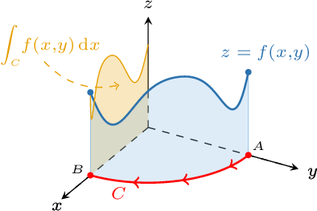
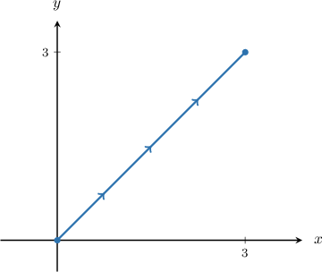
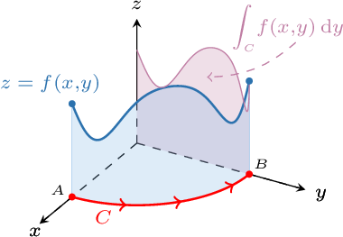
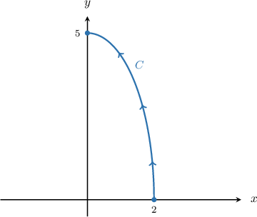
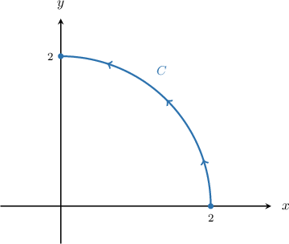

# Line Integrals With Respect to X and Y

Source: https://www.mathacademy.com/topics/2109?courseId=54
Topic ID: 2109

## Prerequisites

- [Line Integrals of Scalar Functions Over Ellipses](./3690-line-integrals-of-scalar-functions-over-ellipses.md)
- [Line Integrals of Scalar Functions Over Line Segments](./3699-line-integrals-of-scalar-functions-over-line-segments.md)

## Lesson

### Introduction

Until now, we've been dealing with line integrals with respect to arc length. In this lesson, we will learn about other types of line integral.

Suppose that $C$ is a path in the $xy$-plane with initial point $A$ and terminal point $B.$ The line integral of the function $f(x,y)$ **with respect to $\boldsymbol x$** along the path $C$ is denoted

$$

\int_C f(x,y)\,\textrm d x.

$$

To understand what this integral represents, we imagine traversing $C$ from $A$ to $B.$ At each point $P$ that lies on $C,$ we project the point on $f$ that lies directly above $P$ onto the plane $y=0.$ Doing this for every point on $C$ traces out a curve. The line integral of $f$ with respect to $x$ gives the (signed) area bounded by this curve and the $x$-axis.

To calculate a line integral with respect to $x,$ we must first parameterize $C$ using a parameter $t\in [a,b].$ Then, we apply the change of variables formula

$$

\int\limits_C f(x, y) \, \textrm{d}x = \int\limits_a^b f(\mathbf r(t)) \, \dfrac{\text{d}x}{\text{d}t} \, \textrm{d}t.

$$

Let's take a look at a concrete example.

### Example: Constructing Line Integrals With Respect to X

#### Question

Find a definite integral that's equivalent to the line integral $\displaystyle \int_C (x+y) \, \textrm{d} x,$ where $C$ is the path along the line segment from the point $(0,0)$ to the point $(3,3),$ as shown above.

#### Explanation

We will use the formula

$$

\int\limits_C f(x, y) \, \textrm{d}x = \int\limits_a^b f(\mathbf r(t)) \, \dfrac{\text{d}x}{\text{d}t} \, \textrm{d}t.

$$

The curve $C$ is a line segment with endpoints $(0,0)$ and $(3,3).$ It can be parametrized as

$$

\begin{aligned}𝐫(𝑡) & =⟨0+𝑡(3−0),\,0+𝑡(3−0)⟩ \\ & =⟨3𝑡,\,3𝑡⟩,\end{aligned}

$$

where $0 \le t \le 1.$

Computing $\dfrac{\textrm{d}x}{\textrm{d}t},$ we get the following:

$$

\begin{aligned}\frac{d𝑥}{d𝑡} & =\frac{d}{d𝑡}(3𝑡)=3\end{aligned}

$$

Now, since $f(x,y) = x+y,$ we obtain

$$

\begin{aligned}𝑓(𝐫(𝑡)) & =3𝑡+3𝑡 \\ & =6𝑡.\end{aligned}

$$

Therefore, we can write the integral as

$$

\begin{aligned}\underset{𝐶}{∫}𝑓(𝑥,𝑦)\,d𝑥 & =∫_{10}^{}𝑓(𝐫(𝑡))\,\frac{d𝑥}{d𝑡}\,d𝑡 \\ & =∫_{10}^{}6𝑡⋅3\,d𝑡 \\ & =18∫_{10}^{}𝑡\,d𝑡.\end{aligned}

$$

### Line Integrals With Respect to Y

The **line integral with respect to** $\boldsymbol y$ of the function $f(x,y)$ along the path $C$ is denoted

$$

\int_C f(x,y)\,\textrm d y.

$$

This integral represents the total area accumulated when $f$ is projected on the plane $x=0$ as $C$ is traversed from the initial point $A$ to the terminal point $B.$

To calculate a line integral with respect to $y,$ we must first parameterize $C$ using a parameter $t\in [a,b].$ Then, we apply the change of variables formula

$$

\int\limits_C f(x, y) \, \textrm{d}y = \int\limits_a^b f(\mathbf r(t)) \, \dfrac{\text{d}y}{\text{d}t} \, \textrm{d}t.

$$

### Example: Constructing Line Integrals With Respect to Y

#### Question

Find the definite integral equivalent to the line integral $\displaystyle\int_C x^2 \, \textrm d y,$ where $C$ is the path along the ellipse $25x^2 + 4y^2 = 100,$ traversed from the point $(2,0)$ to the point $(0,5),$ as shown above.

#### Explanation

We will use the formula

$$

\int\limits_C f(x, y) \, \textrm{d}y = \int\limits_a^b f(\mathbf r(t)) \, \dfrac{\text{d}y}{\text{d}t} \, \textrm{d}t.

$$

The curve $C$ can be parameterized as

$$

\mathbf{r}(t) = \big\langle 2\cos{t}, \: 5\sin{t} \big\rangle, \qquad 0 \le t \le \dfrac{\pi}{2}.

$$

Computing $\dfrac{\textrm{d}y}{\textrm{d}t},$ we get the following:

$$

\begin{aligned}\frac{d𝑦}{d𝑡} & =\frac{d}{d𝑡}(5sin⁡𝑡)=5cos⁡𝑡\end{aligned}

$$

Now, since $f(x,y) = x^2,$ we obtain

$$

\begin{aligned}𝑓(𝐫(𝑡)) & =(2cos⁡𝑡)^{2}=4cos^{2}⁡𝑡.\end{aligned}

$$

Therefore, we can write the integral as

$$

\begin{aligned}\underset{𝐶}{∫}𝑓(𝑥,𝑦)\,d𝑦 & =∫_{𝜋/20}^{}𝑓(𝐫(𝑡))\,\frac{d𝑦}{d𝑡}\,d𝑡 \\ & =∫_{𝜋/20}^{}(4cos^{2}⁡𝑡)⋅5cos⁡𝑡\,d𝑡 \\ & =20∫_{𝜋/20}^{}cos^{3}⁡𝑡\,d𝑡.\end{aligned}

$$

### Example: Evaluating Line Integrals With Respect to X and Y

#### Question

Evaluate $\displaystyle \int_C \left(x^2 + y^2\right)\,\textrm d y,$ where $C$ is the path along the upper-right quarter of the circle $x^2 + y^2 = 4,$ traversed from the point $(2,0)$ to the point $(0,2),$ as shown below.

#### Explanation

We will use the formula

$$

\int\limits_C f(x, y) \, \textrm{d}y = \int\limits_a^b f(\mathbf r(t)) \, \dfrac{\text{d}y}{\text{d}t} \, \textrm{d}t.

$$

The curve $C$ is a quarter of a circle of radius $2$ centered at $O.$ It can be parameterized as

$$

\mathbf{r}(t) = \big\langle 2\cos{t}, \: 2\sin{t} \big\rangle, \qquad 0 \le t \le \dfrac{\pi}{2}.

$$

Computing $\dfrac{\textrm{d}y}{\textrm{d}t},$ we get the following:

$$

\begin{aligned}\frac{d𝑦}{d𝑡} & =\frac{d}{d𝑡}(2sin⁡𝑡)=2cos⁡𝑡\end{aligned}

$$

Now, since $f(x,y) = x^2 + y^2$, we obtain

$$

\begin{aligned}𝑓(𝐫(𝑡)) & =(2cos⁡𝑡)^{2}+(2sin⁡𝑡)^{2} \\ & =4(cos^{2}⁡𝑡+sin^{2}⁡𝑡) \\ & =4.\end{aligned}

$$

We can now evaluate the integral:

$$

\begin{aligned}\underset{𝐶}{∫}𝑓(𝑥,𝑦)\,d𝑦 & =∫_{𝜋/20}^{}𝑓(𝐫(𝑡))\,\frac{d𝑦}{d𝑡}\,d𝑡 \\ & =∫_{𝜋/20}^{}4⋅(2cos⁡𝑡)⋅d𝑡 \\ & =8∫_{𝜋/20}^{}cos⁡𝑡\,d𝑡 \\ & =8sin⁡𝑡\,_{𝜋/20}^{} \\ & =8sin⁡(\frac{𝜋}{2})−8sin⁡0 \\ & =8.\end{aligned}

$$
