# Extending Green's Theorem

Source: https://www.mathacademy.com/topics/2117?courseId=54
Topic ID: 2117

## Prerequisites

- [Using Green's Theorem to Calculate Area](./2198-using-green-s-theorem-to-calculate-area.md)
- [Green's Theorem in Polar Coordinates](./3627-green-s-theorem-in-polar-coordinates.md)

## Lesson

### Introduction

Suppose we wish to calculate the circulation $\Gamma$ of a vector field $\mathbf F$ over the boundary of the region $D$ shown below.

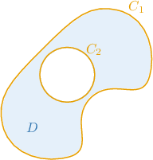

Notice that $D$ is the region between the closed curves $C_1$ and $C_2,$ and has a hole.

When dealing with more complex regions, we usually write $\partial D$ to refer to the boundary of $D.$ So, in this case, we have

$$

\partial D = C_1 \cup C_2.

$$

The circulation of $\mathbf F$ over the boundary of $D$ is simply the sum of the circulations over the two bounding curves:

$$

\Gamma = \oint\limits_{\partial D} \mathbf F\cdot\textrm d\mathbf r = \oint\limits_{C_1} \mathbf F\cdot\textrm d\mathbf r + \oint\limits_{C_2} \mathbf F\cdot\textrm d\mathbf r

$$

Notice that we have not yet determined the orientations of $C_1$ and $C_2.$ For this, we note the following important points:

- the positive direction is *counterclockwise* for the *outer* curve $C_1$ because the region $D$ is always on the left as we traverse $C_1$ counterclockwise, and

- the positive direction is *clockwise* for the *inner* curve $C_2$ because the region $D$ is always on the left as we traverse $C_2$ clockwise.

Therefore, to apply the above formula for the circulation, we need to choose our orientations as follows:

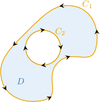

### Calculating a Circulation Over a Region Containing Holes

To calculate the circulation of a vector field over the boundary of a region containing holes, we add together the circulations over each *positively oriented* boundary.

For example, consider the region $D$ below.

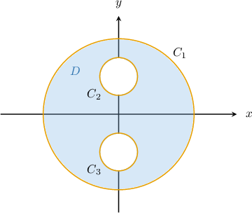

Suppose that $\mathbf F$ is a vector field on $\mathbb R^2$ defined over $D,$ and

$$

\oint\limits_{C_1}\mathbf F\cdot\textrm d \mathbf r = 12, \qquad \oint\limits_{C_2}\mathbf F\cdot\textrm d \mathbf r = -8, \qquad \oint\limits_{C_3}\mathbf F\cdot\textrm d \mathbf r = -2,

$$

where $C_1$ is oriented counterclockwise, and $C_2,$ and $C_3$ are oriented clockwise. Let's use this information to calculate the value of the circulation $\Gamma,$ given by

$$

\Gamma = \displaystyle\oint\limits_{\partial D}\mathbf F\cdot\textrm d \mathbf r.

$$

The diagram below shows the positive orientations of all three curves.

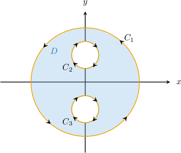

Since the value of each line integral is given for a positively oriented curve, we can calculate the total circulation over $D$ by summing the circulations over each boundary curve. Therefore,

$$

\begin{aligned}Γ & =\underset{𝜕𝐷}{∮}𝐅⋅d𝐫 \\ & =\underset{𝐶_{1}}{∮}𝐅⋅d𝐫+\underset{𝐶_{2}}{∮}𝐅⋅d𝐫+\underset{𝐶_{3}}{∮}𝐅⋅d𝐫 \\ & =12+(−8)+(−2) \\ & =2.\end{aligned}

$$

### Example: Calculating the Circulation of a Vector Field Over a Region Containing Holes

#### Question

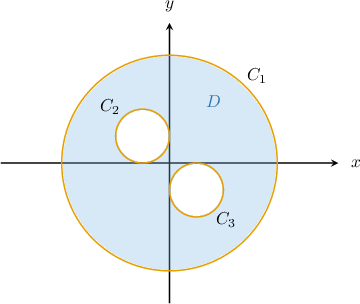

Suppose that $\mathbf F$ is a vector field on $\mathbb R^2$ defined over the region $D$ above. Given that

$$

\oint\limits_{C_1}\mathbf F\cdot\textrm d \mathbf r = 10, \qquad \oint\limits_{C_2}\mathbf F\cdot\textrm d \mathbf r = -8, \qquad \oint\limits_{C_3}\mathbf F\cdot\textrm d \mathbf r = 3,

$$

where $C_1$ and $C_3$ are oriented clockwise, and $C_2$ is oriented counterclockwise, calculate the value of $\displaystyle\oint\limits_{\partial D}\mathbf F\cdot\textrm d \mathbf r.$

#### Explanation

To calculate the total circulation of a vector field over the boundary of a region containing holes, we add together the circulations over each ** boundary.

Remember that:

- the positive direction is ** for the ** curve $C_1$ (because the region $D$ is always on the left as we traverse $C_1$ counterclockwise), and

- the positive direction is ** for the ** curves $C_2$ and $C_3$ (because the region $D$ is always on the left as we traverse $C_2$ and $C_3$ clockwise).

The diagram below shows the positive orientations of all three curves.

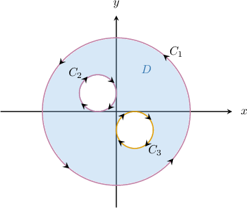

Notice that the positive orientations of the outer curve $C_1$ and the inner curve $C_2$ are opposite those stated in the question.

Therefore, we have

$$

\begin{aligned}\underset{𝜕𝐷}{∮}𝐅⋅d𝐫 & =−\underset{𝐶_{1}}{∮}𝐅⋅d𝐫−\underset{𝐶_{2}}{∮}𝐅⋅d𝐫+\underset{𝐶_{3}}{∮}𝐅⋅d𝐫 \\ & =−10−(−8)+3 \\ & =1.\end{aligned}

$$

### Extending Green's Theorem to Regions With Holes

We now know how to calculate the circulation of a vector field $\mathbf F$ over a region $D$ that contains holes.

In previous lessons, we've seen how to use Green's theorem to calculate circulation. Often, Green's theorem allows us to convert a complex line integral over $\partial D$ to a double integral over $D.$

So the question is, can we use Green's theorem to calculate the circulation of $\mathbf F$ over $\partial D$ when $D$ contains holes?

As it turns out, the answer is yes. Moreover, we can show that applying Green's theorem to regions containing holes works the same way as with regions that don't have holes. We'll describe this in more detail at the end of the lesson.

We can summarize Green's theorem to regions containing holes in a single picture, shown below.

Note that the region $D$ can contain a finite number of holes.

### Intuition Behind the Choice of Orentations

To calculate the circulation of a vector field over a region $D$ containing holes, we add together the circulations over each positively oriented boundary. The outer curves must be oriented counterclockwise for this to work, whereas the inner curves must be oriented clockwise.

To make sense of why we need to choose our orientations in this way, we turn to Green's theorem.

Recall that Green's theorem tells us that the macroscopic circulation over $\partial D$ equals the sum of the scalar curls inside $D.$

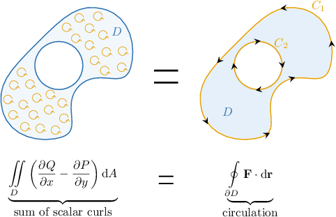

Now, if we exaggerate the size of two of the curls inside $D,$ we get the following picture:

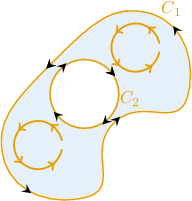

Now, notice the following:

- For the curls' direction to match with the orientation of the *outer* curve at the points where they are in close contact, the outer curve must be oriented *counterclockwise*.

- Similarly, for the curls' direction to match with the orientation of the *inner* curve at the points where they are in close contact, the inner curve must be oriented *clockwise*.

So, for Green's theorem to give us the correct answer, the inner and outer curves must be oriented clockwise and counterclockwise, respectively.

### Example: Applying Green's Theorem to Regions With Holes

#### Question

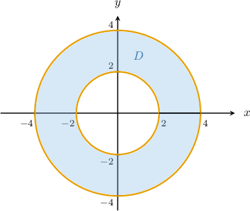

Calculate where is the annular region shown above.

#### Explanation

Let be a positively oriented, piecewise-smooth, simple closed curve in the plane, and let be the region bounded by If and have continuous first partial derivatives on an open region containing then Green's theorem states that

Green's theorem can be extended to include regions containing holes. In such cases, we can apply Green's theorem in the same way as before.

We have that and So,

Therefore, applying Green's theorem, we get

### A Note About Double Integrals Over Regions With Holes

Let's suppose that we want to calculate the double integral

$$

\iint_\limits{D} f(x,y) \: \textrm{d}A

$$

where $D$ is the region shown below.

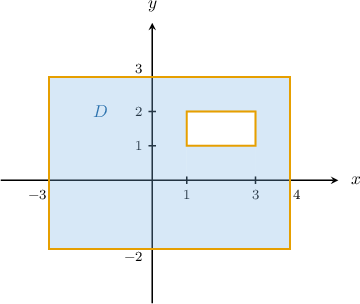

Notice that the region $D$ can be represented as the difference of sets $D = \Delta_1\setminus\Delta_2,$ where

- $\Delta_1 = \big\{(x,y) \:: \: -3 \leq x \leq 4, -2 \leq y \leq 3 \big\}$ is the region enclosed by the outer curve, and

- $\Delta_2 = \big\{(x,y) \:: \: 1 \leq x \leq 3, 1 \leq y \leq 2 \big\}$ is the region enclosed by the inner curve.

In such cases, we have

$$

\begin{aligned}\underset{𝐷}{∬}𝑓(𝑥,𝑦)\,d𝐴 & =\underset{Δ_{1}}{∬}𝑓(𝑥,𝑦)\,d𝐴−\underset{Δ_{2}}{∬}𝑓(𝑥,𝑦)\,d𝐴.\end{aligned}

$$

In other words, we can calculate a double integral over a region with a hole as the difference between two integrals.

### Example: Applying Green's Theorem to Regions With Holes: Advanced Cases

#### Question

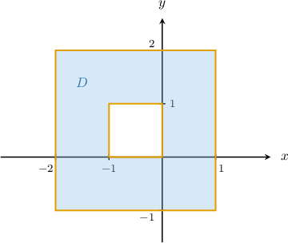

Calculate $\displaystyle \oint\limits_{\partial D} (2x^3y^2-x^5) \,\mathrm{d}x + (3x^4y+y^4) \,\mathrm{d}y,$ where $D$ is the region shown above.

#### Explanation

Let $C$ be a positively oriented, piecewise-smooth, simple closed curve in the plane, and let $D$ be the region bounded by $C.$ If $P$ and $Q$ have continuous first partial derivatives on an open region containing $D,$ then Green's theorem states that

$$

\oint\limits_{C} P\,\mathrm{d}x + Q\,\mathrm{d}y = \iint\limits_D \left(\frac{\partial Q}{\partial x} - \frac{\partial P}{\partial y}\right)\,\textrm d A.

$$

Green's theorem can be extended to include regions containing holes. In such cases, we can apply Green's theorem the same way as before.

We have that $P(x,y)=2x^3y^2-x^5$ and $Q(x,y)= 3x^4y+y^4.$ Therefore,

$$

\dfrac{\partial P}{\partial y} = 4x^3y, \qquad \dfrac{\partial Q}{\partial x} = 12x^3y.

$$

Therefore, applying Green's theorem, we get

$$

\begin{aligned}\underset{𝜕𝐷}{∮}(2𝑥^{3}𝑦^{2}−𝑥^{5})\,d𝑥+(3𝑥^{4}𝑦+𝑦^{4})\,d𝑦 & =\underset{𝐷}{∬}(\frac{𝜕𝑄}{𝜕𝑥}−\frac{𝜕𝑃}{𝜕𝑦})\,d𝐴 \\ & =\underset{𝐷}{∬}12𝑥^{3}𝑦−4𝑥^{3}𝑦\,d𝐴 \\ & =\underset{𝐷}{∬}8𝑥^{3}𝑦\,d𝐴.\end{aligned}

$$

The region $D$ can be represented in Cartesian coordinates as $\Delta_1\setminus\Delta_2,$ where

- $\Delta_1 = \big\{(x,y) \:: \: -2 \leq x \leq 1, -1 \leq y \leq 2 \big\}$ is the region enclosed by the outer curve, and

- $\Delta_2 = \big\{(x,y) \:: \: -1 \leq x \leq 0, 0 \leq y \leq 1 \big\}$ is the region enclosed by the inner curve.

Therefore, our double integral becomes

$$

\begin{aligned}\underset{𝐷}{∬}8𝑥^{3}𝑦\,d𝐴 & =\underset{Δ_{1}}{∬}8𝑥^{3}𝑦\,d𝐴−\underset{Δ_{2}}{∬}8𝑥^{3}𝑦\,d𝐴 \\ & =∫_{2−1}^{}∫_{1−2}^{}8𝑥^{3}𝑦\,d𝑥\,d𝑦−∫_{10}^{}∫_{0−1}^{}8𝑥^{3}𝑦\,d𝑥\,d𝑦 \\ & =∫_{1−2}^{}4𝑥^{3}\,d𝑥∫_{2−1}^{}2𝑦\,d𝑦−∫_{0−1}^{}4𝑥^{3}\,d𝑥∫_{10}^{}2𝑦\,d𝑦 \\ & =𝑥^{4}\,_{1−2}^{}⋅𝑦^{2}\,_{2−1}^{}−𝑥^{4}\,_{0−1}^{}⋅𝑦^{2}\,_{10}^{} \\ & =(1−16)⋅(4−1)−(0−1)⋅(1−0) \\ & =(−15)⋅3−(−1)⋅1 \\ & =−44.\end{aligned}

$$

### An Illustration of How To Extend Green’s Theorem to Regions Containing Holes

When proving Green's theorem, we typically start by assuming that $D$ is a so-called **simple region** (that is, a region that is both type I and type II). Then, Green's theorem is *extended* to include regions that are not simple.

Let's suppose that we've proved that Green's theorem is true for type I and type II regions. How can we use this to show that Green's theorem is also true for regions containing holes?

To illustrate how this is done, let's consider the vector field $\mathbf F = P\,\mathbf i + Q\,\mathbf j,$ and the line integral

$$

\displaystyle\oint\limits_{\partial D} \mathbf F\cdot \textrm d \mathbf r

$$

where $D$ is the annular region below.

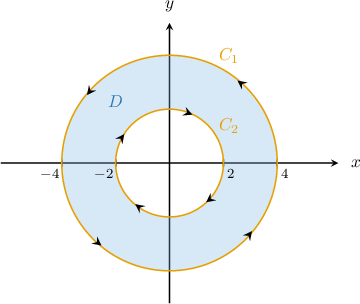

Note that $\partial D= C_1\cup C_2$ is positively oriented.

Now, imagine splitting $D$ into two regions $D_1$ and $D_2$ by means of *cuts* along the segments $[-4, -2]$ and $[2,4]$ on the $x$-axis, as shown below

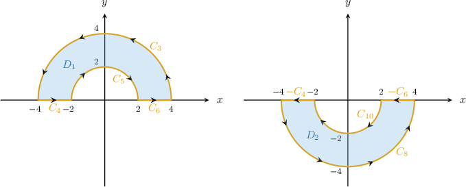

Notice that $D_1$ and $D_2$ are positively oriented type I regions. In addition, we have the following:

$$

\begin{aligned}𝐶_{1} & =𝐶_{3}∪𝐶_{8} \\ 𝐶_{2} & =𝐶_{5}∪𝐶_{10} \\ 𝜕𝐷_{1} & =𝐶_{3}∪𝐶_{4}∪𝐶_{5}∪𝐶_{6}, \\ 𝜕𝐷_{2} & =𝐶_{8}∪(−𝐶_{6})∪𝐶_{10}∪(−𝐶_{4})\end{aligned}

$$

We can now write the circulation of $\mathbf F$ over $\partial D$ as follows:

$$

\begin{aligned}\underset{𝜕𝐷}{∮}𝐅⋅d𝐫 & =\underset{𝐶_{1}∪\,𝐶_{2}}{∮}𝐅⋅d𝐫 \\ & =\underset{𝐶_{1}}{∮}𝐅⋅d𝐫+\underset{𝐶_{2}}{∮}𝐅⋅d𝐫 \\ & =\underset{𝐶_{3}}{∫}𝐅⋅d𝐫+\underset{𝐶_{8}}{∫}𝐅⋅d𝐫+\underset{𝐶_{5}}{∫}𝐅⋅d𝐫+\underset{𝐶_{10}}{∫}𝐅⋅d𝐫 \\ & +\underset{0}{\underset{}{\underset{𝐶_{4}}{∫}𝐅⋅d𝐫+\underset{−𝐶_{4}}{∫}𝐅⋅d𝐫+\underset{𝐶_{6}}{∫}𝐅⋅d𝐫+\underset{−𝐶_{6}}{∮}𝐅⋅d𝐫}} \\ & =\underset{𝐶_{3}}{∫}𝐅⋅d𝐫+\underset{𝐶_{4}}{∫}𝐅⋅d𝐫+\underset{𝐶_{5}}{∫}𝐅⋅d𝐫+\underset{𝐶_{6}}{∫}𝐅⋅d𝐫 \\ & +\underset{𝐶_{8}}{∫}𝐅⋅d𝐫+\underset{−𝐶_{6}}{∫}𝐅⋅d𝐫+\underset{𝐶_{10}}{∫}𝐅⋅d𝐫+\underset{−𝐶_{4}}{∮}𝐅⋅d𝐫 \\ & =\underset{𝜕𝐷_{1}}{∮}𝐅⋅d𝐫+\underset{𝜕𝐷_{2}}{∮}𝐅⋅d𝐫 \\ & =\underset{𝜕𝐷_{1}}{∮}𝑃\,d𝑥+𝑄\,d𝑦+\underset{𝜕𝐷_{2}}{∮}𝑃\,d𝑥+𝑄\,d𝑦 \\ & =\underset{𝐷_{1}}{∬}(\frac{𝜕𝑄}{𝜕𝑥}−\frac{𝜕𝑃}{𝜕𝑦})\,d𝐴+\underset{𝐷_{2}}{∬}(\frac{𝜕𝑄}{𝜕𝑥}−\frac{𝜕𝑃}{𝜕𝑦})\,d𝐴 \\ & =\underset{𝐷}{∬}(\frac{𝜕𝑄}{𝜕𝑥}−\frac{𝜕𝑃}{𝜕𝑦})\,d𝐴.\end{aligned}

$$

To summarize,

$$

\oint \limits_{\partial D}\mathbf F\cdot \textrm d \mathbf r = \iint_\limits{D}\left(\dfrac{\partial Q}{\partial x}-\dfrac{\partial P}{\partial y}\right)\,\textrm{d}A,

$$

which is just Green's theorem for the region $D.$
