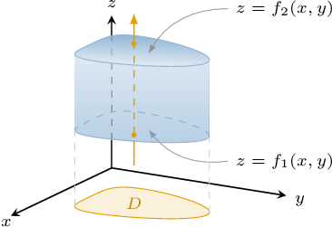
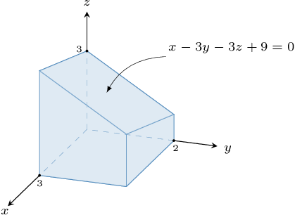
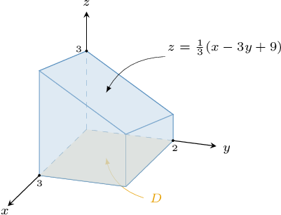
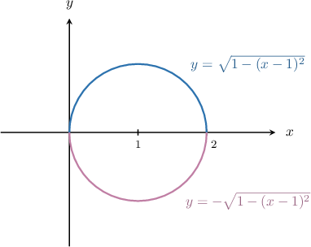
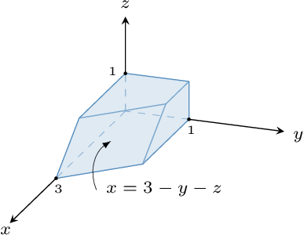
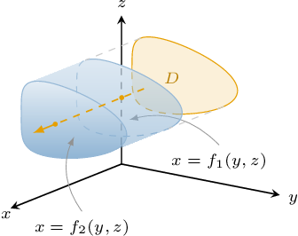
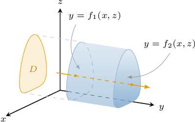
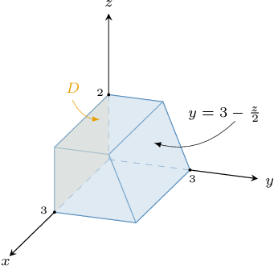
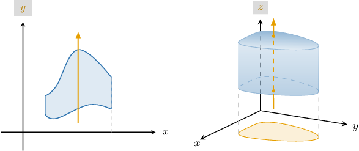

# Type I, II, and III Regions in Three-Dimensional Space

Source: https://www.mathacademy.com/topics/2130?courseId=54
Topic ID: 2130

## Prerequisites

- [Identifying Quadric Surfaces](./1898-identifying-quadric-surfaces.md)
- [Type I and II Regions in Two-Dimensional Space](./1979-type-i-and-ii-regions-in-two-dimensional-space.md)

## Lesson

### Introduction

A **type I region** in three-dimensional space is a region that can be represented in the form

$$

R = \big\{ (x,y,z) \: : \: (x,y) \in D, \:\: f_1(x,y) \leq z \leq f_2(x,y) \big\},

$$

where $D$ is a plane region in the $xy$-plane.

A typical type I region can be visualized schematically, as shown below.

For any type I region, if we draw a line parallel to the $z$-axis that passes through the region, its intersection with the region must be a single (connected) interval, represented by the dashed orange segment in our diagram

We say that $D$ is the **projection** of $R$ onto the $xy$-plane. We can think of $D$ as the shadow made by $R$ in the $xy$-plane due to a light source placed directly above $R.$

We can further refine our type I representation of $R$ depending on whether the projection $D$ is a type I or type II *plane* region:

- If the projection $D$ of $R$ is a type I *plane* region, then we can express $R$ as

$$

R = \big\{ (x,y,z) \: : \: \underbrace{a \leq x\leq b, \:\: g_1(x) \leq y \leq g_2(x)}_{\text{Type I plane region}}, \:\: f_1(x,y) \leq z \leq f_2(x,y) \big\}.

$$

- If the projection $D$ of $R$ is a type II *plane* region, then we can express $R$ as

$$

R = \big\{ (x,y,z) \: : \: \underbrace{c \leq y\leq d, \:\: h_1(y) \leq x \leq h_2(y)}_{\text{Type II plane region}}, \:\:f_1(x,y) \leq z \leq f_2(x,y) \big\}.

$$

### An Example of a Type I Region

Consider the region $R$ that is bounded by the planes $x=0$, $x=3$, $y=0$, $y=2$, $z=0,$ and $x-3y-3z+9=0,$ as shown below.

Let's represent $R$ as a type I region in three-dimensional space:

$$

R = \big\{ (x,y,z) \: : \: (x,y) \in D, \: f_1(x,y) \leq z \leq f_2(x,y) \big\}

$$

A typical three-dimensional type I region can be visualized schematically, as shown below.

In our example, the projection $D$ of $R$ onto the $xy$-plane gives the domain

$$

D = \big\{ (x,y) \: : \: 0 \leq x \leq 3, \: 0 \leq y \leq 2 \big\}.

$$

For the top and bottom surfaces, we have

- the *bottom* surface $z=f_1(x,y)=0$, and

- the *top* surface $z=f_2(x,y)=\dfrac13(x-3y+9),$

as shown below.

Therefore, the region $R$ expressed as a type I region is

$$

R= \left\{ (x,y,z) \: : \: (x,y) \in D, \: 0 \leq z \leq \dfrac13(x-3y+9) \right\}

$$

where

$$

D = \big\{ (x,y) \: : \: 0 \leq x \leq 3, \: 0 \leq y \leq 2 \big\}.

$$

Finally, since $D$ is a type I (or type II) plane region, we can write our type I representation of $R$ as a single expression, as follows:

$$

R= \left\{ (x,y,z) \: : \: 0 \leq x \leq 3, \:\: 0 \leq y \leq 2, \:\: 0 \leq z \leq \dfrac13(x-3y+9) \right\}

$$

### Example: Describing Type I Regions

#### Question

The region $R$ is bounded between the elliptic paraboloid $z=x^2+y^2$ and the plane $z=2x.$ Express $R$ as a type I region in the form

$$

R = \big\{ (x,y,z) \: : \: a \leq x \leq b, \quad g_1(x) \leq y \leq g_2(x), \quad f_1(x,y) \leq z \leq f_2(x,y) \big\}.

$$

#### Explanation

A typical three-dimensional type I region can be visualized schematically, as shown below.

Let's find a type I representation of our region.

**** We start by finding the surfaces $f_1(x,y)$ and $f_2(x,y).$ Since all $z$ in the region are bounded ** by $z=x^2+y^2$ and ** by $z=2x,$ we have

$$

\underbrace{x^2+y^2}_{f_1(x,y)} \leq z \leq \underbrace{2x}_{f_2(x,y)} .

$$

**** We find the projection of the intersection between the elliptic paraboloid $z=x^2+y^2$ and the plane $z=2x$ onto the $xy$-plane.

Notice that the equation of the plane is already solved for $z.$ Substituting this expression for $z$ into the equation of the paraboloid, we obtain:

$$

\begin{aligned}2𝑥 & =𝑥^{2}+𝑦^{2} \\ 𝑥^{2}−2𝑥+𝑦^{2} & =0 \\ (𝑥^{2}−2𝑥+1)+𝑦^{2} & =1 \\ (𝑥−1)^{2}+𝑦^{2} & =1\end{aligned}

$$

So, the projection of the intersection is the circle $(x - 1)^2 + y^2 = 1$ centered at $(1,0)$ in the $xy$-plane.

The region is bounded ** by $y=-\sqrt{1-(x-1)^2}$ and bounded ** by $y=\sqrt{1-(x-1)^2}.$ Therefore,

$$

\underbrace{-\sqrt{1-(x-1)^2}}_{g_1(x)} \leq y \leq \underbrace{\sqrt{1-(x-1)^2}}_{g_2(x)}.

$$

**** We find the bounds for $x.$ From the diagram, $x$ is bounded ** by $x=0$ and bounded ** by $x=2.$ Therefore,

$$

\underbrace{0}_a \leq x \leq \underbrace{2}_b.

$$

Therefore, we can express $R$ as a type I region as follows:

$$

R = \left\{ (x,y,z) \: : \: 0 \leq x \leq 2, \:\:-\sqrt{1-(x-1)^2} \leq y \leq \sqrt{1-(x-1)^2}, \:\: x^2+y^2 \leq z \leq 2x\right\}

$$

### Type II Regions

A **type II region** in three-dimensional space is a region that can be represented in the form

$$

R = \big\{ (x,y,z) \: : \: (y,z) \in D, \:\: f_1(y,z) \leq x \leq f_2(y,z) \big\},

$$

where $D$ is a plane region in the $yz$-plane.

A typical three-dimensional type II region can be visualized schematically, as shown below.

For any type II region, if we draw a line parallel to the $x$-axis that passes through the region, its intersection with the region must be a single (connected) interval.

We can further refine our type II representation of $R$ depending on whether the projection $D$ is a type I or type II *plane* region:

- If the projection $D$ of $R$ is a type I *plane* region, then we can express $R$ as

$$

R = \big\{ (x,y,z) \: : \: \underbrace{a \leq y\leq b, \:\: g_1(y) \leq z \leq g_2(y)}_{\text{Type I plane region}}, \:\: f_1(y,z) \leq x \leq f_2(y,z) \big\}.

$$

- If the projection $D$ of $R$ is a type II *plane* region, then we can express $R$ as

$$

R = \big\{ (x,y,z) \: : \: \underbrace{c \leq z\leq d, \:\: h_1(z) \leq y \leq h_2(z)}_{\text{Type II plane region}}, \:\: f_1(y,z) \leq x \leq f_2(y,z) \big\}.

$$

### An Example of a Type II Region

Consider the region $R$ that is bounded by the planes $y=0$, $y=1$, $z=0$, $z=1$, $x=0,$ and $x=3-y-z.$

Let's represent $R$ as a type II region in three-dimensional space:

$$

R = \big\{ (x,y,z) \: : \: (y,z) \in D, \: f_1(y,z) \leq x \leq f_2(y,z) \big\}

$$

A typical three-dimensional type II region can be visualized schematically, as shown below.

In our example, the projection $D$ onto the $yz$-plane gives the domain

$$

D = \big\{ (y,z) \: : \: 0 \leq y \leq 1, \: 0 \leq z \leq 1 \big\}.

$$

For the front and back surfaces, we have

- the *back* surface $x=f_1(y,z)=0$, and

- the *front* surface $x=f_2(y,z)=3-y-z.$

Therefore, the region $R$ expressed as a type II region is

$$

R = \big\{ (x,y,z) \: : \: (y,z) \in D, \: 0 \leq x \leq 3-y-z \big\},

$$

where

$$

D = \big\{ (y,z) \: : \: 0 \leq y \leq 1, \: 0 \leq z \leq 1 \big\}.

$$

Finally, since $D$ is a type I (or type II) plane region, we can write our type II representation of $R$ as a single expression, as follows:

$$

R = \big\{ (x,y,z) \: : \: 0 \leq y \leq 1, \: 0 \leq z \leq 1, \: 0 \leq x \leq 3-y-z \big\}

$$

### Example: Describing Type II Regions

#### Question

The region $R$ is bounded between the elliptic paraboloid $x=y^2+z^2$ and the plane $x=2y.$ Express $R$ as a type II region in the form

$$

R = \big\{ (x,y,z) \: : \: (y,z) \in D, \: f_1(y,z) \leq x \leq f_2(y,z) \big\}.

$$

#### Explanation

A typical three-dimensional region of type II can be visualized schematically, as shown below.

First, we find the projection of the intersection between the elliptic paraboloid $x=y^2+z^2$ and the plane $x=2y$ onto $yz$-plane.

Notice that the equation of the plane is already solved for $x.$ Substituting this expression for $x$ into the equation of the paraboloid, we obtain

$$

\begin{aligned}2𝑦 & =𝑦^{2}+𝑧^{2} \\ 𝑦^{2}−2𝑦+𝑧^{2} & =0 \\ (𝑦^{2}−2𝑦+1)+𝑧^{2} & =1 \\ (𝑦−1)^{2}+𝑧^{2} & =1.\end{aligned}

$$

So, the projection of the intersection is the circle $(y - 1)^2 + z^2 = 1$ centered at $(1,0)$ in the $yz$-plane. Hence, the domain $D$ is given by the following disc:

$$

D = \big\{ (y,z) \: : \: (y - 1)^2 + z^2 \leq 1 \big\}

$$

For the front and back surfaces, we have that $x$ is

- bounded ** by $f_1(y,z)=y^2+z^2$, and

- bounded ** by $f_2(y,z)=2y.$

Therefore, our type II representation is

$$

R = \big\{ (x,y,z) \: : \: (y,z) \in D, \:y^2+z^2 \leq x \leq 2y \big\},

$$

where

$$

D = \big\{ (y,z) \: : \: (y - 1)^2 + z^2 \leq 1 \big\}.

$$

### Type III Regions

A **type III region** in three-dimensional space is a region that can be represented in the form

$$

R = \big\{ (x,y,z) \: : \: (x,z) \in D, \:\: f_1(x,z) \leq y \leq f_2(x,z) \big\},

$$

where $D$ is a plane region in the $xz$-plane.

A typical three-dimensional type III region can be visualized schematically, as shown below.

For any type III region, if we draw a line parallel to the $y$-axis that passes through the region, its intersection with the region must be a single (connected) interval.

We can further refine our type III representation of $R$ depending on whether the projection $D$ is a type I or type II *plane* region:

- If the projection $D$ of $R$ is a type I *plane* region, then we can express $R$ as

$$

R = \big\{ (x,y,z) \: : \: \underbrace{a \leq x\leq b, \:\: g_1(x) \leq z \leq g_2(x)}_{\text{Type I plane region}}, \:\: f_1(x,z) \leq y \leq f_2(x,z) \big\}.

$$

- If the projection $D$ of $R$ is a type II *plane* region, then we can express $R$ as

$$

R = \big\{ (x,y,z) \: : \: \underbrace{c \leq z\leq d, \:\: h_1(z) \leq x \leq h_2(z)}_{\text{Type II plane region}}, \:\: f_1(x,z) \leq y \leq f_2(x,z) \big\}.

$$

### An Example of a Type III Region

The region $R$ is bounded by the planes $x=0$, $x=3$, $z=0$, $z=2$, $y=0,$ and $y=3-\dfrac z2.$

Let's represent it as a type III region in three-dimensional space:

$$

R = \big\{ (x,y,z) \: : \: (x,z) \in D, \: f_1(x,z) \leq y \leq f_2(x,z) \big\}

$$

Recall that a typical three-dimensional type III region can be visualized schematically, as shown below.

In our example, the projection $D$ onto the $xz$-plane gives the domain

$$

D = \big\{ (x,z) \: : \: 0 \leq x \leq 3, \: 0 \leq z \leq 2 \big\}.

$$

And we have

- the *left* surface $y=f_1(x,z)=0$, and

- the *right* surface $y=f_2(x,z)=3-\dfrac z2.$

Therefore, we can express $R$ as a type III region as follows:

$$

R = \left\{ (x,y,z) \: : \: 0 \leq x\leq 3, \:\: 0 \leq z \leq 2, \:\: 0 \leq y \leq 3-\dfrac z2 \right\}.

$$

### Example: Describing Type III Regions

#### Question

The region $R$ is bounded between the hyperbolic paraboloid $y=x^2-z^2+1$ and the elliptic paraboloid $y=2x^2+z^2-1.$ Express $R$ as a type III region in the form

$$

R = \big\{ (x,y,z) \: : \: (x,z) \in D, \: f_1(x,z) \leq y \leq f_2(x,z) \big\}.

$$

#### Explanation

A typical three-dimensional type III region can be visualized schematically, as shown below.

First, we find the projection of the intersection between the hyperbolic paraboloid $y=x^2-z^2+1$ and the elliptic paraboloid $y=2x^2+z^2-1$ onto $xz$-plane.

Notice that the equations are already solved for $y.$ Equating the two expressions, we obtain:

$$

\begin{aligned}𝑥^{2}−𝑧^{2}+1 & =2𝑥^{2}+𝑧^{2}−1 \\ 𝑥^{2}+2𝑧^{2} & =2\end{aligned}

$$

So, the projection of the intersection is the ellipse $x^2 + 2z^2 = 2$ centered at $(0,0)$ in the $xz$-plane. Hence, the domain $D$ is given by the interior part of the ellipse:

$$

D = \big\{ (x,z) \: : \: x^2 + 2z^2 \leq 2 \big\}

$$

For the left and right surfaces, we have that $y$ is

- bounded ** by $f_1(x,z)=2x^2+z^2-1$, and

- bounded ** by $f_2(x,z)=x^2-z^2+1.$

Therefore, the type III representation of our ellipse is given by

$$

R = \big\{ (x,y,z) \: : \: (x,z) \in D, \: 2x^2+z^2-1 \leq y \leq x^2-z^2+1 \big\},

$$

where

$$

D = \big\{ (x,z) \: : \: x^2 + 2z^2 \leq 2 \big\}.

$$

### A Mnemonic for Remembering the Different Region Types

There's a nice mnemonic that's useful when recalling which direction each region type is oriented.

A type I region is always "vertically" oriented with respect to the usual coordinate system representation.

The "vertical" direction is always the final letter:

- for a two-dimensional $(x\boldsymbol{y})$ system, the vertical direction is $\boldsymbol y,$ and

- for a three-dimensional $(xy\boldsymbol{z})$ system, the vertical direction is $\boldsymbol z.$

Then, any remaining types are paired with the rest of the variables in alphabetical order:

- for a two-dimensional $({\color{red}{\boldsymbol{x}}}y)$ system, type II regions are oriented along the ${\color{red}{\boldsymbol{x}}}$-axis,

- for a three-dimensional $({\color{red}{\boldsymbol{x}}}{\color{blue}{\boldsymbol y}}z)$ system, type II regions are oriented along the ${\color{red}{\boldsymbol{x}}}$-axis, and type III regions are oriented along the ${\color{blue}{\boldsymbol y}}$-axis
