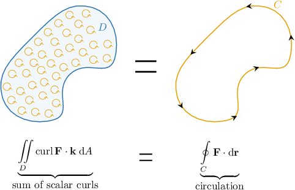
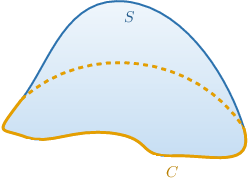
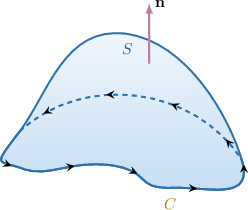
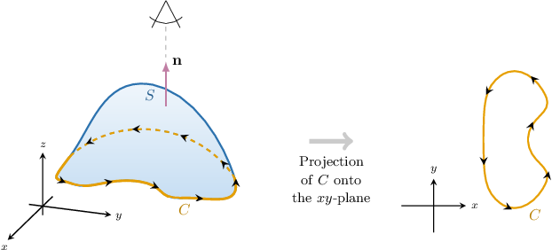
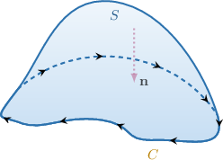
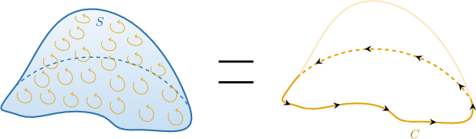
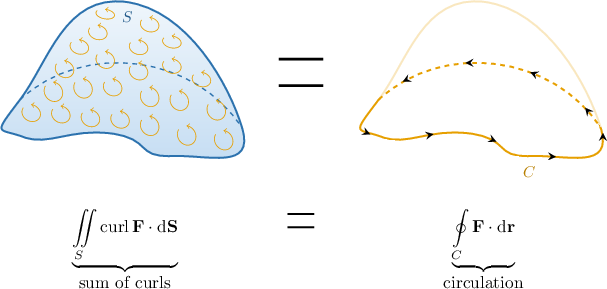
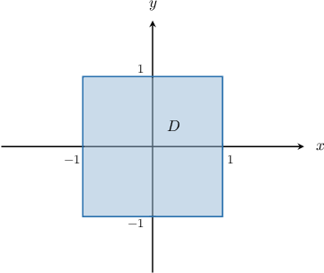

# Stokes' Theorem

Source: https://www.mathacademy.com/topics/2138?courseId=54
Topic ID: 2138

## Prerequisites

- [Introduction to Green's Theorem](./2116-introduction-to-green-s-theorem.md)
- [Calculating Flux Through Cartesian Surfaces](./4143-calculating-flux-through-cartesian-surfaces.md)

## Lesson

### Introduction

The **circulation** $\Gamma$ of a three-dimensional vector field $\mathbf F(x,y,z)$ along a closed, piecewise-smooth curve $C \in \mathbb R^3$ parametrized by $\mathbf r(t)$ for $t\in [a,b]$ is given by

$$

\Gamma = \oint\limits_C \mathbf F \cdot \textrm d\mathbf r = \int_a^b \mathbf F(\mathbf r(t)) \cdot \mathbf r'(t) \; \textrm{d}t.

$$

This is the same definition as the two-dimensional case. Also, like the two-dimensional case, $\Gamma$ measures the total work done by a force $\mathbf F$ in moving a particle along a closed curve $C,$ traversed once.

Remember that circulation is always measured with respect to our chosen orientation for $C$ (positive or negative).

Let's get some practice at computing circulation over three-dimensional curves.

### Example: Circulation Over Space Curves

#### Question

Calculate the circulation $\Gamma$ of the vector field $\mathbf F(x,y,z) = y \,\mathbf{i} -x \,\mathbf{j} + z\,\mathbf{k}$ along the closed curve $C$ given by $\mathbf r(t) = \sin (\pi t)\,\mathbf{i} + \cos (\pi t)\, \mathbf{j} + t(2-t)\,\mathbf{k}$ for $t \in [0,2].$

#### Explanation

The circulation $\Gamma$ measures the total work done by a force $\mathbf F$ in moving a particle along a ** curve $C.$ It is given by the formula

$$

\Gamma = \oint\limits_C \mathbf F \cdot \textrm{d} \mathbf r = \int_a^b \mathbf F(r(t)) \cdot \mathbf r'(t) \; \textrm{d}t.

$$

Along the curve $C,$ we have

$$

x = \sin (\pi t), \qquad y = \cos (\pi t), \qquad z = t(2-t) = 2t-t^2.

$$

So,

$$

\begin{aligned}𝐅(𝐫(𝑡)) & =𝑦\,𝐢−𝑥\,𝐣+𝑧\,𝐤 \\ & =cos⁡(𝜋𝑡)\,𝐢−sin⁡(𝜋𝑡)\,𝐣+(2𝑡−𝑡^{2})\,𝐤.\end{aligned}

$$

Computing $\mathbf r'(t),$ we get

$$

\begin{aligned}𝐫^{′}(𝑡) & =\frac{d}{d𝑡}(sin⁡(𝜋𝑡))\,𝐢+\frac{d}{d𝑡}(cos⁡(𝜋𝑡))\,𝐣+\frac{d}{d𝑡}(2𝑡−𝑡^{2})\,𝐤 \\ & =𝜋cos⁡(𝜋𝑡)\,𝐢−𝜋sin⁡(𝜋𝑡)\,𝐣+2(1−𝑡)\,𝐤.\end{aligned}

$$

Therefore,

$$

\begin{aligned}𝐅(𝐫(𝑡))⋅𝐫^{′}(𝑡) & =(\,cos⁡(𝜋𝑡)\,𝐢−sin⁡(𝜋𝑡)\,𝐣+(2𝑡−𝑡^{2})\,𝐤\,)⋅(𝜋cos⁡(𝜋𝑡)\,𝐢−𝜋sin⁡(𝜋𝑡)\,𝐣+2(1−𝑡)\,𝐤) \\ & =cos⁡(𝜋𝑡)⋅𝜋cos⁡(𝜋𝑡)+(−sin⁡(𝜋𝑡))⋅(−𝜋sin⁡(𝜋𝑡))+(2𝑡−𝑡^{2})⋅2(1−𝑡) \\ & =𝜋cos^{2}⁡(𝜋𝑡)+𝜋sin^{2}⁡(𝜋𝑡)+2(2𝑡−𝑡^{2})(1−𝑡) \\ & =𝜋(cos^{2}⁡(𝜋𝑡)+sin^{2}⁡(𝜋𝑡))+2(2𝑡−3𝑡^{2}+𝑡^{3}) \\ & =𝜋+4𝑡−6𝑡^{2}+2𝑡^{3}.\end{aligned}

$$

Finally, we evaluate the integral as follows:

$$

\begin{aligned}Γ=\underset{𝐶}{∮}𝐅⋅d𝐫 & =∫_{20}^{}𝐅(𝑟(𝑡))⋅𝐫^{′}(𝑡)\,d𝑡 \\ & =∫_{20}^{}𝜋+4𝑡−6𝑡^{2}+2𝑡^{3}\,d𝑡 \\ & =[𝜋𝑡+2𝑡^{2}−2𝑡^{3}+\frac{1}{2}𝑡^{4}]_{20}^{} \\ & =[2𝜋+8−16+8]−[0] \\ & =2𝜋\end{aligned}

$$

### A Review of Green's Theorem

To understand the following work, it's a good idea to review Green's theorem.

Suppose $C$ is a positively oriented, piecewise-smooth, and simple closed curve in $\Bbb R^2,$ and $D$ is the region enclosed by $C.$ If we consider the two-dimensional vector field $\mathbf F(x,y) = \langle P, Q\rangle$ to have zero $z$-component, i.e.,

$$

\mathbf{F} = \langle P,\: Q,\:0\rangle

$$

and the scalar functions $P$ and $Q$ have continuous partial derivatives in the interior of $D,$ then Green's theorem can be written as follows:

$$

\iint\limits_D \textrm{curl}\,\mathbf{F} \cdot \mathbf{k} \: \textrm{d}A = \oint\limits_{C} \mathbf{F} \cdot \mathrm{d}\mathbf{r}

$$

Green's theorem relates the sum of the microscopic curls of $\mathbf{F}$ over $D$ to the macroscopic curl of $\mathbf{F}$ (i.e., the circulation) along the boundary of $D.$

Green's theorem is a special case of another important theorem, which we'll discuss shortly. But first, we need to look at the relationship between oriented surfaces and their bounding curves.

### Induced Orientations of Boundary Curves

Suppose we have an oriented surface $S$ (not closed) whose **boundary curve** is the closed curve $C,$ as shown below.

Whenever we select an orientation for $S,$ our chosen orientation automatically induces a positive orientation for $C.$

For example, if we select the upward-pointing unit normal vector shown below, the positive orientation is *counterclockwise* when viewed from above.

Assume that you are standing on the curve $C$ with your head pointing upward (i.e., in the same direction as $\mathbf n$). Then, if you traverse $C$ in the positive direction, the surface will always be on your left.

For example, if $z=f(x,y)$ is upward-oriented, the projection of the bounding curve onto the $xy$-plane runs counterclockwise when viewed from above.

Now, suppose we select the opposite orientation for $\mathbf n,$ shown below.

By choosing the *opposite* orientation for $\mathbf n,$ the positive orientation for $C$ is *clockwise* when viewed from above!

If you're not convinced, grab a child's doll, a toothbrush, or any other object with some kind of head, and mark its left and right sides (be careful not to damage it!). Then, walk it around the edge of a table so that its left side is always next to the table surface. If you turn it upside down, you will see that the object must traverse the table's edge in the *opposite* direction for the table surface to stay on the left.

### Stokes' Theorem

We're now ready to state the main result of the lesson:

*Let $S$ be an oriented piecewise-smooth surface bounded by a simple, closed, piecewise-smooth boundary $C$ with positive orientation. If a vector field $\mathbf{F}$ has continuous partial derivatives for all its components in an open region in space that contains $S,$ then*

$$

\iint\limits_S \textrm{curl}\,\mathbf{F} \cdot \textrm{d}\mathbf{S} = \oint\limits_{C} \mathbf{F}\cdot\mathrm{d}\mathbf{r}.

$$

This result is known as **Stokes' theorem** and can be considered a generalization of Green's theorem. Let's spend some time building some intuition behind this result.

Suppose that $\mathbf F$ is a vector field in $\mathbb R^3.$ Stokes' theorem states that the sum of the microscopic curls of $\mathbf F$ on the surface $S$ equals the macroscopic curl of $\mathbf F$ at the boundary $C$ of $S.$

Consider the left-hand side of the above picture, and suppose we have a point $P$ that lies on $S.$

The magnitude of the flux of $\textrm{curl}\,\mathbf F$ through $S$ at $P$ is given by

$$

\textrm{curl}\,\mathbf F \cdot \mathbf n.

$$

We can think of this quantity as the amount of "swirl" of $\mathbf F$ at $P$ that acts tangentially to $S$ at $P.$

If we sum (integrate) the flux of the curl through $S$ at every point over the entire surface $S,$ we get

$$

\iint\limits_S \textrm{curl}\,\mathbf{F} \cdot \mathbf n\, \textrm{d}S

$$

which we usually write as

$$

\iint\limits_S \textrm{curl}\,\mathbf{F} \cdot \textrm{d}\mathbf{S}.

$$

This expression gives us the left-hand side of Stokes' theorem.

Let's now look at the right-hand side of our image. The macroscopic curl is simply the circulation of $\mathbf F$ along the boundary of $S{:}$

$$

\oint\limits_C\mathbf F\cdot \textrm d \mathbf r

$$

Equating the sum of the microscopic curls with the circulation, we have

$$

\iint\limits_S \textrm{curl}\,\mathbf{F} \cdot \textrm{d}\mathbf{S} = \oint\limits_C\mathbf F \cdot \textrm d \mathbf r.

$$

Stokes' theorem can be summarized in a single picture as follows:

We can immediately deduce a remarkable fact. Notice the value of the surface integral depends only on the circulation at the boundary. Therefore, within a given vector field, if two surfaces $S_1$ and $S_2$ have the same boundary $C,$ then their respective surface integrals will be equal!

$$

\iint\limits_{S_1} \textrm{curl}\,\mathbf{F} \cdot \textrm{d}\mathbf{S} = \iint\limits_{S_2} \textrm{curl}\,\mathbf{F} \cdot \textrm{d}\mathbf{S}

$$

### Example: Evaluating a Surface Integral Using Stokes' Theorem

#### Question

Let $S$ be an oriented piecewise-smooth surface bounded by the closed curve $C$ with positive orientation and parametrization $\mathbf{r}(t) = (t^2-t^3)\,\mathbf{i} + (t^2-t) \, \mathbf{j} + (t^2-t)\,\mathbf{k}$ for $t \in [0,1).$ Given that $\mathbf{F}(x,y,z) = \mathbf{i} + x\, \mathbf{j} + y\,\mathbf{k},$ evaluate the integral

$$

\iint\limits_S \textrm{curl}\,\mathbf{F} \cdot \textrm{d}\mathbf{S}.

$$

#### Explanation

Let $S$ be an oriented piecewise-smooth surface bounded by a simple, closed, piecewise-smooth boundary $C$ with positive orientation. If a vector field $\mathbf{F}$ has continuous partial derivatives for all its components in an open region in space that contains $S,$ then Stokes' theorem states that

$$

\oint\limits_{C} \mathbf{F}\cdot\mathrm{d}\mathbf{r} = \iint\limits_S \textrm{curl}\,\mathbf{F} \cdot \textrm{d}\mathbf{S}.

$$

Along the curve $C,$ we have

$$

x = t^2-t^3, \qquad y = t^2-t, \qquad z = t^2-t.

$$

So,

$$

\begin{aligned}𝐅(𝐫(𝑡)) & =𝐢+𝑥\,𝐣+𝑦\,𝐤 \\ & =𝐢+(𝑡^{2}−𝑡^{3})\,𝐣+(𝑡^{2}−𝑡)\,𝐤.\end{aligned}

$$

Computing $\mathbf r'(t),$ we get

$$

\begin{aligned}𝐫^{′}(𝑡) & =\frac{d}{d𝑡}(𝑡^{2}−𝑡^{3})\,𝐢+\frac{d}{d𝑡}(𝑡^{2}−𝑡)\,𝐣+\frac{d}{d𝑡}(𝑡^{2}−𝑡)\,𝐤 \\ & =(2𝑡−3𝑡^{2})\,𝐢+(2𝑡−1)\,𝐣+(2𝑡−1)\,𝐤.\end{aligned}

$$

Therefore,

$$

\begin{aligned}𝐅(𝐫(𝑡))⋅𝐫^{′}(𝑡) & =(𝐢+(𝑡^{2}−𝑡^{3})\,𝐣+(𝑡^{2}−𝑡)\,𝐤)⋅((2𝑡−3𝑡^{2})\,𝐢+(2𝑡−1)\,𝐣+(2𝑡−1)\,𝐤) \\ & =1⋅(2𝑡−3𝑡^{2})+(𝑡^{2}−𝑡^{3})⋅(2𝑡−1)+(𝑡^{2}−𝑡)⋅(2𝑡−1) \\ & =2𝑡−3𝑡^{2}+(−𝑡^{3}+2𝑡^{2}−𝑡)⋅(2𝑡−1) \\ & =2𝑡−3𝑡^{2}−2𝑡^{4}+𝑡^{3}+4𝑡^{3}−2𝑡^{2}−2𝑡^{2}+𝑡 \\ & =3𝑡−7𝑡^{2}+5𝑡^{3}−2𝑡^{4}.\end{aligned}

$$

Finally, we evaluate the integral as follows:

$$

\begin{aligned}\underset{𝑆}{∬}curl\,𝐅⋅d𝐒 & =\underset{𝐶}{∮}𝐅⋅d𝐫 \\ & =∫_{10}^{}𝐅(𝑟(𝑡))⋅𝐫^{′}(𝑡)\,d𝑡 \\ & =∫_{10}^{}(3𝑡−7𝑡^{2}+5𝑡^{3}−2𝑡^{4})\,d𝑡 \\ & =[\frac{3}{2}𝑡^{2}−\frac{7}{3}𝑡^{3}+\frac{5}{4}𝑡^{4}−\frac{2}{5}𝑡^{5}]_{10}^{} \\ & =\frac{3}{2}−\frac{7}{3}+\frac{5}{4}−\frac{2}{5} \\ & =\frac{1}{60}\end{aligned}

$$

### Using Stokes' Theorem to Evaluate Line Integrals

Calculating the circulation of a vector field along a closed, piecewise smooth curve $C$ can be time-consuming because it often requires splitting $C$ into several parts, evaluating a line integral along each one, and calculating their sum.

However, in such cases, we can often use Stokes' theorem to reduce the amount of work required by converting this sum of line integrals to a single surface integral.

For example, suppose that $C$ is the intersection of the paraboloid $z=x^2 + y^2$ and the boundary of the infinite vertical column enclosed by the planes $x = \pm 1$ and $y=\pm 1.$ Suppose also that $C$ is oriented counter-clockwise when viewed from above, and

$$

\mathbf{F} = \bigg\langle 0, \: \dfrac{1}{2}z^2, \: xz \bigg\rangle.

$$

Let's use Stokes' theorem to find the circulation of $\mathbf{F}$ along $C$.

$$

\oint\limits_{C} \mathbf{F}\cdot\mathrm{d}\mathbf{r} = \iint\limits_S \textrm{curl}\,\mathbf{F} \cdot \textrm{d}\mathbf{S}

$$

We first compute the partial derivatives of $z=g(x,y){:}$

$$

\begin{aligned}\frac{𝜕𝑔}{𝜕𝑥} & =\frac{𝜕}{𝜕𝑥}(𝑥^{2}+𝑦^{2})=2𝑥 \\ \frac{𝜕𝑔}{𝜕𝑦} & =\frac{𝜕}{𝜕𝑦}(𝑥^{2}+𝑦^{2})=2𝑦\end{aligned}

$$

By computing the curl of $\mathbf{F},$ we obtain

$$

\begin{aligned}𝐢 & 𝐣 & 𝐤 \\ \frac{𝜕}{𝜕𝑥} & \frac{𝜕}{𝜕𝑦} & \frac{𝜕}{𝜕𝑧} \\ 0 & \frac{1}{2}𝑧^{2} & 𝑥𝑧\end{aligned}

$$

Next, we substitute the equation $z=g(x,y)$ into expression for $\textrm{curl}\,\mathbf{F}{:}$

$$

\begin{aligned}curl\,𝐅\,_{𝑧=𝑔(𝑥,𝑦)} & =⟨−𝑧,\,−𝑧,\,0⟩_{𝑧=𝑥^{2}+𝑦^{2}} \\ & =⟨\underset{𝑃}{\underset{}{−(𝑥^{2}+𝑦^{2})}},\,\underset{𝑄}{\underset{}{−(𝑥^{2}+𝑦^{2})}},\,\underset{𝑅}{\underset{}{0}}⟩\end{aligned}

$$

So, we have

$$

\begin{aligned}\underset{𝐶}{∮}𝐅⋅d𝐫 & =\underset{𝑆}{∬}curl\,𝐅⋅d𝐒 \\ & =\underset{𝐷}{∬}(−𝑃\frac{𝜕𝑔}{𝜕𝑥}−𝑄\frac{𝜕𝑔}{𝜕𝑦}+𝑅)d𝐴 \\ & =\underset{𝐷}{∬}((𝑥^{2}+𝑦^{2})⋅2𝑥+(𝑥^{2}+𝑦^{2})⋅2𝑦+0)\,d𝐴 \\ & =\underset{𝐷}{∬}2(𝑥^{3}+𝑥^{2}𝑦+𝑥𝑦^{2}+𝑦^{3})\,d𝐴,\end{aligned}

$$

where $D$ is the region enclosed by the projection of $C$ onto the $xy$-plane, shown below.

Evaluating this integral using the usual methods, we get

$$

2\int_{-1}^{1} \int_{-1}^{1} x^3 + x^2 y + x y^2 + y^3 \: \textrm{d}y \: \textrm{d}x = 0.

$$

Therefore, we conclude that

$$

\oint\limits_{C} \mathbf{F}\cdot\mathrm{d}\mathbf{r} = 0.

$$

**Note**: Stokes theorem tells us that

$$

\displaystyle \iint\limits_S \textrm{curl}\,\mathbf{F} \cdot \textrm{d}\mathbf{S}

$$

depends only on the circulation of $\mathbf F$ at the boundary of $S.$ Therefore, we could have evaluated our line integral by selecting *any* surface with $C$ as its bounding curve and integrating $\textrm{curl}\,\mathbf F$ over this surface.

### Example: Evaluating a Line Integral Using Stokes' Theorem

#### Question

Use Stokes' theorem to evaluate

$$

\displaystyle{\oint\limits_{C}\mathbf{F}\cdot\mathrm{d}\mathbf{r}},

$$

where $\textrm{curl}\,\mathbf{F} = \langle -xz, \: -yz, \: x+z^2 \rangle,$ and $C$ is the intersection of the paraboloid $z=x^2+y^2$ and the plane $z=1.$ The curve $C$ is oriented counter-clockwise when viewed from above.

#### Explanation

Let $S$ be an oriented piecewise-smooth surface bounded by a simple, closed, piecewise-smooth boundary $C$ with positive orientation. If a vector field $\mathbf{F}$ has continuous partial derivatives for all its components in an open region in space that contains $S,$ then Stokes' theorem states that

$$

\oint\limits_{C} \mathbf{F}\cdot\mathrm{d}\mathbf{r} = \iint\limits_S \textrm{curl}\,\mathbf{F} \cdot \textrm{d}\mathbf{S}.

$$

There are many surfaces whose boundary is the curve $C$ representing the intersection of the paraboloid $z=x^2+y^2$ and the plane $z=1.$ One such surface would be the plane $S$ with the equation

$$

z = g(x,y) = 1.

$$

We first compute the partial derivatives of the graph $z=g(x,y){:}$

$$

\begin{aligned}\frac{𝜕𝑔}{𝜕𝑥} & =\frac{𝜕}{𝜕𝑥}(1)=0 \\ \frac{𝜕𝑔}{𝜕𝑦} & =\frac{𝜕}{𝜕𝑦}(1)=0\end{aligned}

$$

Next, we substitute the equation $z=g(x,y)$ into the expression for $\textrm{curl}\,\mathbf{F}{:}$

$$

\begin{aligned}curl\,𝐅\,_{𝑧=𝑔(𝑥,𝑦)} & =⟨−𝑥𝑧,\,−𝑦𝑧,\,𝑧^{2}+𝑥⟩_{𝑧=1} \\ & =⟨\underset{𝑃}{\underset{}{−𝑥}},\,\underset{𝑄}{\underset{}{−𝑦}},\,\underset{𝑅}{\underset{}{1+𝑥}}⟩\end{aligned}

$$

So, we have

$$

\begin{aligned}\underset{𝑆}{∬}curl\,𝐅⋅d𝐒 & =\underset{𝐷}{∬}(−𝑃\frac{𝜕𝑔}{𝜕𝑥}−𝑄\frac{𝜕𝑔}{𝜕𝑦}+𝑅)d𝐴 \\ & =\underset{𝐷}{∬}(−(−𝑥)⋅0−(−𝑦)⋅0+1+𝑥)\,d𝐴 \\ & =\underset{𝐷}{∬}(1+𝑥)\,d𝐴,\end{aligned}

$$

where $D$ is region enclosed by the projection of $C$ onto the $xy$-plane.

Now, note that the projection of $C$ onto the $xy$-plane is the circle $x^2+y^2=1$ of radius $1$ centered at the origin. Therefore, using the change of variables to polar coordinates

$$

x = r \cos\theta, \qquad y = r \sin\theta, \qquad \textrm{d}A = r \, \textrm{d}r \textrm{d}\theta,

$$

we obtain

$$

\begin{aligned}\underset{𝐷}{∬}(1+𝑥)\,d𝐴 & =∫_{10}^{}∫_{2𝜋0}^{}(1+𝑟cos⁡𝜃)⋅𝑟\,d𝜃\,d𝑟 \\ & =∫_{10}^{}∫_{2𝜋0}^{}𝑟+𝑟^{2}cos⁡𝜃\,d𝜃\,d𝑟 \\ & =∫_{10}^{}[𝑟𝜃+𝑟^{2}sin⁡𝜃]_{2𝜋0}^{}\,d𝑟 \\ & =∫_{10}^{}2𝜋𝑟\,d𝑟 \\ & =𝜋[𝑟^{2}]_{10}^{} \\ & =𝜋.\end{aligned}

$$
