# Approximating Volumes Using Upper Riemann Sums

Source: https://www.mathacademy.com/topics/2614?courseId=54
Topic ID: 2614

## Prerequisites

- [Approximating Areas With the Left Riemann Sum](../ap-calculus-ab/477-approximating-areas-with-the-left-riemann-sum.md)
- [Volumes of Rectangular Solids](../geometry/1753-volumes-of-rectangular-solids.md)
- [The Domain of a Multivariable Function](./1899-the-domain-of-a-multivariable-function.md)
- [Partitions of Intervals](./3697-partitions-of-intervals.md)

## Lesson

### Introduction

In this lesson, we will describe a process for calculating an **upper bound** for the volume enclosed between a surface $z=f(x,y)$ and the $xy$-plane.

As an example, consider the rectangle $R$ in the $xy$-plane, defined as

$$

\begin{aligned}𝑅={(𝑥,𝑦)\,:\,0≤𝑥≤1,\,0≤𝑦≤1}.\end{aligned}

$$

A sketch of the region $R$ is shown below.

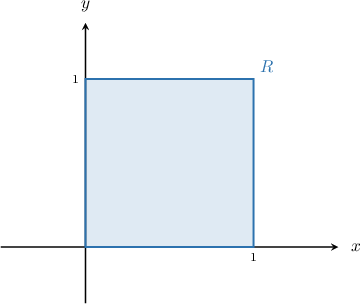

Now consider the function $f(x,y) = 3-x^2-y^2,$ defined over $R,$ shown below.

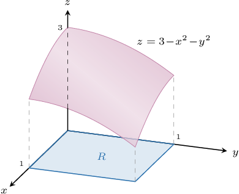

The space underneath the surface and above the region $R$ defines a fixed volume $V.$ Our goal is to find an upper bound for $V.$ We do this by approximating this volume using rectangular solids.

We start by partitioning the $x$- and $y$-intervals of $R.$ Let's pick two subintervals of equal length for both $x$ and $y.$

The region $R$ is now partitioned into $4$ rectangles:

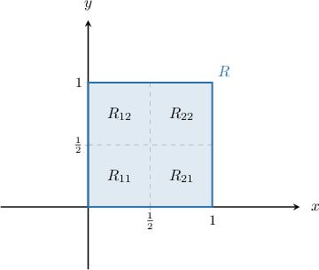

We seek an *upper* bound for the volume $V.$ So, we let $M_{ij}$ be the *largest* value of $f$ in each subregion $R_{ij}.$ We then define a rectangular solid in each subregion whose base is $R_{ij}$ and whose height is $M_{ij}.$

For example, the rectangular solid corresponding to $R_{11}$ is given below.

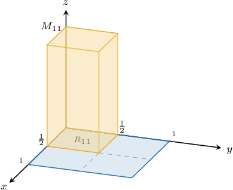

The volume of this rectangular solid is

$$

M_{11}\cdot \textrm{Area}(R_{11}) = \dfrac14M_{11}.

$$

Similarly, the volumes of the rectangular solids formed by the partitions $R_{21}, R_{12},$ and $R_{22}$ respectively are

$$

\dfrac14M_{21}, \qquad \dfrac14M_{12}, \qquad \dfrac14M_{22}.

$$

Drawing all four rectangular solids, we get a volume that looks as follows:

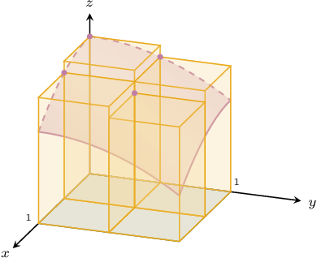

The upper bound $U$ for our volume is the sum of the volumes of our four rectangular solids. This gives

$$

U = \dfrac14(M_{11} + M_{21} + M_{12} + M_{22}).

$$

The number $U$ is called the **upper Riemann sum with respect to the given partition**.

**Note:** We don't yet know the values of $M_{ij},$ the height of each solid. We'll learn to figure these out a little later in the lesson. For now, we will just focus on writing $U$ as an expression of $M_{ij}.$

### Example: Calculating an Expression for the Upper Bound in Terms of Maximum Values

#### Question

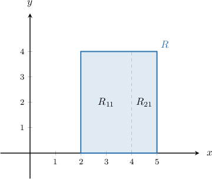

Consider the partition of the rectangular region $R$ shown above and the positive function $f(x,y)$ defined on $R.$ Find an expression for the upper Riemann sum of $f$ with respect to this partition.

**

#### Explanation

To calculate the upper Riemann sum $U$ with respect to the given partition, we compute the sum of the volumes of $2$ rectangular solids, one for each $R_{ij}.$

The volume of the rectangular solid corresponding to each subregion $R_{ij}$ is given by

$$

M_{ij}\cdot \textrm{Area}(R_{ij}).

$$

where $M_{ij}$ denotes the maximum value of $f$ on the subregion $R_{ij}.$ We pick the ** value of $f$ because we're finding the ** sum.

So in our case, we have

$$

U = M_{11}\cdot \textrm{Area}(R_{11}) + M_{21}\cdot \textrm{Area}(R_{21}).

$$

Now, notice that

$$

\textrm{Area}(R_{11}) = 8

$$

and

$$

\textrm{Area}(R_{21}) = 4.

$$

Therefore, we have

$$

\begin{aligned}𝑈 & =8⋅𝑀_{11}+4⋅𝑀_{21} \\ & =8𝑀_{11}+4𝑀_{21}.\end{aligned}

$$

### Calculating the Maximum Value of the Function in Each Partition

Recall the region $R$ that we encountered earlier:

Earlier, we saw that an upper bound for the volume $V$ of

$$

z = f(x,y) = 3-x^2-y^2

$$

defined over the region $R$ with respect to the partition $P$ (shown above) is given by

$$

U = \dfrac14(M_{11} + M_{21}+ M_{12} + M_{22}),

$$

where $M_{ij}$ is the maximum value of $f$ over the subregion $R_{ij}.$ Our goal now is to calculate the values of $M_{ij}.$

We start by considering $M_{11},$ so let's zoom in on $R_{11}\mathbin{:}$

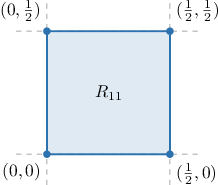

Now, let's take a closer look at the function $f(x,y)\mathbin{:}$

$$

f(x,y) = 3-x^2-y^2

$$

Notice that

- as we *increase* $x,$ the value of $f$ *decreases* (because we're *subtracting* $x^2$), and

- as we *increase* $y,$ the value of $f$ *decreases* (because we're *subtracting* $y^2$).

As a result, the *maximum* value of $f$ in this subregion is attained when we have the *smallest* possible $x$ and the *smallest* possible $y.$ This is the value at the *bottom left corner* of the subregion.

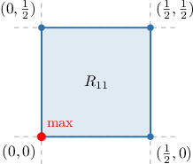

Since the function $f(x,y)$ decreases as $x$ and $y$ increase everywhere on $R,$ the maximum value of $f$ in each subregion $R_{ij}$ *always* occurs at the bottom left corner!

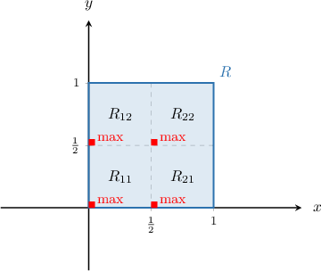

Calculating the value of $f$ at each bottom left corner, we get the following:

$$

\begin{aligned}𝑀_{11} & =𝑓(0,0)=3 \\ 𝑀_{21} & =𝑓(\frac{1}{2},0)=2.75 \\ 𝑀_{12} & =𝑓(0,\frac{1}{2})=2.75 \\ 𝑀_{22} & =𝑓(\frac{1}{2},\frac{1}{2})=2\end{aligned}

$$

Finally, substituting the above values in our expression for $U,$ we get

$$

U = \dfrac14(3+2.75+2.75+2.5) = 2.75.

$$

Remember that $U$ is the *upper* Riemann sum, which is an *upper* bound for the volume between $z=f(x,y)$ and the region $R.$ Therefore, we conclude that the volume between $z = f(x,y)$ and the region $R$ must be smaller than (or equal to) $2.75.$

### Updating Our Notation

We need to introduce just a bit more notation. To help us, let's consider the region $R$ and the partition $P$ shown below.

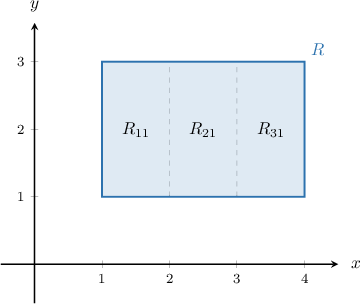

It's convenient to express our region $R$ in a way that does not involve a diagram. We can do this using the Cartesian product.

Using the Cartesian product, we have $R = [1,4]\times [1,3].$

Similarly:

- The partition of the $x$-interval $[1,4]$ can be expressed as $P_1 = \{1,2,3,4\}.$

- The partition of the $y$-interval $[1,3]$ can be expressed as $P_2 = \{1,3\}.$

- Therefore, we can write the partition as $P = P_1\times P_2.$

Finally, we write $U(f,P)$ for the upper Riemann sum of the function $f$ with respect to $P.$

**Note:** We write $U(f,P)$ because the answer we get for the upper bound $U$ depends on the function $f$ and the partition $P$ that we choose. If we choose a different function or partition, then we'll get a different upper bound.

### Example: Calculating an Upper Riemann Sum in the Case of a Strictly Decreasing Function

#### Question

Let $R = [1,5] \times [2,6]$ be a region in the $xy$-plane, and let $f(x,y) = 65-x^2-y^2.$ Further, let $P$ be a partition of $R,$ where

$$

\begin{aligned}𝑃_{1}={1,3,5},\,𝑃_{2}={2,4,6},\,𝑃=𝑃_{1}×𝑃_{2}.\end{aligned}

$$

Calculate the upper Riemann sum $U(f,P).$

#### Explanation

First, let's draw the region $R$ and the partition $P.$

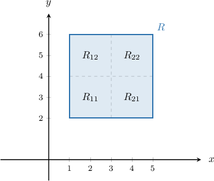

The upper sum $U(f,P)$ is given by

$$

U(f,P) = M_{11}\cdot\textrm{Area}(R_{11}) + M_{21}\cdot\textrm{Area}(R_{21}) + M_{12}\cdot\textrm{Area}(R_{12}) + M_{22}\cdot\textrm{Area}(R_{22}),

$$

where $M_{ij}$ is the ** value of $f$ in each subregion $R_{ij}.$ We pick the ** value of $f$ because we're finding the ** sum.

Taking into account the fact that $\textrm{Area}(R_{ij})=4$ for all $4$ regions, the formula for $U(f,P)$ reduces to

$$

\begin{aligned}𝑈(𝑓,𝑃) & =4⋅𝑀_{11}+4⋅𝑀_{21}+4⋅𝑀_{12}+4⋅𝑀_{22} \\ & =4(𝑀_{11}+𝑀_{21}+𝑀_{12}+𝑀_{22}).\end{aligned}

$$

Now, notice that

- $f(x,y) = 65-x^2-y^2$ decreases as $x$ increases, and

- $f(x,y) = 65-x^2-y^2$ decreases as $y$ increases.

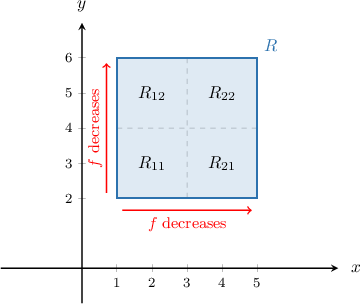

As a result, the ** value of $f$ in each subregion is attained when we have the ** possible $x$ and the ** possible $y.$ This is the value at the ** of each subregion.

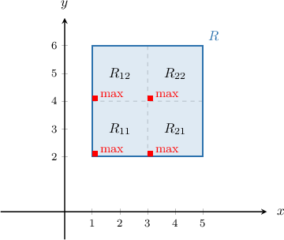

Calculating the value of $f$ at each bottom left corner, we get the following:

$$

\begin{aligned}𝑀_{11} & =𝑓(1,2)=60 \\ 𝑀_{21} & =𝑓(3,2)=52 \\ 𝑀_{12} & =𝑓(1,4)=48 \\ 𝑀_{22} & =𝑓(3,4)=40\end{aligned}

$$

Finally, substituting the above values in our expression for $U,$ we get

$$

\begin{aligned}𝑈(𝑓,𝑃) & =4(60+52+48+40)=800.\end{aligned}

$$

### Example: Calculating an Upper Riemann Sum in the Case of a Strictly Increasing Function

#### Question

Let $R = [0,2]\times [1,3]$ be a region in the $xy$-plane, and let $f(x,y) = x+2y.$ Further, let $P$ be a partition of $R,$ where

$$

\begin{aligned}𝑃_{1}={0,1,2},\,𝑃_{2}={1,2,3},\,𝑃=𝑃_{1}×𝑃_{2}.\end{aligned}

$$

Calculate the upper Riemann sum $U(f,P).$

#### Explanation

First, let's draw the region $R$ and the partition $P.$

The upper sum $U(f,P)$ is given by

$$

U(f,P) = M_{11}\cdot\textrm{Area}(R_{11}) + M_{21}\cdot\textrm{Area}(R_{21}) + M_{12}\cdot\textrm{Area}(R_{12}) + M_{22}\cdot\textrm{Area}(R_{22}),

$$

where $M_{ij}$ is the ** value of $f$ in each subregion $R_{ij}.$ We pick the ** value of $f$ because we're finding the ** sum,

Taking into account the fact that $\textrm{Area}(R_{ij})=1$ for all $4$ subregions, the formula for $U(f,P)$ reduces to

$$

U(f,P) = M_{11} + M_{21} + M_{12} + M_{22}.

$$

Now, notice that

- $f(x,y) = x+2y$ increases as $x$ increases, and

- $f(x,y) = x+2y$ increases as $y$ increases.

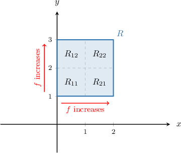

As a result, the ** value of $f$ in each subregion is attained when we have the ** possible $x$ and the ** possible $y$. This is the value at the ** of each subregion.

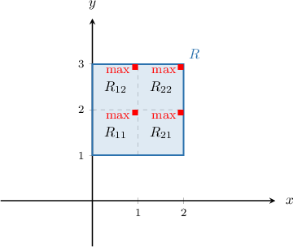

Calculating the value of $f$ at each top right corner, we get the following:

$$

\begin{aligned}𝑀_{11} & =𝑓(1,2)=5 \\ 𝑀_{21} & =𝑓(2,2)=6 \\ 𝑀_{12} & =𝑓(1,3)=7 \\ 𝑀_{22} & =𝑓(2,3)=8\end{aligned}

$$

Finally, substituting the above values in our expression for $U,$ we get

$$

\begin{aligned}𝑈(𝑓,𝑃) & =5+6+7+8=26.\end{aligned}

$$
