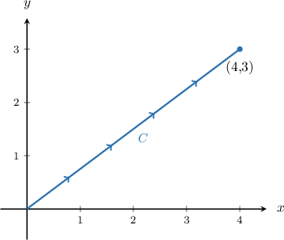
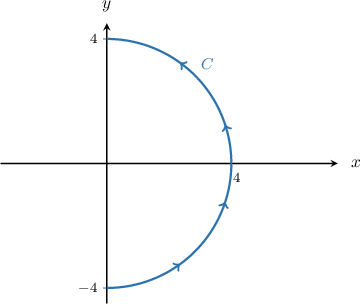
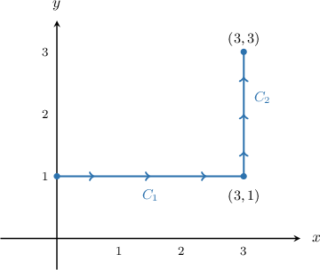
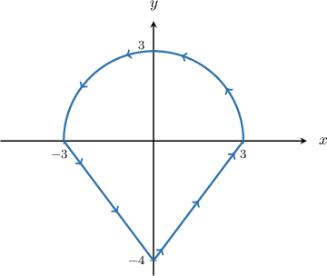
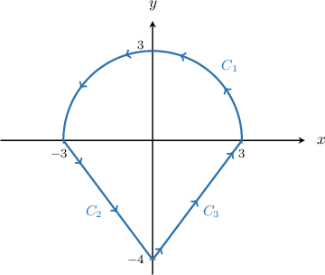

# Properties of Line Integrals of Scalar Functions

Source: https://www.mathacademy.com/topics/3145?courseId=54
Topic ID: 3145

## Prerequisites

- [Cartesian Equations of Parametric Curves](../integrated-math-iii-honors/1255-cartesian-equations-of-parametric-curves.md)
- [Line Integrals of Scalar Functions](./2107-line-integrals-of-scalar-functions.md)

## Lesson

### Introduction

In this lesson, we discuss some properties of line integrals of scalar functions $f(x,y)$ with respect to arc length. Recall that we denote these types of integrals as

$$

\displaystyle\int\limits_C f(x, y) \, \textrm{d}s,

$$

where $C$ is some path in the $xy$-plane. The first property we'll consider is the line integral of **unity**, i.e., $f(x,y) = 1.$

Firstly, by setting $f(x,y) = 1,$ we can write our line integral as

$$

\displaystyle\int\limits_C \, \textrm{d}s.

$$

Now suppose that $C$ is the path along the line segment from $(0,0)$ to $(4,3),$ as shown below.

As it turns out, the line integral with respect to arc length of unity along a path $C$ equals the arc length of $C.$

In this case, the arc length of $C$ is given by the length of the hypotenuse of a right triangle. Therefore, by the Pythagorean theorem, we have

$$

\displaystyle\int\limits_C \, \textrm{d}s = \sqrt{4^2+3^2} = 5.

$$

### Example: Calculating Line Integrals of Unity

#### Question

Calculate $\displaystyle\int_C \,\textrm d s,$ where $C$ is the arc of a semicircle of radius $4$ traversed once in the counterclockwise direction, as shown above.

#### Explanation

The line integral of unity with respect to arc length over $C$ is equal to the arc length $L$ of $C,$ i.e.,

$$

\int_C \,\textrm d s = L.

$$

In this case, $C$ is a semicircle of radius $r = 4.$ Its arc length is given by

$$

\begin{aligned}𝐿=𝜋𝑟=4𝜋.\end{aligned}

$$

Therefore,

$$

\int_C \,\textrm d s = 4\pi.

$$

### Calculating Line Integrals Over Piecewise-Smooth Curves

Let's once again consider the line integral with respect to arc length of $f(x,y),$ given by

$$

\displaystyle\int\limits_C f(x, y) \, \textrm{d}s

$$

where $C = C_1\cup C_2$ is the **piecewise-smooth** path shown below.

We can show that the line integral along the entire path $C$ equals the sum of the line integrals across the paths $C_1$ and $C_2\mathbin{:}$

$$

\int_{C}f(x,y)\,\textrm d s = \int_{C_1}f(x,y)\,\textrm d s + \int_{C_2}f(x,y)\,\textrm d s

$$

So, if $f(x,y)=1,$ then we have

$$

\begin{aligned}∫_{𝐶}\,d𝑠 & =∫_{𝐶_{1}}\,d𝑠+∫_{𝐶_{2}}\,d𝑠 \\ & =3+2 \\ & =5.\end{aligned}

$$

This result naturally extends to line integrals across piecewise-smooth paths comprised of three or more parts. Let's see an example.

### Example: Calculating Line Integrals Over Piecewise-Smooth Curves

#### Question

Calculate $\displaystyle\int_C \,\textrm d s,$ where $C$ is the path shown above, traversed once counterclockwise.

#### Explanation

The path $C$ is made up of three parts, as shown below:

Now, we make use of the following facts:

- If $C = C_1 \cup C_2 \cup C_3$ is a piecewise-smooth curve, we have

- The line integral of unity with respect to arc length over $C$ is equal to the arc length $L$ of $C,$ i.e.,

The path $C_1$ is a semicircle of radius $r = 3.$ Therefore, we have

$$

\int_{C_1} \,\textrm ds = \dfrac{1}{2}(2 \pi r) = 3\pi.

$$

The paths $C_2$ and $C_3$ are hypotenuses of right triangles whose legs have lengths $3$ and $4.$ Therefore, we have

$$

\int_{C_2} \,\textrm ds = \int_{C_3} \,\textrm ds = \sqrt{3^2 + 4^2} = 5.

$$

Therefore,

$$

\int_C \,\textrm d s = 3\pi + 5 + 5 = 3\pi + 10.

$$

### Independence of Parametrization and Orientation

Let's once again consider the line integral with respect to arc length of $f(x,y)\mathbin{:}$

$$

\displaystyle\int\limits_C f(x, y) \, \textrm{d}s

$$

There are two more important properties of this type of line integral that we need to be aware of.

- There is usually more than one way to parametrize a curve. However, line integrals with respect to arc length are *independent of the choice of parametrization*. In other words, we get the same result regardless of which parametrization we choose. For example, the paths $C_1$ and $C_2,$ given by both traverse a circle of radius $1$ once in the counterclockwise direction starting from $(1,0).$ However, since line integrals with respect to arc length are independent of parametrization, we have

- Line integrals with respect to arc length are also *independent of the orientation* of $C.$ For example, suppose that $C$ is a path along a particular curve traversed from the point $A$ to the point $B.$ Then, $-C$ is a path along the same curve but traversed from $B$ to $A,$ as shown below. Independence of orientation means that

- Finally, it's important to mention that all of the properties discussed in this lesson apply to line integrals with respect to arc length over space curves, i.e., line integrals of the form $\displaystyle\int_{C} f(x,y,z)\,\textrm d s.$

### Example: Applying Independence of Parametrization and Orientation

#### Question

Consider the curves $C_1$ and $C_2,$ defined parametrically as follows:

$$

\begin{aligned}𝐶_{1}:\,𝐫_{1}(𝑡) & =⟨\frac{1}{9}𝑡^{3},\,𝑡⟩, & 0≤𝑡≤3 \\ 𝐶_{2}:\,𝐫_{2}(𝑢) & =⟨3𝑢^{3},\,3𝑢⟩, & 0≤𝑢≤1\end{aligned}

$$

Now suppose $\displaystyle\int_{C_1} f(x,y)\,\textrm ds = k$ for some function $f(x,y)$ and real number $k.$ Which of the following must be true?

1. $\displaystyle\int_{C_2} f(x,y)\,\textrm ds = 3k$

2. $\displaystyle\int_{C_2} f(x,y)\,\textrm ds = k$

3. $\displaystyle\int_{-C_1} f(x,y)\,\textrm ds = k$

#### Explanation

Line integrals with respect to arc length are independent of the choice of parametrization and orientation.

With that in mind, let's examine each statement.

- Statement I is false, while statement II is true. Notice that $C_1$ and $C_2$ are different parameterizations of the same curve. Since line integrals with respect to arc length are independent of the choice of parameterization, we have To see that $C_1$ and $C_2$ represent the same curve, we can convert each parametrization to Cartesian form. In doing so, we find that both parameterizations give the Cartesian curve

- Statement III is true. Reversing the curve's orientation does ** change the value of a line integral with respect to arc length. Therefore, we have

Therefore, the correct answer is "II and III only."
