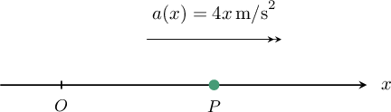
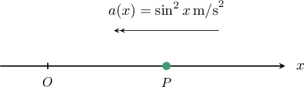
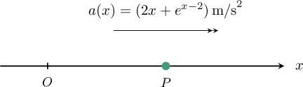
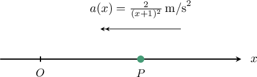

# Velocity and Acceleration as Functions of Displacement

Source: https://www.mathacademy.com/topics/3235?courseId=54
Topic ID: 3235

## Prerequisites

- [Solving First-Order IVPs Using Separation of Variables](../ap-calculus-ab/1179-solving-first-order-ivps-using-separation-of-variables.md)
- [Modeling With First-Order ODEs](../ap-calculus-ab/2023-modeling-with-first-order-odes.md)
- [Calculating the Displacement of a Particle Using Integration](../ap-calculus-ab/3576-calculating-the-displacement-of-a-particle-using-integration.md)

## Lesson

### Introduction

Suppose that a particle $P$ moves along the $x$-axis with acceleration $a(t),$ velocity $v(t)$ and displacement $x(t),$ where $t$ is the time. If we want to calculate the acceleration of $P,$ we use the relationship

$$

a(t) = \dfrac{\textrm d v}{\textrm d t}.

$$

Similarly, if we know the acceleration and we want to find the velocity, we use the relationship

$$

v(t) = \int a(t)\,\textrm d t.

$$

In both of these relationships, we require $a$ and $v$ to be expressed as functions of $t.$

Now suppose that we're given the acceleration as a function of the displacement $x.$ How do we calculate the velocity in this case?

For example, suppose that the acceleration of a particle is given by $a(x) = 4x\,\textrm{m/s}^2.$ A sketch of the situation is shown below.

Since the acceleration of the particle $P$ equals $4x,$ we have

$$

\dfrac{\textrm{d}v}{\textrm{d}t} = 4x.

$$

Using the chain rule for differentiation, we can rewrite the left-hand side of this equation as

$$

\begin{aligned}\frac{d𝑣}{d𝑥}⋅\frac{d𝑥}{d𝑡}=4𝑥.\end{aligned}

$$

Now, since $v= \dfrac{\textrm{d}x}{\textrm{d}t}$ by definition, we have

$$

v \dfrac{\textrm{d}v}{\textrm{d}x} = 4x.\qquad \qquad (\ast)

$$

Also, by the chain rule for differentiation, we have

$$

\dfrac{\textrm d }{\textrm d x}(v^2) = 2v\dfrac{\textrm d v}{\textrm d x} \quad\Longrightarrow\quad \dfrac{\textrm d }{\textrm d x}\left(\dfrac12v^2\right) = v\dfrac{\textrm d v}{\textrm d x}.

$$

Therefore, we can write the differential equation $(\ast)$ as

$$

\dfrac{\textrm d }{\textrm d x}\left(\dfrac12v^2\right) = 4x.

$$

By solving this differential equation, we can find an expression for the velocity $v$ in terms of displacement $x.$

Let's see another example.

### Example: Finding a Differential Equation That Relates the Velocity and Displacement of a Particle

#### Question

A particle $P$ moves along the $x$-axis where $x>0$. When the displacement of $P$ from the origin $O$ is $x$ meters, its velocity is $v\, \rm{m/s}$ and the magnitude of its acceleration is $\sin^2 x \,\rm{m/s}^2.$ Given that the acceleration is directed toward $O,$ what differential equation describes this motion?

#### Explanation

Since the acceleration of the particle $P$ has magnitude $\sin^2 x$ and is directed ** $O,$ we have

$$

\dfrac{\textrm{d}v}{\textrm{d}t} = -\sin^2 x.

$$

Using the chain rule for differentiation, we can rewrite this equation as

$$

\begin{aligned}\frac{d𝑣}{d𝑥}⋅\frac{d𝑥}{d𝑡}=−sin^{2}⁡𝑥.\end{aligned}

$$

Now, since $v= \dfrac{\textrm{d}x}{\textrm{d}t},$ we have

$$

v \dfrac{\textrm{d}v}{\textrm{d}x} = -\sin^2 x.\qquad \qquad (\ast)

$$

Finally, using the fact that

$$

\dfrac{\textrm d }{\textrm d x}(v^2) = 2v\dfrac{\textrm d v}{\textrm d x} \quad\Longrightarrow\quad \dfrac{\textrm d }{\textrm d x}\left(\dfrac12v^2\right) = v\dfrac{\textrm d v}{\textrm d x},

$$

we can write our differential equation $(\ast)$ as

$$

\dfrac{\textrm d }{\textrm d x}\left(\dfrac12v^2\right) = -\sin^2 x.

$$

### Example: Solving a Differential Equation That Relates the Velocity and Displacement of a Particle

#### Question

A particle $P$ moves along the $x$-axis in the direction of increasing $x,$ away from a fixed origin $O.$ When the displacement of $P$ from $O$ is $x \,\rm{m},$ its velocity is $v\,\rm{m/s}$ and its acceleration is $(2x + e^{x-2}) \, \rm{m/s}^2.$ If $v = 4 \, \rm{m/s}$ when $x = 2 \, \textrm m,$ find the velocity of $P$ when $x = 1 \, \textrm m.$ Round your answer to two decimal places.

#### Explanation

Since the acceleration of the particle $P$ is $(2x + e^{x-2}) \,\rm{m/s}^2,$ we have

$$

\dfrac{\textrm{d}v}{\textrm{d}t} = 2x + e^{x-2}.

$$

Using the fact that

$$

\dfrac{\textrm{d}v}{\textrm{d}t}= \dfrac{\textrm{d}}{\textrm{d}x}\left(\dfrac{1}{2}v^2\right)

$$

we can rewrite our equation as

$$

\dfrac{\textrm{d}}{\textrm{d}x}\left(\dfrac{1}{2}v^2\right) = 2x + e^{x-2}.

$$

Integrating both sides of the above equation with respect to $x,$ we have

$$

\begin{aligned}∫\frac{d}{d𝑥}(\frac{1}{2}𝑣^{2})\,d𝑥 & =∫(2𝑥+𝑒^{𝑥−2})\,d𝑥\end{aligned}

$$

which gives the general solution

$$

\dfrac{1}{2}v^2 = x^2 + e^{x-2} + C.

$$

Now, since $v = 4 \, \rm{m/s}$ when $x = 2 \, \textrm m,$ we can find the value of the constant $C$, as follows:

$$

\begin{aligned}\frac{1}{2}(4)^{2} & =2^{2}+𝑒^{2−2}+𝐶 \\ 8 & =4+1+𝐶 \\ 𝐶 & =3\end{aligned}

$$

Therefore,

$$

\begin{aligned}\frac{1}{2}𝑣^{2} & =𝑥^{2}+𝑒^{𝑥−2}+3 \\ 𝑣^{2} & =2(𝑥^{2}+𝑒^{𝑥−2}+3) \\ 𝑣 & =±\sqrt{√2(𝑥^{2}+𝑒^{𝑥−2}+3)}.\end{aligned}

$$

Since the particle is moving in the direction of increasing $x,$ we have that $v(x) \gt 0,$ so we can discard the negative square root. Therefore,

$$

v = \sqrt{2\left(x^2 + e^{x-2} + 3\right)}.

$$

Finally, the velocity of $P$ at $x = 1$ is given by

$$

\begin{aligned}𝑣 & =\sqrt{√2(1^{2}+𝑒^{1−2}+3)} \\ & =\sqrt{√2(4+𝑒^{−1})} \\ & ≈2.96\,m/s,\end{aligned}

$$

rounded to two decimal places.

### Example: Calculating the Displacement of a Particle as a Function of Time

#### Question

A particle $P$ moves along the $x$-axis in the direction of increasing $x$ where $x\geq 0.$ When the displacement of $P$ from the origin $O$ is $x\,\textrm m,$ the magnitude of its acceleration is $\dfrac{2}{(x+1)^2}\, \rm{m/s}^2$ and is directed toward $O.$ Initially, $P$ is at the origin $O$ and has velocity $v=2\,\rm{m/s}.$ Find $x$ as a function of time $t.$

#### Explanation

Since the acceleration of the particle $P$ has magnitude $\dfrac{2}{(x+1)^2}\, \rm{m/s}^2$ and is directed ** $O,$ we have

$$

\dfrac{\textrm{d}v}{\textrm{d}t} =-\dfrac{2}{(x+1)^2}.

$$

Using the fact that

$$

\dfrac{\textrm{d}v}{\textrm{d}t}= \dfrac{\textrm{d}}{\textrm{d}x}\left(\dfrac{1}{2}v^2\right)

$$

we can rewrite our equation as

$$

\dfrac{\textrm{d}}{\textrm{d}x}\left(\dfrac{1}{2}v^2\right) = -\dfrac{2}{(x+1)^2}.

$$

Integrating both sides of the above equation with respect to $x,$ we have

$$

\begin{aligned}∫\frac{d}{d𝑥}(\frac{1}{2}𝑣^{2})\,d𝑥 & =∫−\frac{2}{(𝑥+1)^{2}}d𝑥\end{aligned}

$$

which gives the general solution

$$

\begin{aligned}\frac{1}{2}𝑣^{2} & =\frac{2}{𝑥+1}+𝐾.\end{aligned}

$$

Now, since $v=2\,\rm{m/s}$ when $x=0\, \textrm{m},$ we can find the value of the constant $K,$ as follows:

$$

\begin{aligned}\frac{1}{2}𝑣^{2} & =\frac{2}{𝑥+1}+𝐾 \\ \frac{1}{2}(2)^{2} & =\frac{2}{0+1}+𝐾 \\ 2 & =2+𝐾 \\ 𝐾 & =0\end{aligned}

$$

Therefore,

$$

\begin{aligned}\frac{1}{2}𝑣^{2} & =\frac{2}{𝑥+1} \\ 𝑣^{2} & =\frac{4}{𝑥+1} \\ 𝑣 & =±\frac{2}{\sqrt{√𝑥+1}}.\end{aligned}

$$

Since the particle is moving in the direction of increasing $x,$ we have that $v(x) > 0,$ so we can discard the negative square root. Therefore,

$$

v(x) = \dfrac{2}{\sqrt{x+1}}.

$$

Now, we know that $v= \dfrac{\textrm{d}x}{\textrm{d}t}.$ Therefore, we have the equation

$$

\dfrac{\textrm{d}x}{\textrm{d}t} = \dfrac{2}{\sqrt{x+1}}.

$$

Separating the variables and integrating both sides with respect to $t,$ we have

$$

\begin{aligned}\frac{d𝑥}{d𝑡} & =\frac{2}{\sqrt{√𝑥+1}} \\ \sqrt{√𝑥+1}\,\frac{d𝑥}{d𝑡} & =2 \\ ∫\sqrt{√𝑥+1}\,\frac{d𝑥}{d𝑡}\,d𝑡 & =∫2\,d𝑡 \\ ∫\sqrt{√𝑥+1}\,d𝑥 & =∫2\,d𝑡 \\ \frac{2}{3}(𝑥+1)^{3/2} & =2𝑡+𝐶_{1} \\ (𝑥+1)^{3/2} & =3𝑡+𝐶\end{aligned}

$$

where $C = \dfrac{3C_1}{2}.$

We're given that $x=0$ when $t=0.$ Therefore, $C=1,$ and the particular solution is

$$

(x+1)^{3/2} =3t+1.

$$

Finally, writing $x$ in terms of $t,$ we have

$$

\begin{aligned}(𝑥+1)^{3/2} & =3𝑡+1 \\ 𝑥+1 & =(3𝑡+1)^{2/3} \\ 𝑥 & =(3𝑡+1)^{2/3}−1.\end{aligned}

$$
