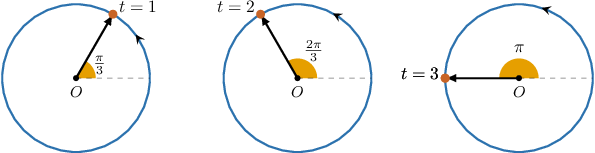
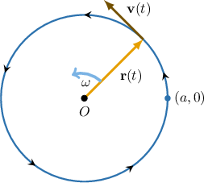

# Circular Motion About the Origin

Source: https://www.mathacademy.com/topics/3338?courseId=54
Topic ID: 3338

## Prerequisites

- [Calculating Acceleration for Plane Motion Using Differentiation](../ap-calculus-bc/825-calculating-acceleration-for-plane-motion-using-differentiation.md)

## Lesson

### Introduction

Consider the unit circle configured in the usual way in the coordinate plane. Suppose a particle $P$ is initially at the point $(1,0)$ and moves counterclockwise along the unit circle with a fixed **angular velocity** of $\dfrac\pi3$ **radians per second.**

The first three seconds of the particle's motion are illustrated below.

Since the angular velocity is constant, we refer to this as **uniform circular motion**. This fixed angular velocity is denoted $\omega,$ and we write

$$

\omega = \dfrac\pi 3\,\textrm{rad/s}.

$$

Now, let $\mathbf r(t)$ be the position vector of $P$ at time $t.$ Then, we have

$$

\mathbf {r}(t)= \cos\left(\dfrac{\pi t}{3}\right) \, \mathbf i + \sin\left(\dfrac{\pi t}{3}\right) \,\mathbf j.

$$

It's worth building a picture of why this formula is true:

- We know that $\mathbf r(\theta) = \cos\theta\,\mathbf i + \sin\theta\,\mathbf j$ traces out a unit circle, starting at the point $(1,0).$

- We can see from the picture that $P$ will return to the starting position after $t=6$ seconds, so the angular frequency of the motion is Therefore, we have

Notice that $P$ indeed returns to its starting location when $t=6{:}$

$$

\begin{aligned}𝐫(6) & =cos⁡(\frac{6𝜋}{3})\,𝐢+sin⁡(\frac{6𝜋}{3})\,𝐣 \\ & =cos⁡(2𝜋)\,𝐢+sin⁡(2𝜋)\,𝐣 \\ & =cos⁡(0)\,𝐢+sin⁡(0)\,𝐣 \\ & =𝐫(0).\end{aligned}

$$

In general, if a particle moves counterclockwise along a circle of radius $R$ centered at $O$ with initial position $(R,0),$ then its position vector $\mathbf r(t)$ is given by

$$

\mathbf {r}(t)= R\left(\cos\omega t \, \mathbf i + \sin\omega t \,\mathbf j\right)\!\,.

$$

Note that for clockwise motion, we have $\omega < 0.$

Let's see an example.

### Example: Finding the Position Function of an Object Moving With Circular Motion

#### Question

A particle moves along a **** circular path with center $O$ in the $xy$-plane with a constant angular velocity of $3 \textrm{rad/s}.$ Given that the object is at the position $(7,0)$ when $t=0,$ find the position function of the particle.

#### Explanation

The position function of a particle moving in a circular path of radius $R$ in the $xy$-plane with a constant angular velocity $\omega$ is given by

$$

\mathbf {r}(t)= R\left(\cos \omega t \, \mathbf i + \sin \omega t \,\mathbf j\right),

$$

where it is assumed that the circle is centered at $O,$ and particle is at the position $(R,0)$ when $t=0.$

Since the object's initial position is $(7,0),$ we have that $\mathbf r(0)=\,7\mathbf i,$ and we can conclude that the radius of the circle $R=7.$

Therefore, since we have $R=7$ and $\omega= -3 \textrm{rad/s}$ (negative because the motion is clockwise), we get that the position function is given by

$$

\begin{aligned}𝐫(𝑡) & =7(cos⁡(−3𝑡)\,𝐢+sin⁡(−3𝑡)\,𝐣) \\ & =7(cos⁡3𝑡\,𝐢−sin⁡3𝑡\,𝐣).\end{aligned}

$$

### Linear vs. Angular Velocity

Suppose a particle $P$ moves along a circle of radius $R$ centered at the origin in the $xy$-plane.

Note the following:

- The **position vector** $\mathbf r$ extends from the origin to $P$ in the *radial* direction, while

- the **velocity vector** $\mathbf v$ points in the direction of the particle's motion, *tangential* to the circle.

First, let's assume that $P$ is at the point $(R,0)$ when $t=0.$ Then, we have

$$

\mathbf r(t) = R\left(\cos\omega t \, \mathbf i + \sin\omega t \,\mathbf j\right).

$$

We can easily derive a convenient formula relating $\mathbf v$ and $\omega$ by differentiating $\mathbf r(t){:}$

Differentiating once, we get

$$

\begin{aligned}𝐯(𝑡) & =𝐫^{′}(𝑡) \\ & =(𝑅(cos⁡𝜔𝑡\,𝐢+sin⁡𝜔𝑡\,𝐣))^{′} \\ & =𝑅𝜔(−sin⁡𝜔𝑡\,𝐢+cos⁡𝜔𝑡\,𝐣).\end{aligned}

$$

By computing the magnitude of this vector, we see that

$$

\begin{aligned}||𝐯||^{2} & =𝑅^{2}𝜔^{2}((−sin⁡𝜔𝑡)^{2}+(cos⁡𝜔𝑡)^{2}) \\ & =𝑅^{2}𝜔^{2}(sin^{2}⁡𝜔𝑡+cos^{2}⁡𝜔𝑡) \\ & =𝑅^{2}𝜔^{2}.\end{aligned}

$$

Taking the square root, we get

$$

||\mathbf v || = R|\omega|.

$$

Note that while the magnitude of the velocity vector (i.e., the speed) is constant, its direction is continuously changing, which means that an object in uniform circular motion also experiences *acceleration* (more on this shortly).

### Example: Finding the Velocity and Speed of a Particle Moving With Circular Motion

#### Question

An object moves along a circular path with position $\mathbf {r}(t)= 5\cos \pi t \, \mathbf i + 5\sin \pi t \,\mathbf j$ meters. Find the speed of the object at time $t,$ measured in seconds.

#### Explanation

****

First, we find the velocity vector by differentiating the position vector. We get

$$

\begin{aligned}𝐯(𝑡) & =(𝐫(𝑡))^{′} \\ & =(5cos⁡𝜋𝑡\,𝐢+5sin⁡𝜋𝑡\,𝐣)^{′} \\ & =−5𝜋sin⁡𝜋𝑡\,𝐢+5𝜋cos⁡𝜋𝑡\,𝐣.\end{aligned}

$$

To find the speed, we calculate the magnitude of the velocity vector as follows:

$$

\begin{aligned}||𝐯(𝑡)|| & =\sqrt{√(−5𝜋sin⁡𝜋𝑡)^{2}+(5𝜋cos⁡𝜋𝑡)^{2}} \\ & =\sqrt{√25𝜋^{2}sin^{2}⁡𝜋𝑡+25𝜋^{2}cos^{2}⁡𝜋𝑡} \\ & =\sqrt{√25𝜋^{2}(sin^{2}⁡𝜋𝑡+cos^{2}⁡𝜋𝑡)} \\ & =5𝜋\end{aligned}

$$

Therefore, the object's speed is $5 \pi \textrm{m/s}.$

Note that the speed is constant, but the velocity is not.

****

For uniform circular motion in the $xy$-plane, we have

$$

||\mathbf v|| = R|\omega|,

$$

where $R$ is the radius of the circle, and $\omega$ is the angular velocity.

In our case, the radius of the circle is $R=5\,\textrm m$ and the angular frequency $\omega = \pi \,\textrm{rad/s}.$ Therefore,

$$

||\mathbf v|| = 5\cdot |\pi| = 5\pi \textrm{ m/s}.

$$

### The Acceleration Vector

Let's return to our particle $P$ moving along a circle of radius $R$ centered at the origin in the $xy$ plane.

Once again, let's assume that $P$ is at the point $(R,0)$ when $t=0.$ Then, we have

$$

\mathbf r(t) = R\left(\cos\omega t \, \mathbf i + \sin\omega t \,\mathbf j\right).

$$

Differentiating, we get the velocity vector $\mathbf v{:}$

$$

\mathbf v(t) =R\omega\left(-\sin\omega t \, \mathbf i + \cos\omega t \,\mathbf j\right)

$$

Differentiating once more, we get an expression for the acceleration vector:

$$

\begin{aligned}𝐚(𝑡) & =𝐯^{′}(𝑡) \\ & =𝑅𝜔(−sin⁡𝜔𝑡\,𝐢+cos⁡𝜔𝑡\,𝐣)^{′} \\ & =𝑅𝜔(−𝜔cos⁡𝜔𝑡\,𝐢−𝜔sin⁡𝜔𝑡\,𝐣) \\ & =−𝜔^{2}⋅𝑅(cos⁡𝜔𝑡\,𝐢+sin⁡𝜔𝑡\,𝐣) \\ & =−𝜔^{2}𝐫\end{aligned}

$$

To summarize,

$$

\mathbf a = -\omega^2 \mathbf r.

$$

Therefore, the acceleration vector acts in the *opposite* direction to $\mathbf r.$ In other words, $\mathbf a$ points *toward the center of the circle*. Moreover, we have

$$

||\mathbf a|| = \omega^2 || \mathbf r ||.

$$

### Example: Finding the Acceleration of a Particle Moving With Circular Motion

#### Question

An object moves along a circular path with position $\mathbf {r}(t)= 4(\cos 3t\, \mathbf i + \sin 3t\, \mathbf j)$ meters. Find the magnitude of the acceleration of the object at time $t,$ measured in seconds.

#### Explanation

****

First, we find the velocity vector by differentiating the position vector. We get

$$

\begin{aligned}𝐯(𝑡) & =(𝐫(𝑡))^{′} \\ & =(4(cos⁡3𝑡\,𝐢+sin⁡3𝑡\,𝐣))^{′} \\ & =−12sin⁡3𝑡\,𝐢+12cos⁡3𝑡\,𝐣.\end{aligned}

$$

Then, we find the acceleration vector by differentiating the velocity vector.

$$

\begin{aligned}𝐚(𝑡) & =(𝐯(𝑡))^{′} \\ & =(−12sin⁡3𝑡\,𝐢+12cos⁡3𝑡\,𝐣)^{′} \\ & =−36cos⁡3𝑡\,𝐢−36sin⁡3𝑡\,𝐣\end{aligned}

$$

Finally, we calculate the magnitude of the acceleration as follows:

$$

\begin{aligned}||𝐚(𝑡)|| & =\sqrt{√(−36cos⁡3𝑡)^{2}+(−36sin⁡3𝑡)^{2}} \\ & =\sqrt{√36^{2}cos^{2}⁡3𝑡+36^{2}sin^{2}⁡3𝑡} \\ & =\sqrt{√36^{2}} \\ & =36\end{aligned}

$$

Therefore, the magnitude of the acceleration is $36\, \textrm{m/s}^2.$

Note that $||\mathbf a||$ is constant, but $\mathbf a$ is not.

****

For uniform circular motion in the $xy$-plane, we have

$$

\mathbf a = -\omega^2\mathbf r \qquad \Rightarrow \qquad ||\mathbf a|| = \omega^2||\mathbf r||.

$$

In our case, the radius of the circle is $R=4\,\textrm m$ and the angular frequency $\omega = 3\,\textrm{rad/s}.$ Therefore,

$$

||\mathbf a|| = 3^2\cdot |4| = 36\, \textrm{m/s}^2.

$$
