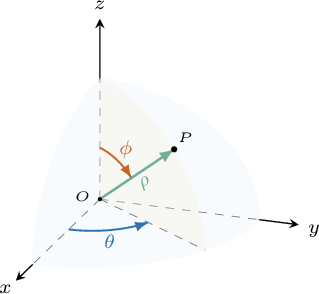

# Parametrizations of Ellipsoids and Cones

Source: https://www.mathacademy.com/topics/3371?courseId=54
Topic ID: 3371

## Prerequisites

- [Parametric Surfaces](./1789-parametric-surfaces.md)
- [Elliptic Cones](./1894-elliptic-cones.md)
- [Surfaces in Cylindrical Polar Coordinates](./3569-surfaces-in-cylindrical-polar-coordinates.md)
- [Surfaces in Spherical Polar Coordinates](./3570-surfaces-in-spherical-polar-coordinates.md)

## Lesson

### Introduction

Recall that if $(\rho, \theta, \phi)$ are the *spherical* polar coordinates of a point $P$ in the three-dimensional space, then its Cartesian coordinates $(x,y,z)$ can be found using the following formulas:

$$

x = \rho\cos\theta\sin\phi, \qquad y = \rho\sin\theta\sin\phi, \qquad z = \rho\cos\phi

$$

With that in mind, let's find a parametrization of the sphere whose cartesian equation is

$$

x^2+y^2+z^2=1.

$$

This equation represents a unit sphere (i.e., a sphere of radius $1$) centered at the origin.

Given a point $P$ on the sphere, the variable $\rho$ represents the *radial* distance between the origin and $P.$ Since every point on the sphere is a distance of $1$ from $O,$ we must have $\rho =1$ at every point on the sphere.

Therefore, for any point $(x,y,z)$ on our surface, we obtain the following:

$$

\begin{aligned}𝐟(𝜃,𝜙) & =⟨𝑥,𝑦,𝑧⟩ \\ & =⟨𝜌cos⁡𝜃sin⁡𝜙,\,𝜌sin⁡𝜃sin⁡𝜙,\,𝜌cos⁡𝜙⟩ \\ & =⟨1⋅cos⁡𝜃sin⁡𝜙,\,1⋅sin⁡𝜃sin⁡𝜙,\,1⋅cos⁡𝜙⟩ \\ & =⟨cos⁡𝜃sin⁡𝜙,\,sin⁡𝜃sin⁡𝜙,\,cos⁡𝜙⟩\end{aligned}

$$

where $\theta \in [0,2\pi)$ and $\phi \in [-\pi,\pi].$ As a result, the vector-valued function

$$

\mathbf{f}(\theta,\phi) = \big\langle \cos\theta\sin\phi, \: \sin\theta\sin\phi, \: \cos\phi \big\rangle, \qquad \theta \in [0,2\pi), \quad \phi \in [-\pi,\pi],

$$

represents a parametrization of our sphere.

**Watch out!** There are many possible parameterizations of the given sphere. Here, we found one of them.

### Example: Finding a Parametrization of a Sphere Using Spherical Coordinates

#### Question

$$

\mathbf{f}(\theta,\phi) = \big\langle 5 \cos\theta\sin\phi, \: \boxed{\phantom{0}}, \: 5 \cos\phi \big\rangle

$$

The vector-valued function $\mathbf{f}(\theta,\phi)$ above parametrizes the sphere defined in Cartesian coordinates as $x^2+y^2+z^2=25.$ What is the second component of $\mathbf{f}?$

#### Explanation

The given equation generates a sphere of radius $5$ centered at the origin. In spherical polar coordinates, this sphere has the equation $\rho =5.$

If $(\rho, \theta, \phi)$ are the spherical polar coordinates of a point, then its Cartesian coordinates $(x,y,z)$ can be found using the following formulas:

$$

x = \rho\cos\theta\sin\phi, \qquad y = \rho\sin\theta\sin\phi, \qquad z = \rho\cos\phi.

$$

Now, for any point $(x,y,z)$ on our surface, we obtain the following:

$$

\begin{aligned}𝐟(𝜃,𝜙) & =⟨𝑥,𝑦,𝑧⟩ \\ & =⟨𝜌cos⁡𝜃sin⁡𝜙,\,𝜌sin⁡𝜃sin⁡𝜙,\,𝜌cos⁡𝜙⟩ \\ & =⟨5⋅cos⁡𝜃sin⁡𝜙,\,5⋅sin⁡𝜃sin⁡𝜙,\,5⋅cos⁡𝜙⟩ \\ & =⟨5cos⁡𝜃sin⁡𝜙,\,5sin⁡𝜃sin⁡𝜙,\,5cos⁡𝜙⟩\end{aligned}

$$

where $\theta \in [0,2\pi)$ and $\phi \in [-\pi,\pi].$

Therefore, the second component of $\mathbf{f}$ is ${\color{black} 5 \sin\theta\sin\phi}.$

### Example: Finding a Parametrization of an Ellipsoid Using Spherical Coordinates

#### Question

$$

\mathbf{f}(\theta,\phi) = \big\langle \boxed{\phantom{0}} , \: 5\sin\theta\sin\phi, \: 4\cos\phi\big\rangle

$$

The vector-valued function $\mathbf{f}(\theta,\phi)$ above parametrizes the ellipsoid defined in Cartesian coordinates as

$$

\dfrac{x^2}{36}+\dfrac{y^2}{25}+\dfrac{z^2}{16}=1.

$$

What is the first component of $\mathbf{f}?$

#### Explanation

First, we make the following substitution:

$$

x = 6X, \qquad y =5 Y, \qquad z = 4Z

$$

Substituting the above into the Cartesian equation of our ellipsoid, we get

$$

X^2 + Y^2 + Z^2 = 1,

$$

which is the equation of a sphere of radius $1$ centered at the origin in $(X,Y,Z)$ coordinates. In spherical polar coordinates, this sphere has the equation $\rho =1.$

If $(\rho, \theta, \phi)$ are the spherical polar coordinates of a point, then its $(X,Y,Z)$ coordinates can be found using the following formulas:

$$

X = \rho\cos\theta\sin\phi, \qquad Y = \rho\sin\theta\sin\phi, \qquad Z = \rho\cos\phi.

$$

Now, for any point $(x,y,z)$ on our surface, we obtain the following:

$$

\begin{aligned}𝐟(𝜃,𝜙) & =⟨𝑥,𝑦,𝑧⟩ \\ & =⟨6𝑋,5𝑌,4𝑍⟩ \\ & =⟨6𝜌cos⁡𝜃sin⁡𝜙,\,5𝜌sin⁡𝜃sin⁡𝜙,\,4𝜌cos⁡𝜙⟩ \\ & =⟨6⋅1⋅cos⁡𝜃sin⁡𝜙,\,5⋅1⋅sin⁡𝜃sin⁡𝜙,\,4⋅1⋅cos⁡𝜙⟩ \\ & =⟨6cos⁡𝜃sin⁡𝜙,\,5sin⁡𝜃sin⁡𝜙,\,4cos⁡𝜙⟩\end{aligned}

$$

where $\theta \in [0,2\pi)$ and $\phi \in [-\pi,\pi].$

Therefore, the first component of $\mathbf{f}$ is ${\color{black}6\cos\theta\sin\phi}.$

### Example: Finding a Parametrization of a Cone Using Cylindrical Coordinates

#### Question

$$

\mathbf{f}(r,\theta) = \big\langle \boxed{\phantom{0}}, \: 6r\sin\theta, \: r \big\rangle, \qquad r \geq 0

$$

The vector-valued function $\mathbf{f}(r,\theta)$ above parametrizes the half-cone defined in Cartesian coordinates as

$$

z^2=\dfrac{x^2}{25}+\dfrac{y^2}{36}, \qquad z\geq 0.

$$

What is the first component of $\mathbf{f}?$

#### Explanation

First, we make the following substitution:

$$

x = 5X, \qquad y = 6Y, \qquad z = Z

$$

Substituting the above into the Cartesian equation of our half-cone, we get

$$

Z^2=X^2+Y^2,\qquad Z\geq 0

$$

which is the equation of a half-cone whose axis of symmetry is the $Z$-axis in $(X,Y,Z)$ coordinates. In cylindrical polar coordinates, this cone has the equation $Z = r.$

If $(r, \theta, Z)$ are the cylindrical coordinates of a point, then its $(X,Y,Z)$ coordinates can be found using the following formulas:

$$

X = r\cos\theta, \qquad Y = r\sin\theta, \qquad Z = Z.

$$

Now, for any point $(x,y,z)$ on our surface, we obtain the following:

$$

\begin{aligned}𝐟(𝑟,𝜃) & =⟨𝑥,𝑦,𝑧⟩ \\ & =⟨5𝑋,\,6𝑌\,,\,𝑍⟩ \\ & =⟨5⋅𝑟cos⁡𝜃,\,6⋅𝑟sin⁡𝜃,\,𝑍⟩ \\ & =⟨5𝑟cos⁡𝜃,\,6𝑟sin⁡𝜃,\,𝑟⟩\end{aligned}

$$

where $r \in [0,\infty)$ and $\theta \in [0,2\pi).$

Therefore, the first component of $\mathbf{f}$ is ${\color{black} 5r\cos\theta}.$
