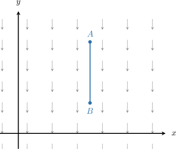
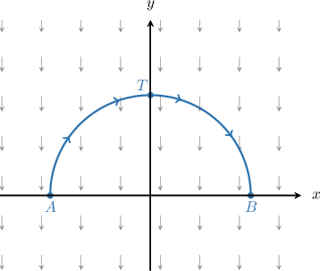
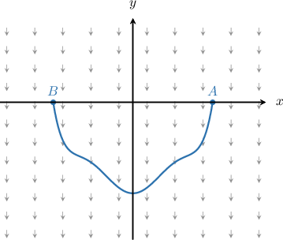
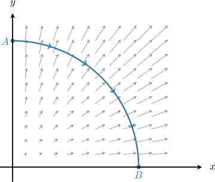
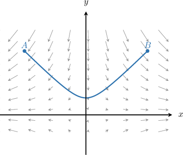

# Interpreting Line Integrals of Vector-Valued Functions

Source: https://www.mathacademy.com/topics/3694?courseId=54
Topic ID: 3694

## Prerequisites

- [Line Integrals of Vector-Valued Functions Over Parametric Curves](./2108-line-integrals-of-vector-valued-functions-over-parametric-curves.md)
- [Gradient Vector Fields](./3692-gradient-vector-fields.md)

## Lesson

### Introduction

Suppose that $\mathbf F$ is a vector field on $\mathbb R^2$ and $C$ is a smooth curve in the $xy$-plane. Recall that the line integral

$$

W = \int\limits_C\mathbf F\cdot\textrm d \mathbf r

$$

represents the total work done by $\mathbf F$ in moving a particle along $C.$ Loosely speaking:

- if $W > 0,$ then $\mathbf F$ causes the particle to *speed up* as it moves along $C,$ and

- if $W < 0,$ then $\mathbf F$ causes the particle to *slow down* as it moves along $C.$

To understand this, consider the vector field $\mathbf F$ and the path $C$ defined by the line segment $\overline{AB},$ shown below.

It's helpful to imagine that $\mathbf F$ represents a uniform gravitational field near the earth's surface.

Let's consider two examples.

- If a particle moves from $A$ to $B$ along the segment, it will pick up speed because it moves *with* the vector field: Intuitively, this makes sense. We know from real-world experience that if we drop a pebble, its speed increases as it descends. Therefore,

- If a particle moves from $B$ to $A$ along the segment, it will slow down because it moves *against* the vector field: Again, this matches our intuition: If we toss a pebble into the air, its speed decreases as it ascends. Therefore,

### Cases When a Particle Experiences Acceleration and Deceleration

In some situations, a particle's speed increases and then decreases (or vice-versa) as it moves along a curve in a vector field.

Let's consider a particle moving from $A$ to $B$ along the arc of a semicircle centered at $O$ in a uniform gravitational field, as shown below.

Note that:

- as the particle moves from $A$ to $T,$ it works against $\mathbf F$ and slows down, and

- as the particle moves from $T$ to $B,$ it works with $\mathbf F$ and speeds up.

By symmetry, the contribution to $\displaystyle\int_C\mathbf F\cdot \textrm d \mathbf r$ for $x < 0$ is canceled out by the contribution for $x > 0.$ So,

$$

\displaystyle\int_C\mathbf F\cdot \textrm d \mathbf r = 0.

$$

Intuitively, this means that the particle's speed is the same at the points $A$ and $B,$ and these are the points of maximum speed.

Additionally, since $\displaystyle\int_C\mathbf F\cdot \textrm d \mathbf r$ is decreasing as we move from $A$ to $T,$ the particle moves at its slowest speed at the point $T.$

### Example: Interpreting the Sign of a Line Integral Over a Constant Vector Field

#### Question

Consider the curve and constant vector field $\mathbf F$ shown above. Let $C$ be the path where the curve is traversed from $A$ to $B.$ Which of the following statements are true?

1. $\displaystyle\int_C\mathbf F\cdot \textrm d \mathbf r > 0$

2. $\displaystyle\int_C\mathbf F\cdot \textrm d \mathbf r = 0$

3. $\displaystyle\int_{-C}\mathbf F\cdot \textrm d \mathbf r = 0$

#### Explanation

Remember that $\displaystyle\int_C\mathbf F\cdot \textrm d \mathbf r$ gives the total work done by a force $\mathbf F$ in moving a particle along $C\mathbin{:}$

- If the force works ** the motion of the particle (i.e., the force helps to push the particle along the path), then $\displaystyle\int_C\mathbf F\cdot \textrm d \mathbf r > 0.$

- If the force works ** the motion of the particle (i.e., the force impedes the motion of the particle as it moves along the path), then $\displaystyle\int_C\mathbf F\cdot \textrm d \mathbf r < 0.$

With that in mind, let's check each statement.

- Statements I is false, while statement II is true. As the particle moves from $A$ to $B,$ the force $\mathbf F$ works with the particle for $x > 0,$ while $\mathbf F$ works against the particle for $x < 0.$ By symmetry, the contribution to $\displaystyle\int_C\mathbf F\cdot \textrm d \mathbf r$ for $x < 0$ is canceled out by the contribution for $x > 0.$ So,

- Statement III is true. If we reverse the orientation of $C,$ then the situation with regards to the work done by $\mathbf F$ is similar to the previous case. So, $\displaystyle\int_{-C}\mathbf F\cdot \textrm d \mathbf r = 0.$

Therefore, the correct answer is "II and III only."

### Cases When the Vector Field and Curve are Perpendicular

Another noteworthy situation is when $\mathbf F$ is perpendicular to $C$ at all points along $C.$

Since the force $\mathbf F$ acts perpendicular to the particle's motion as it moves from $A$ to $B,$ it neither helps nor hinders its motion. Therefore,

$$

W = \displaystyle\int_{C}\mathbf F\cdot \textrm d \mathbf r = 0.

$$

This means that $\displaystyle\int_{C}\mathbf F\cdot \textrm d \mathbf r = 0$ whenever $C$ is a level curve of $\mathbf F.$

### Example: Interpreting the Sign of a Line Integral Over a Non-Constant Vector Field

#### Question

Consider the vector field $\mathbf F(x,y)$ shown above, and let $C$ be the path where the curve is traversed from $A$ to $B.$ Which of the following statements are true?

1. $\displaystyle\int_C\mathbf F\cdot \textrm d \mathbf r < 0$

2. $\displaystyle\int_C\mathbf F\cdot \textrm d \mathbf r = 0$

3. $\displaystyle\int_{-C}\mathbf F\cdot \textrm d \mathbf r > 0$

#### Explanation

Remember that $\displaystyle\int_C\mathbf F\cdot \textrm d \mathbf r$ gives the total work done by a force $\mathbf F$ in moving a particle along $C\mathbin{:}$

- If the force works ** the motion of the particle (i.e., the force helps to push the particle along the path), then $\displaystyle\int_C\mathbf F\cdot \textrm d \mathbf r > 0.$

- If the force works ** the motion of the particle (i.e., the force impedes the motion of the particle as it moves along the path), then $\displaystyle\int_C\mathbf F\cdot \textrm d \mathbf r < 0.$

With that in mind, let's check each statement.

- Statement I is false, while statement II is true. Since the force $\mathbf F$ acts perpendicular to the motion of the particle as it moves from $A$ to $B,$ it neither helps nor hinders its motion. So, $\displaystyle\int_C\mathbf F\cdot \textrm d \mathbf r = 0.$

- Statement III is false. If we reverse the orientation of $C,$ then the situation with regards to the work done by $\mathbf F$ is similar to the previous case. So, $\displaystyle\int_{-C}\mathbf F\cdot \textrm d \mathbf r = 0.$

Therefore, the correct answer is "II only."
