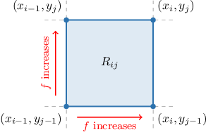
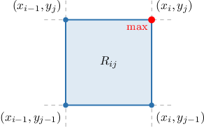
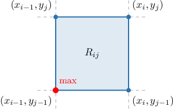
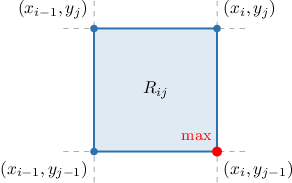

# Upper Riemann Sums Over General Rectangular Partitions

Source: https://www.mathacademy.com/topics/3696?courseId=54
Topic ID: 3696

## Prerequisites

- [Double Summations](./1983-double-summations.md)
- [Approximating Volumes Using Upper Riemann Sums](./2614-approximating-volumes-using-upper-riemann-sums.md)

## Lesson

### Introduction

We know how to write the upper Riemann sum for a function $f(x,y)$ over a *fixed* rectangular partition. In this lesson, we will learn how to write down an expression for the upper Riemann sum for an *arbitrary* rectangular partition.

As a concrete example, let $R = [0,1] \times [0,1]$ be a region in the $xy$-plane, and define the function $f(x,y)$ as

$$

f(x,y) = x^2+y^2.

$$

Further, let $P$ be an arbitrary partition of $R,$ where

$$

\begin{aligned}𝑃_{1}={𝑥_{0},𝑥_{1},…,𝑥_{𝑚}},\,𝑃_{2}={𝑦_{0},𝑦_{1},…,𝑦_{𝑛}},\,𝑃=𝑃_{1}×𝑃_{2}.\end{aligned}

$$

Our goal is to find an expression for $U(f, P),$ the upper Riemann sum of $f$ with respect to this partition. We proceed identically to the case where $P$ was fixed.

First, we consider an arbitrary subregion $R_{ij}$ of the partition. This subregion lies between $x_{i-1}$ and $x_i$ over the $x$-axis and $y_{j-1}$ and $y_j$ over the $y$-axis, as shown below.

Since we're computing the *upper* sum, we're interested in the *maximum* value of $f$ in this subregion.

Notice that

- $f(x,y) = x^2+y^2$ increases as $x$ increases on $[0,1],$ and

- $f(x,y) = x^2+y^2$ increases as $y$ increases on $[0,1].$

Therefore, the *maximum* value of $f$ in the subregion is attained when we have the *largest* possible $x$ and the *largest* possible $y.$ This is the value of $f$ at the *top right corner* of the subregion.

So, if $M_{ij}$ denotes the maximum value of $f$ in each subregion, we have

$$

M_{ij} = f(x_{i}, y_{j}) = x_{i}^2 + y_{j}^2

$$

for all $1\leq i\leq m$ and $1\leq j\leq n.$

Since the area of $R_{ij}$ is $\Delta x_i\Delta y_j,$ the volume of the rectangular solid with base $R_{ij}$ and height $M_{ij}$ is

$$

M_{ij}\Delta x_i\Delta y_j = (x_{i}^2 + y_{j}^2)\Delta x_i \Delta y_j

$$

Finally, summing up all of our rectangular solids over the entire partition $P$, we find that the upper Riemann sum is given by

$$

U(f,P) = \sum_{i=1}^m\sum_{j=1}^n (x_{i}^2 + y_{j}^2)\Delta x_i \Delta y_j \, .

$$

### Example: Writing an Upper Riemann Sum for a Strictly Increasing Function

#### Question

Let $R = [0,2]\times [1,3]$ be a region in the $xy$-plane, and let $f(x,y) = x+2y.$ Further, let $P$ be a partition of $R,$ where

$$

\begin{aligned}𝑃_{1}={𝑥_{0},𝑥_{1},…,𝑥_{𝑚}},\,𝑃_{2}={𝑦_{0},𝑦_{1},…,𝑦_{𝑛}},\,𝑃=𝑃_{1}×𝑃_{2}.\end{aligned}

$$

Write down the upper Riemann sum $U(f, P).$

#### Explanation

The upper Riemann sum is given by

$$

\begin{aligned}𝑈(𝑓,𝑃) & =\underset{\underset{𝑖=1}{∑}}{\overset{}{𝑚}}\underset{\underset{𝑗=1}{∑}}{\overset{}{𝑛}}𝑀_{𝑖𝑗}Δ𝑥_{𝑖}Δ𝑦_{𝑗}\end{aligned}

$$

where $M_{ij}$ is the ** value of $f$ in each subregion $R_{ij}.$

We consider an arbitrary subregion $R_{ij}$ of the partition. This subregion lies between $x_{i-1}$ and $x_i$ over the $x$-axis and $y_{i-1}$ and $y_i$ over the $y$-axis, as shown below.

Notice that

- $f(x,y) = x+2y$ increases as $x$ increases, and

- $f(x,y) = x+2y$ increases as $y$ increases.

As a result, the ** value of $f$ in each subregion is attained when we have the ** possible $x$ and the ** possible $y.$ This is the value at the ** of each subregion.

Therefore,

$$

\begin{aligned}𝑀_{𝑖𝑗} & =𝑓(𝑥_{𝑖},𝑦_{𝑗})=𝑥_{𝑖}+2𝑦_{𝑗}\end{aligned}

$$

for all $1\leq i\leq m$ and $1\leq j\leq n.$

Finally, the upper Riemann sum is

$$

\begin{aligned}𝑈(𝑓,𝑃) & =\underset{\underset{𝑖=1}{∑}}{\overset{}{𝑚}}\underset{\underset{𝑗=1}{∑}}{\overset{}{𝑛}}(𝑥_{𝑖}+2𝑦_{𝑗})Δ𝑥_{𝑖}Δ𝑦_{𝑗}.\end{aligned}

$$

### Example: Writing an Upper Riemann Sum for a Strictly Decreasing Function

#### Question

Let $R = [0,1] \times [0,2]$ be a region in the $xy$-plane, and let $f(x,y) = 90-x^2-y^2.$ Further, let $P$ be a partition of $R,$ where

$$

\begin{aligned}𝑃_{1}={𝑥_{0},𝑥_{1},…,𝑥_{𝑚}},\,𝑃_{2}={𝑦_{0},𝑦_{1},…,𝑦_{𝑛}},\,𝑃=𝑃_{1}×𝑃_{2}.\end{aligned}

$$

Write down the upper Riemann sum $U(f, P).$

#### Explanation

The upper Riemann sum is given by

$$

\begin{aligned}𝑈(𝑓,𝑃) & =\underset{\underset{𝑖=1}{∑}}{\overset{}{𝑚}}\underset{\underset{𝑗=1}{∑}}{\overset{}{𝑛}}𝑀_{𝑖𝑗}Δ𝑥_{𝑖}Δ𝑦_{𝑗}\end{aligned}

$$

where $M_{ij}$ is the ** value of $f$ in each subregion $R_{ij}.$

We consider an arbitrary subregion $R_{ij}$ of the partition. This subregion lies between $x_{i-1}$ and $x_i$ over the $x$-axis and $y_{i-1}$ and $y_i$ over the $y$-axis, as shown below.

Notice that

- $f(x,y) = 90-x^2-y^2$ decreases as $x$ increases on $[0,1],$ and

- $f(x,y) = 90-x^2-y^2$ decreases as $y$ increases on $[0,2].$

As a result, the ** value of $f$ in each subregion is attained when we have the ** possible $x$ and the ** possible $y.$ This is the value at the ** of each subregion.

Therefore,

$$

\begin{aligned}𝑀_{𝑖𝑗} & =𝑓(𝑥_{𝑖−1},𝑦_{𝑗−1})=90−𝑥_{2𝑖−1}^{}−𝑦_{2𝑗−1}^{}\end{aligned}

$$

for all $1\leq i\leq m$ and $1\leq j\leq n.$

Finally, the upper Riemann sum is

$$

\begin{aligned}𝑈(𝑓,𝑃) & =\underset{\underset{𝑖=1}{∑}}{\overset{}{𝑚}}\underset{\underset{𝑗=1}{∑}}{\overset{}{𝑛}}(90−𝑥_{2𝑖−1}^{}−𝑦_{2𝑗−1}^{})Δ𝑥_{𝑖}Δ𝑦_{𝑗}.\end{aligned}

$$

### Example: Writing an Upper Riemann Sum for a Function That’s Neither Strictly Increasing nor Decreasing

#### Question

Let $R = [2,4] \times [0,1]$ be a region in the $xy$-plane, and let $f(x,y) = 2x - y.$ Further, let $P$ be a partition of $R,$ where

$$

\begin{aligned}𝑃_{1}={𝑥_{0},𝑥_{1},…,𝑥_{𝑚}},\,𝑃_{2}={𝑦_{0},𝑦_{1},…,𝑦_{𝑛}},\,𝑃=𝑃_{1}×𝑃_{2}.\end{aligned}

$$

Write down the upper Riemann sum $U(f,P).$

#### Explanation

The upper Riemann sum is given by

$$

\begin{aligned}𝑈(𝑓,𝑃) & =\underset{\underset{𝑖=1}{∑}}{\overset{}{𝑚}}\underset{\underset{𝑗=1}{∑}}{\overset{}{𝑛}}𝑀_{𝑖𝑗}Δ𝑥_{𝑖}Δ𝑦_{𝑗}\end{aligned}

$$

where $M_{ij}$ is the ** value of $f$ in each subregion $R_{ij}.$

We consider an arbitrary subregion $R_{ij}$ of the partition. This subregion lies between $x_{i-1}$ and $x_i$ over the $x$-axis and $y_{i-1}$ and $y_i$ over the $y$-axis, as shown below.

Notice that

- $f(x,y) = 2x - y$ increases as $x$ increases, and

- $f(x,y) = 2x - y$ decreases as $y$ increases.

As a result, the ** value of $f$ in each subregion is attained when we have the ** possible $x$ and the ** possible $y.$ This is the value at the ** of each subregion.

Therefore,

$$

\begin{aligned}𝑀_{𝑖𝑗} & =𝑓(𝑥_{𝑖},𝑦_{𝑗−1})=2𝑥_{𝑖}−𝑦_{𝑗−1}\end{aligned}

$$

for all $1\leq i\leq m$ and $1\leq j\leq n.$

Finally, the upper Riemann sum is

$$

\begin{aligned}𝑈(𝑓,𝑃) & =\underset{\underset{𝑖=1}{∑}}{\overset{}{𝑚}}\underset{\underset{𝑗=1}{∑}}{\overset{}{𝑛}}(2𝑥_{𝑖}−𝑦_{𝑗−1})Δ𝑥_{𝑖}Δ𝑦_{𝑗}.\end{aligned}

$$
