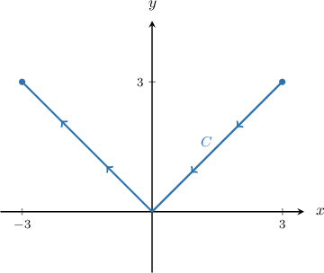
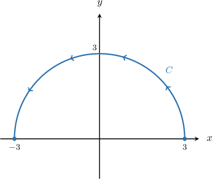
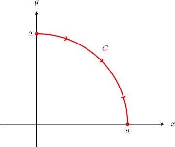
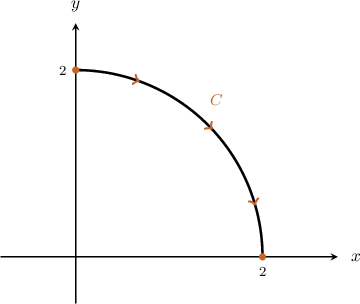

# Properties of Line Integrals With Respect to X and Y

Source: https://www.mathacademy.com/topics/3708?courseId=54
Topic ID: 3708

## Prerequisites

- [Properties of Definite Integrals Involving the Limits of Integration](../ap-calculus-ab/632-properties-of-definite-integrals-involving-the-limits-of-integration.md)
- [Line Integrals With Respect to X and Y](./2109-line-integrals-with-respect-to-x-and-y.md)

## Lesson

### Introduction

The line integral with respect to $x$ of the function $f(x,y)$ along the path $C$ can be calculated using the formula

$$

\int_C f(x,y)\,\textrm d x = \int\limits_a^b f(\mathbf r(t)) \, \dfrac{\text{d}x}{\text{d}t} \, \textrm{d}t,

$$

where $\mathbf r (t)$ for $a\leq t\leq b$ is a parametrization of $C.$

Now, if we set $f(x,y) = 1,$ then by the change of variables formula, we have

$$

\begin{aligned}∫_{𝐶}\,d𝑥 & =\underset{\underset{𝑎}{∫}}{\overset{}{𝑏}}\frac{d𝑥}{d𝑡}\,d𝑡 \\ & =\underset{\underset{𝑥_{1}}{∫}}{\overset{}{𝑥_{2}}}\,d𝑥 \\ & =𝑥_{2}−𝑥_{1},\end{aligned}

$$

where $x_1$ and $x_2$ are the $x$-coordinates at the initial and terminal points of $C,$ respectively. To summarize,

$$

\int_C \,\textrm d x = x_2 - x_1.

$$

Let's use this result to calculate $\displaystyle\int_C\,\textrm d x,$ where $C$ is the path along the quarter-circle of radius $2$ centered at $O$ in the first quadrant, traversed in the clockwise direction, as shown below:

The initial point is $(0,2)$ and the terminal point is $(2,0).$ So, we have $x_1 = 0, x_2 = 2,$ and therefore,

$$

\int_C \,\textrm d x = 2-0 = 2.

$$

### Some Remarks

In addition, we note the following regarding line integrals with respect to $x\mathbin{:}$

- If $C = C_1\cup C_2$ is a piecewise-smooth curve, then

- When $C$ is a *closed* curve, we sometimes use the following notation: If the curve is traversed once, the initial and terminal points are the same, so $x_1 = x_2.$ Therefore, for line integrals of unity with respect to $x,$ we have

### Example: Line Integrals of Unity With Respect to X

#### Question

Calculate $\displaystyle\int_C \,\textrm d x,$ where $C=C_1 \cup C_2$ is the path comprising of two line segments, as shown below.

#### Explanation

The line integral of unity with respect to $x$ along a path $C$ is equal to the net change in $x$ between the terminal and initial points:

$$

\int_C \,\textrm d x = x_2 - x_1,

$$

where $x_2$ is the $x$-coordinate of the terminal point, and $x_1$ is the $x$-coordinate of the initial point.

In our case, $x_2 = -3$ and $x_1 = 3.$ Therefore,

$$

\int_C \,\textrm d x = x_2 - x_1 = (-3) - 3 = -6.

$$

### Line Integrals of Unity With Respect to Y

Similar to line integrals of unity with respect to $x,$ the line integral of unity with respect to $y$ along a path $C$ is equal to the net change in $y$ between the terminal and initial points:

$$

\int_C \,\textrm d y = y_2 - y_1,

$$

where $y_2$ is the $y$-coordinate of the terminal point, and $y_1$ is the $y$-coordinate of the initial point.

Also, if $C$ is a closed, positively oriented curve traversed once in the counterclockwise direction, then

$$

\oint_C \,\textrm d y = 0.

$$

### Example: Line Integrals of Unity With Respect to Y

#### Question

Calculate $\displaystyle\int_C \,\textrm d y,$ where $C$ is the path along the semicircle of radius $3,$ traversed from the point $(3,0)$ to the point $(-3,0),$ as shown below.

#### Explanation

The line integral of unity with respect to $y$ along a path $C$ is equal to the net change in $y$ between the terminal and initial points:

$$

\int_C \,\textrm d y = y_2 - y_1,

$$

where $y_2$ is the $y$-coordinate of the terminal point, and $y_1$ is the $y$-coordinate of the initial point.

In our case, $y_2 = 0$ and $y_1 = 0.$ Therefore,

$$

\int_C \,\textrm d y = y_2 - y_1 = 0 - 0 = 0.

$$

### Further Properties of Line Integrals With Respect to X and Y

Earlier, we showed that

$$

\int_{C}\,\textrm d x = 2,

$$

where $C$ is the path along the quarter-circle shown below.

If we reverse the orientation of the curve, we get the following path:

The initial and terminal points have swapped, and so we now have $x_1 = 2$ and $x_2 = 0.$ Applying our formula, we have

$$

\begin{aligned}∫_{−𝐶}\,d𝑥 & =𝑥_{2}−𝑥_{1} \\ & =0−2 \\ & =−2.\end{aligned}

$$

This example illustrates an important property of line integrals with respect to $x,$ described in full as follows:

*Let $C$ be a piecewise-smooth path in the $xy$-plane, and let $-C$ be the curve consisting of the same points as $C$ but with the opposite orientation. Then,*

$$

\displaystyle\int_{-C} f(x,y)\,\textrm d x = -\int_{C} f(x,y)\,\textrm d x.

$$

*Similarly,*

$$

\displaystyle\int_{-C} f(x,y)\,\textrm d y = -\int_{C} f(x,y)\,\textrm d y.

$$

In other words, line integrals with respect to $x$ and $y$ are *dependent on orientation*. This is quite different from the case for line integrals with respect to arc length, which are independent of orientation.

### Example: Orientation-Dependence

#### Question

If $\displaystyle\int_{C} f(x,y) \,\textrm d x= 8$ and $\displaystyle\int_{-C_1} f(x,y) \,\textrm d x= -2,$ calculate $\displaystyle\int_{-C_2} f(x,y) \,\textrm d x$ given that $C = C_1\cup C_2.$

#### Explanation

Let $C = C_1\cup C_2$ be a piecewise smooth path in the $xy$-plane, and let $-C$ be the curve consisting of the same points as $C$ but with the opposite orientation.

For line integrals with respect to $x,$ we have the following properties:

- $\displaystyle\int_{-C} f(x,y)\,\textrm d x = -\int_{C} f(x,y)\,\textrm d x$

- $\displaystyle\int_{C} f(x,y)\,\textrm d x = \int_{C_1} f(x,y)\,\textrm d x + \int_{C_2} f(x,y)\,\textrm d x$

In our case, we have:

$$

\begin{aligned}∫_{𝐶}𝑓(𝑥,𝑦)\,d𝑥 & =∫_{𝐶_{1}}𝑓(𝑥,𝑦)\,d𝑥+∫_{𝐶_{2}}𝑓(𝑥,𝑦)\,d𝑥 \\ 8 & =−∫_{−𝐶_{1}}𝑓(𝑥,𝑦)\,d𝑥−∫_{−𝐶_{2}}𝑓(𝑥,𝑦)\,d𝑥 \\ 8 & =−(−2)−∫_{−𝐶_{2}}𝑓(𝑥,𝑦)\,d𝑥 \\ 8 & =2−∫_{−𝐶_{2}}𝑓(𝑥,𝑦)\,d𝑥 \\ 6 & =−∫_{−𝐶_{2}}𝑓(𝑥,𝑦)\,d𝑥\end{aligned}

$$

Therefore,

$$

\int_{-C_2} f(x,y) \,\textrm d x = -6.

$$

### Intuition Behind Some of the Results

Consider the path $C$ above. Earlier, we showed that

$$

\int_{C}\,\textrm d x = 2,

$$

We note the following:

- In the context of our usual interpretation of line integrals with respect to $x,$ this result represents the total area accumulated when the function $z=1$ is projected onto the plane $y=0$ as $C$ is traversed from the initial point $(0,2)$ to the terminal point $(2,0).$ From the diagram, we see that this projection generates a rectangle of length $x_2 - x_1 = 2$ and height $z=1.$ Since the integral of unity with respect to $x$ along $C$ is equal to the area of this rectangle, we have Furthermore, this result is *positive* because the rectangle is traced out in the direction of *increasing* $x.$

- If we reverse the direction of the curve then we get a *negative* result. This is because the rectangle is traced out in the direction of *decreasing* $x,$ as shown below.
