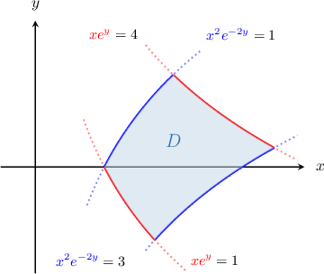
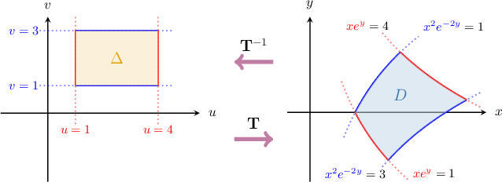
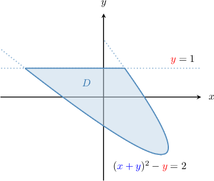
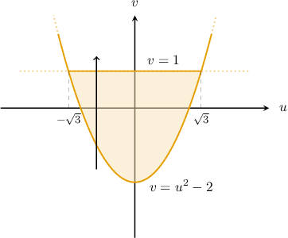
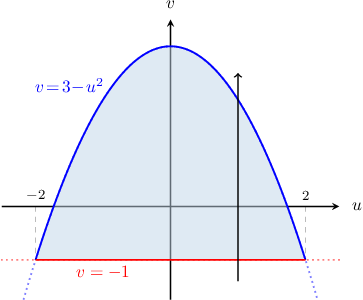

# Transformations of Regions Between Curves

Source: https://www.mathacademy.com/topics/4134?courseId=54
Topic ID: 4134

## Prerequisites

- [Type I and II Regions in Two-Dimensional Space](./1979-type-i-and-ii-regions-in-two-dimensional-space.md)
- [Nonlinear Transformations of Plane Regions](./2832-nonlinear-transformations-of-plane-regions.md)

## Lesson

### Introduction

The plane region $D$ shown below is defined as

$$

D = \big\{ (x,y) \: : \: 1 \leq xe^{y}\leq 4, \: \: 1 \leq x^2e^{-2y} \leq 3 \big\}.

$$

This region is pretty complicated, which could make it difficult to work with.

So, we'd like to define a transformation

$$

\mathbf T^{-1}: (x,y)\to (u(x,y),v(x,y))

$$

that maps the region $D$ to a rectangular region $\Delta$ in the $uv$-plane.

How can we find such a transformation?

Looking at the bounding curves that make up the structure of $D,$ we consider the transformation

$$

{\color{red}u}={\color{red}{xe^{y}}}, \qquad {\color{blue}v}={\color{blue}{x^2e^{-2y}}}.

$$

Next, we find our expression for $\Delta$ by writing $D$ in terms of $u$ and $v,$ as follows:

$$

\begin{aligned}Δ=𝐓^{−1}(𝐷) & ={(𝑢,𝑣)\,:\,1≤𝑥𝑒^{𝑦}≤4,\,\,1≤𝑥^{2}𝑒^{−2𝑦}≤3} \\ & ={(𝑢,𝑣)\,:\,1≤𝑢≤4,\,\,1≤𝑣≤3}\end{aligned}

$$

And that's all there is to it! We've successfully found a transformation $\mathbf T^{-1}$ that maps the complicated region $D$ in the $xy$-plane to the rectangle $[1,4]\times[1,3]$ in the $uv$-plane.

### Example: Finding a Rectangular Preimage Given a Transformation

#### Question

Consider the region $D,$ given by

$$

D = \big\{ (x,y) \: : \: 2 \leq \sqrt{xy} \leq 4, \: 2x \leq y \leq 3x \big\}

$$

and the transformation $\mathbf T,$ given by

$$

\mathbf{T}:(u,v) \to (x(u,v),y(u,v)),

$$

where $u=\dfrac{y}{x}$ and $v=xy.$ Find the representation of $\mathbf{T}^{-1}(D)$ in the $uv$-plane.

#### Explanation

Notice that $\mathbf{T}^{-1}(D)$ is the image of $D$ under the action of the transformation $\mathbf{T}^{-1}.$

Let's find the image of $\mathbf{T}^{-1}(D)$ in the $uv$-plane. To do that, we write the region $D$ in terms of $u$ and $v,$ as follows:

$$

\begin{aligned}𝐓^{−1}(𝐷) & ={(𝑢,𝑣)\,:\,2≤\sqrt{√𝑥𝑦}≤4,\,2𝑥≤𝑦≤3𝑥} \\ & ={(𝑢,𝑣)\,:\,2^{2}≤(\sqrt{√𝑥𝑦})^{2}≤4^{2},\,2≤\frac{𝑦}{𝑥}≤3} \\ & ={(𝑢,𝑣)\,:\,4≤𝑥𝑦≤16,\,2≤\frac{𝑦}{𝑥}≤3} \\ & ={(𝑢,𝑣)\,:\,4≤𝑣≤16,\,2≤𝑢≤3} \\ & ={(𝑢,𝑣)\,:\,2≤𝑢≤3,\,4≤𝑣≤16}\end{aligned}

$$

Notice that since $2 \leq \sqrt{xy}\leq 4,$ we must have $x \neq 0.$ Therefore, $u=\dfrac{y}{x}$ is well-defined.

### Example: Finding a Transformation That Maps a Rectangular Region Onto a Given One

#### Question

Consider the finite region $D$ enclosed in the first quadrant of the $xy$-plane between the curves

$$

y=x, \qquad y=7x, \qquad x=\dfrac{3}{y^2}, \qquad x=\dfrac{5}{y^2}.

$$

A transformation $\mathbf{T},$ where

$$

\mathbf{T}:(u,v) \to (x(u,v),y(u,v)),

$$

maps a rectangular region $\Delta$ with sides parallel to the $u$- and $v$-axes from the $uv$-plane onto $D$ in the $xy$-plane. Given that

$$

\mathbf{T} : (u,v) \to \Big(\sqrt[3]{\dfrac{v}{u^2}}, \: \boxed{\phantom{AA}} \, \Big),

$$

what could be the missing expression?

#### Explanation

We would like to find a rectangular region of the form

$$

\begin{aligned}Δ & ={(𝑢,𝑣)\,:\,𝑎≤𝑢≤𝑏,\,\,𝑐≤𝑣≤𝑑} \\ & ={(𝑢,𝑣)\,:\,𝑎≤𝑢(𝑥,𝑦)≤𝑏,\,\,𝑐≤𝑣(𝑥,𝑦)≤𝑑},\end{aligned}

$$

where the equations of the left, right, bottom, and top sides are

$$

{\color{blue}u(x,y)} = a, \qquad {\color{blue}u(x,y)} = b, \qquad {\color{red}v(x,y)} = c, \qquad {\color{red}v(x,y)} = d.

$$

With that in mind, let's analyze the boundary of our region $D.$

Rewriting the equations

$$

y=x, \qquad y=7x, \qquad x=\dfrac{3}{y^2}, \qquad x=\dfrac{5}{y^2}

$$

by moving both variables $x$ and $y$ to the left-hand side, we obtain

$$

\begin{aligned}\frac{𝑦}{𝑥}=1,\,\frac{𝑦}{𝑥}=7,\,𝑥𝑦^{2}=3,\,𝑥𝑦^{2}=5.\end{aligned}

$$

Therefore, if we put $u(x,y)={\color{blue}\dfrac{y}{x}}$ and $v(x,y)={\color{red}xy^2},$ we can define the transformation $\mathbf{T}^{-1}$ as

$$

\mathbf{T}^{-1} : (x,y) \to \left( \, {\color{blue}\dfrac{y}{x}}\,, \: \boxed{\color{red}xy^2} \right).

$$

To find $\mathbf{T},$ we should express $x$ and $y$ in terms of $u$ and $v.$ Recall that we have

$$

\begin{aligned}𝑢=\frac{𝑦}{𝑥} \\ 𝑣=𝑥𝑦^{2}.\end{aligned}

$$

From the first equation, $y=ux.$ Substituting this into the second equation, we get

$$

v = u^2x^3 \qquad\Longrightarrow\qquad x^3 = \dfrac{v}{u^2} \qquad\Longrightarrow\qquad x = \sqrt[3]{\dfrac{v}{u^2}}.

$$

Finally, substituting $x = \sqrt[3]{\dfrac{v}{u^2}}$ back into $y=ux,$ we obtain

$$

y =u\sqrt[3]{\dfrac{v}{u^2}} = \sqrt[3]{uv}.

$$

Therefore, the transformation $\mathbf{T}$ can be given by

$$

\mathbf{T} : (u,v) \to \left(\sqrt[3]{\dfrac{v}{u^2}}, \, \boxed{ \sqrt[3]{uv}} \right).

$$

### Transformations That Map a Region to a Type I Region

We often use transformations to map a region in the $xy$-plane to a type I region in the $uv$-plane.

For example, let $D$ be the region bounded by the curve $(x+y)^2 - y = 2$ and the line $y=1,$ as shown in the diagram below.

This is not a type I region because the lower curve is not an explicit function of $x.$

Let's map $D$ to a type I region in the $uv$-plane. First, let $\mathbf T$ be the transformation

$$

\mathbf{T}:(u,v) \to (x(u,v),y(u,v)).

$$

The equations of the bounding curves suggest the following for the transformation $\mathbf T^{-1}{:}$

$$

{\color{blue}{u}}={\color{blue}{x+y}}, \qquad {\color{red}{v}}={\color{red}{y}}.

$$

Substituting ${\color{blue}{u}}={\color{blue}{x+y}}$ and ${\color{red}{v}}={\color{red}{y}}$ into the equation of the lower curve, we get

$$

\begin{aligned}(𝑥+𝑦)^{2}−𝑦=2\,⟹\,𝑢^{2}−𝑣=2\,⟹\,𝑣=𝑢^{2}−2,\end{aligned}

$$

which is the equation of an upward-opening parabola.

Substituting $y = v$ into the equation of the line, we obtain

$$

\begin{aligned}𝑦=1\,⟹\,𝑣=1.\end{aligned}

$$

To find the intersections of the parabola and line in the $uv$-plane, we solve the following system:

$$

\begin{aligned}\begin{aligned}𝑣=𝑢^{2}−2 \\ 𝑣=1\end{aligned}\,⟹\,\begin{aligned}𝑢=±\sqrt{√3} \\ 𝑣=1\end{aligned}\end{aligned}

$$

So, the intersection points are $(\pm \sqrt3, 1).$

Finally, our domain in the $uv$-plane has the following type I representation:

$$

\mathbf{T}^{-1}(D) = \big\{ (u,v) \: : \: -\sqrt3 \leq u \leq \sqrt3, \quad u^2-2 \leq v \leq 1 \big\}

$$

### Example: Finding a Transformation That Maps a Region Onto a Type I Region

#### Question

Let $D$ be the finite region bounded by the curve $(x+y)^2 + y = 3$ and the line $y=-1.$ Consider the transformation $\mathbf T,$ given by

$$

\mathbf{T}:(u,v) \to (x(u,v),y(u,v)),

$$

where $u=x+y$ and $v=y.$ Find the representation of $\mathbf{T}^{-1}(D)$ in the $uv$-plane.

#### Explanation

First, notice that we are given that

$$

[\begin{aligned}𝑥 \\ 𝑦\end{aligned}]

$$

Substituting $x+y = u$ and $y = v$ into the equation of the first curve, we get

$$

\begin{aligned}(𝑥+𝑦)^{2}+𝑦=3\,⟹\,𝑢^{2}+𝑣=3\,⟹\,𝑣=3−𝑢^{2},\end{aligned}

$$

while substituting $y = v$ into the equation of the second curve, we obtain

$$

\begin{aligned}𝑦=−1\,⟹\,𝑣=−1.\end{aligned}

$$

To find the intersections of the curves in the $uv$-plane, we solve the following system:

$$

\begin{aligned}\begin{aligned}𝑣=3−𝑢^{2} \\ 𝑣=−1\end{aligned}\,⟹\,\begin{aligned}𝑢=±2 \\ 𝑣=−1\end{aligned}\end{aligned}

$$

So, the intersection points are $(\pm 2, -1).$

As a result, our domain in the $uv$-plane has the type I representation

$$

\mathbf{T}^{-1}(D) = \big\{ (u,v) \: : \: -2 \leq u \leq 2, \quad -1 \leq v \leq 3-u^2 \big\}.

$$
