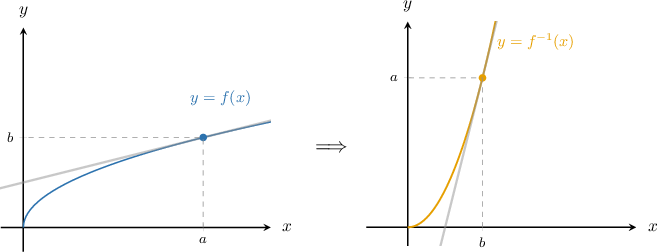
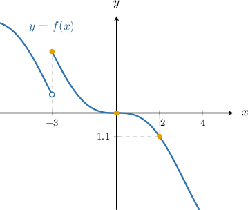
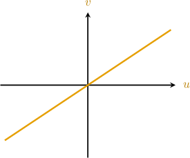

# The Inverse Function Theorem

Source: https://www.mathacademy.com/topics/4149?courseId=54
Topic ID: 4149

## Prerequisites

- [Differentiating an Inverse Function at a Point](../ap-calculus-ab/291-differentiating-an-inverse-function-at-a-point.md)
- [Continuity and Differentiability of Functions](../ap-calculus-ab/1691-continuity-and-differentiability-of-functions.md)
- [The Jacobian](./1999-the-jacobian.md)

## Lesson

### Introduction

Let's now state the so-called **inverse function theorem** for single-variable functions:

*If $f: U \to \Bbb R$ is continuously differentiable on an open set $U\subseteq \mathbb R,$ $f(a) = b$ and $f'(a)\neq 0$ for $a\in U,$ then*

- *$f$ is invertible in some neighborhood of $a,$*

- *$f^{-1},$ the inverse of $f,$ is continuously differentiable in a neighborhood of $b,$ and*

- *the derivative of $f^{-1}$ is given by*

To explain this concretely, consider the graph below:

In this example, the function $f$ is continuously differentiable at $x=a$ and has a nonzero derivative. As a result, $f^{-1}$ exists in a neighborhood of $x=b$ and is continuously differentiable at this point.

On the other hand, if $f$ is continuously differentiable at $x=a$ but $f'(a) = 0,$ then one of two things can happen:

- **Case 1**: The function $f$ does not have a local inverse at $a.$ In the example above, $f$ is not one-to-one in a neighborhood of $a,$ so it's not invertible there.

- **Case 2**: The function $f$ has a local inverse at $a,$ but its inverse is not continuously differentiable at $b.$ In the example above, $f$ is invertible in a neighborhood of $a,$ but $f^{-1}$ is not differentiable at $x=b$ since it has a vertical tangent at this point.

### Example: Identifying True Statements Regarding the Inverse Function Theorem

#### Question

The function $f(x),$ whose graph is shown above, has a stationary point at $x=0$ and is continuously differentiable everywhere except at $x=-3.$ Which of the following statements **** be true according to the inverse function theorem?

1. $f$ is invertible in some neighborhood of $x=-3$

2. $f^{-1}(y)$ is continuously differentiable in a neighborhood of $y=0$

3. The derivative of $f^{-1}(y)$ at $y=-1.1$ equals $\dfrac{1}{f'(2)}$

#### Explanation

The inverse function theorem for single-variable functions states the following:

**

- **

- **

- **

With that in mind, let's examine our statements in turn.

- Statement I is false. Notice that $f$ is not continuous at $x = -3.$ So, the theorem can't be applied in this situation.

- Statement II is also false. Notice that $y = 0 = f(0).$ However, the function $f$ does ** satisfy the conditions for the inverse function theorem at $x = 0$ since $f'(0) = 0.$ So, the theorem can't be applied in this situation.

- Statement III is true. Notice that $y = -1.1 = f(2),$ and the function $f$ satisfies the conditions for the inverse function theorem at $x = 2.$ Indeed, $f$ is continuously differentiable on an open set containing $x=2,$ for example, $(0,4),$ and the derivative of $f$ is nonzero at $x = 2,$ i.e., $f'(2) \neq 0.$ Therefore, by the inverse function theorem, the derivative of $f^{-1}(y)$ at $y = -1.1$ equals $\dfrac{1}{f'(2)}.$

Therefore, the correct answer is "III only."

### Critical Points of Transformations

Consider a transformation $\mathbf T,$ given by

$$

[\begin{aligned}𝑢 \\ 𝑣\end{aligned}]

$$

The points in the $(u,v)$ plane where $\mathbf T$ is *locally* non-invertible are known as **critical points**.

We've already seen that $\mathbf T$ is locally non-invertible when the Jacobian determinant is zero. Therefore, the critical points of $\mathbf T$ are the solutions to the equation

$$

\dfrac{\partial (x, y)}{\partial (u, v)}=0.

$$

Let's compute the critical points of the following transformation:

$$

[\begin{aligned}𝑢 \\ 𝑣\end{aligned}]

$$

First, we find the partial derivatives:

$$

\begin{aligned}\frac{𝜕𝑥}{𝜕𝑢} & =4𝑢 & \,\frac{𝜕𝑥}{𝜕𝑣} & =−6𝑣 \\ \frac{𝜕𝑦}{𝜕𝑢} & =−1 & \,\frac{𝜕𝑦}{𝜕𝑣} & =1\end{aligned}

$$

Therefore, the corresponding Jacobian determinant is

$$

\begin{aligned}\frac{𝜕(𝑥,𝑦)}{𝜕(𝑢,𝑣)} & =\begin{aligned}\frac{𝜕𝑥}{𝜕𝑢} & \frac{𝜕𝑥}{𝜕𝑣} \\ \frac{𝜕𝑦}{𝜕𝑢} & \frac{𝜕𝑦}{𝜕𝑣}\end{aligned} \\ & =\begin{aligned}4𝑢 & −6𝑣 \\ −1 & 1\end{aligned} \\ & =4𝑢⋅1−(−6𝑣)⋅(−1) \\ & =4𝑢−6𝑣.\end{aligned}

$$

The function has critical points when the Jacobian equals zero. So, we obtain

$$

\begin{aligned}\frac{𝜕(𝑥,𝑦)}{𝜕(𝑢,𝑣)} & =0 \\ 4𝑢−6𝑣 & =0 \\ 2𝑢−3𝑣 & =0.\end{aligned}

$$

Therefore, the critical points of $\mathbf{T}$ consist of those points that lie on the line $2u-3v=0$ in the $uv$-plane, shown below.

### Example: Determining the Critical Points of a Transformation

#### Question

Find the locations of all of the critical points of the transformation $\mathbf{T},$ where $\mathbf T$ is defined as

$$

[\begin{aligned}𝑢 \\ 𝑣\end{aligned}]

$$

#### Explanation

Given a transformation

$$

[\begin{aligned}𝑢 \\ 𝑣\end{aligned}]

$$

the Jacobian determinant of $\mathbf T,$ denoted $\dfrac{\partial (x, y)}{\partial (u, v)},$ is given by

$$

\begin{aligned}\frac{𝜕(𝑥,𝑦)}{𝜕(𝑢,𝑣)} & =\begin{aligned}\frac{𝜕𝑥}{𝜕𝑢} & \frac{𝜕𝑥}{𝜕𝑣} \\ \frac{𝜕𝑦}{𝜕𝑢} & \frac{𝜕𝑦}{𝜕𝑣}\end{aligned}.\end{aligned}

$$

To find the locations of the critical points of $\mathbf T,$ we need to solve

$$

\dfrac{\partial (x, y)}{\partial (u, v)} = 0.

$$

Here, we have $x(u,v) = u^2-v^2$ and $y(u,v) = u+v.$

First, we find the partial derivatives:

$$

\begin{aligned}\frac{𝜕𝑥}{𝜕𝑢} & =2𝑢 & \,\frac{𝜕𝑥}{𝜕𝑣} & =−2𝑣 \\ \frac{𝜕𝑦}{𝜕𝑢} & =1 & \,\frac{𝜕𝑦}{𝜕𝑣} & =1\end{aligned}

$$

Therefore, the corresponding Jacobian determinant is

$$

\begin{aligned}\frac{𝜕(𝑥,𝑦)}{𝜕(𝑢,𝑣)} & =\begin{aligned}\frac{𝜕𝑥}{𝜕𝑢} & \frac{𝜕𝑥}{𝜕𝑣} \\ \frac{𝜕𝑦}{𝜕𝑢} & \frac{𝜕𝑦}{𝜕𝑣}\end{aligned} \\ & =\begin{aligned}2𝑢 & −2𝑣 \\ \,\,1\, & \,\,\,\,1\end{aligned} \\ & =2(𝑢+𝑣).\end{aligned}

$$

The function has critical points when $\dfrac{\partial (x, y)}{\partial (u, v)} =0.$ So, we obtain

$$

\begin{aligned}\frac{𝜕(𝑥,𝑦)}{𝜕(𝑢,𝑣)} & =0 \\ 2(𝑢+𝑣) & =0 \\ 𝑢 & =−𝑣.\end{aligned}

$$

Therefore, the critical points of $T$ consist of those points that lie on the line $u=-v$ in the $uv$-plane.

### The Inverse Function Theorem for Transformations

The inverse function theorem can be generalized to transformations too. We state it below:

*Let $\mathbf T:U \to \Bbb R^2$ be a $C^1$ (continuously differentiable) transformation on an open set $U\subseteq \mathbb R^2,$ where*

$$

[\begin{aligned}𝑢 \\ 𝑣\end{aligned}]

$$

*Further, suppose that $(u_0,v_0)$ is **** a critical point of $\mathbf T.$* Then,

- *$\mathbf T$ is locally invertible at $(u_0,v_0),$*

- *$\mathbf T^{-1},$ the inverse of $\mathbf T,$ is a $C^1$ function in a neighborhood of $(x_0,y_0),$ and*

- *the Jacobian determinant of $\mathbf T^{-1},$ denoted $\dfrac{\partial (u, v)}{\partial (x, y)},$ is given by*

### Example: Jacobian Determinants of Inverse Transformations

#### Question

Consider all non-critical points of the transformation $\mathbf{T}:(u,v) \to (x(u,v),y(u,v)).$ The inverse transformation $\mathbf T^{-1}(x,y)\to(u(x,y), v(x,y))$ is given by

$$

[\begin{aligned}𝑥 \\ 𝑦\end{aligned}]

$$

Find the Jacobian determinant of $\mathbf T$ in terms of $u$ and $v.$

#### Explanation

Given a transformation

$$

[\begin{aligned}𝑢 \\ 𝑣\end{aligned}]

$$

the Jacobian determinant of $\mathbf T,$ denoted $\dfrac{\partial (x, y)}{\partial (u, v)},$ is given by

$$

\begin{aligned}\frac{𝜕(𝑥,𝑦)}{𝜕(𝑢,𝑣)} & =\begin{aligned}\frac{𝜕𝑥}{𝜕𝑢} & \frac{𝜕𝑥}{𝜕𝑣} \\ \frac{𝜕𝑦}{𝜕𝑢} & \frac{𝜕𝑦}{𝜕𝑣}\end{aligned}.\end{aligned}

$$

In this case, we're only given $\mathbf T^{-1}.$ So, we compute the Jacobian determinant of $\mathbf T$ as follows:

- First, we compute $\dfrac{\partial (u, v)}{\partial (x, y)},$ the Jacobian determinant of $\mathbf T^{-1}.$

- Then, we will compute the Jacobian determinant of $\mathbf T$ using the relation

Here, we have $u(x,y) = e^{x+y}$ and $v(x,y) = e^{x-y}.$

First, we compute the partial derivatives:

$$

\begin{aligned}\frac{𝜕𝑢}{𝜕𝑥} & =𝑒^{𝑥+𝑦} & \,\frac{𝜕𝑢}{𝜕𝑦} & =𝑒^{𝑥+𝑦} \\ \frac{𝜕𝑣}{𝜕𝑥} & =𝑒^{𝑥−𝑦} & \,\frac{𝜕𝑣}{𝜕𝑦} & =−𝑒^{𝑥−𝑦}\end{aligned}

$$

Therefore, the corresponding Jacobian determinant is

$$

\begin{aligned}\frac{𝜕(𝑢,𝑣)}{𝜕(𝑥,𝑦)} & =\begin{aligned}\frac{𝜕𝑢}{𝜕𝑥} & \frac{𝜕𝑢}{𝜕𝑦} \\ \frac{𝜕𝑣}{𝜕𝑥} & \frac{𝜕𝑣}{𝜕𝑦}\end{aligned} \\ & =\begin{aligned}𝑒^{𝑥+𝑦} & 𝑒^{𝑥+𝑦} \\ 𝑒^{𝑥−𝑦} & −𝑒^{𝑥−𝑦}\end{aligned} \\ & =𝑒^{𝑥+𝑦}⋅(−𝑒^{𝑥−𝑦})−𝑒^{𝑥+𝑦}⋅𝑒^{𝑥−𝑦} \\ & =−𝑒^{𝑥+𝑦}⋅𝑒^{𝑥−𝑦}−𝑒^{𝑥+𝑦}⋅𝑒^{𝑥−𝑦} \\ & =−2⋅𝑒^{𝑥+𝑦}⋅𝑒^{𝑥−𝑦} \\ & =−2𝑢𝑣.\end{aligned}

$$

Finally, we take the reciprocal:

$$

\begin{aligned}\frac{𝜕(𝑥,𝑦)}{𝜕(𝑢,𝑣)} & =(\frac{𝜕(𝑢,𝑣)}{𝜕(𝑥,𝑦)})^{−1} \\ & =−\frac{1}{2𝑢𝑣}\end{aligned}

$$
