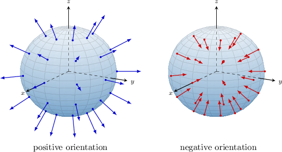
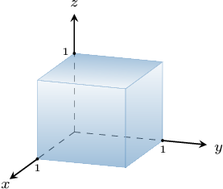
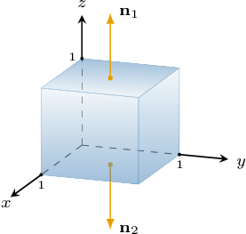
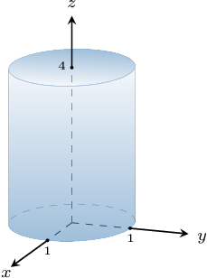
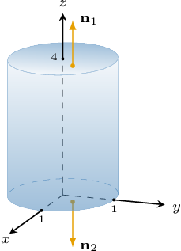
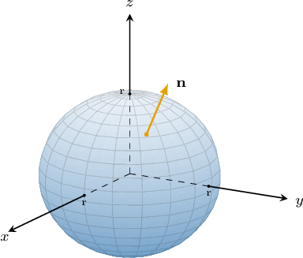

# Flux Through Closed Surfaces

Source: https://www.mathacademy.com/topics/4162?courseId=54
Topic ID: 4162

## Prerequisites

- [Surface Areas of Spheres](../geometry/1765-surface-areas-of-spheres.md)
- [Flux in Three-Dimensional Vector Fields](./3178-flux-in-three-dimensional-vector-fields.md)

## Lesson

### Introduction

Similar to the case of *closed* curves, there is always a well-defined notion of "inside" and "outside" a closed *surface*.

For closed surfaces, the convention is the positive orientation is always given by the *outward-pointing* unit normal vector.

When calculating the flux of a vector field $\mathbf F$ across a closed surface, we always measure the flux relative to the surface's positive orientation.

Let's see an example.

### Example: Computing the Flux of a Vector Field Over a Rectangular Solid

#### Question

Consider the vector field $\mathbf F(x,y,z) = \langle 0, \: 0, \: 1 + xyz \rangle$ and the surface $S$ defined by the bounding region of the rectangular solid shown above in the first octant. Calculate the flux of $\mathbf F$ through $S.$

#### Explanation

If $S$ is an oriented surface with unit normal vector $\mathbf n,$ and $\mathbf F$ is continuous vector field, then the flux of $\mathbf F$ across $S$ measured with respect to $\mathbf n$ is given by

$$

\iint\limits_S \mathbf{F} \cdot \textrm{d}\mathbf{S} = \iint\limits_S \mathbf{F} \cdot \mathbf{n} \,\textrm{d}S.

$$

Notice that only the $z$-component of $\mathbf F = \langle 0,\: 0,\: 1+xyz\rangle$ is non-zero. Since the lateral sides of $S$ are parallel to the $z$-axis, the flux of $\mathbf F$ through $S$ will be non-zero only at the top and bottom sides.

Let's consider the flux of $\mathbf F$ through these two sides.

- Let $S_1$ denote the top surface. On this surface, we have $z = 1$ for $0 \leq x \leq 1$ and $0 \leq y \leq 1.$ The outward-pointing unit normal vector to $S_1$ is Using the fact that $z = 1$ on $S_1,$ we have Therefore, we can calculate the flux of $\mathbf F$ across $S_1$ as follows:

- Let $S_2$ denote the bottom surface. On this surface, we have $z = 0$ for $0 \leq x \leq 1$ and $0 \leq y \leq 1.$ The outward-pointing unit normal vector to $S_2$ is Using the fact that $z = 0$ on $S_2,$ we have Therefore, we can calculate the flux of $\mathbf F$ across $S_2$ as follows:

Finally,

$$

\begin{aligned}\underset{𝑆}{∬}𝐅⋅d𝐒 & =\underset{𝑆}{∬}𝐅⋅𝐧\,d𝑆 \\ & =\underset{𝑆_{1}}{∬}𝐅⋅𝐧\,d𝑆+\underset{𝑆_{2}}{∬}𝐅⋅𝐧\,d𝑆 \\ & =\frac{5}{4}+(−1) \\ & =\frac{1}{4}.\end{aligned}

$$

### Example: Computing the Flux of a Vector Field Over a Cylinder

#### Question

Consider the vector field $\mathbf F(x,y,z) = \langle 0,\: 0,\: z\sqrt{x^2 + y^2} \rangle$ and the surface $S$ defined by the bounding region of a right circular cylinder of height $4$ whose base is a circle of radius $1$ centered at the origin, as shown above. Calculate the flux of $\mathbf F$ through $S.$

#### Explanation

If $S$ is an oriented surface with unit normal vector $\mathbf n,$ and $\mathbf F$ is continuous vector field, then the flux of $\mathbf F$ across $S$ measured with respect to $\mathbf n$ is given by

$$

\iint\limits_S \mathbf{F} \cdot \textrm{d}\mathbf{S} = \iint\limits_S \mathbf{F} \cdot \mathbf{n} \,\textrm{d}S.

$$

Notice that only the $z$-component of $\mathbf F = \langle 0,\: 0,\: z\sqrt{x^2 + y^2} \rangle$ is non-zero. Since the lateral side of $S$ is parallel to the $z$-axis, the flux of $\mathbf F$ through $S$ will be non-zero only at the top and bottom sides.

- Let $S_1$ denote the top surface. On this surface, we have $z = 4$ for $x^2 + y^2 \leq 1.$ The outward-pointing unit normal vector to $S_1$ is Using the fact that $z = 4$ on $S_1,$ we have Therefore, the flux of $\mathbf F$ across $S_1$ is given by

Applying a change of variables $(x,y) \to (r,\theta), \textrm d A = r\,\textrm d r\,\textrm d \theta,$ we have

$$

\begin{aligned}4\underset{𝐷}{∬}\sqrt{√𝑥^{2}+𝑦^{2}}\,d𝐴 & =4\underset{𝐷}{∬}𝑟⋅𝑟\,d𝑟\,d𝜃 \\ & =4∫_{2𝜋0}^{}∫_{10}^{}𝑟^{2}\,d𝑟\,d𝜃 \\ & =4∫_{2𝜋0}^{}\,d𝜃∫_{10}^{}𝑟^{2}\,d𝑟 \\ & =4⋅2𝜋⋅[\frac{1}{3}𝑟^{3}]_{10}^{} \\ & =8𝜋(\frac{1}{3}) \\ & =\frac{8𝜋}{3}.\end{aligned}

$$

- Let $S_2$ denote the bottom surface. On this surface, we have $z = 0$ for $x^2 + y^2 \leq 1.$ Therefore, for every point on $S_2,$ we have Therefore,

Finally,

$$

\begin{aligned}\underset{𝑆}{∬}𝐅⋅d𝐒 & =\underset{𝑆}{∬}𝐅⋅𝐧\,d𝑆 \\ & =\underset{𝑆_{1}}{∬}𝐅⋅𝐧\,d𝑆+\underset{𝑆_{2}}{∬}𝐅⋅𝐧\,d𝑆 \\ & =\frac{8𝜋}{3}+0 \\ & =\frac{8𝜋}{3}.\end{aligned}

$$

### The Outward-Pointing Unit Vector to a Sphere

Given a sphere of radius $r$ centered at the origin, an outward-pointing unit normal vector to the sphere at the point $P(x,y,z)$ is given by

$$

\begin{aligned}𝐧 & =\frac{⟨𝑥,\,𝑦,\,𝑧⟩}{𝑟}.\end{aligned}

$$

We can sometimes use this to calculate the flux of a vector field through a sphere. Let's see an example.

### Example: Computing the Flux of a Vector Field Over a Sphere

#### Question

Consider the vector field $\mathbf F(x,y,z) = \langle 2x,\: 2y+xz,\: 2z-xy\rangle$ and the boundary $S$ of a spherical solid of radius $1$ centered at the origin. Calculate the flux of $\mathbf F$ through $S.$

#### Explanation

If $S$ is an oriented surface with unit normal vector $\mathbf n,$ and $\mathbf F$ is continuous vector field, then the flux of $\mathbf F$ across $S$ measured with respect to $\mathbf n$ is given by

$$

\iint\limits_S \mathbf{F} \cdot \textrm{d}\mathbf{S} = \iint\limits_S \mathbf{F} \cdot \mathbf{n} \,\textrm{d}S.

$$

For a sphere or radius $r$ centered at $O,$ the unit normal to the sphere is given by

$$

\mathbf n = \dfrac{\langle x, y, z\rangle}{r}.

$$

In our case, we have $r=1.$ Therefore,

$$

\mathbf n = \langle x, y, z\rangle.

$$

Using the fact that $x^2+y^2+z^2=1$ on $S,$ we have

$$

\begin{aligned}𝐅⋅𝐧 & =⟨2𝑥,\,2𝑦+𝑥𝑧,\,2𝑧−𝑥𝑦⟩⋅⟨𝑥,𝑦,𝑧⟩ \\ & =2𝑥^{2}+(2𝑦+𝑥𝑧)⋅𝑦+(2𝑧−𝑥𝑦)⋅𝑧 \\ & =2𝑥^{2}+2𝑦^{2}+𝑥𝑦𝑧+2𝑧^{2}−𝑥𝑦𝑧 \\ & =2(𝑥^{2}+𝑦^{2}+𝑧^{2}) \\ & =2⋅1 \\ & =2.\end{aligned}

$$

Therefore, we can calculate the flux of $\mathbf F$ across $S$ as follows:

$$

\begin{aligned}\underset{𝑆}{∬}𝐅⋅d𝐒 & =\underset{𝑆}{∬}𝐅⋅𝐧\,d𝑆 \\ & =\underset{𝑆}{∬}2\,d𝑆 \\ & =2\underset{𝑆}{∬}\,d𝑆 \\ & =2⋅Area(𝑆) \\ & =2⋅4𝜋⋅1^{2} \\ & =8𝜋\end{aligned}

$$

### Deriving the Unit Normal Vector for a Sphere

Let's derive the formula for a unit normal vector for a sphere of radius $r$ centered at the origin.

Consider the function

$$

w = f (x, y, z)= \dfrac 1 2\left(x^2 + y^2 + z^2 - r^2\right).

$$

The level surface corresponding to $w=0$ is the sphere $S$ with equation $x^2 + y^2 + z^2 = r^2.$

Consider the point $P(x,y,z)$ that lies on $S.$ Then, $\nabla f(x,y,z)$ is a normal vector to the level surface at the point $P$.

Computing $\nabla f(x,y,z),$ we get

$$

\begin{aligned}∇𝑓(𝑥,𝑦,𝑧) & =⟨𝑓_{𝑥},\,𝑓_{𝑦},\,𝑓_{𝑧}⟩ \\ & =\frac{1}{2}⟨2𝑥,\,2𝑦,\,2𝑧⟩ \\ & =⟨𝑥,\,𝑦,\,𝑧⟩.\end{aligned}

$$

Since $P(x,y,z)$ lies on $S,$ we have $x^2 + y^2 + z^2 = r^2.$ Normalizing $\nabla f(x,y,z),$ we get

$$

\begin{aligned}𝐧 & =\frac{∇𝑓(𝑥,𝑦,𝑧)}{‖∇𝑓(𝑥,𝑦,𝑧)‖} \\ & =\frac{⟨𝑥,\,𝑦,\,𝑧⟩}{\sqrt{√𝑥^{2}+𝑦^{2}+𝑧^{2}}} \\ & =\frac{⟨𝑥,\,𝑦,\,𝑧⟩}{𝑟}.\end{aligned}

$$

Therefore, the unit normal vector for a sphere of radius $r$ centered at the origin is

$$

\begin{aligned}𝐧 & =\frac{⟨𝑥,\,𝑦,\,𝑧⟩}{𝑟}.\end{aligned}

$$
