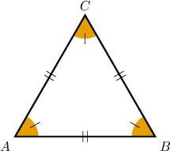
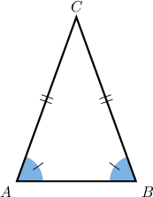
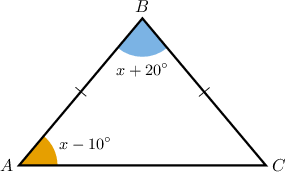
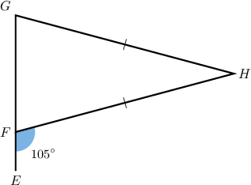
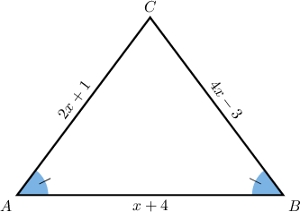
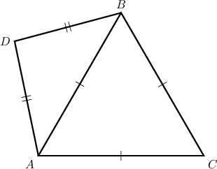
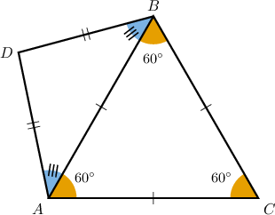

# The Isosceles Triangle Theorem

Source: https://www.mathacademy.com/topics/1403?courseId=99
Topic ID: 1403

## Prerequisites

- [Supplementary Angles](./1511-supplementary-angles.md)
- [Classifying Triangles](./1601-classifying-triangles.md)

## Lesson

### Introduction

Remember that longer sides in a triangle are opposite to larger angles, and vice versa. But what if two (or more) sides have the same length?

As you might have guessed, if two sides have the same length, then the opposite angles have the same measure. And vice-versa: if two angles have the same measure, then the opposite sides have the same length.

So, we obtain the following important properties of isosceles and equilateral triangles:

- A triangle is **equilateral** if and only if all of its angles are of $60^\circ.$

- A triangle is **isosceles** if and only if it has two congruent angles.

**Note:** The statement above encompasses two theorems:

- The **isosceles triangle theorem**: *If a triangle is isosceles, then the base angles are congruent.*

- The **converse isosceles triangle theorem**: *If two angles in a triangle have the same measure, then the triangle must be isosceles.*

### Example: Calculating the Measure of an Angle Using the Isosceles Triangle Theorem

#### Question

What is the measure of $\angle{A}$ in the triangle $\triangle{ABC}$ below?

#### Explanation

Since two sides are congruent, $\overline{BC} \cong \overline{AB},$ we conclude that $\triangle ABC$ is isosceles. Consequently, the base angles must have the same measure:

$$

m\angle C = m\angle A = x -10^\circ

$$

Now, since the internal angles of any triangle sum to $180^\circ,$ we have

$$

\begin{aligned}𝑚∠𝐴+𝑚∠𝐵+𝑚∠𝐶 & =180^{∘} \\ (𝑥−10^{∘})+(𝑥+20^{∘})+(𝑥−10^{∘}) & =180^{∘} \\ 3𝑥 & =180^{∘} \\ 𝑥 & =60^{∘}\,.\end{aligned}

$$

Finally, substituting $x=60^\circ$ into the equation for the measure of $\angle A$ gives

$$

\begin{aligned}𝑚∠𝐴 & =𝑥−10^{∘} \\ & =60^{∘}−10^{∘} \\ & =50^{∘}\,.\end{aligned}

$$

So $m\angle A = 50^\circ.$

### Example: Calculating the Measure of an Angle in an Isosceles Triangle Given an Exterior Angle

#### Question

What is the measure of $\angle{H}$ in the triangle $\triangle{FGH}$ below?

#### Explanation

First, from the diagram, notice that $\angle{HFG}$ and $\angle{EFH}$ are supplementary. Therefore,

$$

\begin{aligned}𝑚∠𝐻𝐹𝐺+𝑚∠𝐸𝐹𝐻 & =180^{∘} \\ 𝑚∠𝐻𝐹𝐺+105^{∘} & =180^{∘} \\ 𝑚∠𝐻𝐹𝐺 & =75^{∘}.\end{aligned}

$$

Since $\triangle{FGH}$ is an isosceles triangle where $\overline{GH} \cong \overline{FH}$, the base angles must be equal:

$$

m\angle{G} = m\angle{HFG}=75^\circ.

$$

Finally, since the interior angles of any triangle sum to $180^\circ,$ we have

$$

\begin{aligned}𝑚∠𝐺+𝑚∠𝐻𝐹𝐺+𝑚∠𝐻 & =180^{∘} \\ 75^{∘}+75^{∘}+𝑚∠𝐻 & =180^{∘} \\ 150^{∘}+𝑚∠𝐻 & =180^{∘} \\ 𝑚∠𝐻 & =30^{∘}.\end{aligned}

$$

### Example: Solving for a Variable Given Unknown Lengths in an Isosceles Triangle

#### Question

What is the measure of $\overline{AB}$ in the isosceles triangle $ABC$ above?

#### Explanation

Since $\triangle ABC$ is an isosceles triangle with base $\overline{AB}$, we have that $\overline{BC} \cong \overline{AC}.$ Hence,

$$

\begin{aligned}𝐵𝐶 & =𝐴𝐶 \\ 4𝑥−3 & =2𝑥+1 \\ 2𝑥 & =4 \\ 𝑥 & =2\,.\end{aligned}

$$

Substituting this value into the expression for the measure of $\overline{AB}$ gives

$$

\begin{aligned}𝐴𝐵 & =𝑥+4 \\ & =(2)+4 \\ & =6\,.\end{aligned}

$$

We conclude that $AB=6.$

### Example: Finding the Measure of an Angle Given Multiple Triangles

#### Question

In the figure below, $m\angle{CAD}=100^\circ.$ What is the measure of $\angle{D}?$

#### Explanation

First, notice that $\triangle{ABC}$ is an equilateral triangle. Consequently, all of the interior angles must be equal to $60^\circ\mathbin{:}$

$$

m\angle{BAC}=m\angle{ABC}=m\angle{C}=60^\circ

$$

Also, since $\triangle{ADB}$ is an isosceles triangle, the base angles must have equal measure:

$$

m\angle{BAD}=m\angle{ABD}

$$

Now, since we're told that $m\angle{CAD}=100^\circ,$ we have

$$

\begin{aligned}𝑚∠𝐵𝐴𝐷 & =𝑚∠𝐶𝐴𝐷−𝑚∠𝐵𝐴𝐶 \\ & =100^{∘}−60^{∘} \\ & =40^{∘}.\end{aligned}

$$

Finally, in $\triangle{BAD}$, we have

$$

\begin{aligned}𝑚∠𝐵𝐴𝐷+𝑚∠𝐷+𝑚∠𝐴𝐵𝐷 & =180^{∘} \\ 2𝑚∠𝐵𝐴𝐷+𝑚∠𝐷 & =180^{∘} \\ 2⋅40^{∘}+𝑚∠𝐷 & =180^{∘} \\ 80^{∘}+𝑚∠𝐷 & =180^{∘} \\ 𝑚∠𝐷 & =100^{∘}.\end{aligned}

$$
