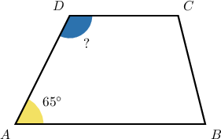
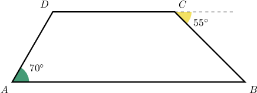
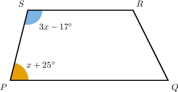
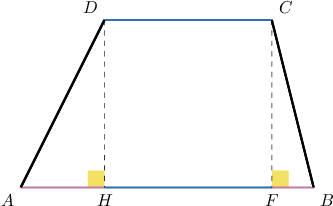
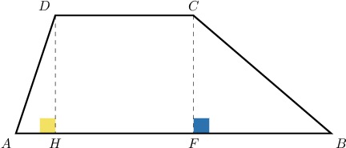

# Properties of Trapezoids

Source: https://www.mathacademy.com/topics/1460?courseId=99
Topic ID: 1460

## Prerequisites

- [The Perimeter of a Polygon](./1386-the-perimeter-of-a-polygon.md)
- [Supplementary Angles](./1511-supplementary-angles.md)
- [The Segment Addition Postulate](./2278-the-segment-addition-postulate.md)
- [Quadrilaterals](../grade-5/2407-quadrilaterals.md)

## Lesson

### Introduction

Let's consider the trapezoid $ABCD,$ shown below.

Notice that the angles $\angle A$ and $\angle D$ are on the same leg. Two angles of a trapezoid that are on the same leg are called **adjacent angles.** Adjacent angles of a trapezoid are always supplementary.

Now, since $\angle A$ and $\angle D$ are supplementary, we can solve for $\angle D\mathbin{:}$

$$

\begin{aligned}𝑚∠𝐴+𝑚∠𝐷 & =180^{∘} \\ 65^{∘}+𝑚∠𝐷 & =180^{∘} \\ 𝑚∠𝐷 & =115^{∘}\end{aligned}

$$

To understand *why* $\angle A$ and $\angle D$ are supplementary, notice that we have two parallel lines $\overline{AB}$ and $\overline{CD}$ intersected by the transversal $\overline{AD}.$ This means that the angles $\angle{A}$ and $\angle{D}$ are consecutive interior angles, and we know that when a transversal intersects two parallel lines, the consecutive interior angles are supplementary.

Finally, notice that we can make the same conclusion about $\angle B$ and $\angle C.$ So in this trapezoid, we have two pairs of supplementary angles:

$$

\begin{aligned}𝑚∠𝐴+𝑚∠𝐷=180^{∘},\,𝑚∠𝐵+𝑚∠𝐶=180^{∘}.\end{aligned}

$$

### Example: Finding the Measures of the Interior Angles of a Trapezoid

#### Question

In the trapezoid $ABCD$ above, determine $m \angle ADC + m \angle ABC.$

#### Explanation

Note that $m \angle{BCD} = 180^{\circ} - 55^{\circ} = 125^{\circ}.$

Because the angles adjacent to the legs of the trapezoid are supplementary, we have

$$

\begin{aligned}𝑚∠𝐴𝐷𝐶 & =180^{∘}−𝑚∠𝐵𝐴𝐷 \\ & =180^{∘}−70^{∘} \\ & =110^{∘}\end{aligned}

$$

and

$$

\begin{aligned}𝑚∠𝐴𝐵𝐶 & =180^{∘}−𝑚∠𝐵𝐶𝐷 \\ & =180^{∘}−125^{∘} \\ & =55^{∘}.\end{aligned}

$$

Finally,

$$

\begin{aligned}𝑚∠𝐴𝐷𝐶+𝑚∠𝐴𝐵𝐶=110^{∘}+55^{∘}=165^{∘}.\end{aligned}

$$

### Example: Finding the Value of an Unknown Using Properties of Interior Angles

#### Question

What is the value of $x$ given the trapezoid $PQRS$ above?

#### Explanation

The angles $\angle{P}$ and $\angle{S}$ are supplementary. Therefore,

$$

\begin{aligned}𝑚∠𝑃+𝑚∠𝑆 & =180^{∘} \\ (𝑥+25^{∘})+(3𝑥−17^{∘}) & =180^{∘} \\ 4𝑥+8^{∘} & =180^{∘} \\ 4𝑥 & =172^{∘} \\ 𝑥 & =43^{∘}.\end{aligned}

$$

### The Relationship Between the Bases and Legs of a Trapezoid

The length of the largest base of a trapezoid is the sum of the smaller base and the projections of the legs onto the largest base.

From the diagram above, we note the following:

- The smaller base is $\overline{CD}.$

- The projection of the leg $\overline{AD}$ onto the largest base is $\overline{AH}.$

- The projection of the leg $\overline{BC}$ onto the largest base is $\overline{BF}.$

So, we have

$$

AB = AH + CD + BF.

$$

### Example: Finding Measures of Unknown Line Segments

#### Question

Given the trapezoid below, find $CD$ if $AH = 2,$ $FB = 8,$ and $AB = 15.$

#### Explanation

Notice that $\overline{AB}$ is the largest base of a trapezoid and $AB=AH+HF+FB.$ Also, $CD = HF.$

So, we obtain

$$

\begin{aligned}𝐴𝐵 & =𝐴𝐻+𝐻𝐹+𝐹𝐵 \\ 15 & =2+𝐻𝐹+8 \\ 15 & =𝐻𝐹+10 \\ 𝐻𝐹 & =15−10 \\ 𝐻𝐹 & =5.\end{aligned}

$$

Therefore, $CD = HF = 5.$
