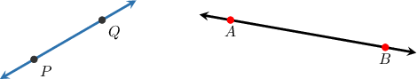
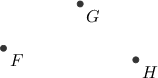
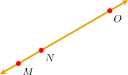
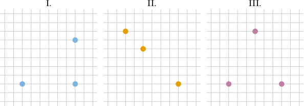
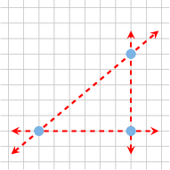
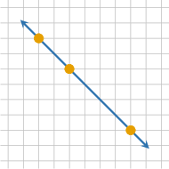
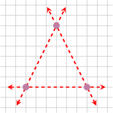
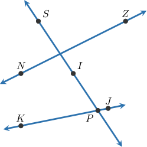
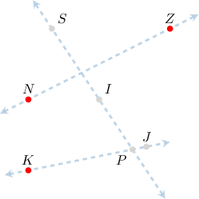
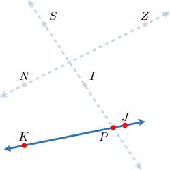

# Collinear Points

Source: https://www.mathacademy.com/topics/1500?courseId=99
Topic ID: 1500

## Prerequisites

- [Points, Lines, Rays, and Segments](./1378-points-lines-rays-and-segments.md)

## Lesson

### Introduction

For any two distinct points, there is always one (and only one) line that passes through them.

For example, the line passing through the points $P$ and $Q$ is $\overset{\longleftrightarrow}{PQ},$ while the line that passes through $A$ and $B$ is $\overset{\longleftrightarrow}{AB}\mathbin{:}$

However, given three or more points, there is not always a line that passes through all of them.

For example, for the three points $F, G,$ and $H$ below, it is impossible to draw a single straight line that passes through all of them.

However, it is *sometimes* possible to draw a line through three (or more) points. In such cases, we say that the points are **collinear**.

For example, the points $M,$ $N,$ and $O$ shown below are collinear since they all lie on the same line.

### Example: Identifying Collinear Points on a Grid

#### Question

Which of the diagrams below shows three collinear points?

#### Explanation

Three (or more) points are collinear if a straight line passes through all points.

With that in mind, let's examine our diagrams in turn.

- Diagram I shows three points that are ** collinear. We can't draw a straight line that passes through all three points.

- Diagram II shows three collinear points. There is a straight line that passes through all three of these points.

- Diagram III shows three points that are ** collinear. We can't draw a straight line that passes through all three points.

Therefore, the correct answer is "II only."

### Example: Determining Whether Points on Intersecting Lines Are Collinear

#### Question

Given the picture shown above, which of the following statements are true?

1. The points $K$, $N$, and $Z$ are collinear

2. The points $K$, $P$, and $J$ are collinear

#### Explanation

- Statement I is false. We can't draw a straight line that passes through these three points.

- Statement II is true. There is a straight line that passes through these three points.

Therefore, the correct answer is "II only."
