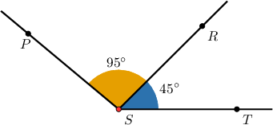
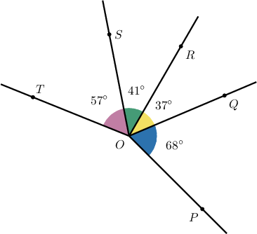
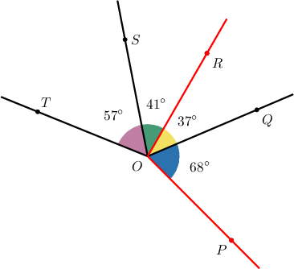
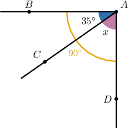
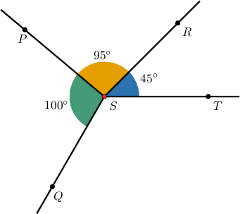
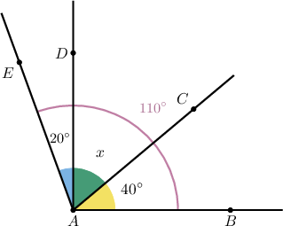

# Sums of Angles

Source: https://www.mathacademy.com/topics/1505?courseId=99
Topic ID: 1505

## Prerequisites

- [Angles and Measures of Angles](./2172-angles-and-measures-of-angles.md)
- [Representing Comparison Statements as Equations](../grade-4/3902-representing-comparison-statements-as-equations.md)
- [Subtracting Three-Digit Numbers](../grade-4/3907-subtracting-three-digit-numbers.md)
- [Adding Three-Digit and Two-Digit Numbers](../grade-4/3910-adding-three-digit-and-two-digit-numbers.md)

## Lesson

### Introduction

When two angles share a common side, they are called **adjacent** angles. When two angles are adjacent, we can add their measures to find the measure of the larger angle.

For example, consider the diagram below.

The angles $\angle PSR$ and $\angle RST$ are adjacent because they both have the side $\overrightarrow{SR}$ in common.

Since the angles $\angle PSR$ and $\angle RST$ are adjacent, we can find the measure of the combined angle $\angle PST$ by adding the two angles:

$$

\begin{aligned}𝑚∠𝑃𝑆𝑇 & =\underset{orange angle}{\underset{}{𝑚∠𝑃𝑆𝑅}}+\underset{blue angle}{\underset{}{𝑚∠𝑅𝑆𝑇}} \\ & =95^{∘}+45^{∘} \\ & =140^{∘}\end{aligned}

$$

### Example: Finding the Measure of a Combined Angle

#### Question

In the figure below, determine $m\angle{POR}.$

#### Explanation

First, notice that $\angle{POQ}$ and $\angle{QOR}$ are adjacent because they share the same side $\overrightarrow{OQ}.$

We can add the measures of two adjacent angles to find the measure of the combined angle.

Therefore:

$$

\begin{aligned}𝑚∠𝑃𝑂𝑅 & =𝑚∠𝑃𝑂𝑄+𝑚∠𝑄𝑂𝑅 \\ & =68^{∘}+37^{∘} \\ & =105^{∘}\end{aligned}

$$

### Example: Finding the Measure of a Smaller Angle

#### Question

The measure of the angle $\angle BAD$ is ${90}^{\circ}.$ Find the value of $x.$

#### Explanation

Here, the letter $x$ represents the measure of the unknown angle $\angle CAD.$

Note the following:

- The angles $\angle BAC$ and $\angle CAD$ are adjacent because they share the side $\overrightarrow{AC}.$

- So, the measure of the ** angle $(\angle BAD)$ must be the ** of the measures of the two ** angles $(\angle BAC$ and $\angle CAD).$

- This means that the measure of $\angle CAD$ must be the ** between the large angle $(\angle BAD)$ and the smaller known angle $(\angle BAC).$

Therefore,

$$

x = 90^\circ - 35^\circ = 55^\circ.

$$

### Extending the Sums of Angles Rule

We can extend our rule relating sums of adjacent angles to more than two angles.

For example, let's consider the angles shown in the diagram below.

According to our rule, the measure of the reflex angle $\angle QST$ is

$$

\begin{aligned}𝑚∠𝑄𝑆𝑇 & =\underset{green angle}{\underset{}{𝑚∠𝑄𝑆𝑃}}+\underset{orange angle}{\underset{}{𝑚∠𝑃𝑆𝑅}}+\underset{blue angle}{\underset{}{𝑚∠𝑅𝑆𝑇}} \\ & =100^{∘}+95^{∘}+45^{∘} \\ & =240^{∘}.\end{aligned}

$$

We can also use this rule to determine the size of a smaller angle when we know a larger one. Let's see an example.

### Example: Finding the Measure of an Unknown Angle Using the Extended Rule

#### Question

In the figure below, $m \angle BAE = {110}^{\circ}.$ Find the value of $x.$

#### Explanation

Here, the letter $x$ represents the measure of the unknown angle $\angle CAD.$

The measure of $\angle CAD$ must be the ** between the large angle $(\angle BAE)$ and the two smaller known angles $(\angle BAC$ and $\angle DAE).$

Therefore,

$$

x = 110^\circ - 40^\circ - 20^\circ = 50^\circ.

$$
