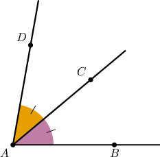
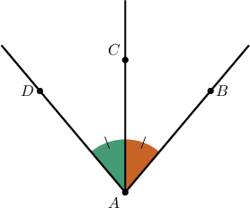
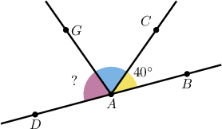
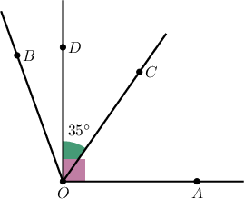
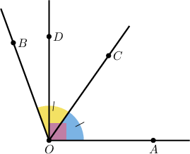
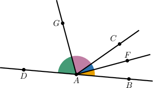
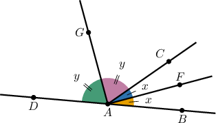

# Angle Bisectors

Source: https://www.mathacademy.com/topics/1508?courseId=99
Topic ID: 1508

## Prerequisites

- [Supplementary Angles](./1511-supplementary-angles.md)

## Lesson

### Introduction

An angle **bisector** is a line that divides an angle into two equal parts.

For example, in the diagram below, $\overset{\longrightarrow}{AC}$ is the bisector of the angle $\angle BAD.$

The resulting angles $\angle BAC$ and $\angle CAD$ are congruent (they have the same measure).

### Example: Using the Property of a Bisection

#### Question

In the figure below, $\overset{\longrightarrow}{AC}$ is the bisector of $\angle DAB$ and $m\angle DAB = 79^\circ.$ What is the measure of $\angle DAC?$

#### Explanation

An angle bisector divides the angle into two congruent angles with equal measures, so $m\angle BAC = m\angle DAC.$

Each of these congruent angles has a measure that is half the measure of the larger bisected angle. So, we have

$$

\begin{aligned}𝑚∠𝐷𝐴𝐶 & =\frac{𝑚∠𝐷𝐴𝐵}{2} \\ & =\frac{79^{∘}}{2} \\ & =39.5^{∘}.\end{aligned}

$$

### Example: Calculating an Unknown Angle Given an Angle Bisector, an Angle Measurement, and a Straight Angle

#### Question

In the figure below, is the bisector of and What is the measure of

#### Explanation

Since the angles and are supplementary, we have

Since is the bisector of, we obtain

### Example: Calculating an Unknown Angle Given an Angle Bisector and Two Angle Measurements

#### Question

In the figure below, $\overrightarrow{OC}$ is the bisector of $\angle AOB.$ If $m \angle AOD = 90^\circ$ and $m \angle COD = 35^\circ,$ find the measure of $\angle BOD.$

#### Explanation

By the angle addition postulate, we have

$$

\begin{aligned}𝑚∠𝐴𝑂𝐶 & =𝑚∠𝐴𝑂𝐷−𝑚∠𝐶𝑂𝐷 \\ & =90^{∘}−35^{∘} \\ & =55^{∘}.\end{aligned}

$$

The bisector of an angle divides the angle into two congruent angles. Therefore,

$$

m \angle AOB =2 m \angle AOC = 110^\circ.

$$

Finally, the angle addition postulate gives

$$

\begin{aligned}𝑚∠𝐵𝑂𝐷 & =𝑚∠𝐴𝑂𝐵−𝑚∠𝐴𝑂𝐷 \\ & =110^{∘}−90^{∘} \\ & =20^{∘}.\end{aligned}

$$

### Example: Calculating an Unknown Angle Given Two Angle Bisectors

#### Question

In the figure below, $\angle BAD$ is a straight angle, $\overset{\longrightarrow}{AG}$ is the bisector of $\angle CAD$ and $\overset{\longrightarrow}{AF}$ is the bisector of $\angle BAC.$ What is the measure of $\angle GAF?$

#### Explanation

Let $m \angle FAC=x$ and $m \angle CAG=y.$ Then,

$$

m \angle GAF=m\angle FAC + m \angle CAG=x+y.

$$

Since $\overset{\longrightarrow}{AF}$ is the bisector of $\angle BAC$, we have

$$

m \angle BAC=2x.

$$

Since $\overset{\longrightarrow}{AG}$ is the bisector of $\angle CAD$, we have

$$

m \angle CAD=2y.

$$

Finally, since $\angle BAD$ is a straight angle, we obtain:

$$

\begin{aligned}𝑚∠𝐵𝐴𝐶+𝑚∠𝐶𝐴𝐷 & =𝑚∠𝐵𝐴𝐷 \\ 2𝑥+2𝑦 & =180^{∘} \\ 𝑥+𝑦 & =90^{∘}\end{aligned}

$$

Consequently, $m \angle GAF=x+y=90^\circ.$
