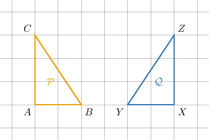
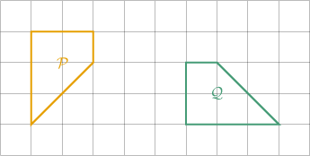
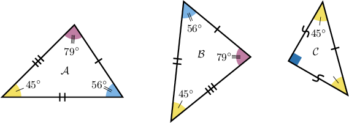
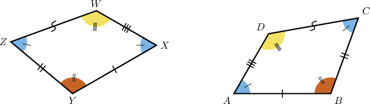
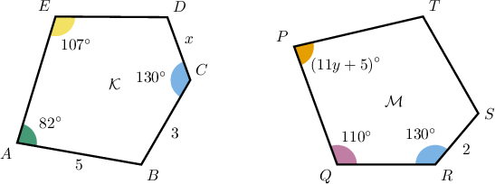

# Congruent Polygons

Source: https://www.mathacademy.com/topics/1515?courseId=99
Topic ID: 1515

## Prerequisites

- [The Perimeter of a Polygon](./1386-the-perimeter-of-a-polygon.md)

## Lesson

### Introduction

Two polygons are **congruent** if they have the same shape. This means that

- they have the same number of sides,

- all corresponding sides are congruent, and

- all corresponding interior angles are congruent.

Consider the two polygons $\mathcal{P}$ and $\mathcal{Q}$ below. Are they congruent?

Let's check these criteria for our polygons $\mathcal{P}$ and $\mathcal{Q}.$ We can see that both polygons have $3$ sides, and

$$

\begin{aligned}\overset{𝐴𝐵}{} & ≅\overset{𝑋𝑌}{}\,, & \overset{𝐴𝐶}{} & ≅\overset{𝑋𝑍}{}\,, & \overset{𝐵𝐶}{} & ≅\overset{𝑌𝑍}{}\,, \\ ∠𝑋 & ≅∠𝐴\,, & ∠𝑌 & ≅∠𝐵\,, & ∠𝑍 & ≅∠𝐶\,.\end{aligned}

$$

Therefore, the polygons are congruent, and we can write

$$

ABC \cong XYZ.

$$

The order in which we write the symbols is important: the corresponding vertices have to be in the same order.

We can also write $\mathcal{P} \cong \mathcal{Q}.$

### Example: Identifying Congruent Polygons on a Grid

#### Question

Are the polygons $\mathcal{P}$ and $\mathcal{Q}$ below congruent?

#### Explanation

In general, congruent polygons have the same shape. In other words:

- they have the same number of sides,

- all corresponding sides are congruent, and

- all corresponding interior angles are congruent.

$\mathcal{P}$ and $\mathcal{Q}$ have the same shape: They have congruent corresponding sides and congruent corresponding angles. This implies that $\mathcal{P} \cong \mathcal{Q}.$

### Example: Identifying Congruent Polygons Given Side and Angle Measures

#### Question

Which of the following statements are true for the polygons $\mathcal{A},$ $\mathcal{B},$ and $\mathcal{C}$ shown below?

1. $\mathcal{A}\cong\mathcal{B}$

2. $\mathcal{B}\cong\mathcal{C}$

3. $\mathcal{C}\cong\mathcal{A}$

#### Explanation

In general, congruent polygons have the same shape. In other words:

- they have the same number of sides,

- all corresponding sides are congruent, and

- all corresponding interior angles are congruent.

With that in mind, let's compare the given polygons.

- Statement I is true. Since the polygons $\mathcal{A}$ and $\mathcal{B}$ have the same number of sides and all corresponding sides and angles are congruent, we conclude that $\mathcal{A}\cong\mathcal{B}.$

- Statement II is false. Notice that the polygons $\mathcal{B}$ and $\mathcal{C}$ have the same number of sides, but they don't seem to have the same shape. In particular, we notice they don't have corresponding congruent angles ($\mathcal{B}$ does not have right angles, while $\mathcal{C}$ does).

- Statement III is false. By the same reasoning as above, we can see that the polygons $\mathcal{C}$ and $\mathcal{A}$ are not congruent.

Therefore, the correct answer is "I only."

### Example: Writing a Congruence Statement

#### Question

Write down a correct congruence statement for the quadrilaterals shown in the diagram above.

#### Explanation

First, notice that $\angle A \cong \angle C.$

Let's determine the vertices in the second quadrilateral that correspond to $A.$ First, notice the following:

$$

\begin{aligned}𝐴𝐵 & =𝑋𝑌 \\ 𝐴𝐷 & =𝑋𝑊 \\ ∠𝐴 & ≅∠𝑋\end{aligned}

$$

Therefore,

- vertex $A$ corresponds to vertex $X,$ and

- vertex $C$ corresponds to vertex $Z$ (since $C$ is opposite $A$ and $Z$ is opposite $X$).

As for the other two vertices, notice we have two more pairs of congruent angles:

$$

\begin{aligned}∠𝐵 & ≅∠𝑌 \\ ∠𝐷 & ≅∠𝑊.\end{aligned}

$$

Similarly, we have two more pairs of congruent sides:

$$

\begin{aligned}𝐶𝐷 & =𝑍𝑊 \\ 𝐵𝐶 & =𝑌𝑍\end{aligned}

$$

Therefore,

- vertex $B$ corresponds to $Y,$ and

- vertex $D$ corresponds to $W.$

Finally, we conclude that a correct congruence statement is

$$

ABCD \cong XYZW .

$$

### Example: Identifying Unknown Quantities From Congruent Polygons

#### Question

Given that $ABCDE \cong PQRST,$ find $x+y.$

#### Explanation

The statement $ABCDE \cong PQRST$ means that $\mathcal{K}$ and $\mathcal{M}$ are congruent. Moreover,

- vertex $A$ corresponds to vertex $P,$

- vertex $B$ corresponds to vertex $Q,$

- vertex $C$ corresponds to vertex $R,$

- vertex $D$ corresponds to vertex $S,$

- vertex $E$ corresponds to vertex $T.$

Therefore,

$$

\begin{aligned}𝐶𝐷 & =𝑅𝑆 \\ 𝑥 & =2.\end{aligned}

$$

Also, we have

$$

\begin{aligned}𝑚∠𝐴 & =𝑚∠𝑃 \\ 82^{∘} & =(11𝑦+5)^{∘} \\ 77 & =11𝑦 \\ 7 & =𝑦.\end{aligned}

$$

Finally,

$$

x+y = 2+7=9.

$$
