# Heights of Triangles

Source: https://www.mathacademy.com/topics/1644?courseId=99
Topic ID: 1644

## Prerequisites

- [Segment Bisectors and the Perpendicular Bisector Theorem](./521-segment-bisectors-and-the-perpendicular-bisector-theorem.md)
- [Classifying Triangles](./1601-classifying-triangles.md)

## Lesson

### Introduction

Consider $\triangle ABC$ shown below.

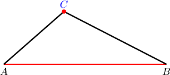

Now, let's draw a line segment that

- runs from $\color{blue}C$ to the line ${\color{red}\overset{\longleftrightarrow}{AB}},$ and

- is *perpendicular* to ${\color{red}\overset{\longleftrightarrow}{AB}}.$

This line segment is the dashed segment shown below:

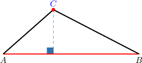

Finally, let's label the other endpoint of our segment ${\color{blue}{H}}.$

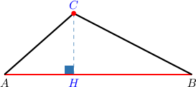

Note the following:

- The line segment ${\color{blue}\overline{CH}}$ is called the **height** (or **altitude**) *corresponding to* ${\color{red}\overset{\longleftrightarrow}{AB}}.$

- The line $\overset{\longleftrightarrow}{AB}$ is called the **base** of the altitude ${\color{blue}\overline{CH}}.$

As we'll soon discover, the heights and their corresponding bases are important attributes of triangles.

### Example: Finding a Height of a Triangle

#### Question

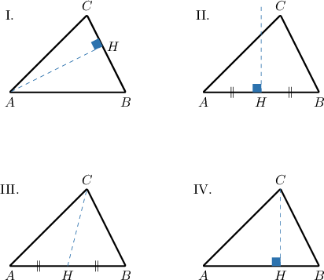

Given $\triangle{ABC}$ above, which of the diagrams represent the height corresponding to $\overline{BC}?$

#### Explanation

The height (or altitude) corresponding to $\overline{BC}$ is a line segment that

- runs from the opposite vertex $A$ to the line $\overset{\longleftrightarrow}{BC},$ and

- is perpendicular to $\overset{\longleftrightarrow}{BC}.$

The correct diagram is shown below:

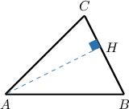

### Case of Extended Bases

We can draw exactly three heights (or altitudes) in any triangle. However, sometimes the height lies outside the triangle.

To demonstrate, consider $\triangle{ABC}$ below.

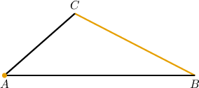

The height corresponding to $\overline{BC}$ is a line segment that

- runs from the opposite vertex $A$ to the line $\overset{\longleftrightarrow}{BC},$ and

- is perpendicular to $\overset{\longleftrightarrow}{BC}.$

In this case, it's impossible to draw a perpendicular from $A$ to the *segment* $\overline{BC}.$ However, we can first *extend* the line segment $\overline{BC}$ as follows:

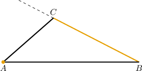

Now, we draw the perpendicular from $A$ to $\overset{\longleftrightarrow}{BC}.$ This gives the height $\overline{AH}{:}$

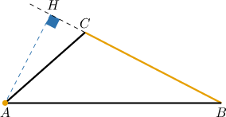

### Example: Finding a Height Corresponding to an Extended Base

#### Question

Consider the triangle $ABC$ shown below. Construct the height corresponding to $\overline{BC}.$

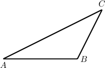

#### Explanation

The height (or altitude) corresponding to $\overline{BC}$ is a line segment that

- runs from the opposite vertex $A$ to the line $\overset{\longleftrightarrow}{BC},$ and

- is perpendicular to $\overset{\longleftrightarrow}{BC}.$

To draw the height, we proceed as follows:

- Extend the line segment $\overline{BC}.$

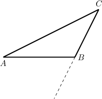

- Draw the perpendicular from $A$ to $\overset{\longleftrightarrow}{BC}.$

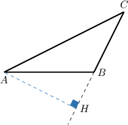

### Example: Calculating an Unknown Angle

#### Question

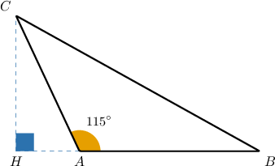

Consider $\triangle ABC$ shown above. The line segment $\overline{CH}$ is the altitude corresponding to $\overline{AB}.$ If $m\angle BAC = 115^\circ,$ calculate $m\angle HCA.$

#### Explanation

Since the straight angle must have a measure of $180^\circ,$ we have

$$

\begin{aligned}𝑚∠𝐻𝐴𝐶+𝑚∠𝐵𝐴𝐶 & =180^{∘} \\ 𝑚∠𝐻𝐴𝐶+115^{∘} & =180^{∘} \\ 𝑚∠𝐻𝐴𝐶 & =65^{∘}.\end{aligned}

$$

Note that $\triangle ACH$ is a right triangle. Since its interior angles must sum to $180^\circ,$ we have

$$

\begin{aligned}𝑚∠𝐻𝐶𝐴+𝑚∠𝐻𝐴𝐶+𝑚∠𝐴𝐻𝐶 & =180^{∘} \\ 𝑚∠𝐻𝐶𝐴+65^{∘}+90^{∘} & =180^{∘} \\ 𝑚∠𝐻𝐶𝐴+155^{∘} & =180^{∘} \\ 𝑚∠𝐻𝐶𝐴 & =25^{∘}.\end{aligned}

$$
