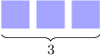
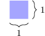
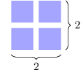
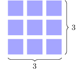
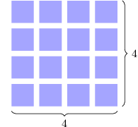

# Squaring Rational Numbers

Source: https://www.mathacademy.com/topics/2174?courseId=99
Topic ID: 2174

## Prerequisites

- [Multiplying Negative Numbers](./3718-multiplying-negative-numbers.md)

## Lesson

### Introduction

To **square** a number means to multiply that number by itself.

For example, to "square $3$", we need to multiply $3$ by $3.$ We write the "square of $3$" as $3^2,$ so we have

$$

3^2 = 3 \cdot 3 = {\color{blue}9}.

$$

We would then say that "the square of $3$ is $9$". We could also say "$3$ squared equals $9$".

The number $\color{blue}2$ in the expression $3^{\color{blue}2}$ is called the **power** or **exponent**.

The act of squaring a number can be represented geometrically. For example, let's start by representing the number $3$ with the following collection of three items:

Then we can picture $3^2$ by creating a square with length and height both equal to $3\mathbin{:}$

There are $9$ items in total in our square, indicating that $3^2 = 9.$

The first few basic squares are shown below:

The squares of our usual counting numbers are called **square numbers** or **perfect squares**. We can write them as follows:

$$

1^2, 2^2, 3^2, 4^2, 5^2, 6^2, \ldots \qquad \text{or} \qquad {\color{blue}1}, {\color{blue}4}, {\color{blue}9}, {\color{blue}16}, {\color{blue}25}, {\color{blue}36}, \ldots

$$

### Example: Squaring Positive Whole Numbers

#### Question

Calculate the value of $7^2.$

#### Explanation

To work out $7^2,$ we multiply $7$ by itself:

$$

7^2 = 7 \cdot 7 = 49

$$

### Example: Squaring Fractions

#### Question

Find the square of $\dfrac{1}{2}.$

#### Explanation

To work out $\left(\dfrac 1 2\right)^2,$ we multiply $\dfrac 1 2$ by itself:

$$

\left(\dfrac 1 2\right)^2 = \dfrac 1 2 \cdot \dfrac 1 2 = \dfrac 1 4

$$

### Squaring Negative Numbers

The squares of negative numbers are always positive because a negative times a negative is positive:

$$

\begin{aligned}(−)\,⋅\,(−)\,=\,(+)\end{aligned}

$$

Some squares of negative numbers are as follows:

$$

\begin{aligned}(−1)^{2}\,=\,(−1)⋅(−1) & \,=\,1 \\ (−2)^{2}\,=\,(−2)⋅(−2) & \,=\,4 \\ (−3)^{2}\,=\,(−3)⋅(−3) & \,=\,9 \\ (−4)^{2}\,=\,(−4)⋅(−4) & \,=\,16 \\ (−5)^{2}\,=\,(−5)⋅(−5) & \,=\,25\end{aligned}

$$

**Watch Out!** When squaring negative numbers, the parentheses are important!

Consider the following squared quantity:

$$

-3^2

$$

This is *not* the same as $(-3)^2$. Instead, this is a shorthand way of writing

$$

(-1) \cdot 3^2.

$$

According to the order of operations, we should square $3$ *first* and *then* multiply by $-1.$ Therefore:

$$

\begin{aligned}−3^{2} & =(−1)⋅3^{2} \\ & =(−1)⋅9 \\ & =−9\end{aligned}

$$

### Example: Squaring Negative Numbers

#### Question

What is the value of $(-4)^2?$

#### Explanation

To work out $(-4)^2,$ we multiply $-4$ by itself:

$$

(-4)^2 = (-4) \cdot (-4) = 16

$$

### Example: Calculating the Square of a Decimal

#### Question

What is the square of $-2.5?$

#### Explanation

We need to calculate the product of $(-2.5)$ with itself:

$$

(-2.5)^2 = (-2.5)\cdot (-2.5) = (2.5)\cdot (2.5)

$$

First, we ignore the decimal points and multiply as if both numbers were whole numbers:

$$

\begin{aligned} & \begin{aligned} & & & \,\,\,\,\begin{aligned}\color{blue}1 \\ \color{blue}2\end{aligned}\,\,\,\, & \\ & & & \,\,\,\,2\,\,\,\, & \,\,\,\,5\,\,\,\, \\ \,\,\,\,×\,\,\,\, & \,\,\,\,0\,\,\,\, & \,\,\,\,0\,\,\,\, & \,\,\,\,2\,\,\,\, & \,\,\,\,5\,\,\,\, \\ & & \,\,\,\,1\,\,\,\, & \,\,\,\,2\,\,\,\, & \,\,\,\,5\,\,\,\, \\ \,\,\,\,+\,\,\,\, & \,\,\,\,\,\,\,\, & \,\,\,\,5\,\,\,\, & \,\,\,\,0\,\,\,\, & \,\,\,\,0\,\,\,\, \\ & \,\,\,\,\,\,\,\, & \,\,\,\,6\,\,\,\, & \,\,\,\,2\,\,\,\, & \,\,\,\,5\,\,\,\,\end{aligned}\end{aligned}

$$

Therefore, $25 \times 25 = 625.$

We now count the total number of decimal places in the two factors.

There is $\color{blue}1$ decimal place in the first factor ($2.5$) and $\color{blue}1$ decimal place in the second factor ($2.5$), so their product will have ${\color{blue}{1}} + {\color{blue}{1}} = 2$ decimal places.

We take our value of $625$ and insert a decimal point to make a number with $2$ decimal places:

$$

2

$$

Therefore, $(-2.5)^2 = 6.25\,.$
