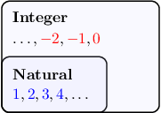
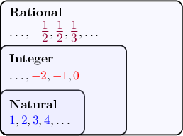

# Natural Numbers, Integers, and Rational Numbers

Source: https://www.mathacademy.com/topics/2558?courseId=99
Topic ID: 2558

## Prerequisites

- [Division of Whole Numbers With Decimal Quotients](../grade-5/2335-division-of-whole-numbers-with-decimal-quotients.md)
- [Negative Numbers](../grade-5/2442-negative-numbers.md)

## Lesson

### Introduction

The **natural numbers** are the positive whole numbers:

$$

{\color{blue}1},\: {\color{blue}2},\: {\color{blue}3},\: {\color{blue}4},\: {\color{blue}5},\ldots

$$

We also refer to them as the **counting numbers**.

There's some debate among mathematicians about whether zero should be considered a natural number. However, for our purposes, zero is *not* a natural number.

### Example: Classifying Numbers as Natural

#### Question

Which of the following are natural numbers?

1. $0$

2. $-\dfrac1 3$

3. $4$

#### Explanation

The natural numbers consist of all positive whole numbers:

$$

{\color{blue}1},\: {\color{blue}2},\: {\color{blue}3},\: {\color{blue}4}, \:{\color{blue}5},\ldots

$$

Of the given numbers, $4$ is a natural number, but $-\dfrac13$ and $0$ are not.

Therefore, the correct answer is "III only."

### The Integers

When we extend the natural numbers by joining them with zero and the negative whole numbers, we get the **integers**.

$$

\overbrace{ \ldots, {\color{red}-5},\: {\color{red}-4},\: {\color{red}-3},\: {\color{red}-2},\: {\color{red}-1},\: {\color{red}0}, \: \!\underbrace{ {\color{blue}1},\: {\color{blue}2}, \: {\color{blue}3},\: {\color{blue}4},\: {\color{blue}5},\ldots }_{\large\textrm{Natural numbers}} }^{\large\textrm{Integers}}

$$

We can represent the relationship between the natural numbers and integers using an inclusion diagram:

Notice that the natural numbers are *contained within* the integers. In other words, *every* natural number is also an integer.

### Example: Classifying Numbers as Integers

#### Question

Which of the following numbers are integers?

1. $-3$

2. $\dfrac32$

3. $2$

#### Explanation

The integers consist of all positive and negative whole numbers and zero.

$$

\ldots, {\color{red}-3},\: {\color{red}-2},\: {\color{red}-1},\: {\color{black}0},\: {\color{blue}1},\: {\color{blue}2},\: {\color{blue}3}, \ldots

$$

Of the given numbers, $-3$ and $2$ are integers, but $\dfrac32$ is not.

Therefore, the correct answer is "I and III only."

### The Rational Numbers

The **rational numbers** consist of all numbers that can be written as the ratio of two integers, where the denominator is not zero. For example:

$$

{\color{purple}-\dfrac{1}{2}}, \quad {\color{purple}\dfrac{1}{2}}, \quad {\color{purple}\dfrac{1}{3}}, \quad {\color{purple}-\dfrac{2}{3}}, \quad {\color{purple}\dfrac{2}{3}}.

$$

Every integer is also a rational number because every integer can be expressed as a ratio of two integers. For example,

$$

{\color{blue}2} = {\color{black}\dfrac{2}{1}}, \qquad {\color{red}-9} = {\color{black}\dfrac{(-9)}{\phantom{-}1}}.

$$

Likewise, any mixed number is a rational number because it can be written as an improper fraction. For example, $2 \, \dfrac{1}{3}$ is a rational number because

$$

2 \, \dfrac{1}{3} = \dfrac{2 \times 3 + 1}{3} = \dfrac{7}{3}.

$$

We can now add the rational numbers to our inclusion diagram.

Notice that the integers (and therefore the natural numbers) are contained within the rational numbers.

### Example: Classifying Numbers as Rational

#### Question

Which of the following statements are true?

1. $2$ is a natural number

2. $2$ is a rational number

3. $\dfrac12$ is a rational number

#### Explanation

Let's recall our definitions.

- The natural numbers consist of all positive whole numbers:

- The integers consist of all of the positive and negative whole numbers, and zero:

- The rationals consist of all numbers that can be written as the ratio of two integers.

Now, let's go through each number in turn.

- $2$ is a natural number.

- $2$ is a rational number because it can be written as $\dfrac{2}{1}.$

- $\dfrac12$ is a rational number because it is the ratio of two integers.

Therefore, the correct answer is "I, II, and III."
