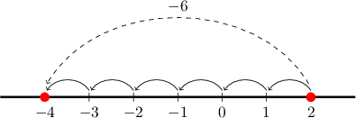
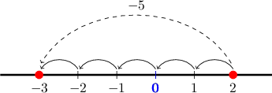
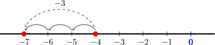

# Adding a Negative Number

Source: https://www.mathacademy.com/topics/328?courseId=99
Topic ID: 328

## Prerequisites

- [Subtracting a Positive Fraction From a Smaller Fraction](./3679-subtracting-a-positive-fraction-from-a-smaller-fraction.md)
- [Subtracting a Positive Decimal From a Smaller Decimal](./3680-subtracting-a-positive-decimal-from-a-smaller-decimal.md)

## Lesson

### Introduction

Whenever we add a negative number, we write parentheses around the negative number so that it's easier to read.

For example, instead of

$$

7 + - 5

$$

which is difficult to read, we write

$$

7+(-5).

$$

Adding a negative number is the same as subtracting a positive number. Therefore, we can drop the addition sign and the parentheses in the above expression, which gives

$$

7 - 5.

$$

Carrying out the subtraction, as usual, we get

$$

7 - 5 = 2.

$$

### Example: Adding a Negative Number

#### Question

Calculate the value of $2+ (-6).$

#### Explanation

We drop the parentheses and the addition sign to give

$$

2+ (-6) = 2-6.

$$

Then, we move $6$ spaces to the left of $2$ on a number line.

We end up at $-4.$ Therefore,

$$

2 + (-6) = -4.

$$

### Example: Adding a Negative Decimal

#### Question

What is the value of $-1 + (- 2.5)?$

#### Explanation

First, we drop the parentheses and the addition sign, which gives

$$

-1 + (- 2.5) = -1 - 2.5.

$$

Then, we carry out the subtraction as usual. This gives

$$

-1 - 2.5 = -3.5.

$$

### Adding a Negative Fraction

We can add a negative fraction using the same method. To demonstrate, let's find the value of

$$

\dfrac{2}{7} + \left(- \dfrac{5}{7}\right).

$$

First, we eliminate the parentheses and obtain

$$

\dfrac 2 {7} + \left(-\dfrac 5 {7}\right) = \dfrac 2 {7} -\dfrac 5 {7}.

$$

Now, since both fractions have a common denominator of $7,$ we can combine the numerators, which gives

$$

\begin{aligned}\frac{2}{7}−\frac{5}{7} & =\frac{2−5}{7}.\end{aligned}

$$

Next, we work out $2 - 5$ using our number line.

We find that $2-5=-3.$ So, we get

$$

\dfrac {2 - 5} {7} = \dfrac{-3}{7} = -\dfrac{3}{7}.

$$

If two fractions have different denominators, we need to put them over a common denominator first and *then* subtract! Let's see an example.

### Example: Adding a Negative Fraction

#### Question

Find the value of $-\dfrac{2}{5} + \left(- \dfrac{3}{10}\right).$

#### Explanation

First, we drop the parentheses and the addition sign, which gives

$$

-\dfrac 2 5 + \left(-\dfrac{3}{10}\right) = -\dfrac 2 5 -\dfrac{3}{10} .

$$

Now, we need to convert the fractions to have the same denominator. To convert $-\dfrac{2}{5}$ to have a denominator of $10,$ we multiply the numerator and denominator by $2$ as follows:

$$

- \dfrac{2}{5} = - \dfrac{2 \times 2}{5 \times 2} = - \dfrac{4}{10}

$$

Now, the subtraction problem is

$$

\begin{aligned}−\frac{2}{5}−\frac{3}{10} & =−\frac{4}{10}−\frac{3}{10}.\end{aligned}

$$

Because the two fractions now have the same denominator, we can combine the numerators:

$$

\begin{aligned}−\frac{4}{10}−\frac{3}{10}=\frac{−4−3}{10}\end{aligned}

$$

Next, we work out $-4 - 3$ using our number line.

We find that $-4-3=-7.$ So, we get

$$

\dfrac {-4 - 3} {10} = \dfrac{-7}{10} = -\dfrac{7}{10} .

$$
